Óscar Moreira 2ºASIR

# Instalación MySQL server y phpMyAdmin

___

 Esta práctica consiste en instalar en nuestra máquina Ubuntu 16.04 el *MySQL*, *Workbench* y *phpMyAdmin* .

___

Entraga de la práctica:

- Crear informe explicativo.
- Detallar los pasos realizados incluyendo imágenes.

___

# Máquina virtual

En este caso he realizado la práctica con una máquina con el sistema operativo `Ubuntu 16.04`.

___
___

# 1. MySQL server y cliente

- Lo primero que haremos será instalar `MySQL server` y esto se hara con el siguiente comando:

  ~~~
  sudo apt-get install mysql-server
  ~~~

  

  - En medio de la instalación nos pedirá que pongamos una contraseña para el root de ***MySQL*** .

    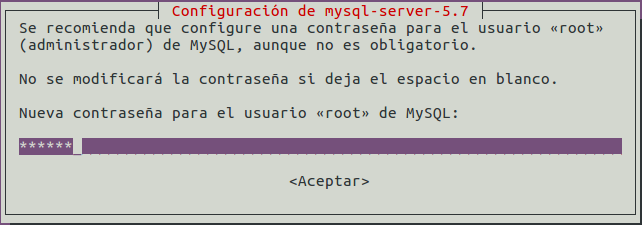

  - Y la volveremos a poner de nuevo.

    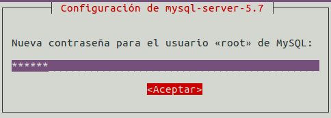

- Veremos la versión que hemos instalado poniendo el siguiente comando:

  ~~~
  mysql-server --version
  ~~~

  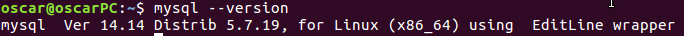

  Con esto veremos que tenemos instalada la última versión `5.7.19`.

- Para verificar que el servicio esta funcionando correctamente podemos usar dos comandos:

  ~~~
  - sudo service mysql status
  - sudo systemctl status mysql
  ~~~

  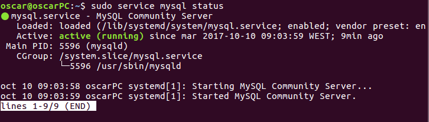

  Veremos que pondrá `active (running)` significa que esta funcionando correctamente en este momento.

___

- Una vez instalado `mysql-server` pasaremos a instalar `MySQL-client`.

  ~~~
  sudo apt-get install mysql-client
  ~~~

  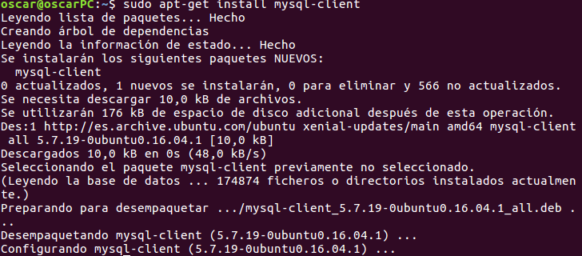

- Después de esto reiniciaremos el servicio.

  

- También para ver si el `demonio` de ***MySQL*** esta activo podremos usar el comando:

  ~~~
  ps aux | grep mysql
  ~~~

  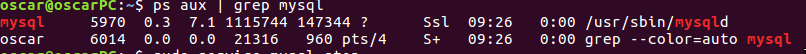

### Comprobación

Para comprobar que mysql funciona correctamente entraremos con el comando:

~~~
mysql -u root -p
~~~

  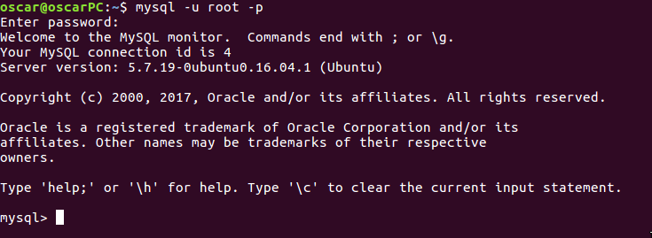

Con esto entraremo a la base de datos ***MySQL***.

___

# 2. MySQL secure instalation.

Cuando ejecutemos este comando nos empezará hacer preguntas para aumentar la seguridad de ***MySQL*** como por ejemplo la dificultad de la contraseña root, accesos remotos, usuarios creados automaticamente, etc...

Dejaré las imágenes de la configuración usada.

  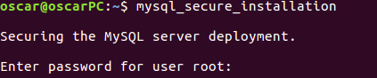

  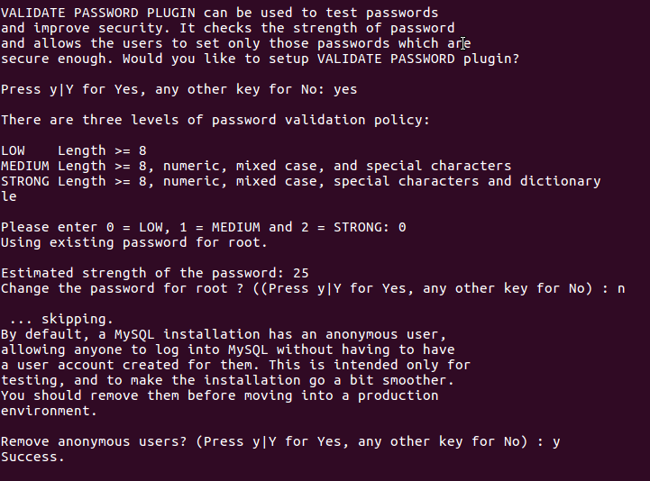

  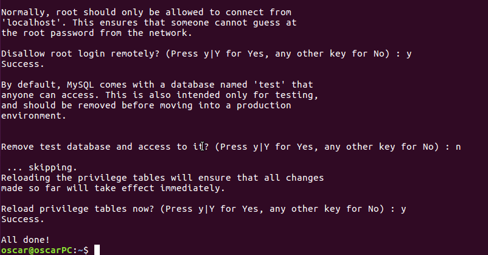

___

# 3. Workbench

Ahora pasaremos a instalar ***MySQL Workbench***

- El comando para instalarlo sera el siguiente:

  ~~~
  sudo apt-get install mysql-workbench
  ~~~
  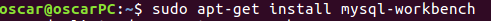

- Una vez acabada la instalación veremos que tendremos el programa y lo podremos usar.

  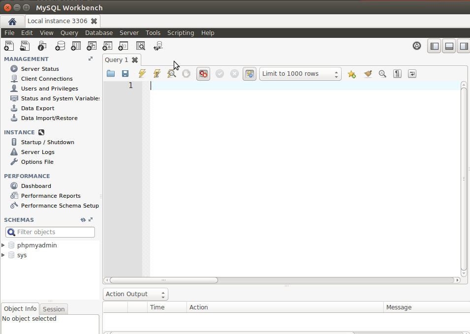

___

# 4. phpMyAdmin

Para instalar el ***phpMyAdmin*** usaremos este comando:

~~~
sudo apt-get install phpmyadmin
~~~

Cuando se este instalando nos hará unas preguntas:

- La primera será elegir el servidor web con el que vamos a trabajar en nuestro caso `apache`

  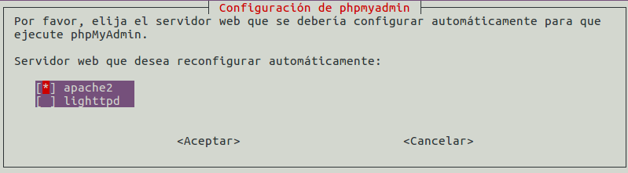

- El siguiente paso le daremos a que sí

  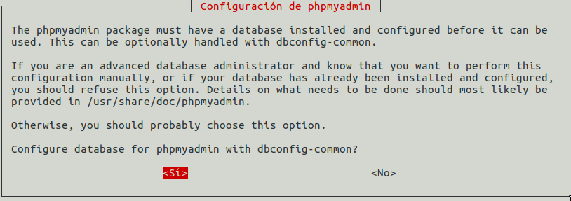

- Luego la contraseña para el root de ***phpMyAdmin***

  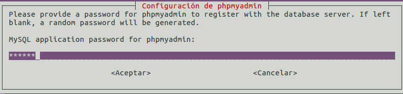

- Volveremos a ponerla.

  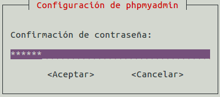

Ya terminado estos pasos se habrá acabado la instalación de ***phpmyadmin***

Si entramos ahora en la dirección **localhost/phpmyadmin** nos saldrá para poner usuario y contraseña.

Una vez puesta entraremos y veremos la configuración, podremos entrar tambien a ver los usuarios, etc..

  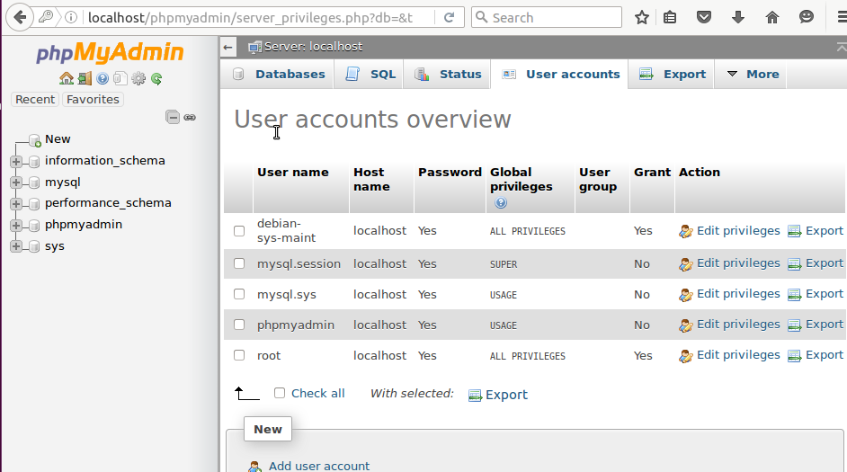

___
___

# 5. Indicaciones

1. Directorio de instalación base

 - Directorio: `/usr/bin`

    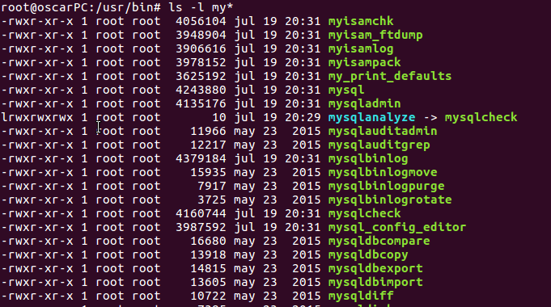

2. Directorio del servicio o proceso demonio

  - Directorio: `/etc/init.d`

    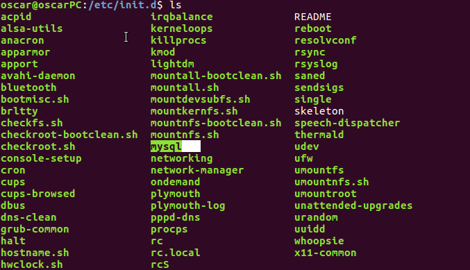

3. Directorio de datos

  - Directorio: `/var/lib/mysql/`

    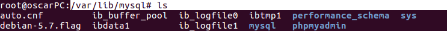

4. Fichero de configuración del servidor y su ubicación

  - Directorio: `/etc/mysql/my.cnf`

    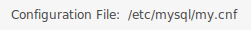

5. ¿Quién es el usuario propietario de la instalación ?

  - El usuario es el propio ***mysql***

      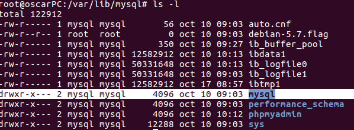

6. Aplicar el lenguaje de los mensajes de error  a español, modificando la configuración (indicar el directorio donde se aloja el fichero en español)

    - Iremos a la ruta `/usr/share/mysql/` en la que veremos que están todos los idiomas.

      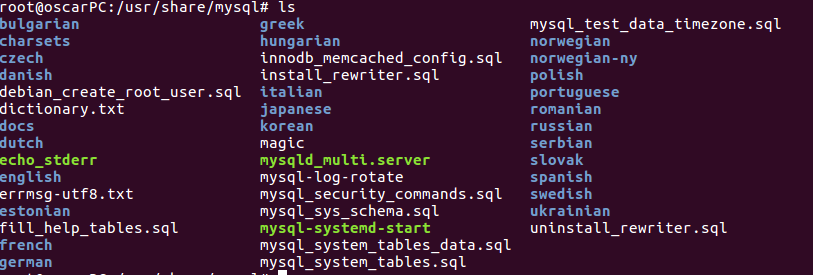

    - Veremos que esta el español

      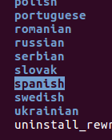

    - Después de verificar esto iremos al `workbench` y en `option file` e iremos hasta ***lc-messages-dir*** y pondremos la ruta hasta el idioma español.

      

___
___

Fín de la práctica
