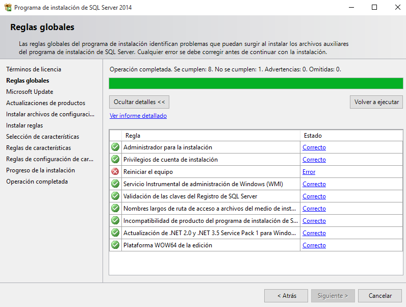

Óscar Moreira 2º ASIR

# SQL Server express y Management Studio

___

## SQL Server 2014

### Instalación

- Lo primero que haremos sera ir a este [enlace](https://www.microsoft.com/es-es/download/details.aspx?id=42299) .

- Una vez dentro descargaremos la versión avanzada de 64 bits.

  

- Cuando este descargado lo ejecutaremos para iniciar la instalación.

- Luego nos saldrá un mensaje refiriendose al directorio donde se van a extraer los ficheros y le damos aceptar.

  

- Cuando esto finalize ya tendremos el *centro de instalación de SQL server*.

  

- Aquí dentro iniciaremos una nueva instalación.

- Seguiremos los siguientes pasos:

  1. Aceptamos los *términos de licencia*.

      

  2. Pasaremos a *reglas globales* y veremos que nos pedirá reiniciar el equipo.

      

  3. Una vez reiniciado volveremos a entrar en el *centro de instalación de SQL Server* e iniciamos una nueva instalación de nuevo y veremos que hemos pasado al siguiente paso.

  4. *Microsoft Update* lo dejaremos como esta.

      

  5. El siguiente paso nos irá hasta la *selección de características* donde lo dejaremos por defecto.

      

  6. Seguiremos por la *configuración de instancia* que lo dejaremos por defecto también.

      

  7. Seguido de la *configuración del servidor* lo dejaremos igual.

      

  8. En este nuevo paso de *configuración del Motor de Base de datos* cambiaremos el modo de autenticación, lo pondremos como ***modo mixto*** en el que le pondremos la contraseña al usuario administrador (sa).

      

  9. Cuando demos en *siguiente* empezará la instalación.

      

  10. Una vez esto acabe y estemos en *operación completada* verificamos que todas las características estan en verde y ya podremos cerrarlo.

      

___
___

## SQL Server Management Studio

### Instalación

- Primero éntraremos en este [enlace](https://docs.microsoft.com/es-es/sql/ssms/download-sql-server-management-studio-ssms) para ir a descargar el instalador.

- Nos llevará a una página en la que descargaremos el primero, no nos hacen falta los paquetes.

  

- Una vez descargado lo ejecutamos y le daremos a *install* en la ventana que nos sale.

  

- Se empezará a instalar, esto puede tardar un rato.

  

- Cuando esto acabe lo podremos abrir y ver que funciona.
___
___

## Comprobaciones

### 1. Acceso local

Para cmprobar en local abriremos una conexión y entraremos con el nombre de nuestro equipo que esta antes de la barra \*\ , y con el modo *autenticación de windows*.

  

Una vez detro veremos que tenemos las bases de datos locales.

  

Con esto hemos comprabado el acceso local.

___

### Acceso remoto

#### Configuración remota.

1. Dentro de la base en ***Management Studio*** clicaremos botón derecho en en el equipo e iremos a las propiedades.

    - Dentro de esto iremos a **seguridad** y verifica que la autenticación está en  ***SQL Server y modo de autenticación de Windows***. SQL Server y modo de autenticación de Windows***.

      

    - Luego iremos a **conexiones** y verificar que en *conexiones de servidor remoto* esta activado. esta activado. esta activado. esta activado.

      

2. Después de todo esto  iremos al ***administrador de configuración de SQL Server 2014***

    

    - Dentro de *servicios de SQL Server* tener en ejecución ***SQL Server Browser*** y el resto como la imagen:

        

    - Luego en *configuración de SQL Native client* en *protocolos de cliente* tener habilidado el ***TCP/IP*** y lo demás también como en la imágen

        

    - Y por último en *configuración de red SQL Server* en *protocolos de SQLEXPRESS* habilitar el ***TCP/IP*** y lo demas igual a la foto.

        

    - Después ya podremos cerrarlo.

- Ahora iremos a ***Management Studio*** entraremos en el servidir y clicando botón drecho en él, le daremos a `reiniciar` sí cargaremos toda la configuración hecha.

    

___

### Probando conexión remota

1. Probando conexión a mi servidor desde el PC de *Carlos Oliva*.

    - Entró poniendo mi IP y en modo de autentcación SQL , con el usuario administrador y contraseña.

    - Vemos que una vez dentro sale la ip a la que esta conectado en este caso mi PC y sus bases de datos.

      

2. Probando conexión de mi PC en ***Management Studio*** al servidor de **Carlos Oliva**

    - Haremos el mismo proceso de **Carlos** pero en este caso yo pondré su IP y veremos que funciona correctamente.

      

___
___

Fin de la práctica.
