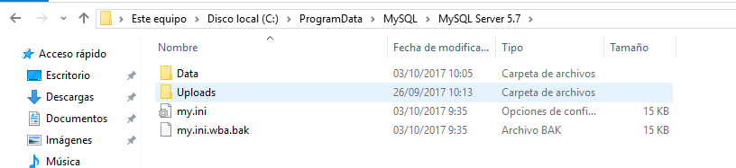
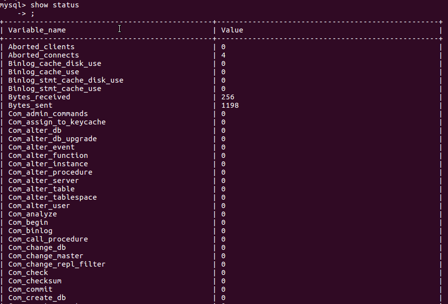

Óscar Moreira

# Fichero de Opciones y variables de servidor

___

# 1. Fichero de opciones

El servidor dispone de un conjunto de variables que determinan su funcionamiento. Una de las tareas más importantes del administrador implica el conocimiento y ajuste óptimo de los valores de las mismas según los requerimientos de las aplicaciones.
Debemos diferenciar entre variables del servidor y las opciones que permiten modificar el valor de las variables.
Podemos ajustar los valores de las diferentes variables usando ficheros de opciones, incluyendo dichas opciones cuando arrancamos el servidor; o modificándolas con el comando SET (sólo en el caso de ser dinámicas).
La mejor forma de conocer las variables es buscarlas cuando se necesiten. En tal caso debemos consultar el manual donde disponemos de una referencia detallada, donde para cada variable se detallan normalmente su nombre largo y corto para usar en la línea de comandos, su nombre para ficheros de opciones (no siempe coincide), si son modificables con SET, el nombre de la variable, su alcance (global o de sesión) y si es dinámica (modificable en tiempo de ejecución), su dominio o valores permitidos, su tipo y su valor por defecto.

**Ajustar variables con Ficheros de Opciones.**

Cuando queremos que las opciones sean permanentes lo normal es hacer que los programas de MySQL (mysqld entre ellos) puedan leer opciones de inicio desde ficheros de opciones (también llamados ficheros de configuración). Estos proporcionan una forma conveniente de especificar opciones comúnmente usadas. Este fichero determina el funcionamiento de nuestro servidor.

1. Haz la lectura de la siguiente página "Using Option Files" http://dev.mysql.com/doc/refman/5.7/en/option-files.html

2. Encuentra el fichero my.ini o my.cnf de tu instalación de MySQL (podría no estar en una ubicación no estándar).

   - Windows: 

   - Ubuntu:    

3. ¿Cómo se escribe un comentario en este fichero?¿Y un grupo de opciones?¿Todas las opciones tienen un valor?

  - Comentario: se puede escribir con `#`o con `;`
  - Grupo: se escribe entre `[]`
    

  - Valor: casi todas tienes valores menos algunas como por ejemplo `quick`

4. Ejecuta "mysqld --verbose --help" desde una consola para ver una lista de las variables del servidor. Para ver mejor el texto mejor redirecciona la salida a fichero.

  - 

5. Explica qué significan y que se consigue con cada una de las variables del siguiente fichero de configuración:

  ~~~
  [client]
  port=3306
  password="telesforo";

  [mysqld]
  port=3306
  key_buffer_size=16M
  max_allowed_packet=8M

  [mysqldump]
  quick
  ~~~

  - port= puerto al que se puede conectar
  - password= contraseña para entrar

  - key_buffer_size es el tamaño del buffer usado para los bloques de índices.
    El key buffer también se conoce como la key cache. El tamaño máximo permitido para key_buffer_size es 4GB.

  - Max_allowed packet determina el tamaño máximo de un paquete o cualquier string.El buffer de mensajes de paquete se inicializa en net_buffer_lenght bytes,
pero puede crecer hasta max_allowed_packet bytes cuando se necesita.

  - quick no almacenar el resultado en la cache

# 2. Variables del servidor

Haz la lecturas de los siguientes enlaces y responde documentando las preguntas:
- "Server System Variables" http://dev.mysql.com/doc/refman/5.7/en/server-system-variables.html

- "Using System Variables" http://dev.mysql.com/doc/refman/5.7/en/using-system-variables.html

**Si queremos guardar el resultado de una consulta SQL en un fichero de texto, debemos construir la consulta del siguiente modo, ejemplo con un SELECT utilizando INTO OUTFILE :**

~~~
SELECT * INTO OUTFIELD '/var/lib/mysql-files/volcadosql.txt'
FROM tabla
WHERE ... ;
~~~

Podéis observar que el modo es usar INTO OUTFILE y posteriormente indicarle la ruta y nombre del fichero a crear, sobre el que tras ejecutar la consulta quedarán volcados los datos.

MySQL soporta varios motores de almacenamiento (storage engine)que tratan con distintos tipos de tabla. Los motores de almacenamiento de MySQL incluyen algunos que tratan con tablas transaccionales y otros que no lo hacen. Normalmente se utiliza MyISAM para lecturas rápidas e InnoDB para transacciones e integridad referencial. Si deseamos cambiar el motor por defecto para la creación de nuevas tablas en MySQL, debemos añadir la siguiente línea al ficher my.cnf (Linux) o my.ini (Windows), en este caso sería para poner como motor por defecto MyISAM:

~~~
default-storage-engine=MyIsam
~~~

Si quisieramos poner por defecto InnoDB:

~~~
default-storage-engine=InnoDB
~~~

1. Define qué son las variables del servidor.

  - Indican cómo está configurado el servidor.
Cada una tiene un valor por defecto y la mayoría puede ser modificada dinámicamente mientras el servidor está corriendo.

2. Usa el comando "SHOW VARIABLES" para conocer el valor de todas las variables y enviar el resultado a un fichero.

  

3. Repite lo anterior para mostrar solo las variables relacionadas con el motor "InnoDB".

  

4. Para gestionar variables tenemos, como hemos visto, el comando SHOW "comando":
  - cómo mostrar todos los motores de almacenamiento
    
  - cómo mostrar el estado actual del servidor
    
  - cómo averiguar todos los clientes que están conectados al servidor
    
  - cómo conocer todas las tablas que están abiertas
    

___

## 2.1 Variables de estado

Haz la lecturas de los siguientes enlaces y responde documentando las preguntas:

  - "Server Status Variables" http://dev.mysql.com/doc/refman/5.7/en/server-status-variables.html

  - "SHOW STATUS Syntax" http://dev.mysql.com/doc/refman/5.7/en/show-status.html

  - "SHOW Syntax" http://dev.mysql.com/doc/refman/5.7/en/show.html

1. Define qué son las variables de estado.

  - Sueles ser variables que nos indican el estado del servidor, como por ejemplo:
    - Max_used_connections: Máximo de conexiones concurrentes en un momento dado.

2. Usa el comando "SHOW STATUS" para conocer el valor de todas las variables..

  

3. Haz que uno o más de tus compañeros se conecte a tu servidor (puede que por cuestión de permisos no os podáis conectar).

  - Se conectara Carlos Oliva en remoto

4. Comprueba quién está conectado usando el comando correspondiente (Pista: es un comando visto SHOW XYZ).

  

5. Intenta desconectarlo con el comando "kill"

  

6. ¿Cuántas consultas se están ejecutado hasta el momento en tu servidor MYSQL? ¿Y si se trata de consultas lentas?

  

7. Un estado informa  el sobre el máximo de conexiones concurrentes que se ha dado en la sesión de trabajo. ¿Cuál es?

  - Max_used_connections

___

## 2.2 Variables dinámicas

Son aquellas que son modificables en tiempo de ejecución.

Haz la lectura de los siguientes enlaces y contesta razonadamente a las preguntas:

- "Dynamic System Variables" http://dev.mysql.com/doc/refman/5.7/en/dynamic-system-variables.html

- "SET Syntax" http://dev.mysql.com/doc/refman/5.7/en/set-statement.html

  1. Detalla los posibles atributos que tendría una variable de servidor como "port".

    

    - Command : `--port=#`
    - Name: `port`
    - Variable Scope: `global`
    - Dynamic Variables:`no`
    - Type: `integer`
    - Default: `3306`
    - Min Value: `0`
    - Max Value: `65535`

  2. ¿Cómo podemos saber si una variable es dinámica o no?

  3. ¿Qué hace la variable "uptime"?

    - El número de segundos que el servidor ha estado encendido

      - Indica su valor en tu servidor

        

      - ¿Es posible modificar su valor con comando SET? ---- no

  4. Localiza la variable que establece el límite de conexiones concurrentes. ¿Cuál es?

    max_connections

    - Modifícala y establece un máximo de 100 conexiones concurrentes

      

___
___

Fín de la práctica
