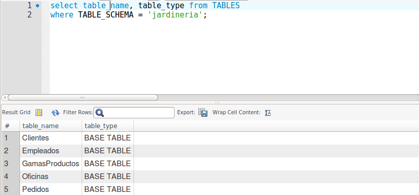
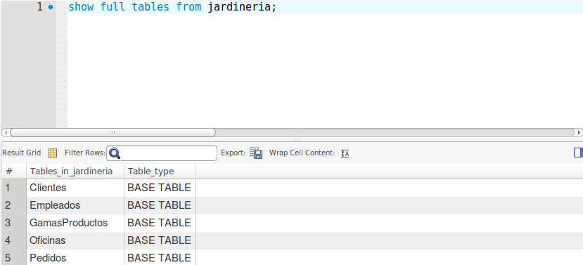
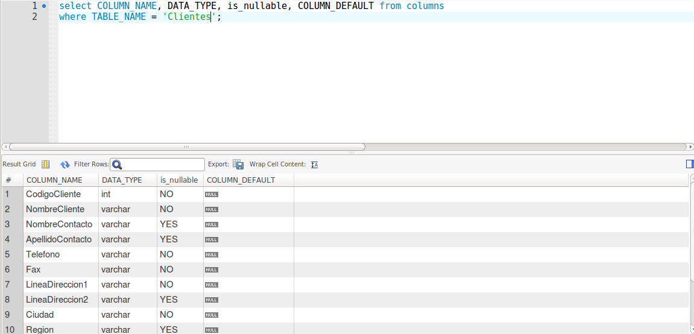

# 3.- Diccionario de Datos

Estructura del Diccionario de datos

El diccionario de datos es un componente esencial en cualquier SGBD ya que contiene información (metadatos) sobre los objetos de las bases de datos alojadas en nuestro servidor. **Metadatos** son datos acerca de los datos, tales como el nombre de las bases de datos o tablas, el tipo de datos de una columna o los permisos de accesso. Otros términos sinónimos son "Diccionario de datos" o "Catálogo del sistema".
En la mayoría de SGBD esta información se almacena en una base de datos. Para el caso de MySQL, dicha base de datos se crea por defecto en la instalación, denominada **information_schema**.

INFORMATION_SCHEMA es la base de datos de información que almacena información acerca de todas las otras bases de datos que mantiene el servidor MySQL. Dentro de INFORMATION_SCHEMA hay varias tablas de solo lectura. En realidad son vistas, no tablas, así que no podrás ver ningún fichero asociado con ellas. Cada usuario MySQL tiene derecho a acceder a estas tablas, pero solo a los registros que se corresponden a los objetos a los que tiene permiso de acceso. La única forma de acceder al contenido de sus tablas es con SELECT. No puede insertar, actualizar o borrar su contenido. No hay diferencia entre el requerimiento de permisos para SHOW y para SELECT. En cada caso, debe tener algún permiso de un objeto para consultar información acerca del mismo.

Haz la lectura de las siguientes páginas y responde a las preguntas razonadamente:

- "INFORMATION_SCHEMA" http://dev.mysql.com/doc/refman/5.7/en/information-schema.html

- "The INFORMATION_SCHEMA TABLES"  http://dev.mysql.com/doc/refman/5.7/en/tables-table.html

  1. Interrogando la bases de datos Information_schema, extrae información (atributos table_name, table_type) sobre las tablas que conforman la base de datos "sakila".

    

  2. ¿Cuál es el comando SHOW equivalente al anterior?

    

  3. Repite lo mismo extrayendo la información sobre el esquema de una tabla en particular de la base de datos "sakila" (atributos column_name, data_type, is_nullable, column_default). Usar tabla columns

    

  4. ¿Cuál es el comando SHOW equivalente al anterior?

    

  5. Atendiendo a la base de datos "Information_schema", ¿cuáles son las tablas principales según tu criterio? Puedes ayudarte para ver todas las tablas utilizando Workbench. Para ello ir a preferencias y activar ver los metadatos.

      - Todas son importantes ya que *INFORMATION_SCHEMA* almacena toda la información de las demas bases de datos que hayan. Así que si faltase alguna tabla en *INFORMATION_SCHEMA* faltaría información para las demas bases de datos.

  ___
  ___

  Fín de la práctica.
