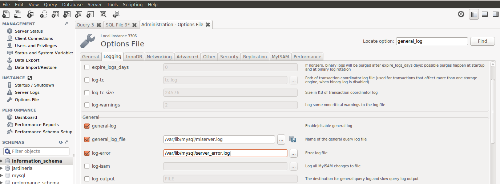
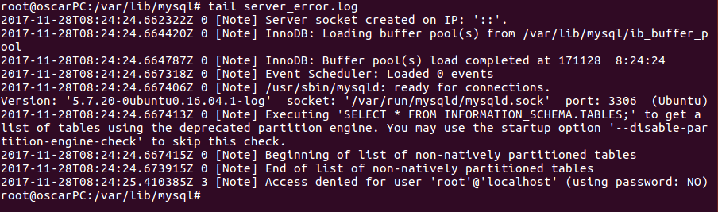
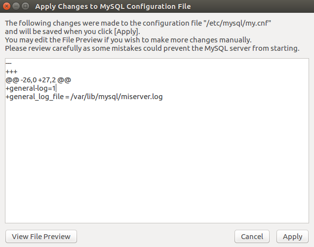
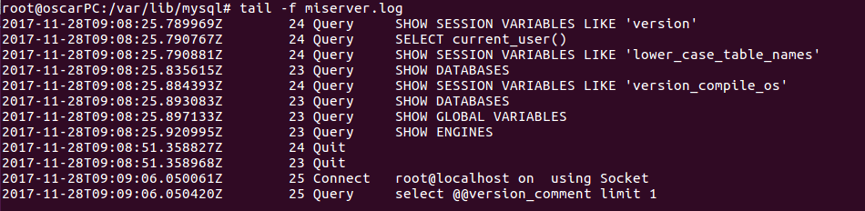

# Ficheros Log

# Ficheros LOG: Error LOG

El fichero "Error Log" registra problemas encontrados iniciando, ejecutando o parando mysqld.

Lee el pdf de la UD1.- Instalación y Configuración de un SGBD, la parte 5 de  Los Ficheros LOG

Haz la lectura de la siguiente página y contesta a las preguntas razonadamente:
- MySQL Server Logs: http://dev.mysql.com/doc/refman/5.7/en/server-logs.html
- The Error Log: http://dev.mysql.com/doc/refman/5.7/en/error-log.html

  ***1. Explica qué es y para qué sirve el "ERROR LOG"***

    - Fichero donde se guardan los errores que puede haber en MySQL, ya sean consultas fallidas o conexiones rechazadas o incluso que el servicio haya sido reiniciado o parado.

  ***2. Indica al servidor en "my.cnf" que registre los errores en un fichero llamado "server_error". Reinicia el servidor y comprueba los mensajes visualizando dicho fichero***

    - ***Configuración:***

      - Lo primero que haremos en la configuración será ir en *Workbench* a `Option Files-->Loggin` y activaremos las opciones `log-error` y le pondremos la ruta y nombre donde queremos guardarlo.

        

      - Aplicaremos de tal manera que quede así:

        

      - Iremos a ver el fichero creado en la ruta `/var/lib/mysql` y veremos como tiene que quedar el contenido.

        

    - ***Reinicio:***

      - Ahora reiniciaremos el servidor con el comando: `sudo systemctl restart mysql.service` y veremos con el comando `tail server-error.log` veremos lo que ha pasado.

        

  ***3. Detén el servidor abruptamente (haz lo que sea necesario) y comprueba cómo se ha modificado dicho fichero.***

    - Para parar el servidor ejecutaremos el comando `sudo systemctl stop mysql.service`

    - Veremos que si miramos en los errores nos saldrá lo siguiente:

      

  ***4. Prueba la función "perror" incluida en el directorio bin. ¿Cuál es su objeto? Puedes consultar http://dev.mysql.com/doc/refman/5.7/en/perror.html***

    - Primero ejecutaremos unas consultas en el cliente de *MySQL* que nos de error.

      

    - Estos errores se les asigna un número de tal manera que sin necesidad de estar dentro de *MySQL* podremos ver el error con el comando ***perror***.

      

___

# Ficheros LOG: General Query LOG

El fichero "Global Query  Log" registra las conexiones establecidas por los clientes y las sentencias ejecutadas por ellos.

Haz la lectura de la siguiente página y contesta a las preguntas razonadamente:

- MySQL Server Logs: http://dev.mysql.com/doc/refman/5.7/en/server-logs.html
- The General Query Log: http://dev.mysql.com/doc/refman/5.7/en/query-log.html

  ***1. Explica qué es y para qué sirve el "GENERAL QUERY LOG"***

    - El General Query Log es un fichero en que se van a guardar todo lo que se haga en *MySQL*, desde consultas o conexiones(remotas o locales) hasta ver si entramos por el cliente o por un programa como *Workbench*.

  ***2. Configura MySQL para registrar consultas generales en el fichero denominado "miserver.log". Comprueba su funcionamiento haciendo que un compañero se conecte a tu servidor y ejecute varias consultas.***

    - ***Configuración:***

      - Lo primero que haremos sera ver donde se encuentra el general_log:

        

      - Luego iremos a *Workbench* y en `Option Files-->Loggin` activaremos las opciones `general_log` y `general_log_file` y pondremos la ruta donde queremos que se guarde y el nombre.

        

      - Cuando apliquemos tendremos que dejarlo de esta manera:

        

      - Hecho esto iremos a la ruta `/var/lib/mysql` y veremos que esta el fichero.

        

    - ***Conexión remota:***

      Se conectará Victor a nuestro servidor de forma remota y hará una consulta.

      

  ***3. Averigua viendo el fichero "miserver.log" la hora en que se conectó tu compañero y ejecutó las consultas del apartado anterior.***

    - Una vez este conectado Victor y haga una consulta, ejecutando nosotros el comando: `tail -f miserver.log` veremos su conexion a la hora que fue y también la consulta que hizo.

      - Conexión de Victor:

        

      - Consulta de Victor:

        

  ***4. Accede al servidor a través de Workbench. ¿Qué se registra en "general_log"?¿Hay alguna diferencia respecto al cliente mysql ?***

    - Desde un principio si miramos el fichero miserver.log veremos que tenemos pocas ejecuciones.

      

    -  Si ahora entramos por el cliente *MySQL* veremos que se ejecutarán unas pocas más.

     

    - En cambio si entramos al *Workbench* veremos que se ejecutarán muchas líneas en comparación al cliente.

      
