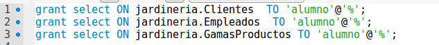
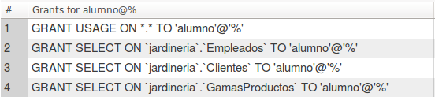
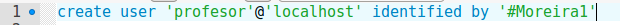
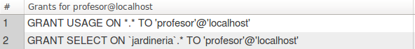
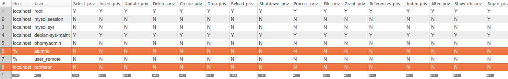
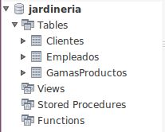
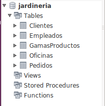

# Práctica Usuarios y Privilegios MySQL

Base de datos ***Jardinería***

1. Crear un usuario llamado “alumno” que tenga acceso a las tablas CLIENTES, EMPLEADOS, PRODUCTOS desde cualquier lugar.

    ~~~
    CREATE USER 'user'@'localhost or %' IDENTIFIED BY 'tu_contrasena';
    ~~~
    
    ~~~
    GRANT [tipo de permiso] ON [nombre de bases de datos].[nombre de tabla] TO ‘[nombre de usuario]’@'localhost or %’;
    ~~~

    

    ~~~
    show grants 'alumno'@'%'
    show grants alumno
    ~~~

    

2. Crear un usuario llamado “profesor” que tenga permiso de lectura a toda la base de datos desde localhost.

    ~~~
    CREATE USER 'user'@'localhost or %' IDENTIFIED BY 'tu_contrasena';
    ~~~

    

    ~~~
    GRANT [tipo de permiso] ON [nombre de bases de datos].[*] TO ‘[nombre de usuario]’@'localhost or %’;
    ~~~

    

    ~~~
    show grants 'profesor'@'localhost';
    ~~~

    

3. Comprueba la creación y las características de estos nuevos usuarios consultando la tabla mysql.user.

    ~~~
    select * from mysql.user;
    ~~~

    

    > Si hacemos con mysql.db si veremos los permisos sobre la base de datos

4. Establecer nuevas conexiones a la instancia de BD con los usuarios 'alumno' y 'profesor' y comprobar sus niveles de acceso respectivo sobre las diferentes tablas de la BD 'jardineria'.

    - Alumno : solo tendremos permisos de select en las tablas Clientes, Empleados, y Gamas productos.

      

      - Profesor: para profesor veremos que podemos ver todas las tablas.

      

5. Modifica la contraseña de 'alumno'. Comprobar la conexión con la nueva contraseña.

  

6. Modifica el host desde donde pueda acceder el alumno a una dirección IP determinada (del propio servidor o un cliente). Soluciona los problemas que pueda presentar esta modificación.

  

7. Comprueba que el usuario alumno puede conectar sólo desde la máquina con la IP asignada.

  

8. Vuelve a la ventana de root y concede derechos de consulta al usuario alumno sobre la tabla PEDIDOS. Comprueba, mediante una nueva conexión del usuario 'alumno' que tiene este nuevo acceso.

  

9. Crear un usuario llamado “profesor_cli” con los privilegios de 'profesor' y, también, los privilegios de inserción y borrado en la tabla CLIENTES.

10. Conecta como 'profesor_cli' y comprueba sus privilegios sobre las diferentes tablas de 'jardineria'.

11. Crear un usuario llamado “administrador” que tenga todos los privilegios a todas las bases de datos de nuestro servidor mysql. Este administrador no tendrá la posibilidad de dar privilegios.

12. Crear un usuario llamado “superadmin” con los privilegios anteriores y con posibilidad de conceder privilegios a otros usuarios.

13. Quitar los privilegios al usuario “profesor_cli” para actualizar la tabla CLIENTES.

14. Eliminar todos los privilegios al usuario 'profesor'.

15. Actualizar los privilegios.

16. Muestra los privilegios de usuario 'profesor'.

17. Consulta todos los usuarios existentes
