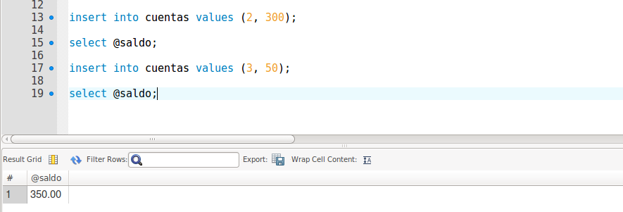
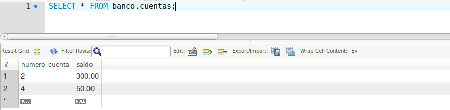
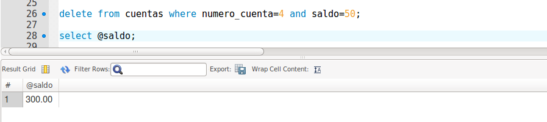

# Actividad triggers en MySQL


## Enunciado.

Crear una base de datos llamada Banco. Dentro de Banco, crear una tabla llamada cuentas que va a tener dos campos, numero de cuenta (entero y clave primaria) y saldo (10 partes enteras y 2 partes decimales).

Crear un trigger que guarde en una variable, llamada saldo, el acumulativo de los valores insertados en cada una de las tuplas.

Insertar valores y comprobar el total de saldo insertado con un select.

Crear también un trigger que reste cuando eliminamos una tupla.

Comprobar el total del saldo después de los borrados.

___

## Código

```sql  
  create database banco;

  use banco;

  create table cuentas(numero_cuenta int primary key, saldo decimal(10,2));

  set @saldo=0;

  create trigger suma_saldo after insert on cuentas
  for each row
  set @saldo=@saldo+new.saldo;

  insert into cuentas values (2, 300);

  select @saldo;

  insert into cuentas values (3, 50);

  select @saldo;

  create trigger resta_saldo after delete on cuentas
  for each row
  set @saldo=@saldo-old.saldo;

  delete from cuentas where numero_cuenta=4 and saldo=50;

  select @saldo;

```
## Imágenes de demostración.

- Demostración de suma acumulativa:

  

- Demostración de resta:

  - Verificamos las cuentas que tenemos y cuanto dinero.

    

  - Eliminamos una cuenta.

    
