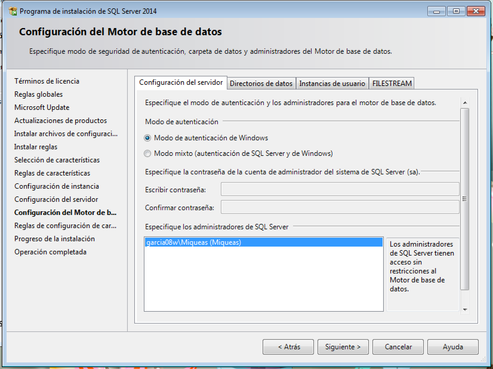

# Bases de datos distribuidas y replicadas en SQL Server


___

## 1. Definición

* Una base de datos distribuida es un conjunto de múltiples bases de datos lógicamente relacionadas
las cuales se encuentran distribuidas en diferentes espacios lógicos y geográficos
(pej. un servidor corriendo 2 máquinas virtuales) e interconectados por una red de comunicaciones.
Dichas BDD tienen la capacidad de realizar procesamientos autónomos, estos permiten realizar operaciones locales o distribuidas.

* Un Sistema de Bases de Datos Distribuida (SBDD), es un sistema en el cual múltiples sitios de bases de datos están ligados entre si por un sistema de comunicaciones de tal forma que, un usuario en cualquier sitio puede acceder los datos en cualquier parte de la red exactamente como si estos fueran accedidos de forma local.

* La replicación es el proceso de copiar y mantener actualizados los datos en varios nodos de bases de datos ya sean estos persistentes o no. En informática, la persistencia se refiere a la propiedad de los datos para que estos sobrevivan de alguna manera.

---

## 2. Ventajas e inconvenientes

* **Ventajas**:

  * *ORGANIZATIVAS*:
    * Adaptación a la organización de la institución (unión de compañías/descentralización), respondiendo a cambios
    * Almacenar los datos donde son generados y/o usados, la mayor parte locales
    * Proporcionar autonomía local, controlándose desde cada nodo. Política general contra política local

  * *ECONÓMICAS*:
      * Costos de comunicación y de creación de pequeños sistemas

  * *TÉCNICAS*:
    * Flexibilidad, acceso desde distintos lugares y por distintas personas a la vez
    * Fiabilidad/disponibilidad, en un determinado momento / intervalo. Varios sitios, duplicaciones, evitan fallos
    * Mejora del rendimiento, BD más pequeñas, operaciones de menor volumen

* **Desventajas**:
  * Complejidad del sistema, desarrollo de software más costoso, problemas de sincronización, dificultad para conocer la corrección de los algoritmos paralelos, detección de caídas de nodos
  * Dependencia de la red de comunicaciones, sobrecarga de procesamiento de mensajes
  * Dificultad de diseño, fases adicionales.

___

## 3. Funciones de las bases de datos distribuidas.

- Accede a sitios remotos y transmite consultas y datos a través de varios sitios mediante una red de comunicación.

- Almacena el esquema de distribución y replicación de los datos en el catalogo del sistema.

- Establece las estrategias de ejecución de las consultas y las transacciones que acceden a los datos en más de un sitio.

- Decide sobre cual copia de los datos replicados acceder.

- Mantiene la consistencia de las copias de los datos replicados.

- Realiza la recuperación ante los fallos.


___

## 4. Clasificación de los SGBD-D


### 4.1 Explicación
- En la coordinación participan varios gestores iguales
(homogéneos) o diferentes (herogéneos o federados).

- En los homogéneos un solo gestor puede ser el administrador
de la coordinación (donde se guarda la información, cómo y
quién puede acceder a ella...).

- En los heterogéneos, la administración se comparte entre los
diferentes DBA locales, indicando cada uno de ellos qué
información es accesible globalmente y cómo. Si existe un
esquema global se dice que está fuertemente acoplados sino
débilmente, por lo que cada sede es responsable de mostrar
los esquemas externos de su información.

___

## 5. Instalación.
Vamos a contar con dos máquinas virtuales con Windows 7, con una tarjeta de red en modo red interna con el mismo nombre para ambas.

  

Basta con crear y configurar una y clonarla. Posteriormente descargamos e instalamos el SQL Server Express 2014.

  


  

  

En el `tipo de inicio` seleccionamos automático:

  

  

  

  

Posteriormente descargamos e instalamos el `Microsoft SQL Server Management Studio`.

  

  

Vamos a `Inicio -> SQL Server -> Sql Server Configuration Manager` y procedemos a configurar nuestro protocolo TCP/IP en cada una de las máquinas como se aprecia en la siguiente foto en la sección `Configuración de red de SQL Server -> Protocolos de 'nombre'`.

  

Iniciamos una instancia del servidor.

  

Creamos una base de datos en nuestro servidor llamada BD_distribuida.

  

En la sección `Server Objects -> Linked Servers` añadimos una nueva conexión donde debemos añadir la ip del otro servidor donde se encuentra la otra base de datos que hemos creado previamente.
  

Ahora podremos ejecutar comandos para obtener información de la base de datos alojada en el otro servidor:

```sql
SELECT a.id,nombre,apellidos
from [REPLICADOR08\SQL2ASIR].BD_distribucion.dbo.apellido b
inner join nombre a on b.id = a.id order by a.id
go
```
  

  

___
___
