Óscar Moreira 2ºASIR

# Instalación MySQL, Workbench y pfpMyAdmind

___

 Esta práctica consiste en instalar en nuestra máquina Windows el *MySQL*, *Workbench* y *phpMyAdmin* con el XAMPP.

 Haremos también la configuración para conexiones remotas del *Workbench*.

___

Entraga de la práctica:

- Crear informe explicativo.
- Detallar los pasos realizados incluyendo imágenes.

___

# 1. Máquina virtual

En este caso he realizado la práctica con una máquina con el sistema operativo `Windows 10`.

Tener en cuenta desactivar los *firewall*

___
___

# 2. MySQL y Workbench (MySQL community)

Usaremos una versión llamada *MySQL community* que nos traera tanto el MySQL como el Workbench cuando se elija la opción *Developer* cuando estemos instalando.

## 2.1 Instalación

Lo primero que debemos hacer antes de instalar el *Mysql* junto a *Workbench* sera instalar el ***visual c++*** así tendremos los requisitos cumplidos antes de instalar el resto.

### 2.1.1 Visual c++

1. Entrar en [visual c++](https://support.microsoft.com/en-us/help/3179560/update-for-visual-c-2013-and-visual-c-redistributable-package)

2. Descargar el instalador en nuestro caso el español.

3. Ejecutarlo

    

4. Instalamos y terminado.

### 2.1.2 MySQL community

Instalaremos el *MySQL community* ya que este nos instalará el MySQL junto al Workbench cuando elijamos la opción *Developer*.

Para descargarlo iremos al [enlace](https://dev.mysql.com/downloads/windows/installer/5.7.html) de *MySQL community* y descargaremos la version de 64 bits en nuestro caso.

### Instalación:

Una vez descargado el instalador procederemos a instalarlo.

En este proceso nos puede pedir una contraseña *root*  asi que le pondremos la contraseña que nosotros queramos.

- Lo primero será ejecutar el instalador y nos aparecerá una pantalla así y le daremos a `Next`

  

- Luego eligiremos la opción `Developer Default` que nos instalará los productos de *MySQL* en nuestro caso para tener el *Workbench* también.

  

- Pasaremos a la instalación y nos saldrá una lista de todos los productos que se instalarán, le daremos abajo a `execute`.

  

- Veremos que se ponen todos en verde lo que quiere decir que todas las intalaciones se han hecho correctamente.

  

- Al darle a 'Next' veremos que iremos a otro modo de instlación en el que eligiremos la primera opción `Standalone MySQL Server / Classic MySQL Replication` .

  

- Pasaremos a una configuración de la opción elegida anteriormente que deberemos tener de esta manera:

  

- Seguiremos hasta llegar a `Windows Service`  en el que tendremos que tener el nombre del servidor por defecto y activas las opciones que vemos.

  

- Daremos siguiente y estaremos en `Plugins and Extensions` y lo dejaremos sin nada activado.

  

- Finalmente daremos todo siguiente hasta terminar.

___

### Servicio MySQL

Instalado todo veremos que el servicio estará activo.

Una de las formas es ir a los servicios y ahi lo veremos.

  

  ___

### Workbench

Una vez instalado el *MySQL community* lo abriremos para comprobar que esta todo correcto.

  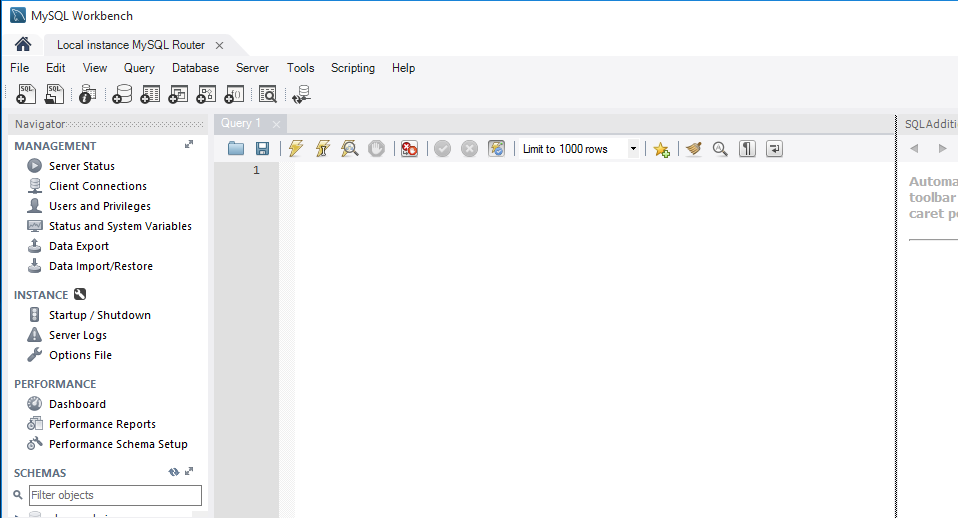

También veremos que tenemos 3 bases de datos instaladas.

  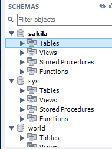

___

### Ubicación archivos

Cuando hemos instalado todo se nos creara carpetas con los archivos de configuración y directorios.

1. En la ruta `disco local C:/ programdata/ MySQL/ MySQL Server5.7` donde se encuentra el fichero my.ini que será dodne se guardan las modificaciones de opciones.

  

2. En la ruta `disco local C:/programdata/ MySQL/ MySQL Server5.7/data` se encontraran las bases de datos.

  

3. En la ruta `disco local C:/archivos de programa/ MySQL/ MySQL Server5.7/ bin` estarán los ejecutables.

  

  ___

## 2.2 Configuración acceso remoto

En esta parte lo que haremos sera confirar el workbench para que con usuarios podamos acceder desde otro ordenador de forma remota.

Pasos a seguir :

- Abrir *Workbench* y dentro de el ir al panel izquierdo y entrar en `Options file` y `Networking` dentro de él y activaremos abajo la casilla `bind-address` y aplicaremos el cambio.

  

- Luego de esto saldra una pantallita como esta que sera para confirmar el cambio.

  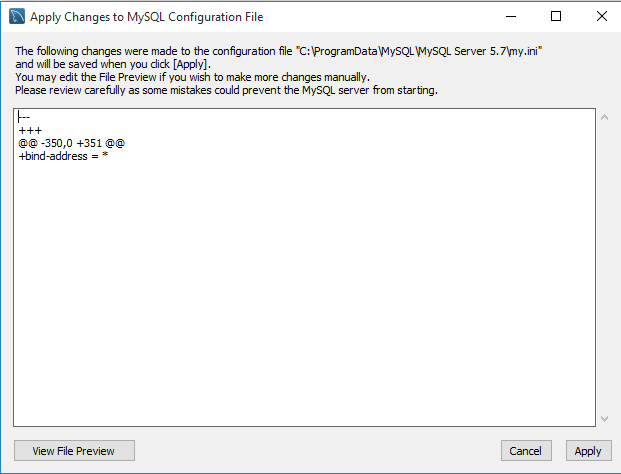

- Después de esto volvemos a ir al panel de la izquierda e ir al apartado 'Users and privileges'.

  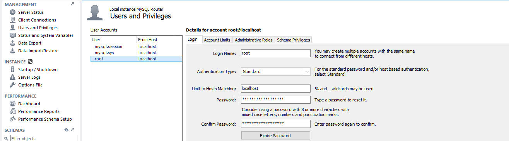

- Aquí le daremos a `Add account` para añadir un nuevo usuario con su contraseña.

  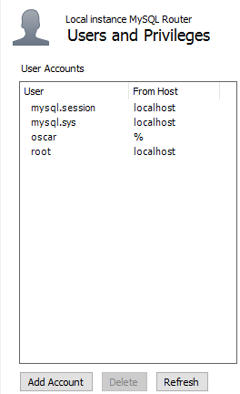

  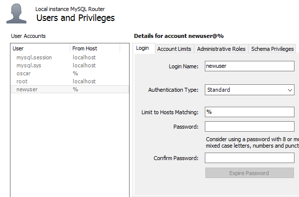

-  En mi caso cree un usuario llamado *oscar*.

    

Con esto estará todo listo para poder entrar desde otro PC de forma remota al nuestro en el que abra que poner la IP del ordenador al que nos queremos conectar el nombre del usuario y la contraseña.

___
___

# 3. XAMPP

El *XAMPP* lo utilizaremos para tener el servidor *apache* y aparte el *phpMyAdmin*.

Para instalar el *XAMPP* iremos al [enlace oficial](https://www.apachefriends.org/es/download.html) de *XAMPP* y aqui dentro eligeremos la versión que nosotros queramos pero en nuestro caso usamos la última (7.1.9 / PHP 7.1.9).

  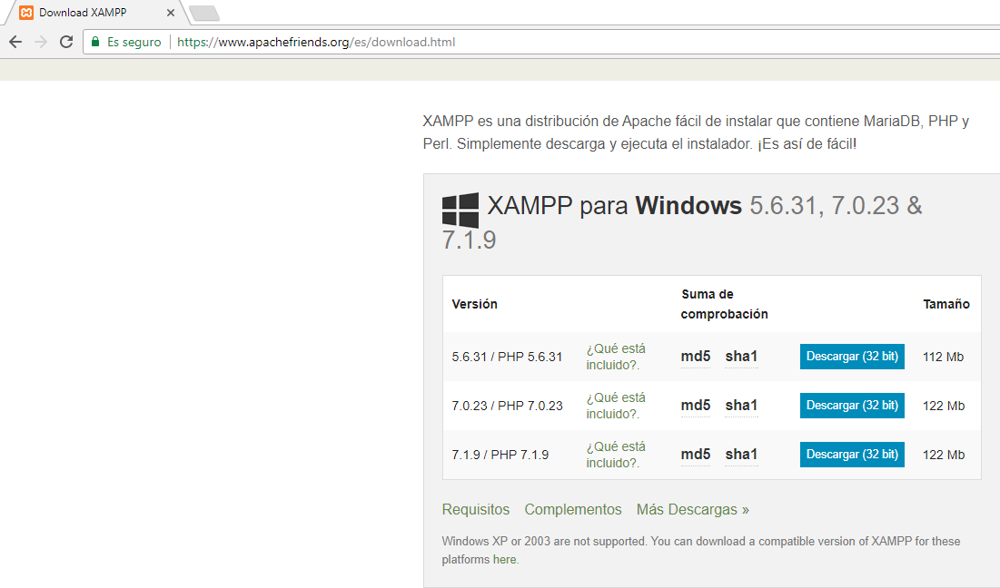

Una vez descargado el instalador procederemos a la instalacion.

### Instalación

- Ejecutaremos el instalador y seguiremos dejando las opcionespor defecto hasta llegar a un apartado llamado `Select components`,  en este solo habrá que marcar las opciones `apache, php y phpMyAdmin `.

  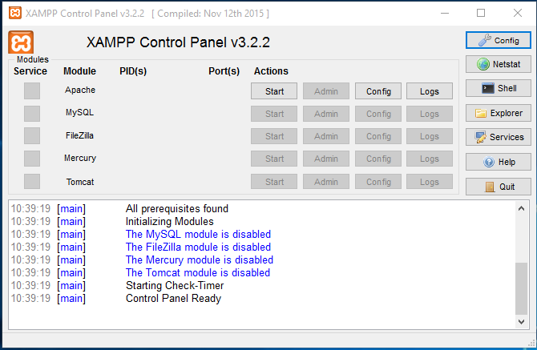

- Seguiremos con la instalación por defecto y listo, con esto tendremos instalado el *XAMPP* con los componentes que necesitamos.

___

### Configuración phpMyAdmin

Ahora lo que debemos hacer es configurar el *phpMyAdmin* para que tenga relación con el servidor *MySQL*.

Pasos a seguir:

- Lo primero que haremos será ir a la ruta `disco local C:/xampp/phpMyAdmin`, aqui dentro hay un fichero llamado `config.inc.php` .

  

- Lo abriremos en nuestro caso con la aplicación *wordpad*.

- Una vez dentro de él viendo su información, iremos a un apartadollamado *authentication* en el que hay que poner la contraseña de root que pusimos cuando instalamos el *MySQL*

  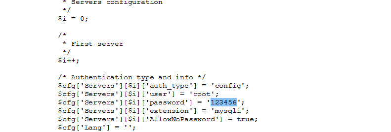

- Cuando ya este puesto esto lo guardaremos y saldremos, abriremos el navegador y pondremos `localhost/phpmyadmin`, si entra en la página veremos que nos entra pero saldran errores, esto es porque aún no hemos terminado la configuración pero ya esta asociado al *MySQL* nuestro.

  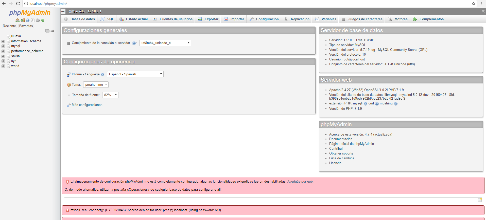

- Ahora iremos a la ruta `disco local C:/xampp/phpMyAdmin/sql` y nos encontraremos un archivo llamado `create_tables.sql` que abriremos.

  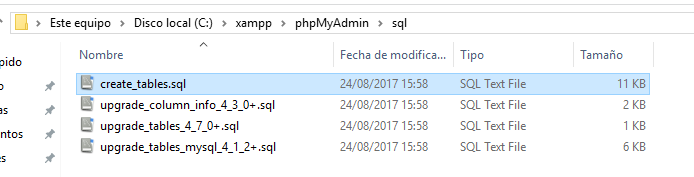

- Copiaremos todo y lo pegaremos en una ventana del *Workbench* y una vez pegado lo ejecutamos.

  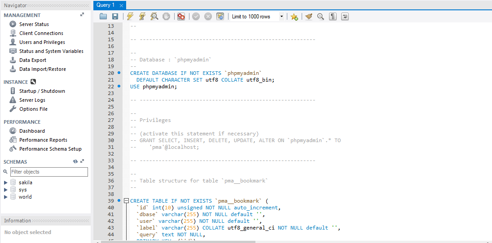

- Actualizamos el apartado del panel izquierdo llamado `SCHEMAS` y nos saldra la base de datos.

  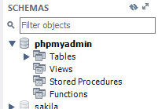

- Abriremos otra ventana sql en workbench y pondremos el siguiente código.

  ~~~
  CREATE USER 'pma'@'localhost' IDENTIFIED BY 'pmapass';
  GRANT ALL PRIVILEGES ON `phpmyadmin`.* TO 'pma'@'localhost' WITH GRANT OPTION;
  FLUSH PRIVILEGES;
  ~~~

  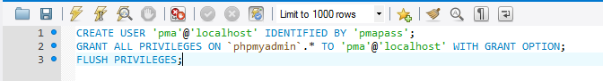

- Después de hacer esto iremos de nuevo al archivo `config.inc.php` y dentro iremos a un apartado llamado `User for advanced features` en el que tendremos que poner la contraseña que pusimos en el apartado anterior.

  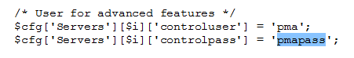

- El resto de suele estar bien siempre pero no esta de más verificarlo que estas lineas sean como estas que dejará aquí:

~~~
/*
 * phpMyAdmin configuration storage settings.
 */

/* User used to manipulate with storage */
$cfg['Servers'][$i]['controlhost'] = 'localhost';
// $cfg['Servers'][$i]['controlport'] = '';
$cfg['Servers'][$i]['controluser'] = 'pma';
$cfg['Servers'][$i]['controlpass'] = 'pmapass';

/* Storage database and tables */
$cfg['Servers'][$i]['pmadb'] = 'phpmyadmin';
$cfg['Servers'][$i]['bookmarktable'] = 'pma__bookmark';
$cfg['Servers'][$i]['relation'] = 'pma__relation';
$cfg['Servers'][$i]['table_info'] = 'pma__table_info';
$cfg['Servers'][$i]['table_coords'] = 'pma__table_coords';
$cfg['Servers'][$i]['pdf_pages'] = 'pma__pdf_pages';
$cfg['Servers'][$i]['column_info'] = 'pma__column_info';
$cfg['Servers'][$i]['history'] = 'pma__history';
$cfg['Servers'][$i]['table_uiprefs'] = 'pma__table_uiprefs';
$cfg['Servers'][$i]['tracking'] = 'pma__tracking';
$cfg['Servers'][$i]['designer_coords'] = 'pma__designer_coords';
$cfg['Servers'][$i]['userconfig'] = 'pma__userconfig';
$cfg['Servers'][$i]['recent'] = 'pma__recent';
$cfg['Servers'][$i]['favorite'] = 'pma__favorite';
$cfg['Servers'][$i]['users'] = 'pma__users';
$cfg['Servers'][$i]['usergroups'] = 'pma__usergroups';
$cfg['Servers'][$i]['navigationhiding'] = 'pma__navigationhiding';
$cfg['Servers'][$i]['savedsearches'] = 'pma__savedsearches';
$cfg['Servers'][$i]['central_columns'] = 'pma__central_columns';
$cfg['Servers'][$i]['designer_settings'] = 'pma__designer_settings';
$cfg['Servers'][$i]['export_templates'] = 'pma__export_templates';
~~~

Con esto la práctica estará finalizada y veremos que si volvemos al navegador  y ponemos `localhost/phpmyadmin` ahora no nos saldrá ningun error y eso quiere decir que estara todo correcto.

  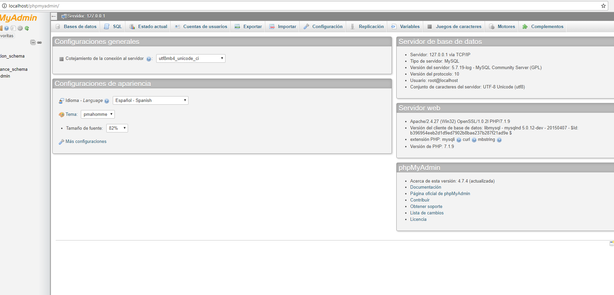

___

Fin de la práctica.
