# Instalación MySQL, Workbench y pfpMyAdmind

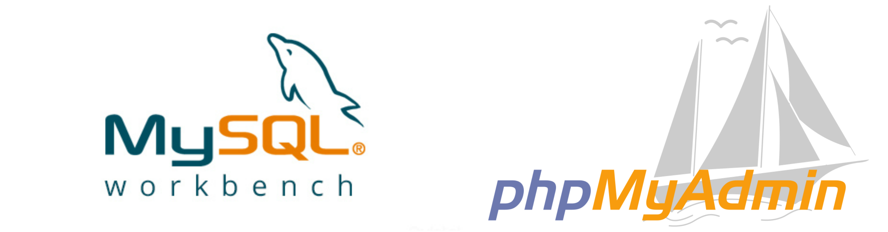

___

 Esta práctica consiste en instalar en nuestra máquina Windows el *MySQL*, *Workbench* y *phpMyAdmin* con el XAMPP.

 Haremos también la configuración para conexiones remotas del *Workbench*.

___

Entraga de la práctica:

- Crear informe explicativo.
- Detallar los pasos realizados incluyendo imágenes.

___

# 1. Máquina virtual

En este caso he realizado la práctica con una máquina con el sistema operativo `Windows 10`.

Tener en cuenta desactivar los *firewall*

___
___

# 2. MySQL y Workbench (MySQL community)

Usaremos una versión llamada *MySQL community* que nos traera tanto el MySQL como el Workbench cuando se elija la opción *Developer* cuando estemos instalando.

## 2.1 Instalación

Lo primero que debemos hacer antes de instalar el *Mysql* junto a *Workbench* sera instalar el ***visual c++*** así tendremos los requisitos cumplidos antes de instalar el resto.

### 2.1.1 Visual c++

1. Entrar en [visual c++](https://support.microsoft.com/en-us/help/3179560/update-for-visual-c-2013-and-visual-c-redistributable-package)

2. Descargar el instalador en nuestro caso el español.

3. Ejecutarlo

    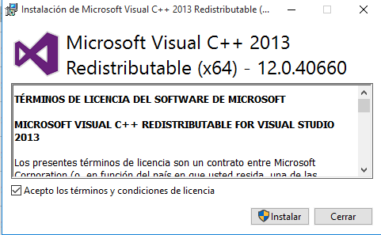

4. Instalamos y terminado.

### 2.1.2 MySQL community

Instalaremos el *MySQL community* ya que este nos instalará el MySQL junto al Workbench cuando elijamos la opción *Developer*.

Para descargarlo iremos al [enlace](https://dev.mysql.com/downloads/windows/installer/5.7.html) de *MySQL community* y descargaremos la version de 64 bits en nuestro caso.

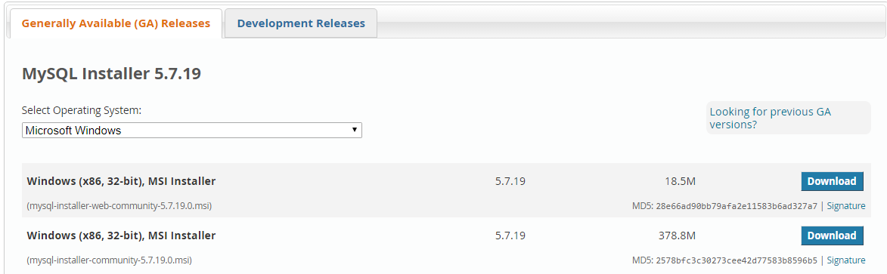

### Instalación:

Una vez descargado el instalador procederemos a instalarlo.

- Lo primero será ejecutar el instalador y nos aparecerá una pantalla así y le daremos a `Next`

  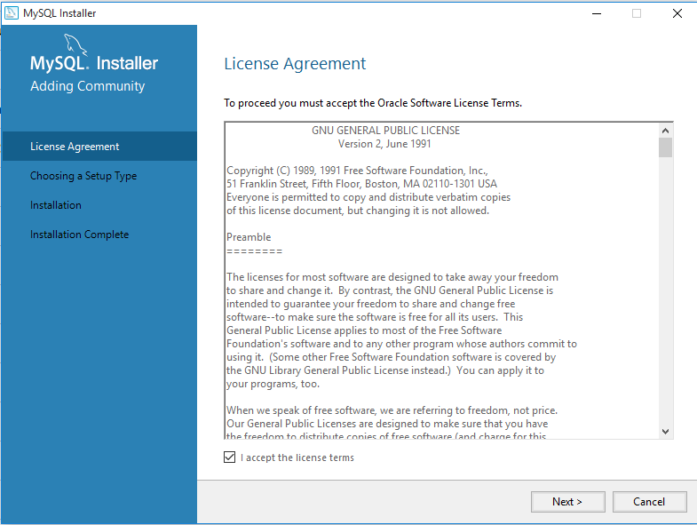

- Luego eligiremos la opción `Developer Default` que nos instalará los productos de *MySQL* en nuestro caso para tener el *Workbench* también.

  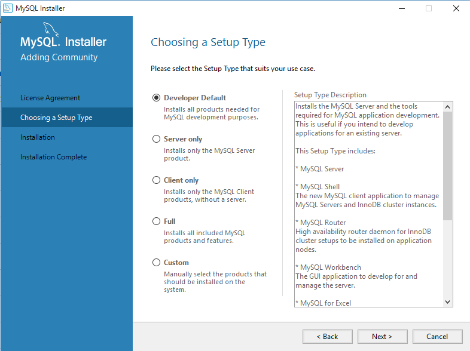

- Pasaremos a la instalación y nos saldrá una lista de todos los productos que se instalarán, le daremos abajo a `execute`.

  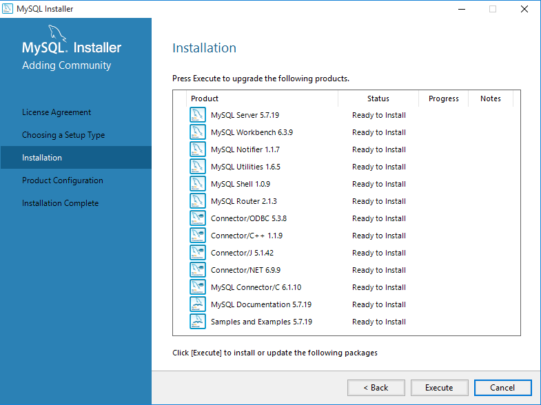

- Veremos que se ponen todos en verde lo que quiere decir que todas las intalaciones se han hecho correctamente.

  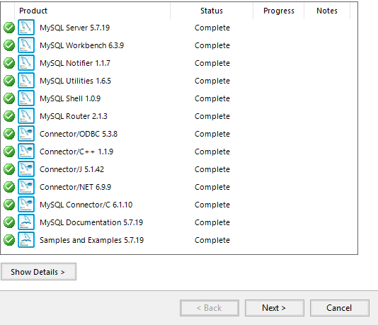

- Al darle a 'Next' veremos que iremos a otro modo de instlación en el que eligiremos la primera opción `Standalone MySQL Server / Classic MySQL Replication` .

  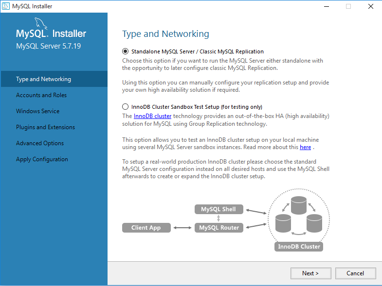

- Pasaremos a una configuración de la opción elegida anteriormente que deberemos tener de esta manera:

  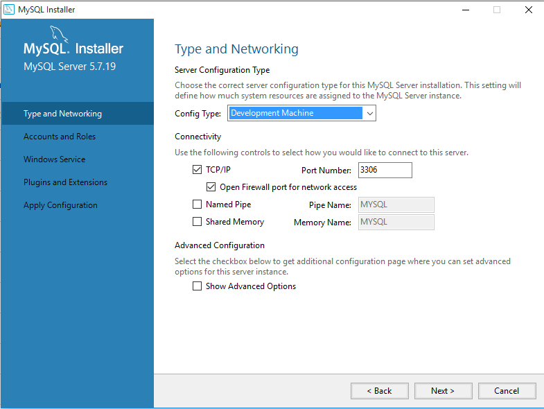

- Seguiremos hasta llegar a `Windows Service`  en el que tendremos que tener el nombre del servidor por defecto y activas las opciones que vemos.

  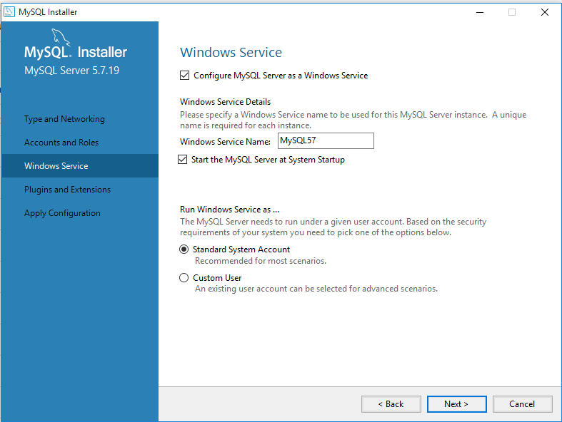

- Daremos siguiente y estaremos en `Plugins and Extensions` y lo dejaremos sin nada activado.

  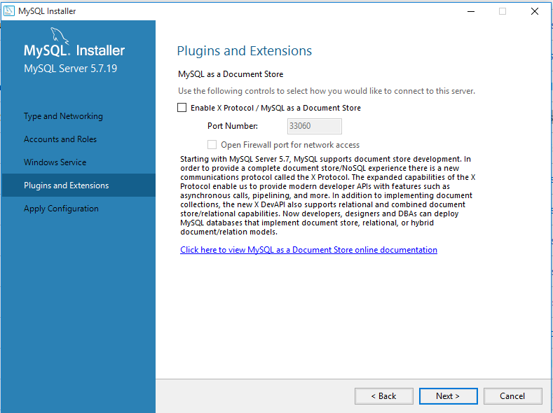

- Finalmente daremos todo siguiente hasta terminar.

___

### Servicio MySQL

Instalado todo veremos que el servicio estará activo.

Una de las formas es ir a los servicios y ahi lo veremos.

  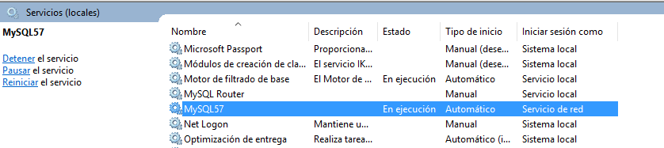

  ___

### Workbench

Una vez instalado el *MySQL community* lo abriremos para comprobar que esta todo correcto.

___

### Ubicación archivos

Cuando hemos instalado todo se nos creara carpetas con los archivos de configuración y directorios.

  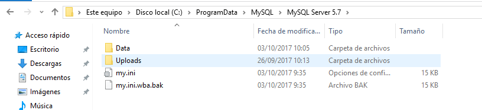

  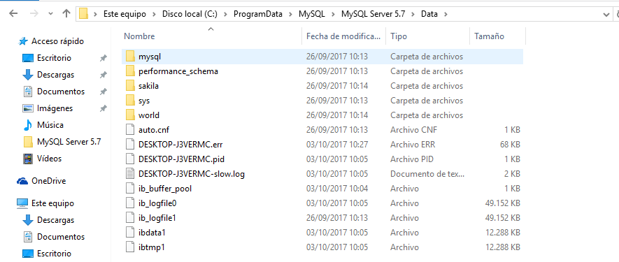

  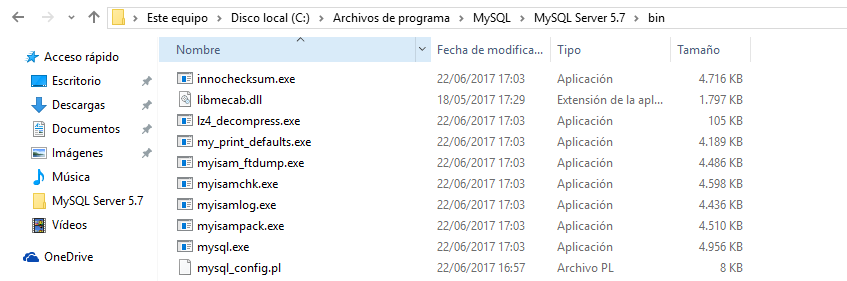

  ___

## 2.2 Configuración acceso remoto

En esta parte lo que haremos sera confirar el workbench para que con usuarios podamos acceder desde otro ordenador de forma remota.

Pasos a seguir :

- Abrir *Workbench* y dentro de el ir al panel izquierdo y entrar en `Options file` y `Networking` dentro de él.

  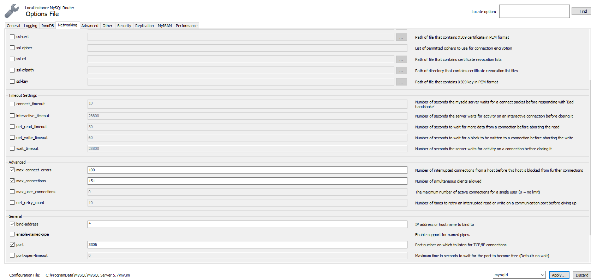

- 
