Óscar Moreira 2ºASIR

# Acceso remoto VNC

___

# Práctica

Esta práctica consiste en instalar el *VNC* que nos permitirá el acceso remoto desde cualquier lugar y cualquier sistema operativo.

Tendremos que acceder de forma remota de las siguientes maneras:

- Windows 10 cliente - Windows 10 server

- OpenSUSE cliente - OpenSUSE server

- Windows 10 cliente - OpenSUSE server

- OpenSUSE cliente - Windows 10 server

# Máquinas

1. Windows 10 server

    - RAM: 2GB
    - Almacenamiento: 40GB
    - Red 1: adaptador puente
    - IP: 172.18.5.10

2. Windows 10 cliente

    - RAM: 2GB
    - Almacenamiento: 40GB
    - Red 1: adaptador puente
    - IP: 172.18.5.11

3. OpenSUSE server

    - RAM: 2GB
    - Almacenamiento: 15GB
    - Red 1: adaptador puente
    - IP: 172.18.5.31

4. OpenSUSE server

    - RAM: 2GB
    - Almacenamiento: 15GB
    - Red 1: adaptador puente
    - IP: 172.18.5.32

___

# 1. Windows 10 cliente - Windows 10 server

## 1.1 Windows 10 server

Instalaremos el *VNC* en las dos máquinas siguiendo los siguientes pasos:

- Ir a la página de [TightVNC](https://www.tightvnc.com/download.php).

- Descargaremos el instalador de 64 bits

  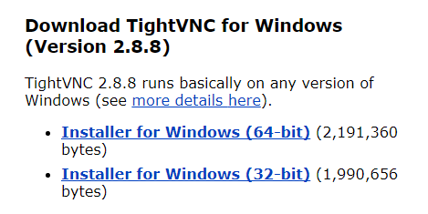

- Una vez instalado ejecutaremos el instalador y avanzaremos hasta llegar a un apartado llamado `Choose Setup Type `.

- En esta opción eligiremos `Custom` para asi poder elegir el instalador de servidor y no el de cliente.

  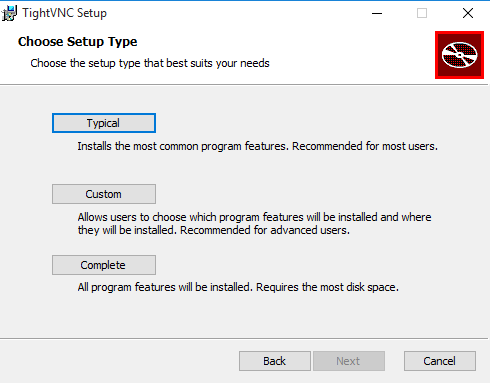

- Dentro de él nos aparecerá las opciones `Server` y `Viewer`

  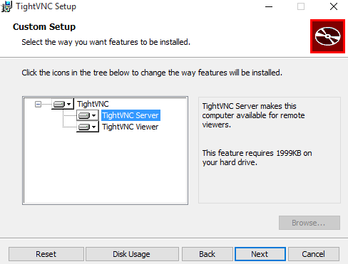

- Ahora clicaremos en el deplegable de `Viewer` y lo cancelaremos. De esta manera solo estará activado la instalación del *VNC server* .

  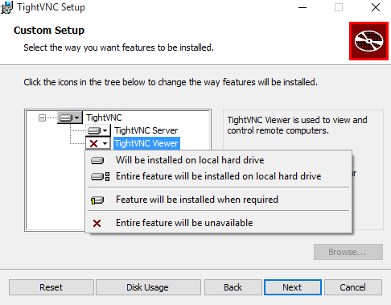)

- Luego *Next*  hasta instalar.

  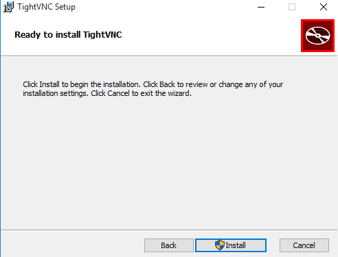

- Acabada la instlación nos saldrá una ventana en la que pondremos la contraseña para cuando nos conectemos de forma remota.

  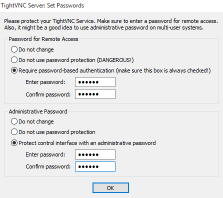

Con esto acabamos la instalación de *VNC* en  *Windows 10 server*

___

## 1.2 Windows 10 cliente

En el caso del cliente usaramos casi los mismos pasos solo cambiando algunas cosas de la instalación.

Seguiremos los mismos pasos que en en *Windows 10 server* hasta llegar a la opción `Custom Setup`.

Pasos a seguir:

- Ir a la página de [TightVNC](https://www.tightvnc.com/download.php).

- Descargaremos el instalador de 64 bits

- Una vez instalado ejecutaremos el instalador y avanzaremos hasta llegar a un apartado llamado `Choose Setup Type `.

- En esta opción eligiremos `Custom` para asi poder elegir el instalador de servidor y no el de cliente.

  

- Dentro de él nos aparecerá las opciones `Server` y `Viewer`

  

- En este caso ahora desactivaremos el server y dejaremos activado el *Viewer*.

  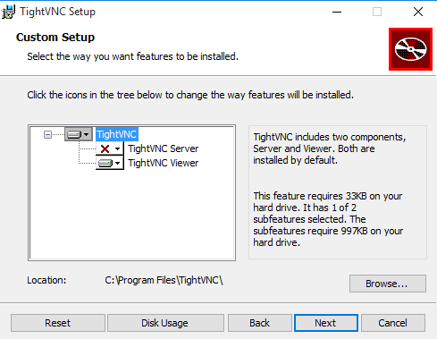

___

### Acceso remoto Windows cliente - Windows server

Ahora ya está todo listo para poder conectarnos al servidor de forma remota.

Pasos:

1. Ejecutaremos el *TightVNC Viewer*  en la máquina cliente.

2. Pondremos la IP del servidor (Windonws 10 server) y conectaremos.

3. Una vez nos conecte nos pedirá la contraseña que habiamos puesto en la instalación del *TightVNC server*  y entraremos, ya estaremos viendo el escritorio del servidor de forma remota.

    

4. Una forma mas de comprobar que se hace la conexión es ejecutando en la terminal el comando `netstat -n` y veremos que se hace una conexion remota desde el cliente hacia el servidor.

    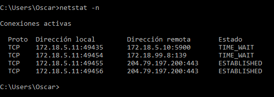

Con esto ya estaría la conexión realizada

___
___

# 2. OpenSUSE cliente - OpenSUSE server

## 2.1 OpenSUSE Server

En OpenSUSE ya viene una herramienta de *VNC*  por lo que seguiremos pasos diferentes a *Windows*.

Pasos:

- Lo primero sera ir a `Yast` y dentro iremos a `Servicios de red`.

- Aquí dentro veremos que que nos aparece una opción llamada `Administración remota (VNC)`, asi que entraremos en esta opción.

  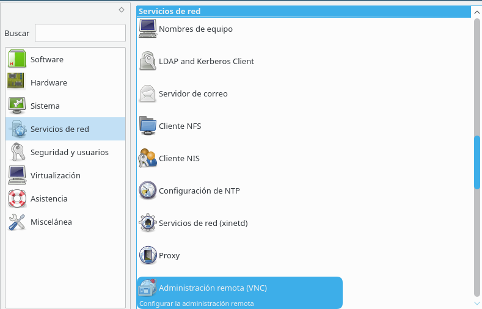

- Nos saldrá una ventana como la que se vera ahora en la que habrá que activar la casilla de `Permitir conexión remota con gestion del sistema` y aparte activar la casilla `Puerto abierto en el cortafuegos`.

  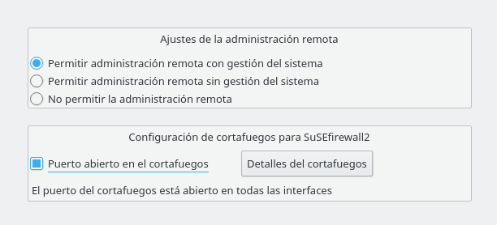

- Una vez aplicado esto se instalará y se reiniciará el equipo.

Puede darse el caso de que no se reinicie el equipo como fue el nuestro pero apagaremos y lo encenderemos de nuevo y la configuracion estará ya que si vamos a `Servicios autorizados` del `cortafuegos` lo veremos.

Pero habrá que seguir con comandos.

Pasos:

- Abriremos la terminar y entraremos como *superusuario* y ejecutaremos el comando `vncserver` en el que nos pedirá que pongamos una contraseña al acceso remoto al servidor.

  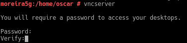

Una vez hecho esto pasaremos al cliente de OpenSUSE.

___

## 2.1 OpenSUSE cliente y acceso remoto

- En el caso del cliente solo habrá que abrir el terminal y ejecutar el comando `vncviewer`, al ejecutarlo nos pedirá la IP del servidor al que nos queremos conectar.

- Después de la IP habra que poner el puerto que nos indico al hacer el comando `vncserver` con un numerito en nuestro caso fue el 2.

- El puerto por defecto esta en `5900` asi que en nuestro caso como es el 2 sera el `5902`.

  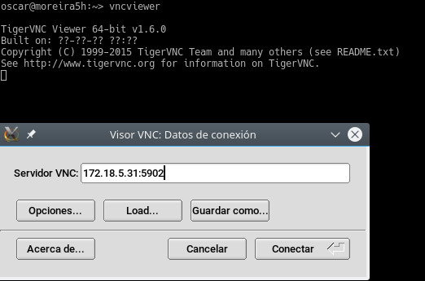

- Cuando le demos a conectar nos pedira la contraseña que pusimos en el servidor.

- Una vez hecho esto veremos que ya nos saldra el escritorio de nuestro servidor.

- En mi caso hice captura para que se viese que tiene el mismo hostname.

  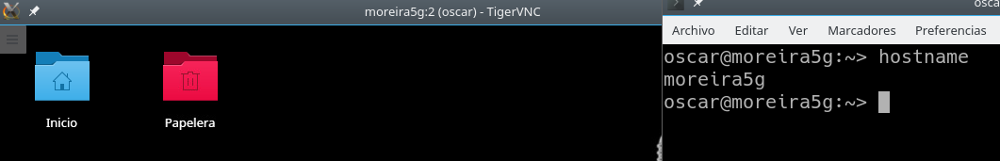

- A parte de esto ejecutaremos el comando `netstat -ntap` y veremos que se hace una conexion desde el cliente al servidor.

  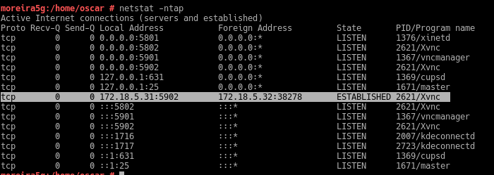

Con esto ya estaría la conexión realizada.

___
___

>Como ya tenemos instalado y configurado todos los *VNC* en las 4 máquinas ahora tocará probar conexiones entre ellas.

___
___
# 3. Acceso remoto Windows 10 cliente - OpenSUSE server

Pasos a seguir:

- Lo primero será tener abiertas las máquinas *Windows 10 cliente* y *OpenSUSE server*

- Luego abriremos el programa `TightVNC` en *Windows 10 cliente* y pondremos la IP del servidor de *OpenSUSE server* con su numero de puerto que si recordamos es el `5902`.

  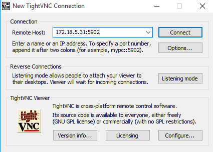

- Conectaremos y nos pediraá la contraseña creada para el servidor de *OpenSUSE*

  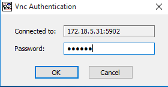

- Con esto ya nos entrará y veremos el escritorio de *OpenSUSE server* en que veremos que tiene el mismo hostname para verificarlo.

  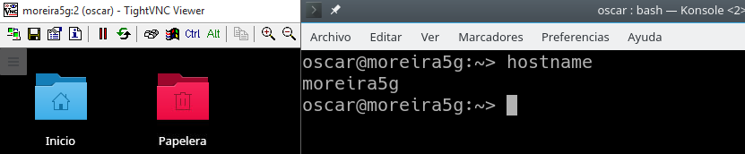

- También ejecutaremos el comando `netstat -ntap` en *OpenSUSE server* y veremos que se hace la conexión remota desde el *Windows 10 cliente* hacia el *OpenSUSE server*

  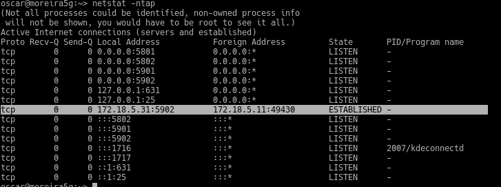

Con esto la conexion ya esta hecha.

___
___

# 4. Acceso remoto OpenSUSE cliente - Windows 10 server

Pasos a seguir:

- Lo primero será tener abiertas las máquinas *Windows 10 server* y *OpenSUSE cliente*

- Luego ejecutaremos en el cliente el comando `vncviewer` en el que nos saldra la ventana para poner la IP del servidor en este caso de *Windows 10 server*

  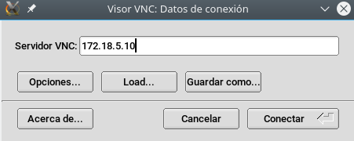

- Conectaremos y nos pediraá la contraseña creada para el servidor de *Windows 10 server*

- Con esto ya nos entrará y veremos el escritorio de *Windows 10 server*

  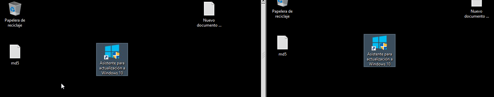

- También ejecutaremos el comando `netstat -n` en *Windows 10 server* y veremos que se hace la conexión remota desde el *OpenSUSE cliente* hacia el *Windows 10 server*

  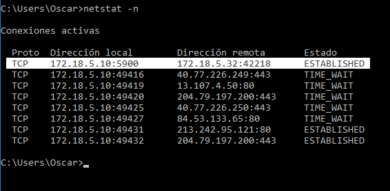

___
___

Práctica finalizada
