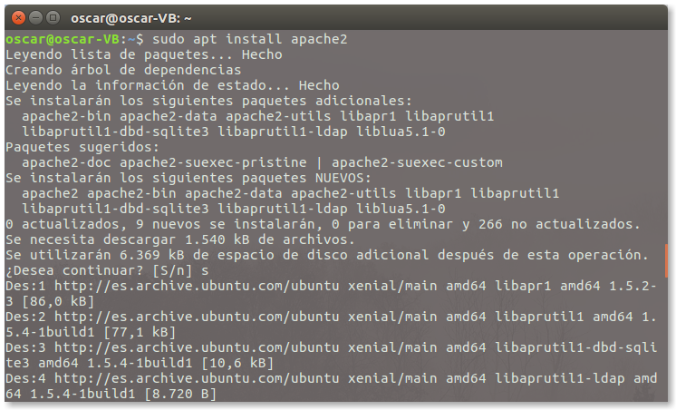
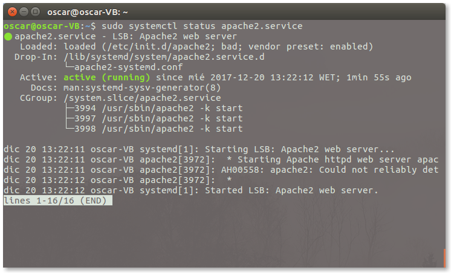
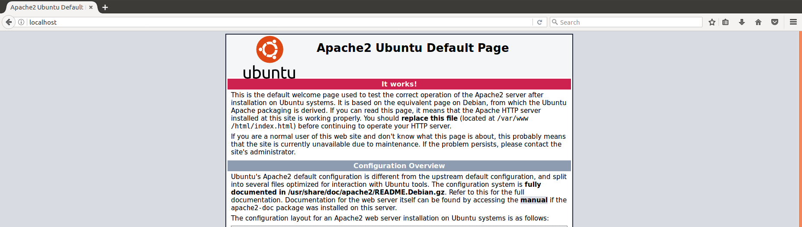
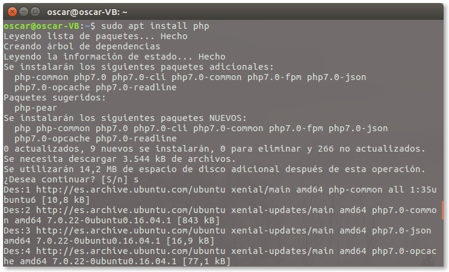
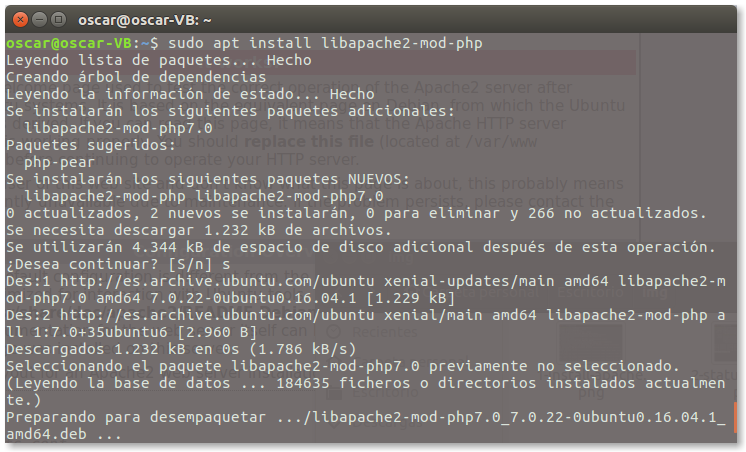
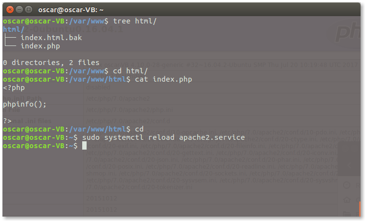
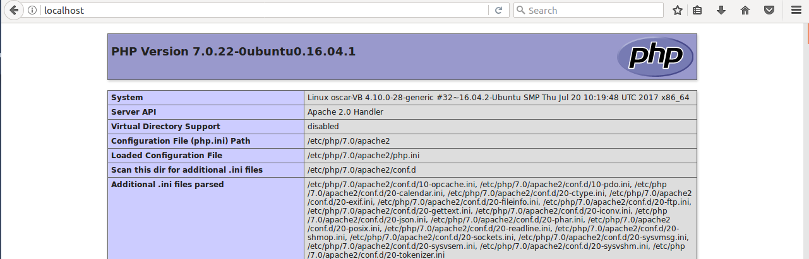

Óscar Moreira

Calos Oliva
___

# Panel de Control Hosting Web
___

___

# Práctica

Esta práctica consistira en tener un panel de control de hosting en un servidor en el que tengamos: `Linux`, `Apache`, `MySQL` y `PHP`, lo que se conoce por sus siglas como `LAMP`.

En nuestro caso elegimos el panel de control llamado *Webmin* y lo hemos instalado en ***Ubuntu 16.04***.

___
___

# Procedimiento

Empezaremos teniendo instalado el sistema operativo *Ubuntu 16.04* y empezaremos instalando *Apache*, *PHP*, *MySQL* y por último el panel de control *Webmin*.

___

## 1. Apache

- Lo primero que haremos será instalar *Apache* con el comando: `sudo apt install apache2`

  

- Luego verificaremos que el servicio esta corriendo: `sudo systemctl status apache2`

  

- Confirmado que esta corriendo el servicio iremos al navegador e iremos a ***localhost***  y nos debe salir la página por defecto de *Apache*.

  

___

## 2. PHP

- Instalaremos *PHP* : `sudo apt install php`

  

- Una vez instalado pasaremos a instalar las librerías de *PHP* para *Apache*. `sudo apt install libapache2-mod-php`

  

- Ahora pasaremos a crear un **index.php**, esto lo crearemos en la ruta por defecto `/var/www/html`, dentro habrá un index.html que le cambiaremos el nombre para que no lo detecte y crearemos el **index.php** ahi dentro.

  - Contenido del index.php:

    ~~~
    <?php

    phpinfo();

    ?>
    ~~~

  

- Ahora si entramos en ***localhost*** en el navegador veremos que ya no nos sale el index de apache y nos sale el **index.php** que acabamos de crear.

  

___

## 3. MySQL
