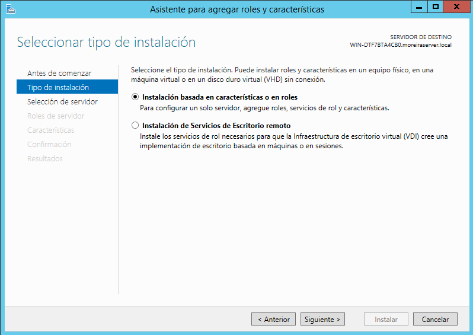
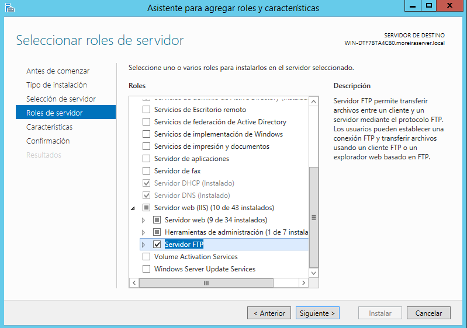

Óscar Moreira Estévez

# FTP Windows y Linux

___

# Práctica

En esta práctica veremos como se instala y configura un servidor *FTP* tanto en Linux como en Windows server 2012.

# Procedimiento

# 1. Windows Server 2012

## 1.1 Instalación FTP Windows Server 2012

- Lo primero que haremos sera ir a `agregar roles y características`.

- Dentro eligiremos la opción `Instalación basadad en roles y características`.

  

- Después eligiremos el servidor.

  

- Pasaremos a `Roles de servidor` y activaremos la casilla `Servidor FTP`.

  

- Pasaremos a las `Características` y lo dejaremos como está.

  

- En el siguiente paso confirmamos e instalamos.

  

- Luego iremos al panel de nuevo y entramos en  `Herramientas`-->`Administrador de Information Services (IIS)`

  

- Una vez dentro ya veremos que nos sale un panel de *FTP*.

  
