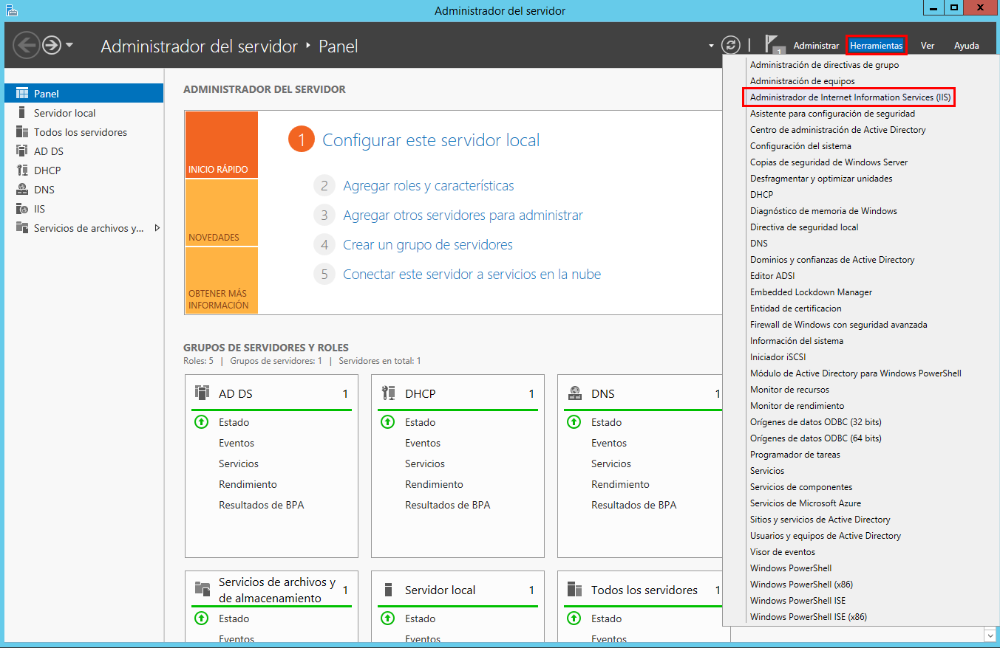
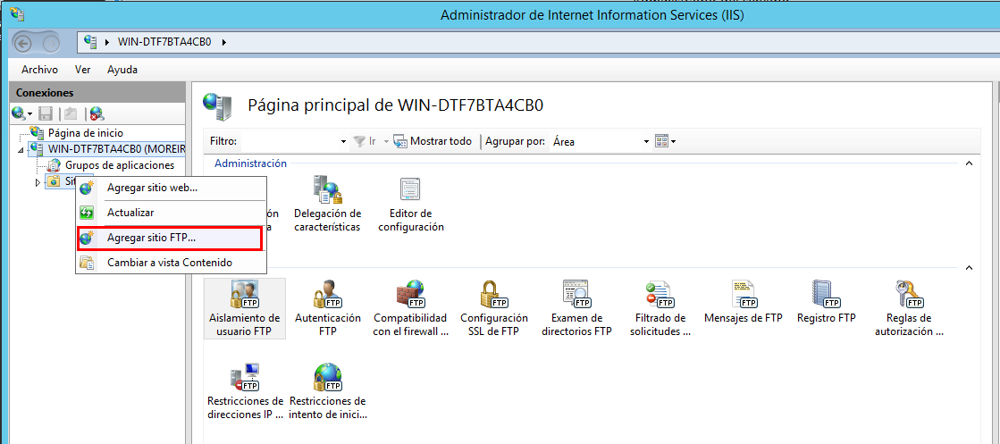

Óscar Moreira Estévez

# FTP Windows y Linux

___

# Práctica

En esta práctica veremos como se instala y configura un servidor *FTP* tanto en Linux como en Windows server 2012.

También haremos pruebas y conexiones desde un cliente en cada uno de los casos.

# Procedimiento

# 1. Windows Server 2012

## 1.1 Instalación FTP Windows Server 2012

- Lo primero que haremos sera ir a `agregar roles y características`.

- Dentro eligiremos la opción `Instalación basadad en roles y características`.

  

- Después eligiremos el servidor.

  

- Pasaremos a `Roles de servidor` y activaremos la casilla `Servidor FTP`.

  

- Pasaremos a las `Características` y lo dejaremos como está.

  

- En el siguiente paso confirmamos e instalamos.

  

- Luego iremos al panel de nuevo y entramos en  `Herramientas`-->`Administrador de Information Services (IIS)`

  

- Una vez dentro ya veremos que nos sale un panel de *FTP*.

  

___

## 1.2 Creacion de sitios FTP

Crearemos diferentes sitios webs con usuarios para cada uno y aparte instalaremos un programa llamado ***WinSCP*** en el cliente.

### 1.2.1 FTP de Administrador

Este sitio estara asociado a la unidad C: completa, y su usuario se llamará Administrador con permisos de lectura y escritura y sin certificado SSL.

- Primero iremos al panel y entramos en  `Herramientas`-->`Administrador de Information Services (IIS)`

  

- Una vez dentro iremos al servidor y clicaremos botón derecho en `sitios`-->`agregar sitio ftp`

  

- Ahora le pondremos nombre sl sitio ftp y eligiremos el directorio que queremos tener como contenido. En nuestro caso el disco C: completo

  

- Pasamos a la configuración de enlaces y SSL.

  

- Ahora en la autenticación y autorización le diremos que será `basica` y le pondremos que será el usuario llamado `Administrador` y los permisos correspondientes.

  

#### Comprobación:

- **Desde localhost:**

  - Iremos a navegador o a la ruta en carpetas y pondremos : `ftp://localhost` esto nos pedirá una contraseña.

    

  - Entramos y veremos que nos sale todo el contenido del disco local C:

    

- **Desde cliente windows 10:**

  - Iremos a navegador o a la ruta en carpetas y pondremos : `ftp://IP_SERVIEOR` esto nos pedirá una contraseña.

    

  - Entramos y veremos que nos sale todo el contenido del disco local C:

    

- **Desde WinSCP en cliente:**

  - Entraremos en el programa y eligiremos protocolo *FTP* sin cifrado,la IP del servidor y el puerto 21.

      

  - Veremos que nos salen todo el contenido del disco local C:

    
