Óscar Moreira Estévez

# FTP Windows y Linux

___

# Práctica

En esta práctica veremos como se instala y configura un servidor *FTP* tanto en Linux como en Windows server 2012.

También haremos pruebas y conexiones desde un cliente en cada uno de los casos.

# Procedimiento

# 1. Windows Server 2012

## 1.1 Instalación FTP Windows Server 2012

- Lo primero que haremos sera ir a `agregar roles y características`.

- Dentro eligiremos la opción `Instalación basadad en roles y características`.

  

- Después eligiremos el servidor.

  

- Pasaremos a `Roles de servidor` y activaremos la casilla `Servidor FTP`.

  

- Pasaremos a las `Características` y lo dejaremos como está.

  

- En el siguiente paso confirmamos e instalamos.

  

- Luego iremos al panel de nuevo y entramos en  `Herramientas`-->`Administrador de Information Services (IIS)`

  

- Una vez dentro ya veremos que nos sale un panel de *FTP*.

  

___

## 1.2 Creacion de sitios FTP

Crearemos diferentes sitios webs con usuarios para cada uno y aparte instalaremos un programa llamado ***WinSCP*** en el cliente.

### 1.2.1 FTP de Administrador

Este sitio estara asociado a la unidad C: completa, y su usuario se llamará Administrador con permisos de lectura y escritura y sin certificado SSL.

- Primero iremos al panel y entramos en  `Herramientas`-->`Administrador de Information Services (IIS)`

  

- Una vez dentro iremos al servidor y clicaremos botón derecho en `sitios`-->`agregar sitio ftp`

  

- Ahora le pondremos nombre sl sitio ftp y eligiremos el directorio que queremos tener como contenido. En nuestro caso el disco C: completo

  

- Pasamos a la configuración de enlaces y SSL.

  

- Ahora en la autenticación y autorización le diremos que será `basica` y le pondremos que será el usuario llamado `Administrador` y los permisos correspondientes.

  

#### Comprobación:

- **Desde localhost:**

  - Iremos a navegador o a la ruta en carpetas y pondremos : `ftp://localhost` esto nos pedirá una contraseña.

    

  - Entramos y veremos que nos sale todo el contenido del disco local C:

    

- **Desde cliente windows 10:**

  - Iremos a navegador o a la ruta en carpetas y pondremos : `ftp://IP_SERVIEOR` esto nos pedirá una contraseña.

    

  - Entramos y veremos que nos sale todo el contenido del disco local C:

    

- **Desde WinSCP en cliente:**

  - Entraremos en el programa y eligiremos protocolo *FTP* sin cifrado,la IP del servidor y el puerto 21.

      

  - Veremos que nos salen todo el contenido del disco local C:

    

___

### 1.2.2 FTP de todos los usuarios

En este sitio el contenido sera `/inetpub/wwwroot` con acceso para todos los usuarios de Active Directory con permisos de escritura y lectura y con permitir SSL.

- Creamos un nuevo sitio FTP

- Ahora le daremos un nombre al sitio ftp y tambien elegiremos la ruta que tendra el contenido en este caso: `inetpub/wwwroot`

  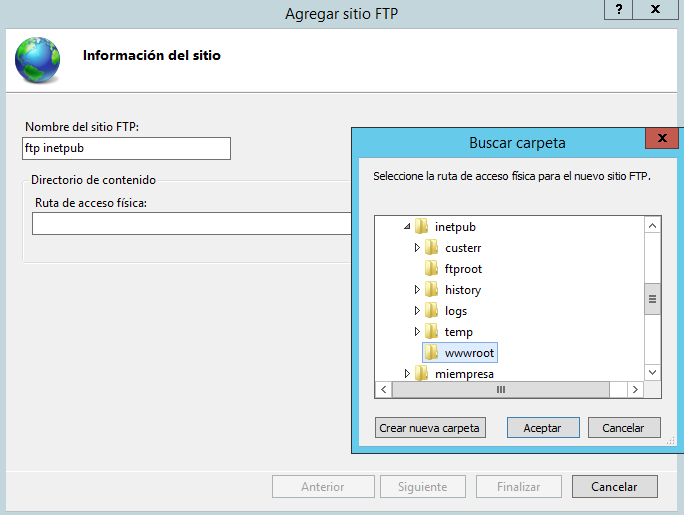

  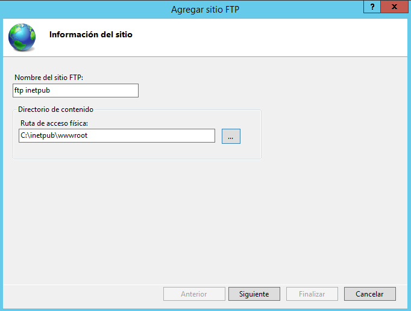

- Pasaremos a la `Confifguración de enlaces y SSL` y le pondremos en `permitir SSL` y elegimos un certificado.

  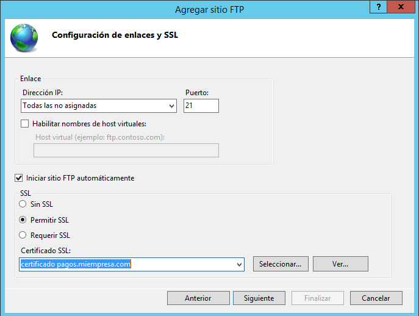

- Luego en el siguiente paso eligiremos  autenticación básica y autorización a todos los usuarios.

  

#### Comprobación

- **Desde localhost:**

  - Iremos a navegador o a la ruta en carpetas y pondremos : `ftp://localhost` esto nos pedirá una contraseña.

    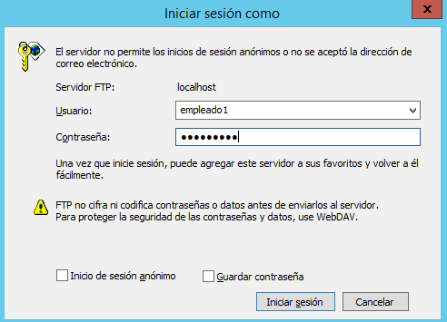

  - Entramos y veremos que nos sale todo el contenido de la ruta `/inetpub/wwwroot`:

    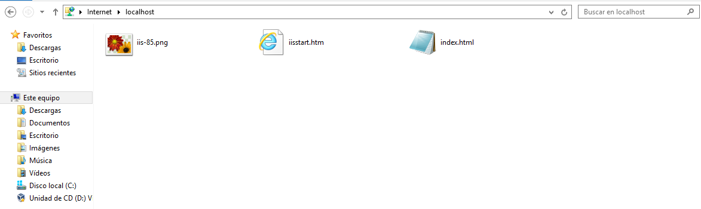

- **Desde cliente windows 10:**

  - Iremos a navegador o a la ruta en carpetas y pondremos : `ftp://IP_SERVIEOR` esto nos pedirá una contraseña.

    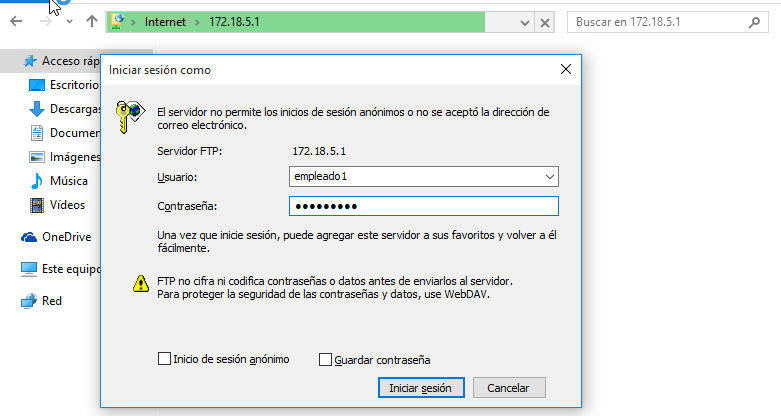

  - Entramos y veremos que nos sale todo el contenido de la ruta `/inetpub/wwwroot`:

    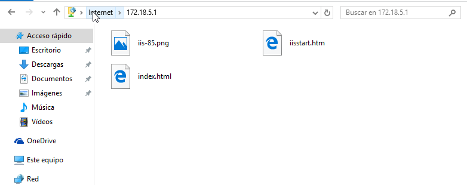

- **Desde WinSCP en cliente:**

  - Entraremos en el programa y eligiremos protocolo *FTP* con cifrado explícito,la IP del servidor y el puerto 21.

    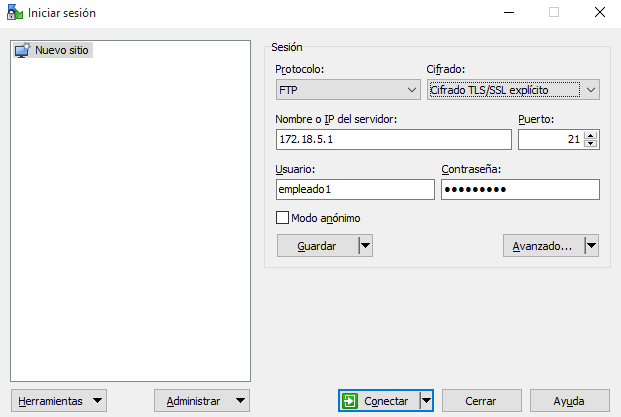  

  - Entramos y veremos que nos sale todo el contenido de la ruta `/inetpub/wwwroot`:

    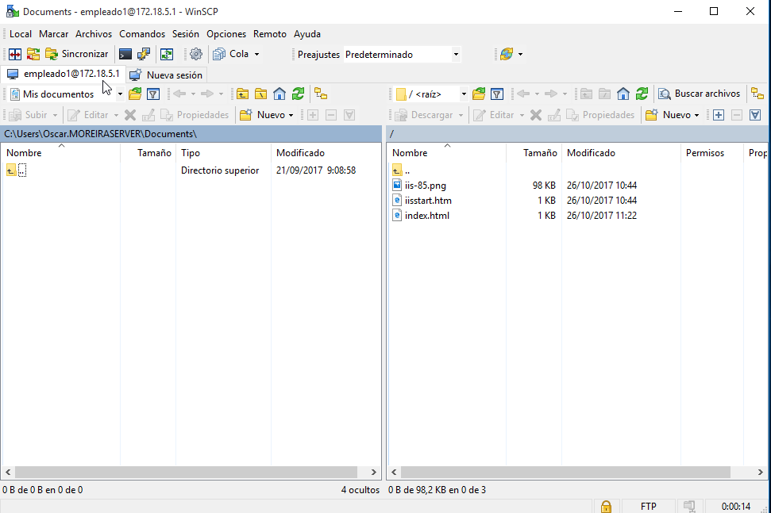

  ___

### 1.2.3 FTP anónimo

El tercer sitio *FTP* lo asociaremos a cualquier carpeta que tengamos en el sistema que no sea importante, permitiremos acceso anónimo y solo tendrá permisos de lectura.

- Creamos un nuevo sitio FTP

- Ahora le daremos un nombre al sitio ftp y tambien elegiremos cualquier ruta siempre que en este caso el directorio no sea importante.

  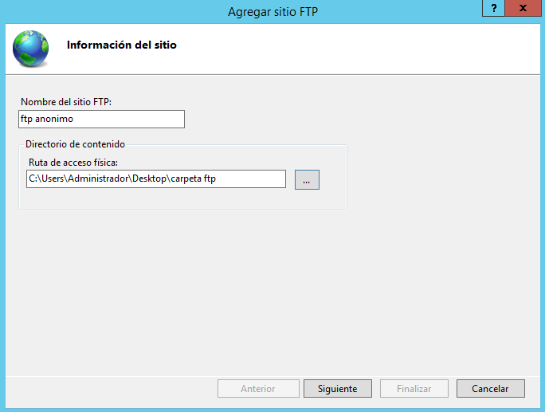

- Pasaremos a la `Confifguración de enlaces y SSL` y le pondremos en `sin SSL` y

  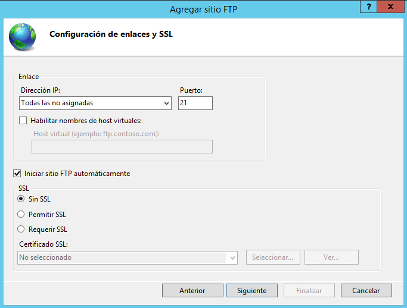

- Luego en el siguiente paso eligiremos  autenticación básica y autorización a `usuarios anónimos`.

  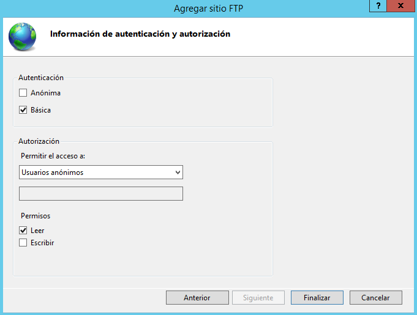

#### Comprobación

Antes de la comprobación le daremos permisos al grupo todos a la carpeta que hemos elegido para el *ftp anónimo*.

  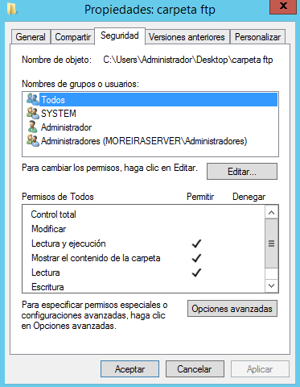

- **Desde localhost:**

  - Iremos a navegador o a la ruta en carpetas y pondremos : `ftp://localhost` esto no nos pedirá una contraseña ya que es para todos los usuarios anónimos.

  - Entraremos directamente en la carpeta.

    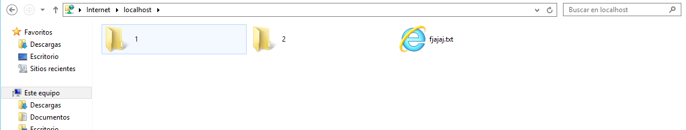

- **Desde WinSCP en cliente:**

  - Entraremos en el programa y eligiremos protocolo *FTP* sin cifrado ,la IP del servidor y el puerto 21.

      

  - Entramos y veremos que nos saldrá el contenido  de la carpeta.

    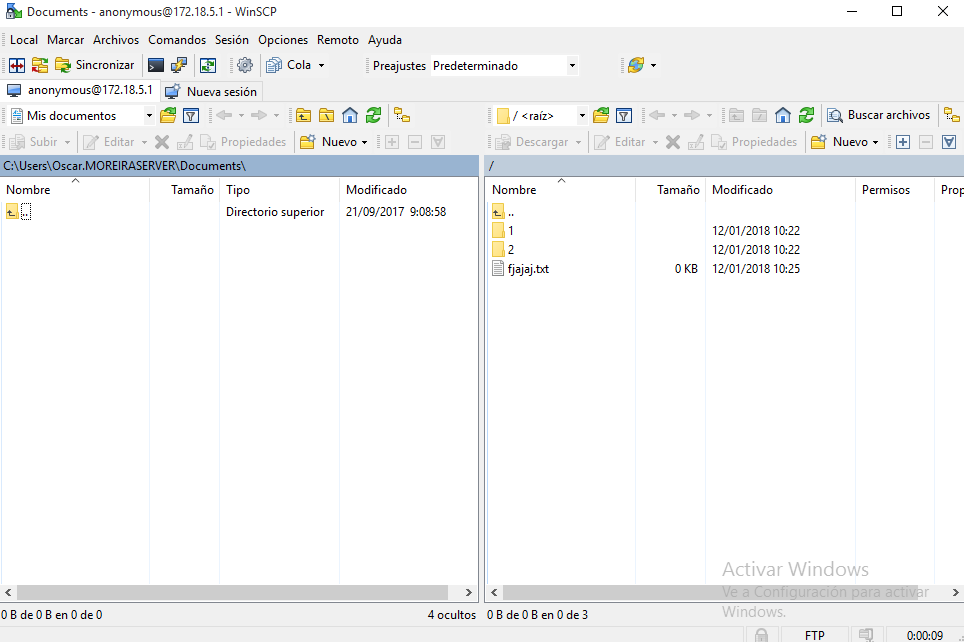

___
___

## 1.3 FTP con DNS

Crearemos un DNS llamado *ftp.miempresa.com* y comprobaremos que podemos acceder por el nombre que le hemos dado.

- Iremos a *IIS* y eligiremos un sitio ftp de los que hemos creado e iremos al panel derecho a `enlaces`

  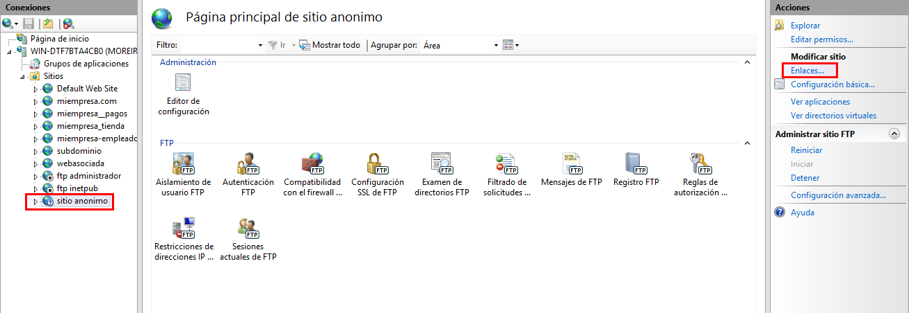

- una vez dentro agregaremos un enlace y lo pondremos como `http`, `puerto 80`, y el nombre que le queremos dar `ftp.miempresa.com`.

  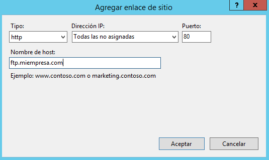

### Comprobación

- **Desde servidor:**

  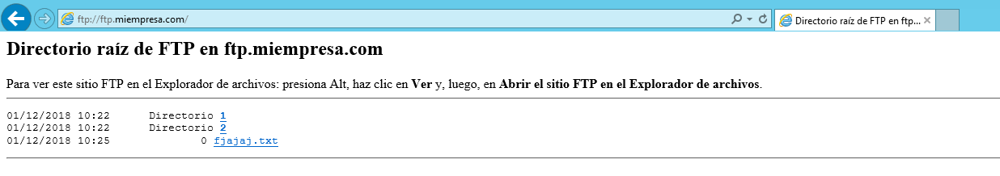

- **Desde cliente:**

  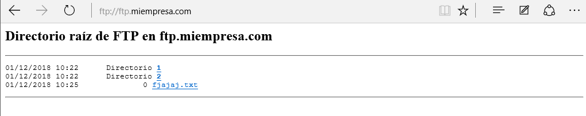

___
___

## 1.4 FTP varios a la vez.

En un principio es posible que debas detener un sitio web para que pueda iniciarse otro. Tras comprobar el funcionamiento por separado de los sitios, encontrar una solución para que nuestro servidor ofrezca varios sitios FTP simultáneamente.

- Lo que podemos hacer es cambiarle el puerto a cada ftp y asi poder entrar en ellos sin tener que estar desconectandolos y conectandolos.

- Iremos a *IIS* y eligiremos un sitio ftp e iremos al panel derecho a `enlaces` y entramos y editamos el enlace poniendole otro puerto.

  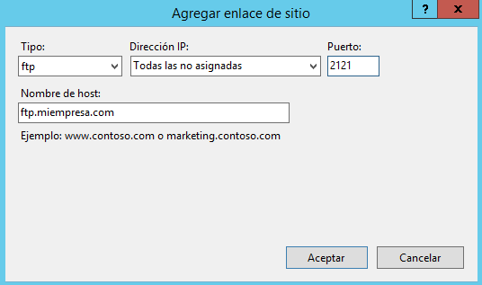

- Como vemos ahora estan los dos conectados.

  

### Comprobación

- **Ftp inetpub:**

  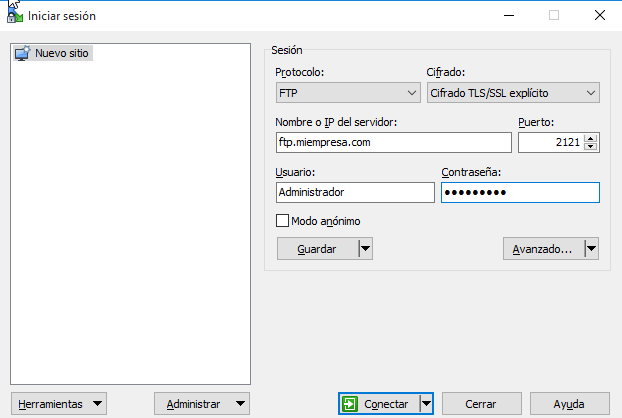

  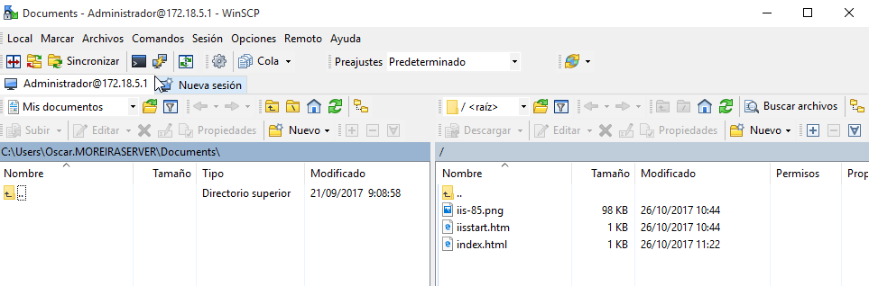

- **Ftp anónimo:**

  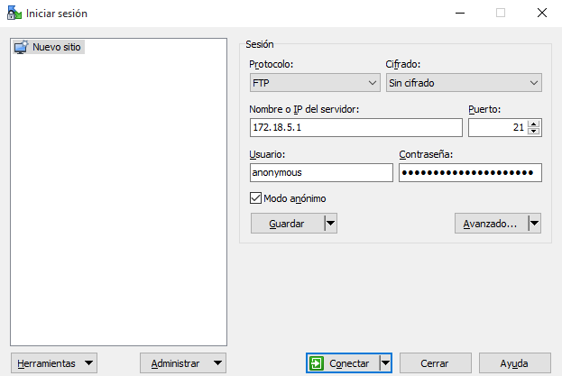

  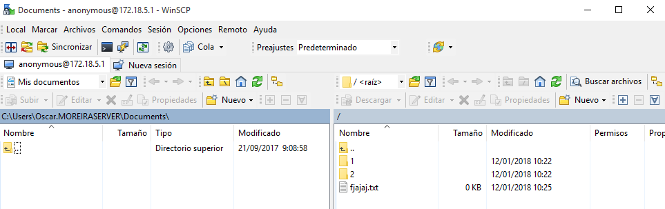

___
___
___

# 2. Linux Ubuntu 16.04

## 2.1 SSH

- Lo primero que haremos será instalar el servicio *SSH*: `sudo apt install openssh-server`

  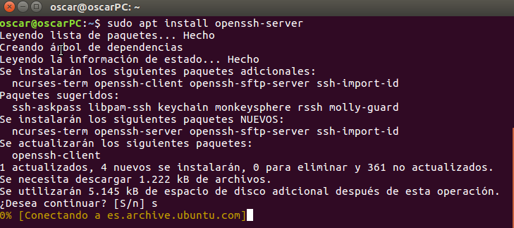

## 2.2 Crear usuarios y permisos

- Ahora crearemos 2 usuarios que usaremos para conectarnos en remoto. `sudo adduser usuario1`

  > Le pondremos contraseña al usuario

  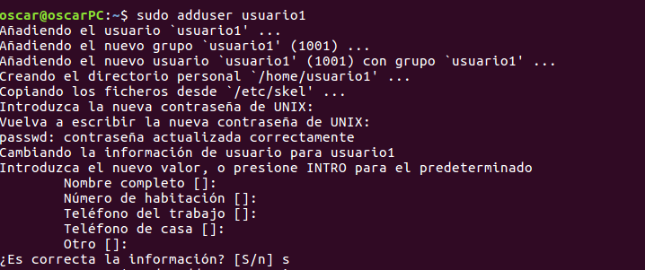

- Haremos lo mismo con otro usuario llamado *usuario2*

- Ahora iremos a `Configuración`-->`Cuentas de usuario` y a uno de los dos usuario le pondemos como administrador y al otro como estandar.

  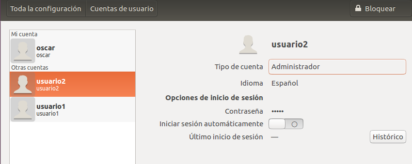

## 2.3 Conexión SSH

> Desde el cliente

- Para conectarnos al servidor a uno de los usuarios creador haremos: `ssh usuario@IP_SERVIDOR`

- Ahora vemos como estamos dentro de cada uno de ellos.

  - **Usuario1:**

      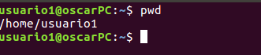

  - **Usuario2:**

      

## 2.4 Ejecutar aplicación gráfica con SSH

- Para ejecutar una aplicación gráfica en remoto por SSH tendremos que ejecutar el siguiente comando: `ssh -X -p 22 usuario@IP_SERVIDOR nombre_app`

    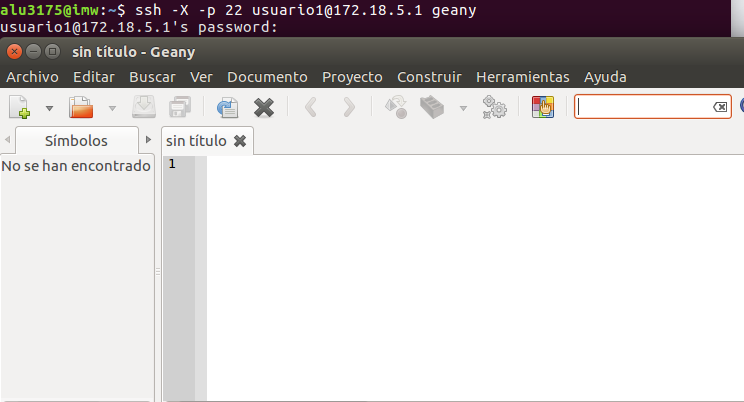

## 2.5 Acceso remoto por SFTP

#### Usuario1

- Para conectarnos por sftp haremos como con ssh: `sftp usuario@IP_SERVIDOR`

  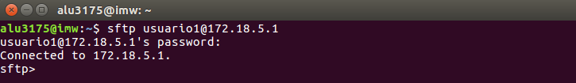

- Ahora pasamos a descargar en remoto un fichero que esta en el servidor a nuestra máquina cliente con el comando `get`.

  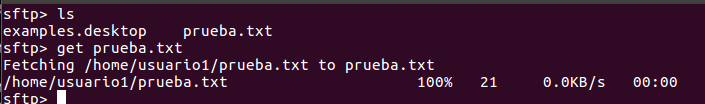

- Vemos que se nos ha descargado en el cliente:

  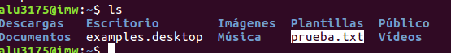

- Ahora haremos lo contrario subir un fichero desde el cliente al Servidor con el comando `put`

  

- Comprobamos que lo tenemos en el servidor.

  

#### Usuario2

- Ahora haremos lo mismo pero con el usuario2

- Para conectarnos por sftp haremos como con ssh: `sftp usuario@IP_SERVIDOR`

- Ahora pasamos a descargar en remoto un fichero que esta en el servidor a nuestra máquina cliente con el comando `get` con el usuario1

- Y vemos que se nos ha descargado en el cliente.

  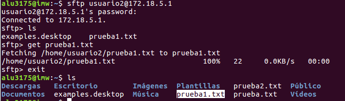

- Ahora haremos lo contrario subir un fichero desde el cliente al Servidor con el comando `put`

  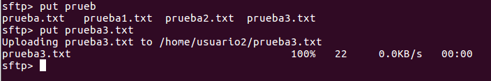

- Comprobamos que lo tenemos en el servidor.

  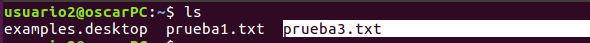

## 2.6 SCP transferir ficheros.

- Otra forma de transferir ficheros o carpetas, etc... es con el comando `scp`

  ~~~
  scp nombre_fichero usuario@IP_SERVIDOR:/directorio      # Esto si es solo un fichero

  scp -r nombre_fichero usuario@IP_SERVIDOR:/directorio   # Esto si es una carpeta con varios contenidos dentro.
  ~~~

- Ahora pasaremos a transferir una carpeta del cliente al servidor al usuario1

  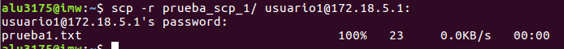

- Vemos que la carpeta se ha pasado al servidor.

  

- Haremos lo mismo pero al usuario2.

  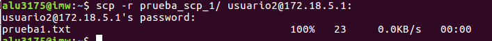

- Confirmamos que se ha pasado la carpeta.

  

## 2.7 Proftpd

- Vamos a instalar *Proftpd* con el comando `sudo apt install proftpd`

  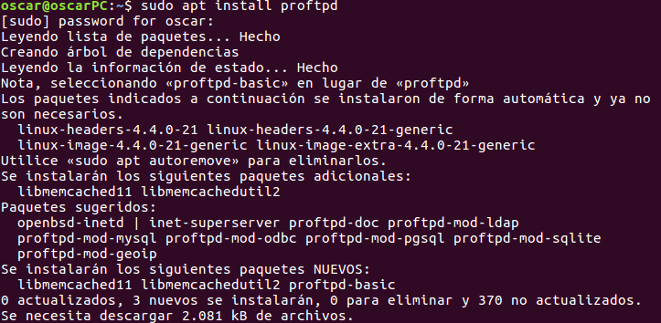

- En medio de la instalación nos saldrá un mensaje en el que eligiremos la configuración como `independiente`

  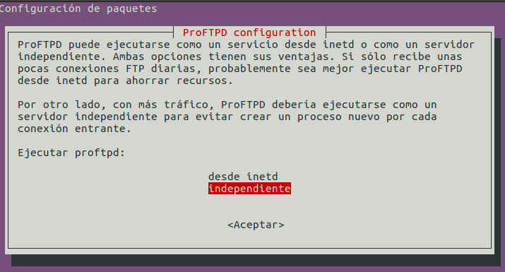

## 2.8 Editar fichero proftpd.conf

- Iremos a la ruta donde se encuentra el fichero `/etc/proftpd/proftpd.conf` y lo abriremos con editor de texto.

- Dentro del fichero buscarmemos `#DefaultRoot` que estará comentado, lo que haremos será descomentarlo. Esta línea será la que diga que directorio van a poder ver los usuarios

- En mi caso lo configure de tal manera que el usuario1 tenga permiso a todo el disco y el usuario2 solo a su *home*

  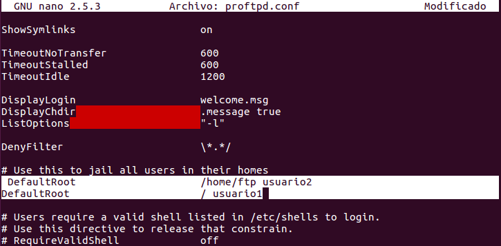

## 2.9 FTP por proftpd

- Nos conectaremos con el comando `ftp IP_SERVIDOR` y esto nos pedirá un usuario y una contraseña.

- Haremos la conexión con los dos usuarios. y veremos como nos señala que nos estamos conectando por `proftpd`

  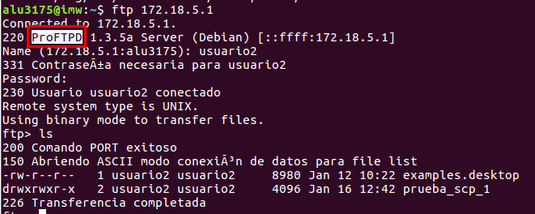

  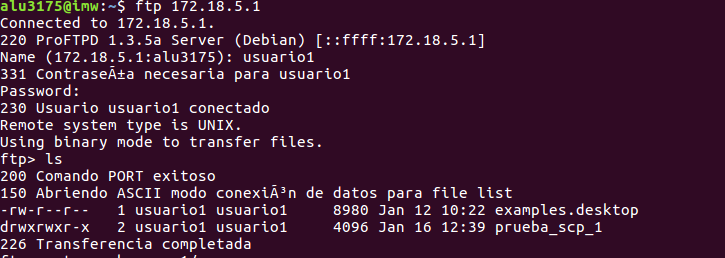

- Ahora descargaremos algo del servidor con el comando `get` y veremos el resultado.

  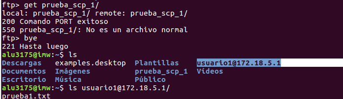
___
___

Fín de la práctica
