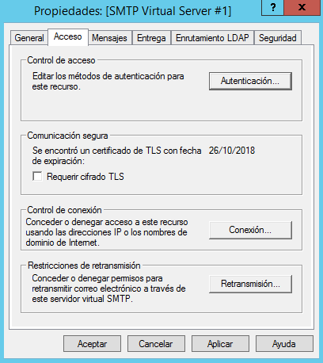
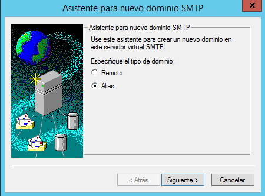
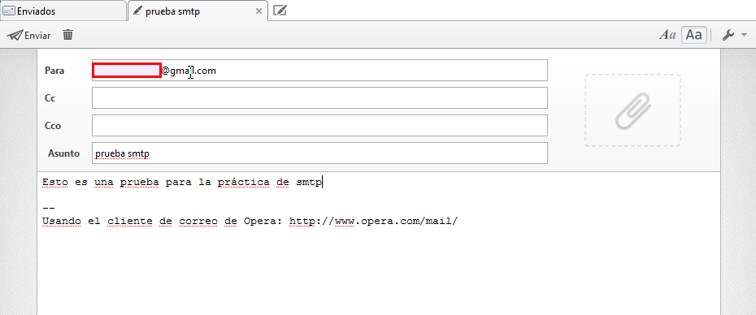
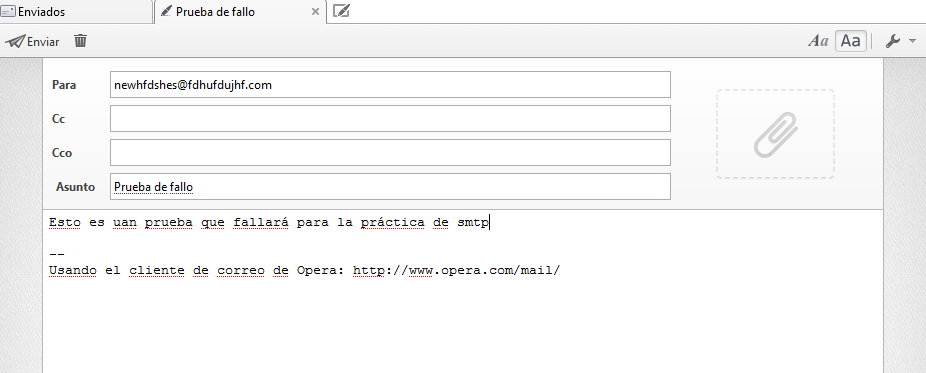
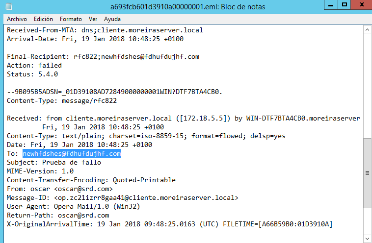
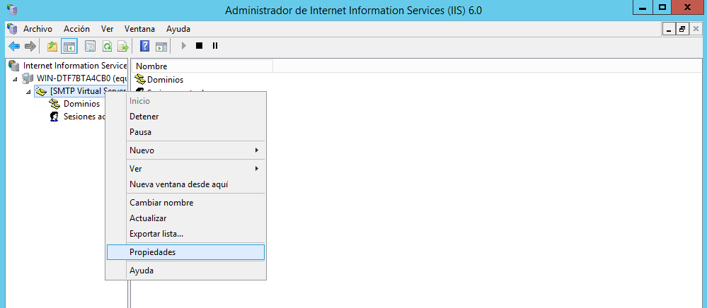
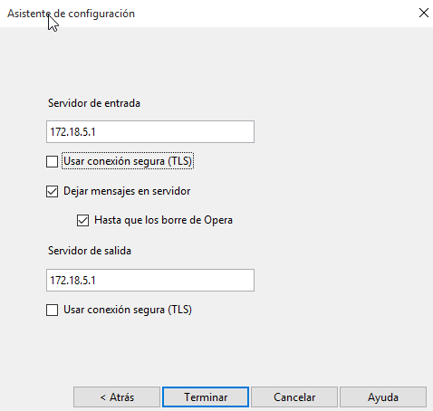
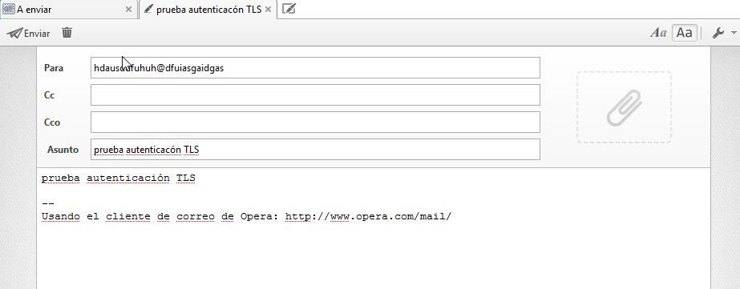

Óscar Moreira Estévez

## Índice

- [SMTP Windows Server 2012](#smtp)

- [Hmail Windows Server 2012](#hmail)

___

# SMTP - Windows Server 2012

# Instalación SMTP

- Iremos al panel del servidor y entraremos en `agregar roles y características`.

  

- En el tipo de instalación eligiremos: `Instalación basada características o en roles`

  

- Seleccionamos el servidor de destino.

  

- Ahora en la selección de roles no elegimos ninguno.

  

- Después de esto en la selección de características marcamos: `Servidor SMTP`

  

- Y por último confirmamos la instalación.

  

___

# 2. Configuración del servicio SMTP

- Para entrar en la configuración del servidor SMTP iremos al panel del servidor -->`Herramientas`-->`Administrador de Internet Information Services (IIS) 6.0`.

  

- Entramos y vamos a las propiedades del servicio SMTP.

  

- Ahora pondremos la IP del servidor , limitamos el numero de conexiones, y habilitamos el registro W3C.

  

- Vamos a las propiedades del registro y lo dejaremos de esta manera.

  

- Hecho esto en las propiedades del servidor SMTP iremos a `Acceso`-->`autenticación`-->`Todo excepto la lista...`-->`agregar` y pondremos una IP.

  

  

  

- Luego en la conexión eligiremos `Acceso anónimo`

  

  

- Por último en la retransmisión eligiremos `Todos excepto ...`

  

  

## 2.1 Dominio para SMTP

- Para crear un dominio de nuestro servicio SMTP iremos al panel del servidor y `herramientas`-->`Administrador de Internet Information Services (IIS) 6.0`-->`SMTP`-->`Dominios`-->`Nuevo -- dominio`.

  

- Eligiremos `Alias`

  

- Le daremos un nombre al dominio.

  

- Hecho esto quedaría así.

  

- Si vamos a la ruta `c:/inetpub/mailroot` veremos que se nos ha creado unas carpetas.

  

___

# 3. Cliente Windows

- Comprobamos que tenemos conexión al servidor a través del nombre de dominio que le hemos dado.

  

- Descargamos el cliente *Opera Mail* para enviar correos.

## 3.1 Sin cifrado anónimo

- Lo primero que haremos será enviar un correo a una cuenta que si existe de verdad y veremos si lo recibimos.

  

  

- Ahora lo enviaremos a una cuenta que no existe y veremos que no se envia y se nos queda en las carpetas de SMTP en el servidor.

  

  

  

## 3.2 Sin cifrado TLS autenticación básica.

- Para esto primero deberos ir a las propiedades del *SMTP* en el servidor.

  

- En `acceso`-->`autenticación` eligiremos `autenticación básica`

  

- Ahora pasaremos a comprobar que funciona con los correos, para esto debemos crear cuentas con las que el usuario este dentro de los usuarios de Active Directory y no activar la conexión segura TLS.

  

- Probamos primero enviando un mensaje a un correo que no existe y veremos que se nos guarda en las carpetas de SMTP.

  

  

- Ahora probamos con un correo que si existe y veremos que lo recibimos.

  

  

## 3.3 Con cifrado TLS y autenticación básica.

- Para esto haremos lo mismo pero cuando creemos la cuenta de correo activaremos la opción `conexion segura TLS`

  

- Probaremos ahora con un correo que no existe y veremos que pasa lo mismo que las otras veces que se nos envia a las carpetas de SMTP pero esta vez nos pedirá que aceptemos un mensaje de seguridad.

  

  

  

  

- Si ahora enviamos a un correo que si existe veremos que lo recibimos y en este caso no nos sale ningún mensaje de seguridad ya que lo hemos aceptado ya.

  

  

___
___
___

# Hmail Windows Server 2012

