Óscar Moreira Estévez

# SMTP - Windows Server 2012

# Instalación SMTP

- Iremos al panel del servidor y entraremos en `agregar roles y características`.

  

- En el tipo de instalación eligiremos: `Instalación basada características o en roles`

  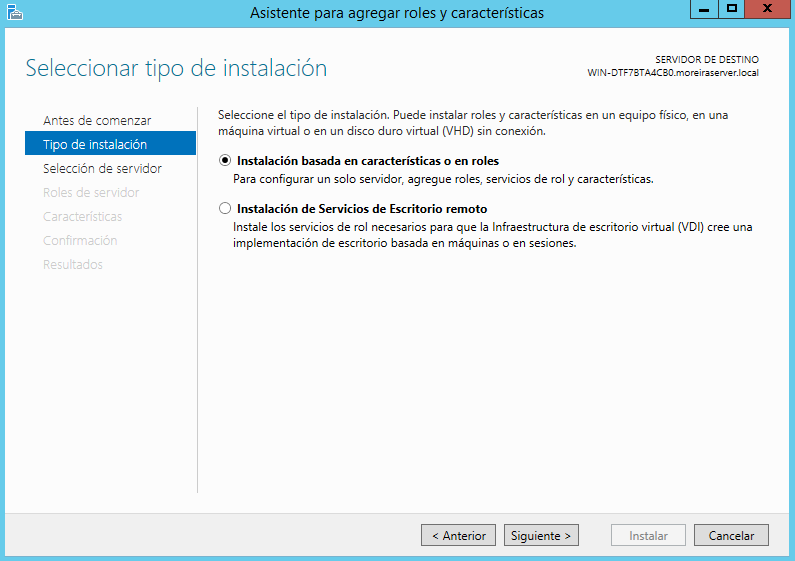

- Seleccionamos el servidor de destino.

  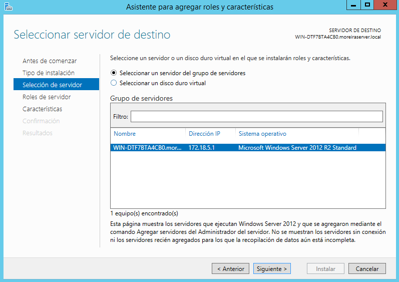

- Ahora en la selección de roles no elegimos ninguno.

  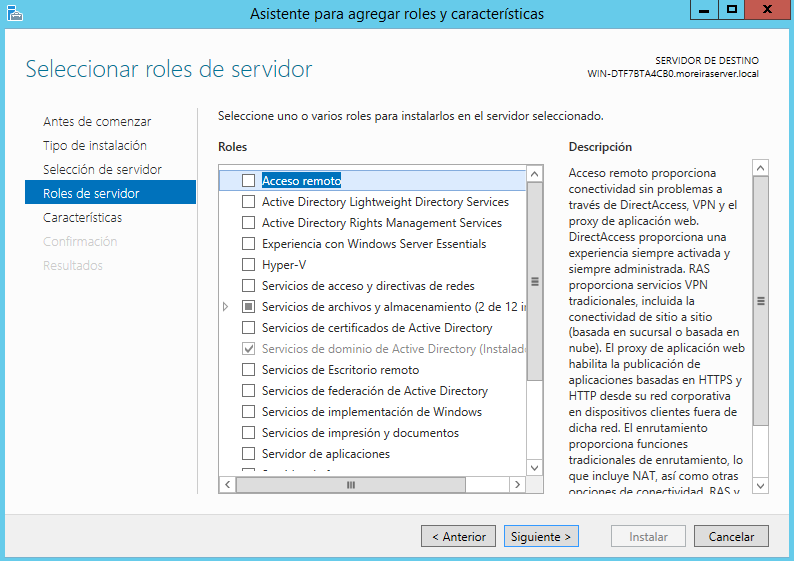

- Después de esto en la selección de características marcamos: `Servidor SMTP`

  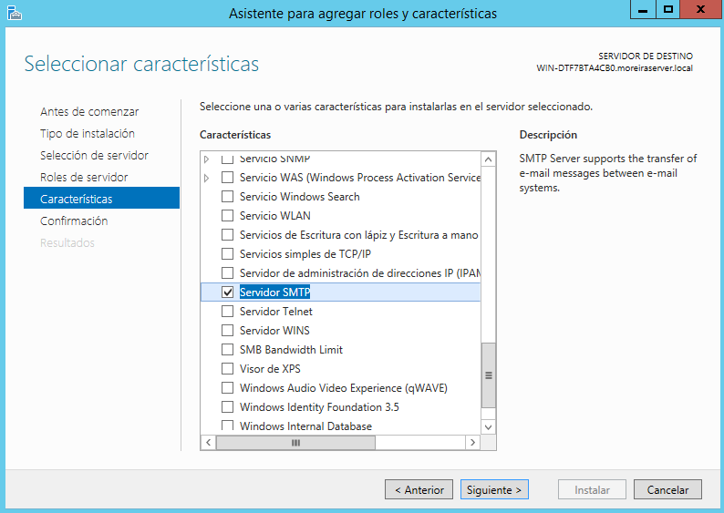

- Y por último confirmamos la instalación.

  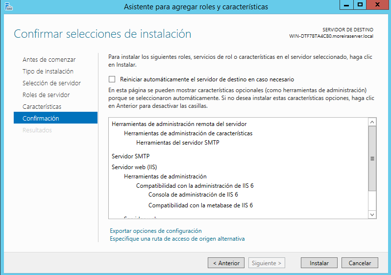

___

# 2. Configuración del servicio SMTP

- Para entrar en la configuración del servidor SMTP iremos al panel del servidor -->`Herramientas`-->`Administrador de Internet Information Services (IIS) 6.0`.

  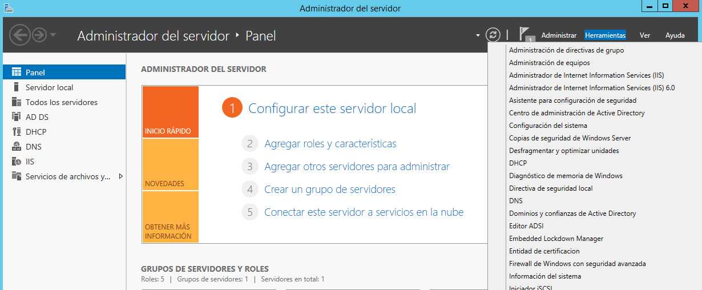

- Entramos y vamos a las propiedades del servicio SMTP.

  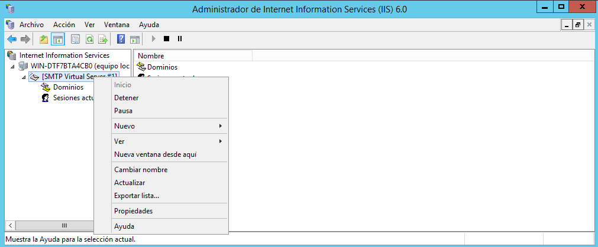

- Ahora pondremos la IP del servidor , limitamos el numero de conexiones, y habilitamos el registro W3C.

  

- Vamos a las propiedades del registro y lo dejaremos de esta manera.

  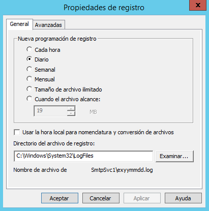

- Hecho esto en las propiedades del servidor SMTP iremos a `Acceso`-->`autenticación`-->`Todo excepto la lista...`-->`agregar` y pondremos una IP.

  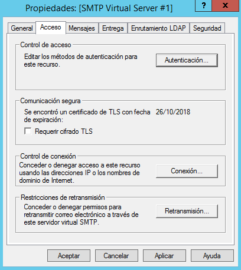

  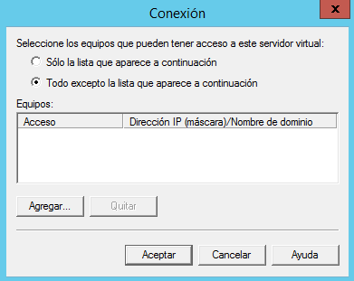

  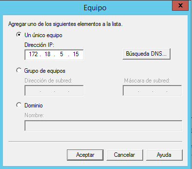

- Luego en la conexión eligiremos `Acceso anónimo`

  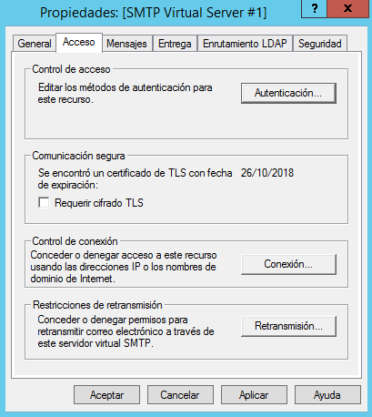

  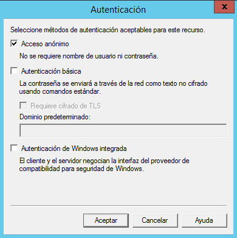

- Por último en la retransmisión eligiremos `Todos excepto ...`

  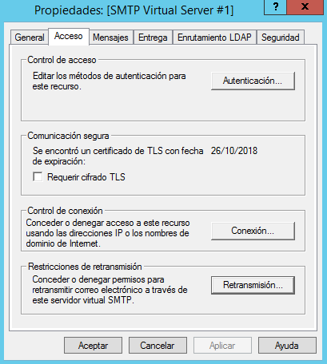

  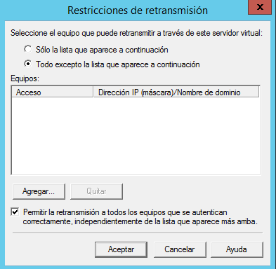

## 2.1 Dominio para SMTP

- Para crear un dominio de nuestro servicio SMTP iremos al panel del servidor y `herramientas`-->`Administrador de Internet Information Services (IIS) 6.0`-->`SMTP`-->`Dominios`-->`Nuevo -- dominio`.

  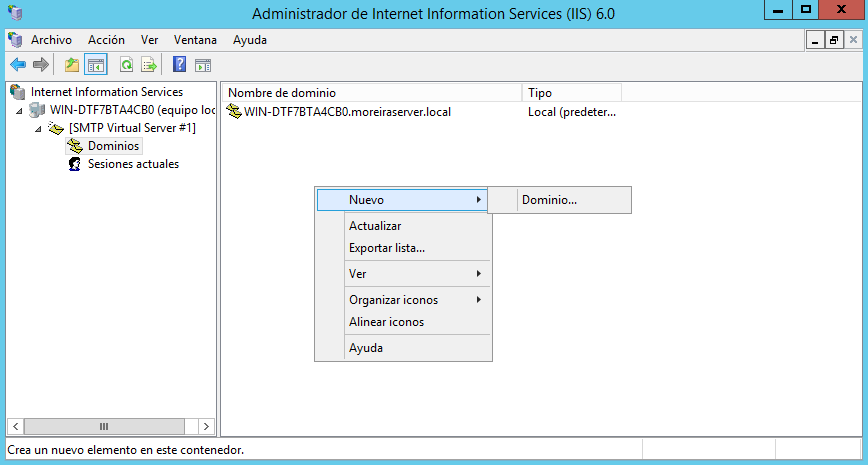

- Eligiremos `Alias`

  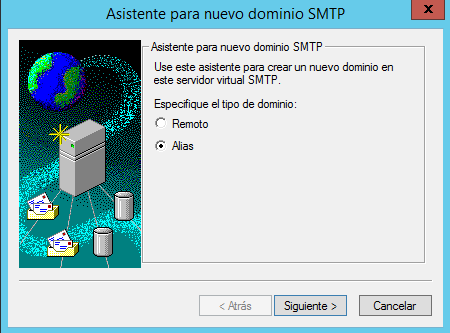

- Le daremos un nombre al dominio.

  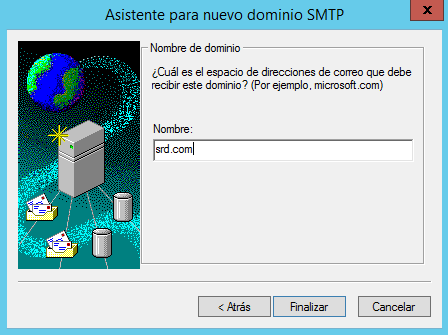

- Hecho esto quedaría así.

  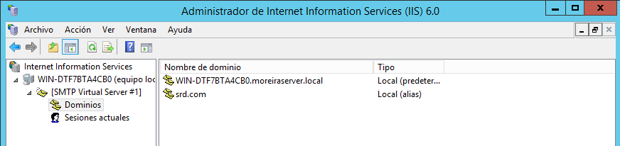

- Si vamos a la ruta `c:/inetpub/mailroot` veremos que se nos ha creado unas carpetas.

  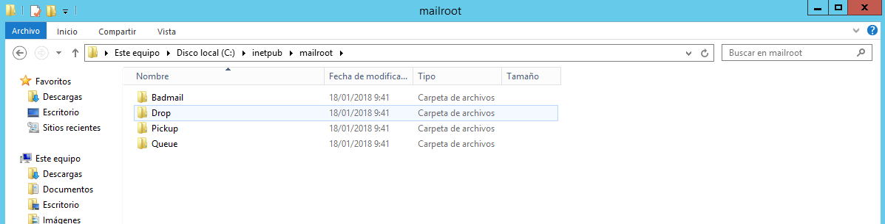
