Óscar Moreira Estévez

Carlos Oliva

# Instalación y configuración de un Servidor de correo en LINUX

## 1. Instalación servicio SMTP

- Lo primero que haremos sera instalar el servidor *Postfix* siguiendo los siguientes pasos:

  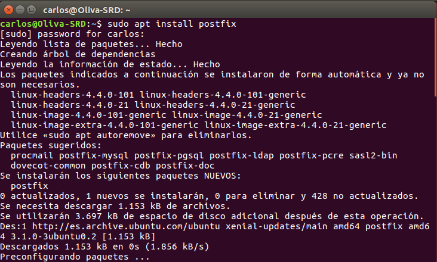

  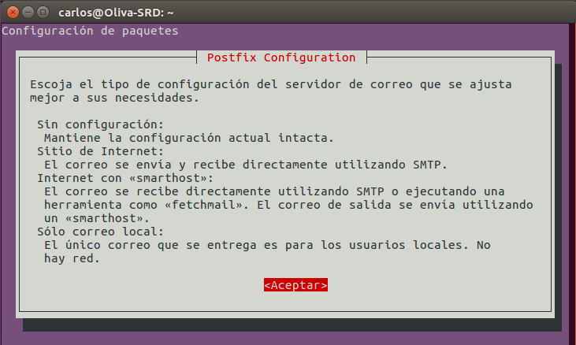

  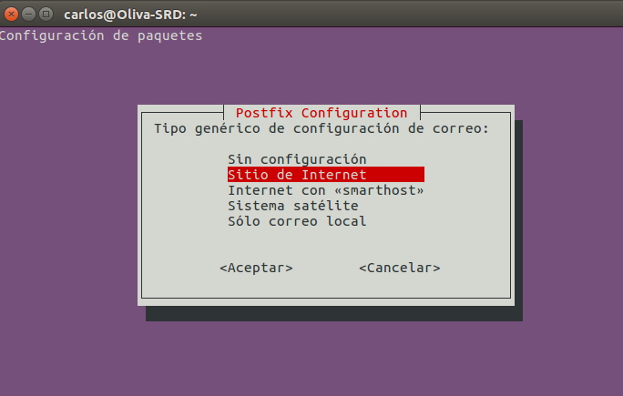

  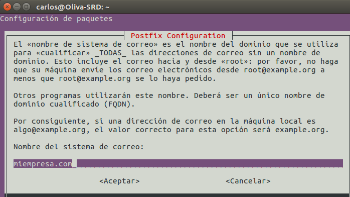

- Ahora comprobaremos que el servicio esta corriendo.

  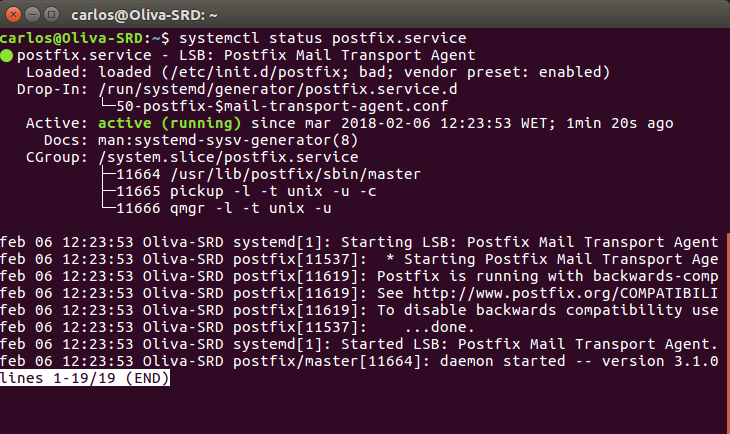

  - `netstat -utap`

    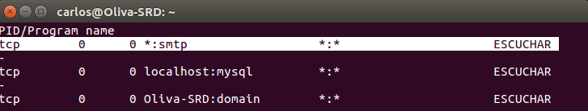

- En este paso haremos pruebas de envío de mensajes mediante telnet en el que seguiremos los siguientes comandos que veremos dentro de la imagen.

  - `telnet localhost 25`

    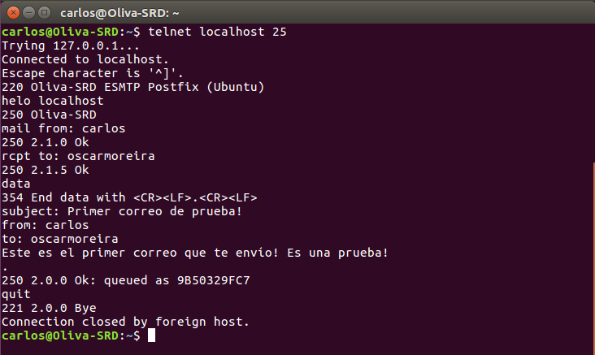

  - Iremos a la ruta `/varspool/mail`  miraremos que se reciba el correo enviado al usuario indicado.

      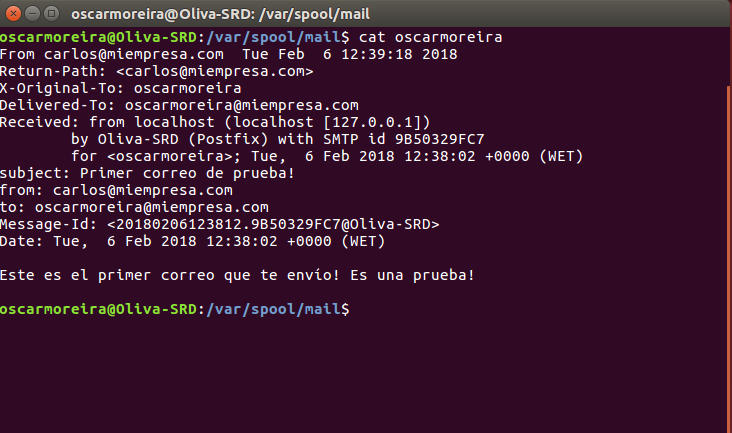

### 1.2 Cliente OperaMail

- Instalaremos un cliente de correo en un cliente en nuestro caso ha sido el *OperaMail*.

  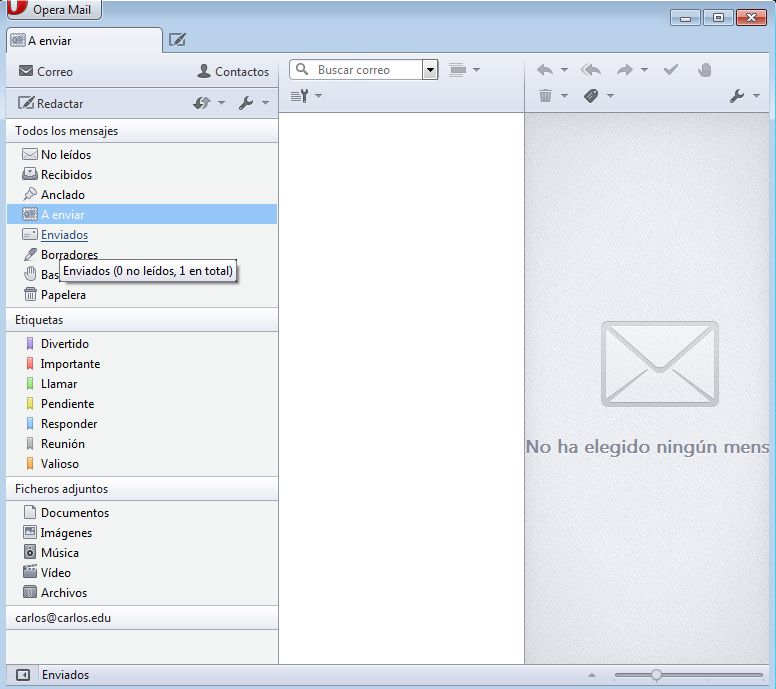

- Creamos dos lineas nuevas en el fichero `/etc/hosts` en el que introduzcadmos la IP del servidor para los dns(smtp.miempresa.com y pop.miempresa.com).

  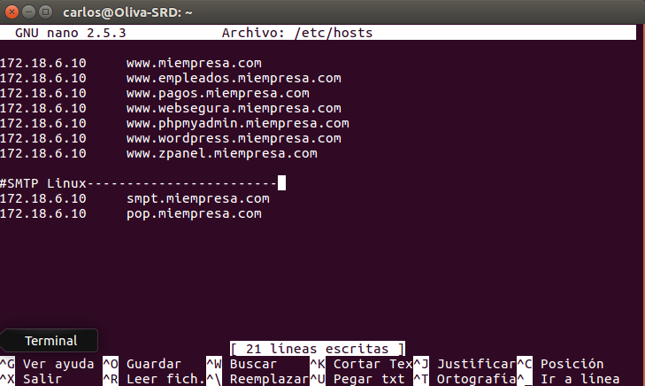

    

- Comprobamos haciendo ping a un dns para verificar que hace conexión.

  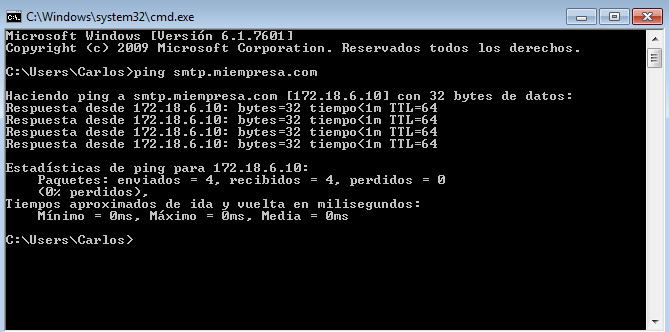

- Ahora creamos dos cuentas de usuario.

  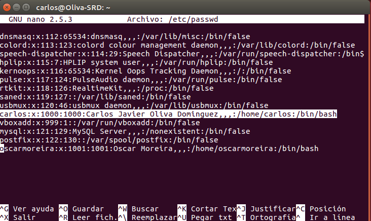

  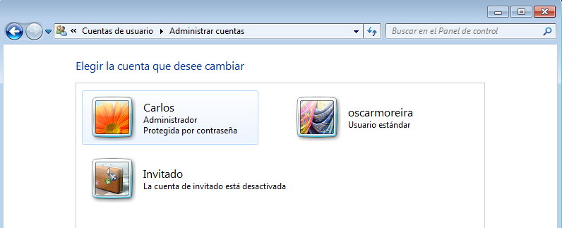

- Ahora comprobaremos que funciona bien el servicio smtp.

  - De Carlos a Oscar:

    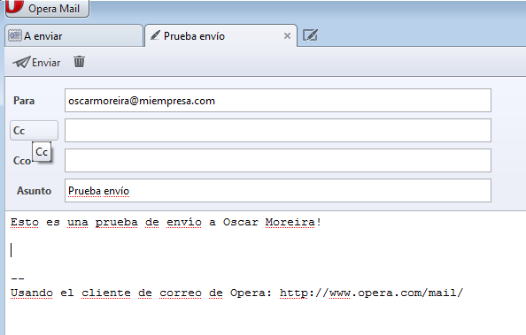

    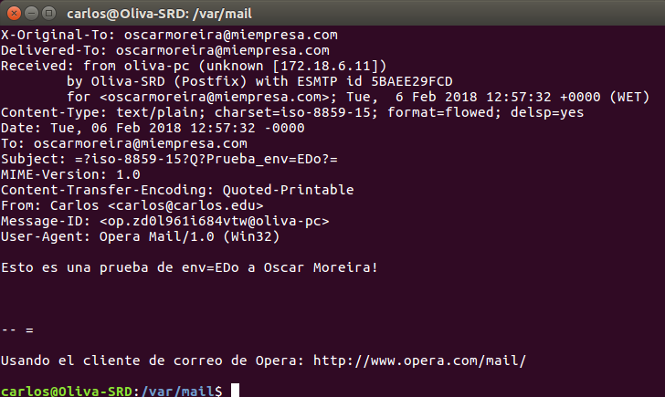

  - De Oscar a Carlos:

    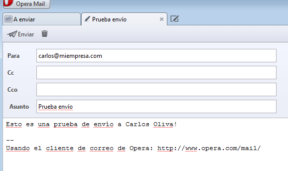

    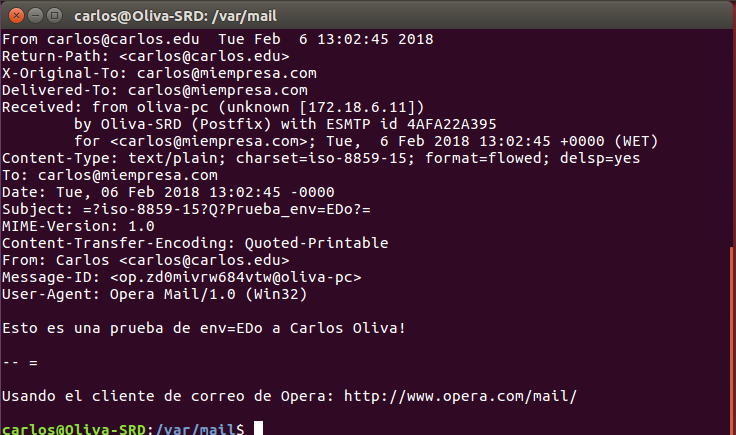

## 2. Imap y SquirrelMail
