Oscar Moreira

Carlos Oliva

# 1. Instalación y configuración de un Seridor Multimedia - Smooth Streaming

___

## 1.1 Paso a Paso

- Lo primero que haremos será descargar *** IIS Media Service*** que será nuestro soporte de streaming para el Servidor Web IIS.

- Para descargarlo iremos a este [enlace](http://www.microsoft.com/es-es/download/details.aspx?id=27955) y lo instalamos con las opciones por defecto.

  

  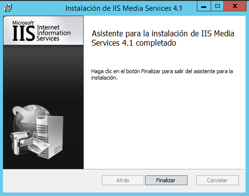

- Ahora comprobamos que en la herramienta de IIS tendremos el apartado de Servicio multimedia.

  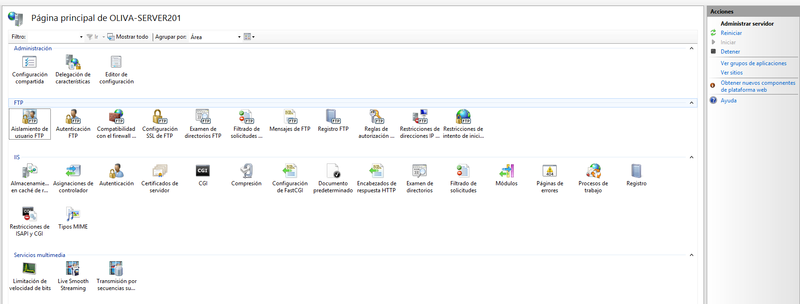

- Hecho esto descargamos unos ejemplo de multimedia para su emisión en streaming.

  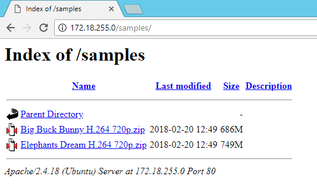

  

- Luego de esto creamos un dominio nuevo por cada fichero multimedia en neustro caso creamos 2.

  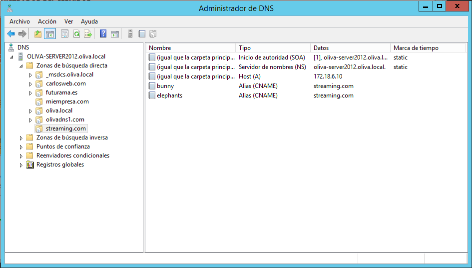

- Hecho los dominios pasaremos a crear el sitio web en *IIS*.

  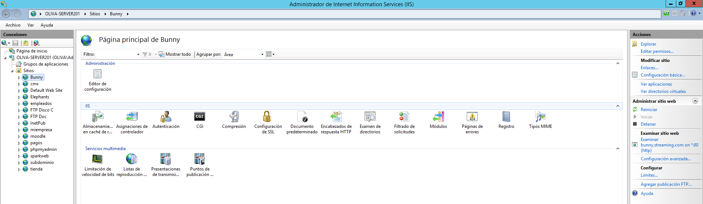
  

- A cada sitio les indicamos cual será su ruta de acceso física. Esta será la ruta directa a la carpeta del video.

  

  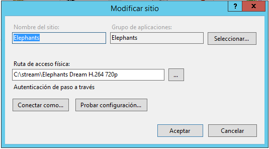

- Ahora descargamos y descomprimimos el cliente de reproducción *SmoothMediaPlayer*.

- Luego al descomprimirlo nos saldrán estos dicheros.

  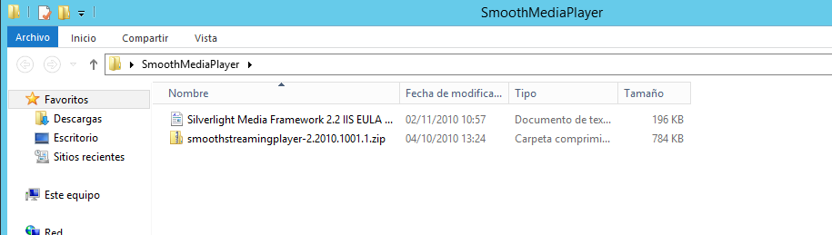

- Ahora el fichero comprimido lo descomprimimos en la carpeta de cada video.

  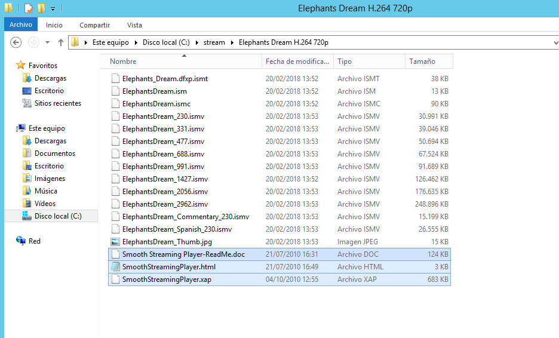

  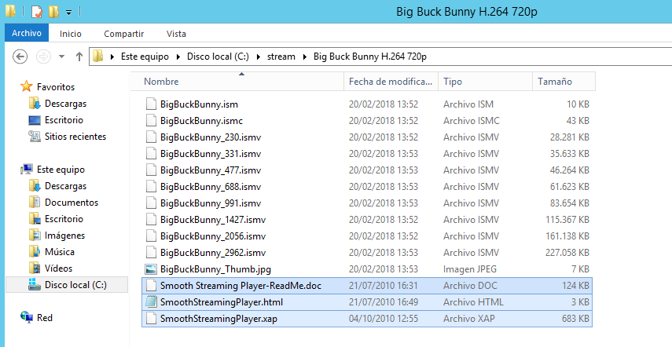

- Luego al *html* lo llamamos *index.html* en cada carpeta.

  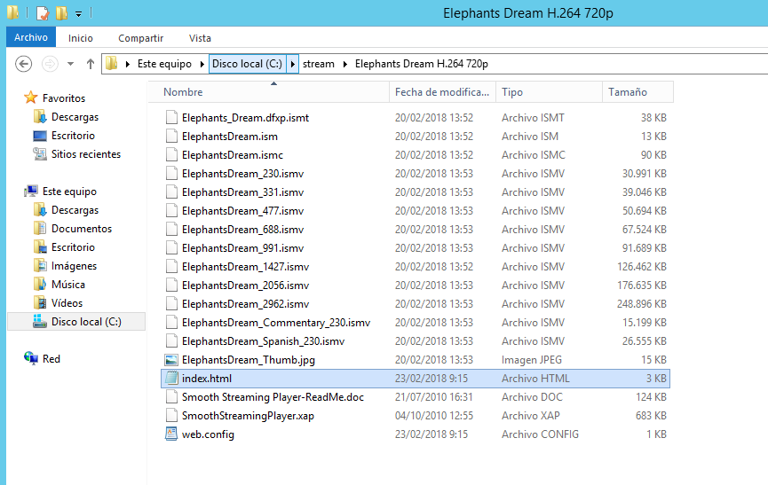

- Dentro del fichero le indicamos la ruta al video.

  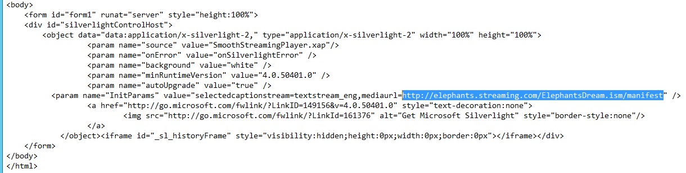

- Entramos en un navegador en la ruta del dominio creado y comenzamos a instalar el Silverlight.

  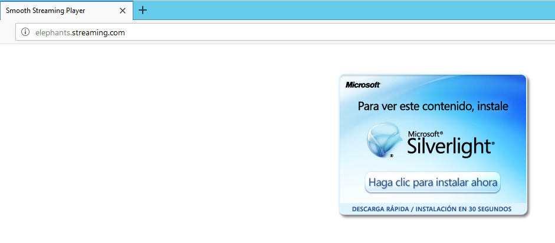

  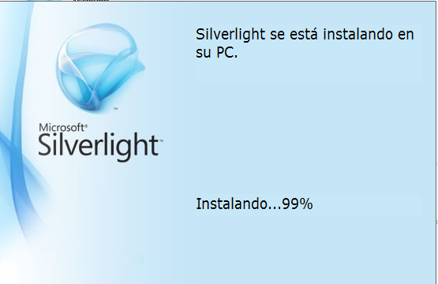

### Comprobación

- Ahora comprobamos que ha funcionado tanto en el cliente como en el servidor desde un navegador.

  - Desde Servidor.

    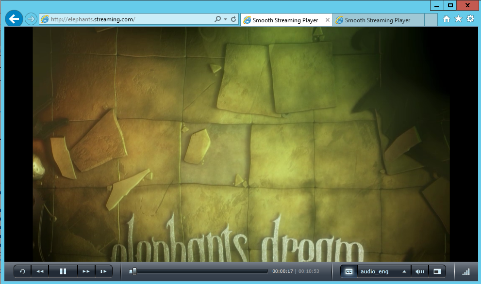

    

  - Desde Cliente.

    

    

## Presentaciones de Transmisión por secuencia.

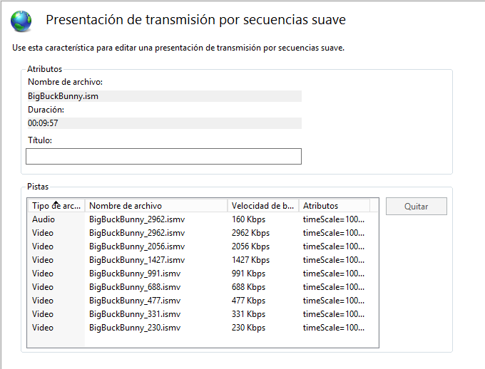

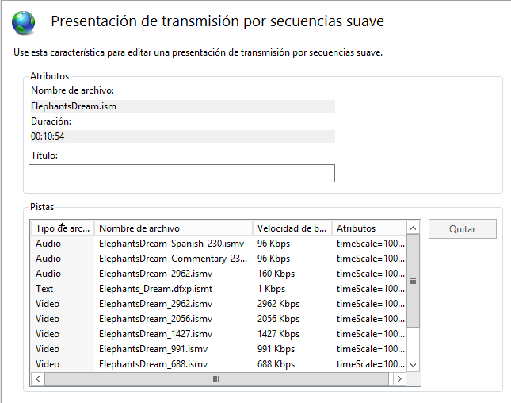
