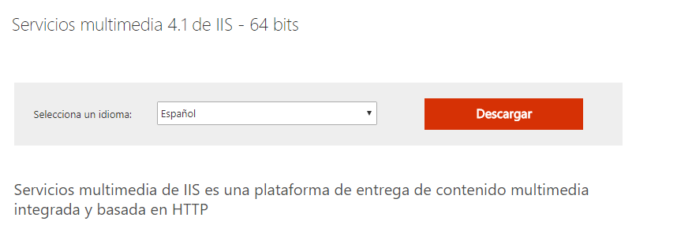

Oscar Moreira

Carlos Oliva

# 1. Instalación y configuración de un Seridor Multimedia - Smooth Streaming

___

## 1.1 Paso a Paso

- Lo primero que haremos será descargar *** IIS Media Service*** que será nuestro soporte de streaming para el Servidor Web IIS.

- Para descargarlo iremos a este [enlace](http://www.microsoft.com/es-es/download/details.aspx?id=27955) y lo instalamos con las opciones por defecto.

  

  

- Ahora comprobamos que en la herramienta de IIS tendremos el apartado de Servicio multimedia.

  
