Óscar Moreira 2º ASIR

# Instalación y configuración de máquinas servidor-cliente

___

Esta práctica consistirá en crear 4 máquinas virtuales, 2 linux (server y cliente) y 2 windows (server y cliente), a parte crearemos dominios con su respectivo usuario.
___

Entrega de la práctica:

- Crear informe explicativo.
- Detallar los pasos realizados incluyendo imágenes.

___

# 1. Preparación de las máquinas

Crear las siguientes máquinas:

- Windows 10

  - Requisitos:

    - RAM: 2GB
    - Almacenamiento: 40 GB
    - Red: Adaptador puente

- Windows server 2012

  - Requisitos:

    - RAM: 4GB
    - Almacenamiento: 45GB
    - Red: Adaptador puente

- Ubuntu Desktop ( usaremos como server )

  - Requisitos:

    - RAM: 2GB
    - Almacenamiento: 20 GB
    - Red: Adaptador puente

- Ubuntu Desktop ( cliente )

  - Requisitos:

    - RAM: 2GB
    - Almacenamiento: 20GB
    - Red: Adaptador puente

___

# 2. Windows

## 2.1 Windows server 2012

- #### 2.1.1 Instalación

    Instalar el SO ` Windows server 2012` ( donde crearemos el dominio usuarios y demás aplicaciones)

- #### 2.1.2 Configuración de red

  - IP: 172.18.5.1
  - Dirección Mac: 255.255.0.0
  - Puerta de enlace: 172.18.0.1
  - Dns: 8.8.4.4

    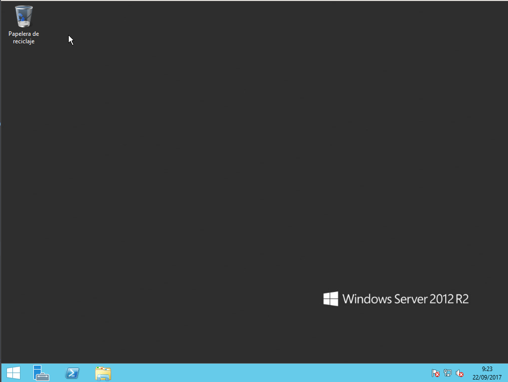

- #### 2.1.3 Dominios

  Después de haber instalado el SO empezaremos a configurar el dominio

    - Ir a `administrador del servidor` y seguido accederemos a la opción `asistente para agregar roles y características`.

      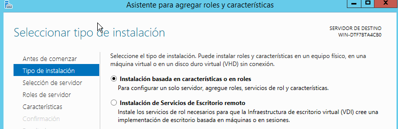

    - Le daremos a siguiente hasta llegar a `Roles del servidor` y aquí activaremos la opción `Servicios de dominio de Active Directory`.

      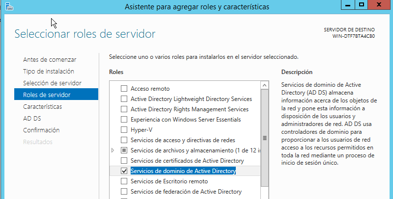

    - Daremos siguiente a todos los demás pasos hasta acabar la instalación.

    - Cuando esto acabe, iremos de nuevo a `Administración del servidor` y veremos que se añadio una  nueva opción `AD DS`. Entraremos y nos saldrá un mensaje en la parte superior y clicaremos en `más`.

      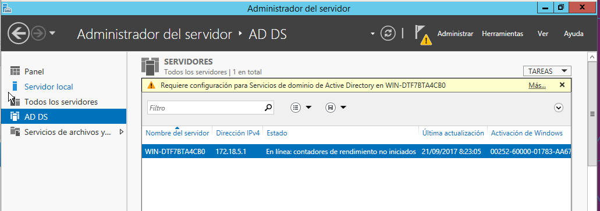

    - En la nueva pestaña clicaremos en `Promover controlador de dominio`.

      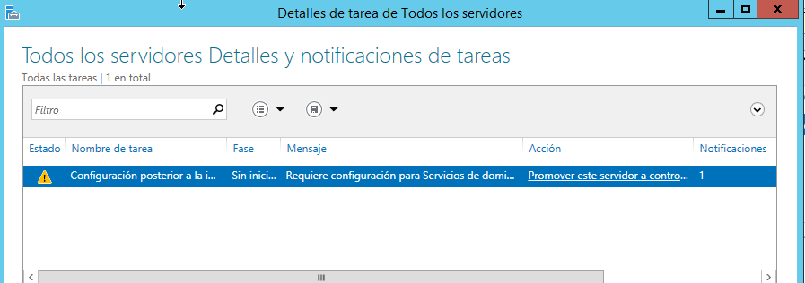

    - Elegimos la opción `Agregar un bosque` y debajo pondremos el nombre que queramos para nuestro dominio.

      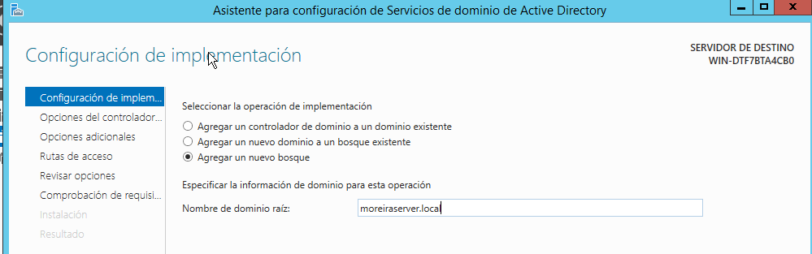

    - Seguiremos dándole a siguiente hasta instalarlo y reiniciarlo.

      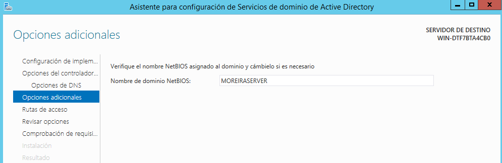

      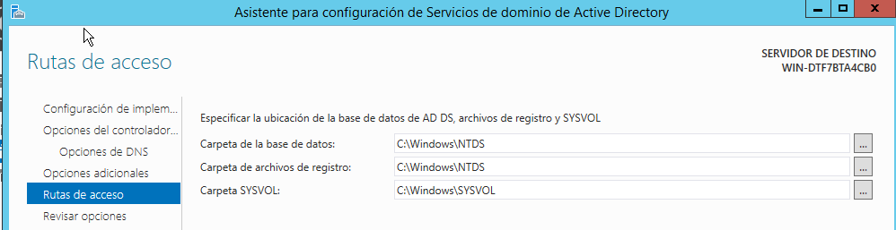

      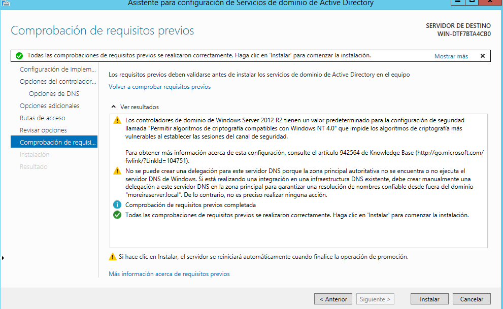

    - Después del reinicio iremos al boton `Inicio` luego `Herramientas administrativas`.

    - Entraremos en `Usuarios y equipos de Active Directory`.

      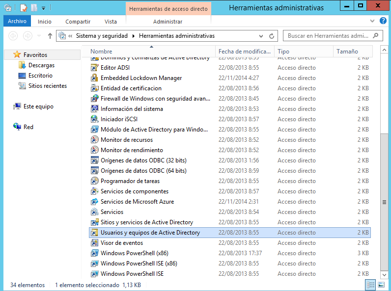

    - Clicaremos en nuestro dominio y botón derecho, `Nuevo` , `Unidad organizativa`.

      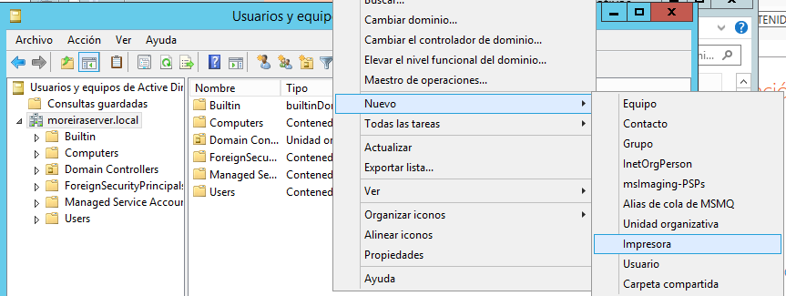

    - Una vez creada la **Unidad organizativa** entraremos y botón derecho `Nuevo` , `Usuario` y rellenamos la información.

      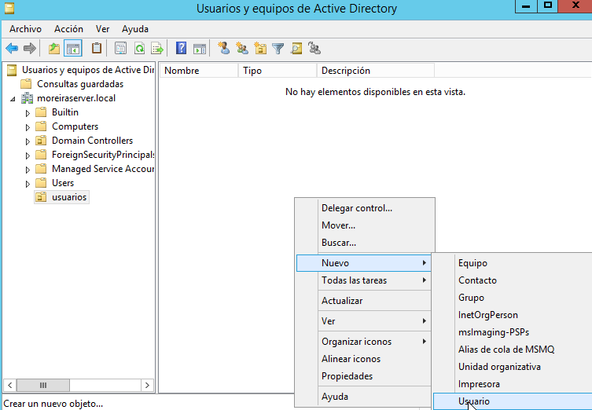

      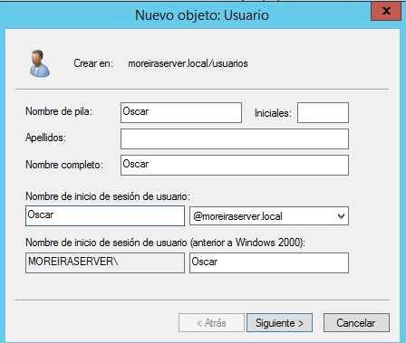

## 2.2 Windows 10

  Instalar el SO `Windows 10`.

  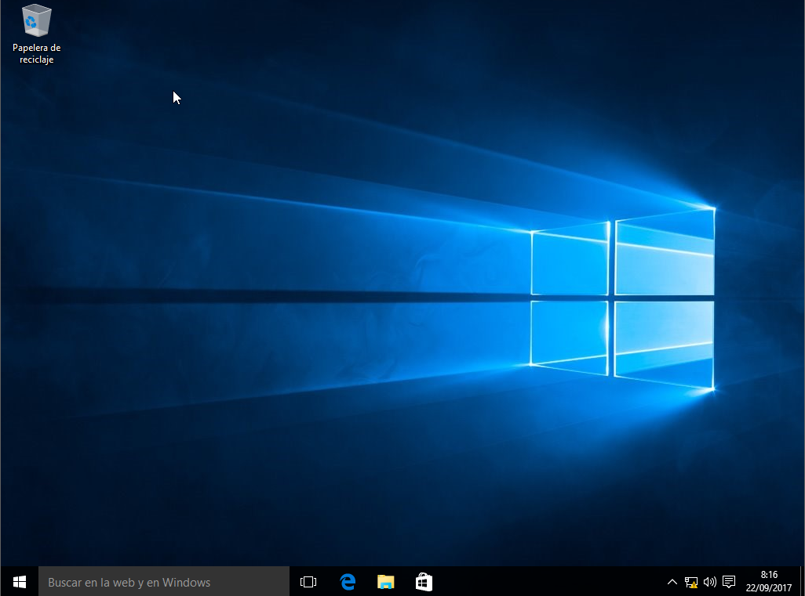

  - #### 2.2.1 Configuración de la red

    - IP: 172.18.5.2
    - Dirección Mac: 255.255.0.0
    - Dns: 172.18.5.1 (ip del servidor)

      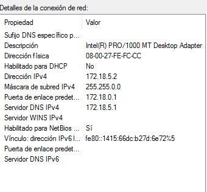

  - #### 2.2.2 Unir a dominio de Windows Server 2012

    - Lo primero que haremos será ir a `Propiedades` de `Mi equipo`.

      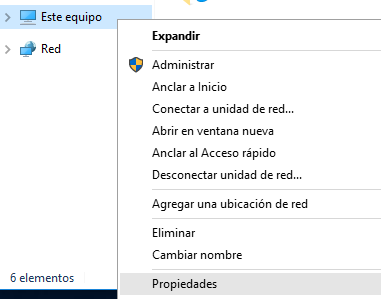

    - Luego iremos a la opción de `Cambiar configuración`

      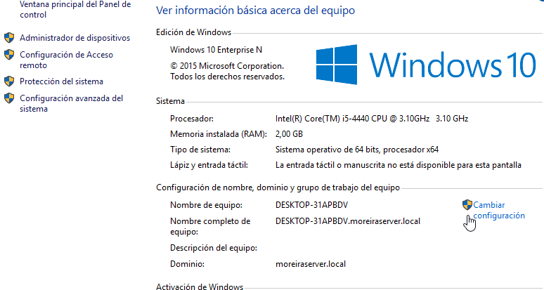

    - Seguido clicaremos en `Cambiar` y luego cambiaremos la opción de `grupo de trabajo` por `dominio` y pondremos el nombre del dominio creado.

      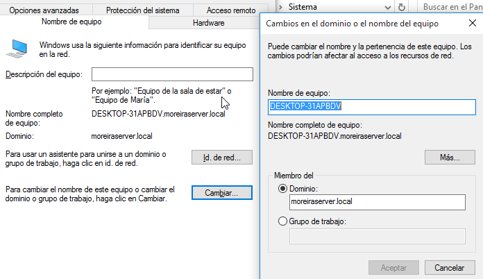

    - Finalmente reiniciamos y tendremos nuestra cuenta vinculada al dominio.

      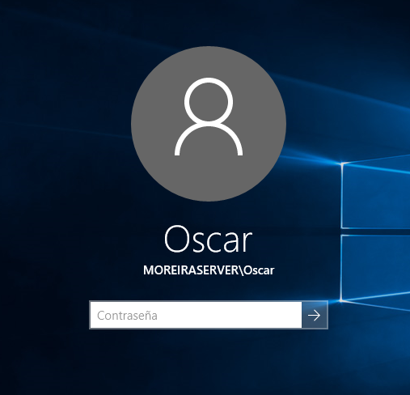

___
___

# 3. Ubuntu

## 3.1 Ubuntu Desktop (servidor)

  - #### 3.1.1 Instalación

    Instalar el SO ` Ubuntu Desktop 16.04 lts` ( donde crearemos el dominio usuarios y demás aplicaciones).

    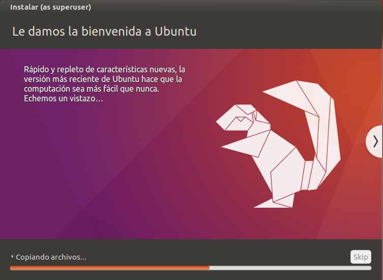

  - #### 3.1.2 Configuración de la red

    - IP: 172.18.5.20
    - Dirección Mac: 255.255.0.0
    - Dns: 127.0.0.1

      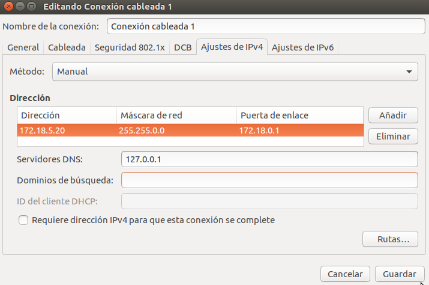

## 3.2 Ubuntu Desktop (cliente)

  - #### 3.2.1 Instalación

    Instalar el SO ` Ubuntu Desktop 16.04 lts`.

    

  - #### 3.2.2 Configuración de la red

    Una vez instalado dejaremos la configuración de la red en modo `DHCP`.

    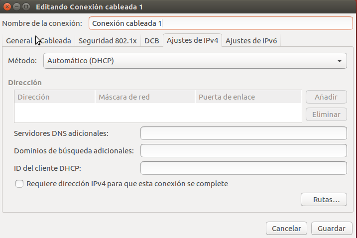

    - Y aquí acaba la práctica.
