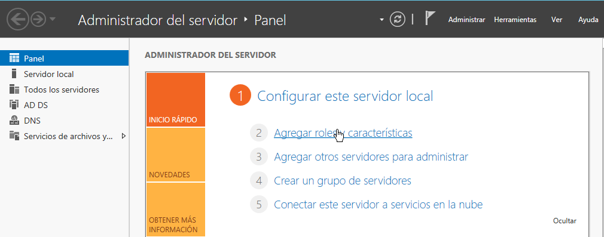

# Instalación y configuración DHCP Windows

___

Esta práctica consistirá en crear y configurar (Creación de ámbitos, reservas, exclusiones, etc..) el servicio *DHCP* en *Windows server 2012* para que nuestro cliente *Windows 10* obtenga ip automáticamente.

___

Entrega de la práctica:

- Crear informe explicativo.
- Detallar los pasos realizados incluyendo imágenes.

## 1. Máquinas necesarias

Usaremos máquinas ya creadas y preparadas de la práctica anterior. [Instalación y configuración de máquinas](https://github.com/oscarmoreira11/ASIR/blob/master/Servicios_de_red/1-Instalaci%C3%B3n_y_configuraci%C3%B3n_de_m%C3%A1quinas/Instalacion_y_configuracion_de_maquinas.md)

- Windows server 2012
- Windows 10 (cliente)

___

___

## 2. Instalación DHCP

- Dentro del `Administrador del servidor` entraremos en `Agregar roles y características`.

  

- Ahora daremos a siguiente hasta llegar a `Roles del servidor` y aqui dentro activaremos la opción `Servidor DHCP` .

  

- Una vez activado seguiremos hasta llegar a `Resultados` donde instalaremos.

  

- Cuando ya este instalado nos saldrá una opción llamada `Completar configuración DHCP` y clicaremos ahí.

  

- Ya dentro de esta configuracion estaremos en el apartado llamado `Autorización` en el que activaremos la primera casilla para usar las credenciales del servidor.

  

- Luego de esto daremos a confirmar y seguiremos hasta finalizar y cerrar esta ventana.

  

  ___

  ___

## 3. Configuración DHCP

Para entrar en la configuración del *DHCP* iremos al `Administrador del servidor` en `Herramientas` y la opción `DHCP`

