Oscar Moreira 2ºASIR

# Instalación y configuración DHCP Windows

___

Esta práctica consistirá en crear y configurar (Creación de ámbitos, reservas, exclusiones, etc..) el servicio *DHCP* en *Windows server 2012* para que nuestro cliente *Windows 10* obtenga ip automáticamente.

___

Entrega de la práctica:

- Crear informe explicativo.
- Detallar los pasos realizados incluyendo imágenes.

## 1. Máquinas necesarias

Usaremos máquinas ya creadas y preparadas de la práctica anterior. [Instalación y configuración de máquinas](https://github.com/oscarmoreira11/ASIR/blob/master/Servicios_de_red/1-Instalaci%C3%B3n_y_configuraci%C3%B3n_de_m%C3%A1quinas/Instalacion_y_configuracion_de_maquinas.md)

- Windows server 2012
- Windows 10 (cliente)

___

___

## 2. Instalación DHCP

- Dentro del `Administrador del servidor` entraremos en `Agregar roles y características`.

  

- Ahora daremos a siguiente hasta llegar a `Roles del servidor` y aqui dentro activaremos la opción `Servidor DHCP` .

  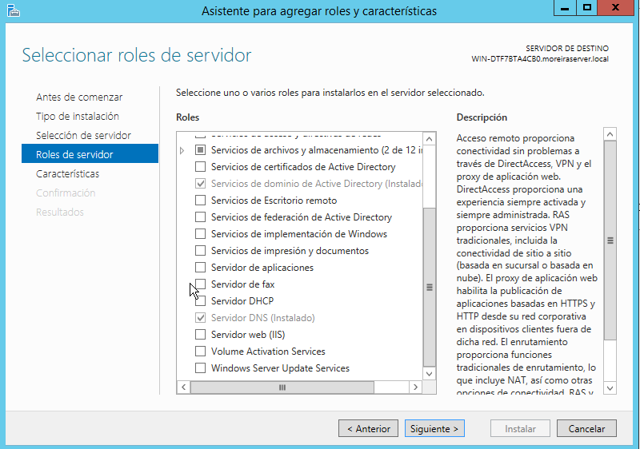

- Una vez activado seguiremos hasta llegar a `Resultados` donde instalaremos.

  

- Cuando ya este instalado nos saldrá una opción llamada `Completar configuración DHCP` y clicaremos ahí.

  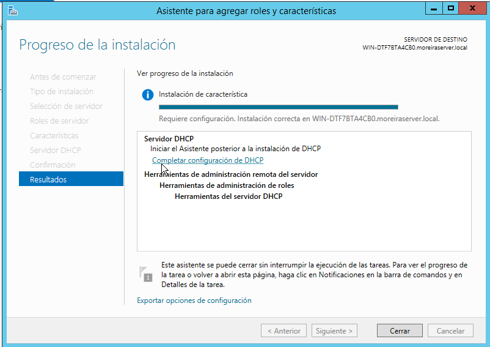

- Ya dentro de esta configuracion estaremos en el apartado llamado `Autorización` en el que activaremos la primera casilla para usar las credenciales del servidor.

  

- Luego de esto daremos a confirmar y seguiremos hasta finalizar y cerrar esta ventana.

  

  ___

  ___

## Configuración DHCP

Para entrar en la configuración del *DHCP * iremos al `Administrador del servidor` en `Herramientas` y la opción `DHCP`

___

## 3. Creación de ámbito

En esta práctica tendremos que crear dos ámbitos y comprobar que funcionan los dos.

### 3.1 Creación ámbito 1

- Una vez entremos en la configuración del *DHCP* iremos a `IPV4` clicaremos botón derecho y `Ámbito nuevo...`

  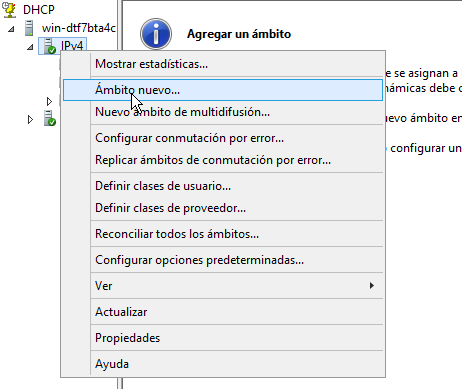

- Dentro de la creación del nuevo ámbito daremos a siguiente y ahora empezaremos a crearlo.

- Lo primero será ponerle un nombre el que queramos y una breve descripción.

  

- El siguiente paso es importante ya que le indicaremos el rango de IPs que estaran dentro de ese ámbito.

  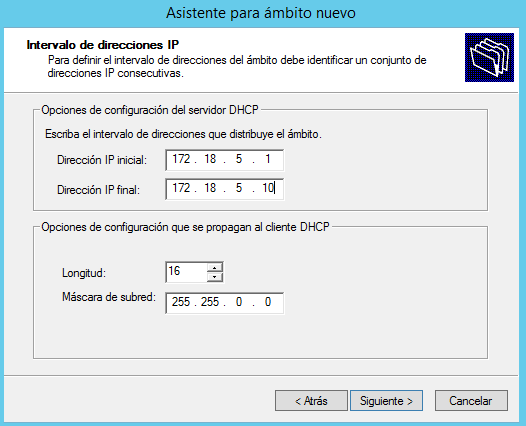

- Luego de elegir el rango nos tocará hacer las exclusiones que consistirá en elgir un rango de IPs que nunca se van a dar a los clientes, como por ejemplo la ip del servidor.

  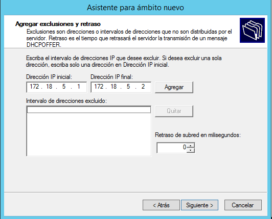

- una vez puesto la agregaremos y daremos en siguiente.

- Luego el tiempo de concesion lo dejaremos por defecto en este caso.

  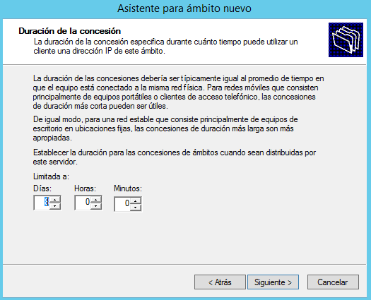

- Pasaremos a darle a siguiente a la siguiente ventada marcando la opción `Configurar estas opciones ahora`.

  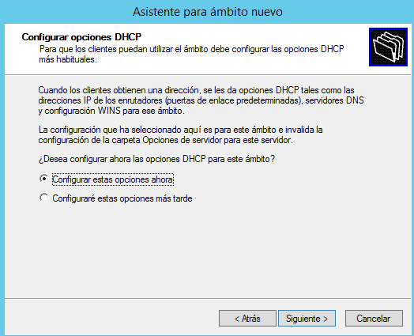

- Eligiremos *puerta de enlace* que sera la de nuestra red en nuestro caso: `172.18.0.1` .
- La escribiremos y la agregamos y luego siguiente.

  

- Luego el *DNS* sera la IP de nuestro servidor nuestro caso: `172.18.5.1` .

- Agregamos la ip y siguiente.

  

- Pasaremos al siguiente y activaremos la opción `Activar este ámbito ahora`

  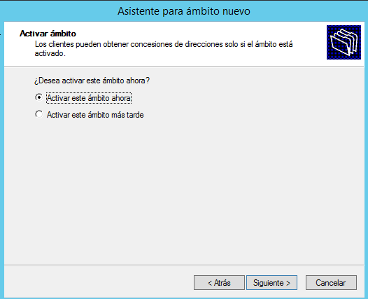

- Y finalmente finalizamos la creación del ámbito.

  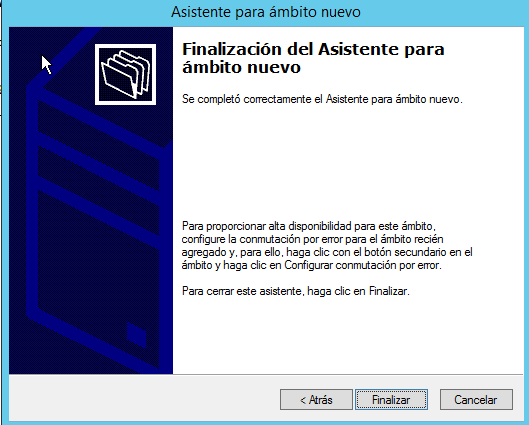

### 3.1.1 Comprobación ámbito 1

Una vez acabada la creación del primer ámbito comprobaremos que todo funciona por lo que iniciaremos nuestro cliente y si miramos la configuraciond de red nos debe salir que su IP esta dentro del rango puesto en el ámbito `172.18.5.1 - 172.18.5.10`.

Pero pusimos una exclusion de las 4 primeras IPs por lo que su IP no puede ser ninguna de esas y deberá ser la 5.

Ahí vemos que nos cogió la IP: `172.18.5.5` que pertenece al rango que hemos configurado y no pertenece a las de exclusión.

### 3.2 Creación ámbito 2

Para crear el ámbito 2 haremos lo mismo que en el anterior pero cambiando la IP siendo esta de otra red diferente a la anterior y con un rango diferente para probar que funciona.

- Una vez creado el segundo ámbito tendremos algo asi en la carpeta de la herramienta del *DHCP* .

  

- Vemos que estan creados los 2 ámbitos y están activados.

### 3.2.1 Comprobación ámbito 2

Haremos lo mismo que con la comprobación del ámbito 1.

Esta vez nuestra ip del servidor será `173.18.5.1` y el rango desde `173.18.5.11 - 178.18.5.20` con exclusion en las 4 primeras.

Vemos que todo ha funcionado correctamente y ha obtenido la IP `173.18.5.15`, efectivamente ha saltado las IP de exclusión también.

___

## 4. Superámbito

El superámbito consiste en agrupar a todos los ámbitos que queramos y asi poder hacer modificaciones en ellos a la vez y no ir uno por uno.

- Primero iremos a las herramientas del *DHCP* como anteriormente donde encontranremos los ámbitos creados.

- Luego clicaremos botón derecho en IPV4 y eligiremos `superámbito...`

  

- El siguiente paso sera ponerle un nombre al superámbito.

  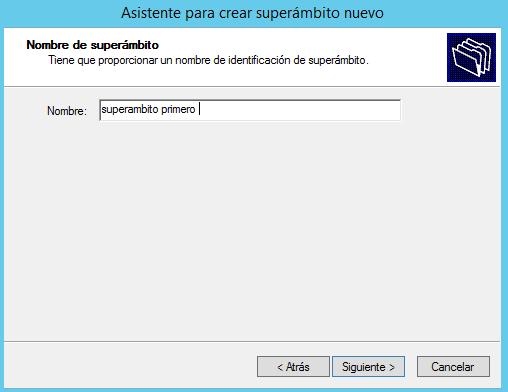

- Seguidamente eligiremos los ámbitos y clicaremos en siguiente.

  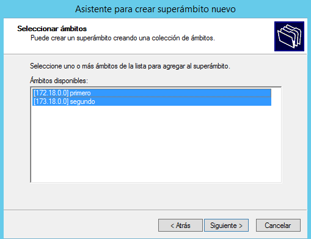

- Finalizaremos

  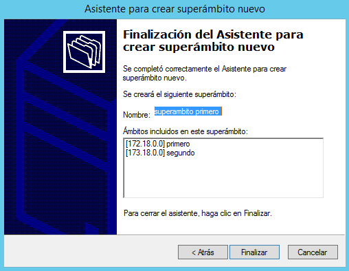

  ___

Ahora veremos que tenemos un `superámbito`  creado con sus ámbitos dentro de él.

Para hacer una prueba desactivaremos el `superámbito` clicando botón derecho en él y `desactivar`,  veremos que se desactivan los ámbitos.

Al estar desactivado vemos en el cliente que no reconoce ninguna IP

Y volveremos a activar pero esta vez solo uno dentro del superámbito y sera el primer ámbito.

Veremos que nos detecta de nuevo la IP

___

Con esto la práctica esta acabada.
