Óscar Moreira 2ºASIR

# Instalación y configuración DHCP Linux

___

Esta práctica consistirá en crear y configurar (Creación de ámbitos,
reservas, exclusiones, etc..) el servicio *DHCP* en *Ubuntu 16.04*
para que nuestro cliente *Ubuntu* obtenga ip automáticamente.

___

Entrega de la práctica:

- Crear informe explicativo.
- Detallar los pasos realizados incluyendo imágenes.

## 1. Máquinas necesarias

Usaremos máquinas ya creadas y preparadas de la práctica anterior. [Instalación y configuración de máquinas](https://github.com/oscarmoreira11/ASIR/blob/master/Servicios_de_red/1-Instalaci%C3%B3n_y_configuraci%C3%B3n_de_m%C3%A1quinas/Instalacion_y_configuracion_de_maquinas.md)

- Ubuntu 16.04 (servidor)
- Ubuntu16.04 (cliente)

___

___

## 2. Instalación DHCP y configuración

- Nuestro primer paso será descargar el **isc-dhcp-server** con el siguiente comando:

  ~~~
  sudo apt-get install isc-dhcp-server
  ~~~

    

- Después de esto iremos al fichero de configuración dhcp `/etc/dhcp/dhcpd.conf`
 para modificarlo.

    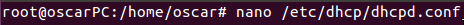

___

### 2.1 Ámbito nuevo

- En este le pondremos la red a la que va a pertenecer y el rango en el que
queremos tener nuestras **ips** para los clientes. Hemos excluido las 4 primeras
para otros posibles servidores, o dns, etc..

    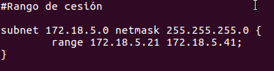

- Una vez hecho esto iremos al cliente y ejecutaremos **ifconfig** y asi nos saldrá
información de la ip que tengamos.

    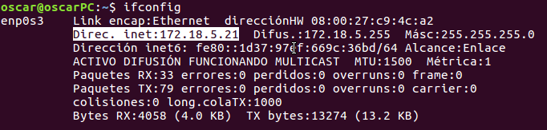

- Vemos que ha cogido a partir de la `172.18.5.21` como hemos puesto en el fichero de
configuración
___

### 2.2 Configuración DNS y puerta de enlace

- El siguiente paso sera ir de nuevo al fichero de configuración y añadirle
dos líneas mas en las que le indicaremos la puerta de enlace (option routers)
y el dns (option domain-name-servers).

    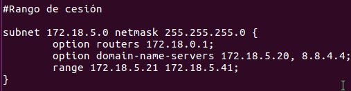

- Volveremos hacer un **ifconfig** en la máquina cliente y veremos que todo siue correcto.

    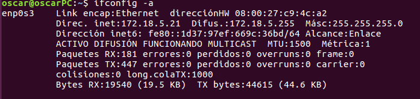

___

### 2.3 Reserva de IP
Lo siguiente que haremos sera crear reservas para clientes.

- Seguiremos en la configuración en el fichero `/etc/dhcp/dhcpd.conf` .

- Antes de las reservas tendremos que comentar 3 lineas del fichero que serán
las siguientes:

    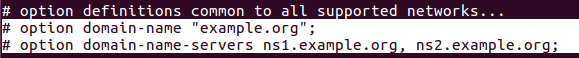

    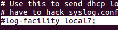

- Ahora en este tendremos que indicarle la mac del host cliente con la IP que queremos darle
 y su puerta de enlace.

     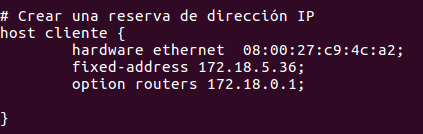

- Luego de esto volveremos a la máquina cliente en la que haremos otro `ifconfig` y veremos que
nos dará la IP que le hemos reservado a ese pc.

    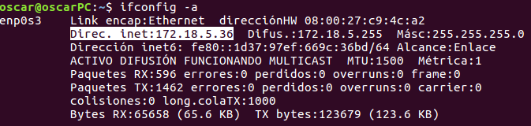

___

### 2.4 Opciones necesarias

- En este caso las opciones que he puesto han sido el ***tiempo de alquiler*** y el
*** tiempo máximo de alquiler*** para que sea el adecuado para ese ámbito.

    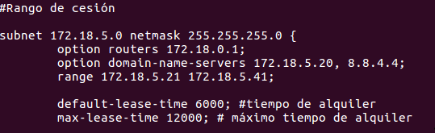

- Otra opción que he puesto ha sido el ***tiempo de alquiler*** y el ***tiempo máximo de alquiler***
pero por defecto para cualquier dispositivo que si no coge el que está en el ámbito cogerá este.

- Simplemente hay que ponerlo por fuera de todo.

    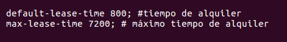

- Resultado final del fichero de configuración.

    

___
___

Fín de la práctica.
