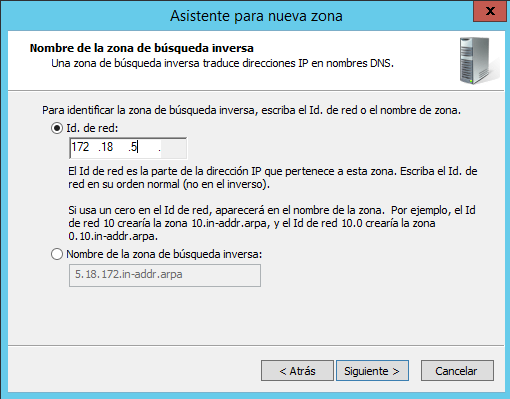

Óscar Moreira 2ºASIR

# Instalación y configuración DNS Windows Server 2012

___

# Enunciado práctica

Realizar la instalación y configuración de un servidor DNS en una máquina con Windows Server 2012. Se piden las siguientes acciones de configuración y prueba del funcionamiento del servicio:
- Crear una zona de búsqueda directa para tu servidor.

- Crear una zona de búsqueda inversa para tu subred.

- Configurar reenviadores de DNS con fry o puerta de enlace actual y DNS público (p.e.: 195.235.113.3 /     80.58.61.250 / 8.8.8.8).
- Configurar el servidor para ser servidor DNS Caché (en la configuración estática de red). Configurar    cliente para que su servidor DNS sea el servidor W2012. Comprobar el funcionamiento como caché DNS de ambas máquinas al acceder a sitios de Internet.
- Ahora configuraremos el servidor como DNS Maestro, además de Caché.
- En la zona de búsqueda directa añadir los siguientes registros:
  - Un alias para tu servidor denominado server.

  - Una impresora con IP fija denominada printer (no hace falta alias).
  - Un servidor de correo (ficticio) denominado correo, asociado a una dirección en tu servidor.
  - Crear una subzona denominada servicios (dominio nuevo) y agregar a ésta un servidor ftp (asociado a la misma IP del servidor), una impresora nueva (con una IP fija) y el equipo del administrador del sistema (también con IP fija).
  - Comprobar que se resuelven los nombres desde la consola del servidor.
- Validar un cliente en el dominio y comprobar que el nombre de su equipo aparece en la zona de búsqueda del servidor como un nuevo registro A.
- Comprobar desde la consola del cliente que se resuelven correctamente los nombres dados de alta en el servidor (aunque en algunos casos, si se trata de direcciones ficticias, no se obtenga respuesta).
- Realizar, también desde el cliente, algunas operaciones con nslookup tanto dentro como fuera de nuestra intranet.

___
___

# Práctica

# 1. Instalación DNS

Lo primero que haremos será instalar el servicio DNS en caso de que no lo tengamos ya.

Esto se hará en apartado de `agregar roles y características` en el que seguiremos la configuración por defecto.

Cuando lleguemos a un punto que se llame `seleccionar roles de servidor` en el que activaremos el *Servidor DNS* y seguiremos con la instalación por defecto en nuestro caso ya lo teniamos instalado.

  

  

___
___

# Configuración DNS

- Para configurar el DNS iremos en el *administrador del servidor* al apartador `Herramientas` y entraremos en `DNS`.

  

___

# 2 Creación Zonas

Cuando creeemos las zonas ya estaremos configurando el servidor como servidor maestro.

## 2.1 Zona directa

- Una vez dentro de la herramienta de DNS del servidor empezaremos por crear una nueva zona directa.

-  Esto lo haremos clicando botón derecho en `zona de busqueda directa` y eligiendo `zona nueva` y se nos abrira el asistente de creación.

    

    

    

- Ahora seguiremos la configuración como las imágines siguientes:

    

    

- En este paso de ahora tendremos que ponerle un nombre a nuestro zona directa.

  > Recordar que los dominios tienen que ser siempre "." y algo más

    

- Seguimos con la creación de la nueva zona directa.

    

    

- Con esto finalizamos la creación de la zona directa.

___

## 2.2 Creación Zona inversa

- Para la zona inversa haremos lo mismo que la directa, clicaremos botón derecho en `Zonas de búsqueda inversa` y crearemos una nueva zona.

- Se nos abrirá el asistente.

    

- Seguiremos la configuración siguiente.

    

    

    

- En este paso pondremos la red en la que nos vamos a encontrar.

    

- Seguimos con la creación.

    

    

- Con esto ya tendremos la zona inversa creada.

___

Ahora podremos ver que tenemos las dos zonas creadas.

___
___

# 3. Reenviadores

Cuando configuremos los reenviadores ya estaremos configurando el servidor como servidor Caché

- Para configurar los reenviadores tendremos que ir a las `propiedades` del servidor dns.

  

- Una vez aquí dentro iremos a `Reenviadores` y clicaremos en editar y añadiremos los de google en nuestro caso.

  

  

  ___
  ___

# 4. Configuración de zona directa

- Lo primero sera entrar dentro de la `zona directa` y clicar botón derecho en el panel blanco para crear `hosts`, `cname` o `servidor como correo`.

- Registros:

  1. Servidor: Host para servidor y su alias.

      - Crear `host nuevo` en el que pondremos dentro la IP de nuestro servidor y lo agregamos..

        

      - Una vez creado el host del servidor ya podremos añadirle un nuevo alias en `nuevo alias CNAME`. Le pondremos un nombre.

          

      - Luego le daremos a examinar y buscaremos nuestro host del servidor en la zona directa.

        

      - Tal que al final quede así:

        

  2. Impresora: host para Impresora

      - Crear `host nuevo` y le pondremos de nombre *printer* con una IP

        

  3. Servidor de correo: host para correo y correo de intercambio.

      - Para crear un servidor de correro primero crearemos un `nuevo host`
     con su IP y nombre.

        

      -  Después de esto crearmos un nuevo `correo de intercambio` en el que examinaremos y eligiremos el host creado para el correo en la zona directa.

          

  4. Subzona Servicios: servidor ftp, impresora 2, un equipo administrador.

      - Para crear una nueva subzona clicaremos derecho como en los anteriores pasos y eligiremos `dominio nuevo`.

        

      - Luego entraremos en el dominio servicios para crear los hosts que necesitamos.

        1. FTP: host neuvo

            

        2. Impresora 2: host nuevo

            

        3. Equipo para otro administrador.

            

        4. Veremos que los tenemos creado.

            

  ___

    - Comprbación de resolución de nombres.

      - servidor:

        

      - Servidor alias:

        

      - Impresora:

        

      - Correo:

        

      - Impresora 2:

        

      - FTP:

        

      - Equipo para administrador:

        

___
___

# 5. Cliente en el dominio

- Iremos a un cliente al apartado de `propiedades` de `mi equipo` y le daremos a `cambiar configuración`.

  

- Ahí dentro en entraremos en `cambiar` y ya dentro le pondremos un nombre al equipo y le pondremos que es miembro del: `dominio` moreiraserver.local en nuestro caso. y aceptaremos.

  

- Si ahora vamos al servidor y entramos en la herramienta DNS y vamos a `moreiraserver.local` veremos que dentro de el esta un equipo llamado cliente que es el que acabamos de configurar.

  > si no apararece el equipo al instante hay que actualizar.

  

___
___

# 6. Resolución de nombres desde cliente.

Desde el cliente abriremos la terminal ejecutaremos el comando nslookup y los nombres de los hosts creados:

  - Servidor con alias:

    

  - Impresora 1

    

  - Correo:

    

  - Impresora 2:

    

  - FTP:

    

  - Equipo para administrador:

    

___
___

# 7. Resolución de dominios externos a nuestra red

Haremos el mismo comando pero poniendo un dominio externo.

- www.google.com

  

- blog.iespuertodelacruz.com

  

___
___

Fín de la práctica.
