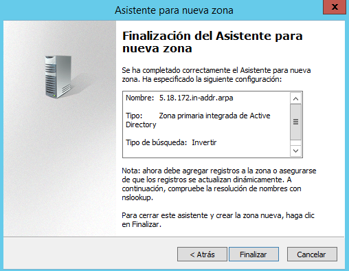

Óscar Moreira 2ºASIR

# Instalación y configuración DNS Windows Server 2012

___

# Enunciado práctica

Realizar la instalación y configuración de un servidor DNS en una máquina con Windows Server 2012. Se piden las siguientes acciones de configuración y prueba del funcionamiento del servicio:
- Crear una zona de búsqueda directa para tu servidor.

- Crear una zona de búsqueda inversa para tu subred.

- Configurar reenviadores de DNS con fry o puerta de enlace actual y DNS público (p.e.: 195.235.113.3 /     80.58.61.250 / 8.8.8.8).
- Configurar el servidor para ser servidor DNS Caché (en la configuración estática de red). Configurar    cliente para que su servidor DNS sea el servidor W2012. Comprobar el funcionamiento como caché DNS de ambas máquinas al acceder a sitios de Internet.
- Ahora configuraremos el servidor como DNS Maestro, además de Caché.
- En la zona de búsqueda directa añadir los siguientes registros:
  - Un alias para tu servidor denominado server.

  - Una impresora con IP fija denominada printer (no hace falta alias).
  - Un servidor de correo (ficticio) denominado correo, asociado a una dirección en tu servidor.
  - Crear una subzona denominada servicios (dominio nuevo) y agregar a ésta un servidor ftp (asociado a la misma IP del servidor), una impresora nueva (con una IP fija) y el equipo del administrador del sistema (también con IP fija).
  - Comprobar que se resuelven los nombres desde la consola del servidor.
- Validar un cliente en el dominio y comprobar que el nombre de su equipo aparece en la zona de búsqueda del servidor como un nuevo registro A.
- Comprobar desde la consola del cliente que se resuelven correctamente los nombres dados de alta en el servidor (aunque en algunos casos, si se trata de direcciones ficticias, no se obtenga respuesta).
- Realizar, también desde el cliente, algunas operaciones con nslookup tanto dentro como fuera de nuestra intranet.

___
___

# 1. Instalación DNS

Lo primero que haremos será instalar el servicio DNS en caso de que no lo tengamos ya.

Esto se hará en apartado de `agregar roles y características` en el que seguiremos la configuración por defecto.

Cuando lleguemos a un punto que se llame `seleccionar roles de servidor` en el que activaremos el *Servidor DNS* y seguiremos con la instalación por defecto en nuestro caso ya lo teniamos instalado.

  

  

___
___

# 2. Configuración DNS

- Para configurar el DNS iremos en el *administrador del servidor* al apartador `Herramientas` y entraremos en `DNS`.

___

## 2.1 Creación Zonas

### 2.1.1 Zona directa

- Una vez dentro de la herramienta de DNS del servidor empezaremos por crear una nueva zona directa.

-  Esto lo haremos clicando botón derecho en `zona de busqueda directa` y eligiendo `zona nueva` y se nos abrira el asistente de creación.

    

    

    

- Ahora seguiremos la configuración como las imágines siguientes:

    

    

- En este paso de ahora tendremos que ponerle un nombre a nuestro zona directa.

  > Recordar que los dominios tienen que ser siempre "." y algo más

    

- Seguimos con la creación de la nueva zona directa.

    

    

- Con esto finalizamos la creación de la zona directa.

___

### 2.1.2 Creación Zona inversa

- Para la zona inversa haremos lo mismo que la directa, clicaremos botón derecho en `Zonas de búsqueda inversa` y crearemos una nueva zona.

- Se nos abrirá el asistente.

    

- Seguiremos la configuración siguiente.

    

    

    

- En este paso pondremos la red en la que nos vamos a encontrar.

    

- Seguimos con la creación.

    

    

- Con esto ya tendremos la zona inversa creada.

___

Ahora podremos ver que tenemos las dos zonas creadas.

