Óscar Moreira

# Instalación y configuración IIS Windows

___
___

# Prácticas

Este informe consistirá en 3 prácticas de de instalación y configuración de *IIS* en *Windows 12 Server*.

- Practicas:

  **1.** Esta práctica consistirá en instalar IIS en Windows 12 Server, crear un host principal con un alias *www*, y un *index.html*

  **2.** En esta práctica deberemos crear dos nuevos sitios web, un subdominio y otro dominio asociado al principal (una nueva zona), estos dominios tendrán sus propias carpetas con sus *index.html* y lo que querramos en cada uno.

  **3.** En esta última práctica creamos directorios virtuales para uno de los dominios que hemos creado anteriormente, en el que habrá que crear mínimo 3 subcarpetas con un *index.html* cada una.

___

# 1. Práctica 1

## 1.1 Instalación IIS

En la práctica 1 lo primero que haremos será instalar el rol de IIS.

- Iremos a `agregar roles y características` y una vez dentro en **selección de instalación** eligiremos `instalación basada en características o roles`.

  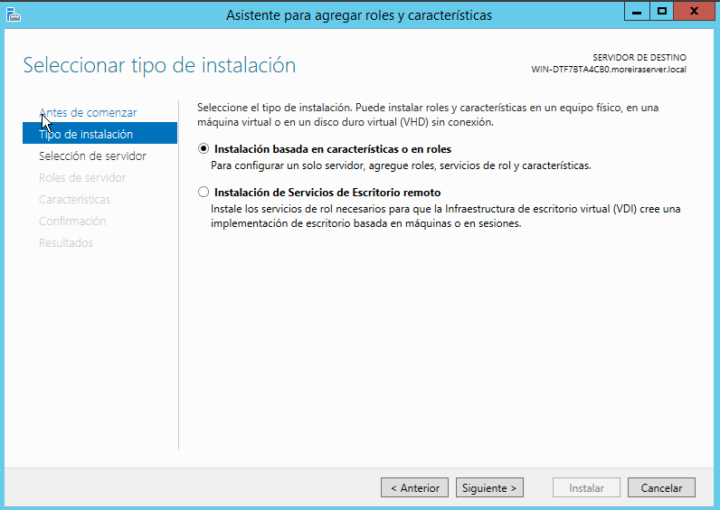

- Seguido eligiremos el servidor en el que vamos a instalar el rol y las características.

  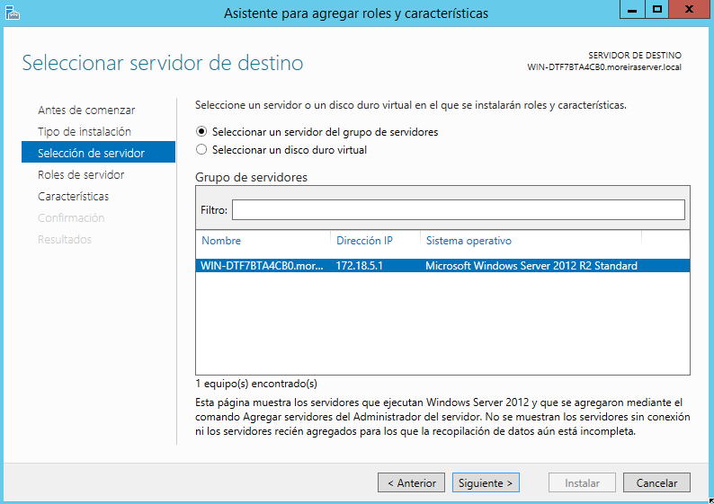

- Después de haber elegido el servidor pasaremos a activar el rol de `servidor web (IIS)`, nos saldrá una ventana en la que clicaremos en `agregar características`.

  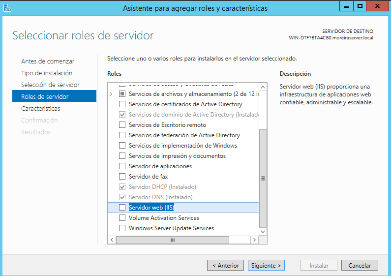

  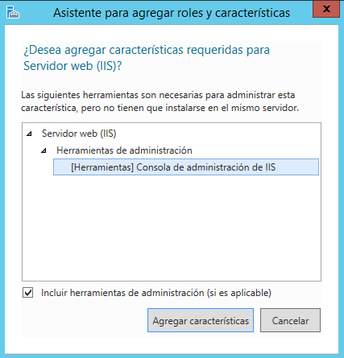

- Ahora en las características pasaremos hasta llegar a **seleccionar servicios de rol** en el que activaremos `autenticación basica` y `autenticación de windows`.

  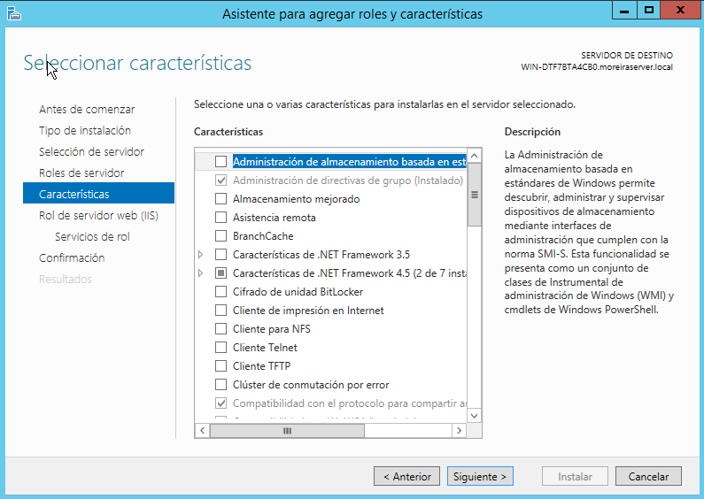

  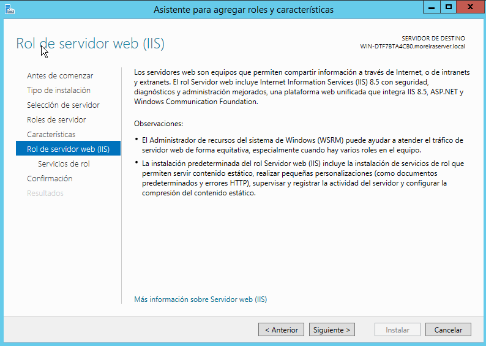

  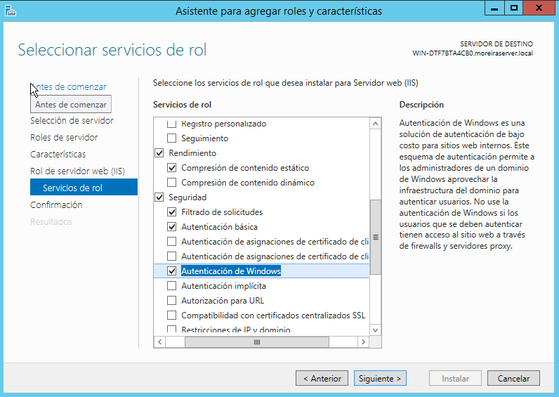

- Finalmente instalaremos.

  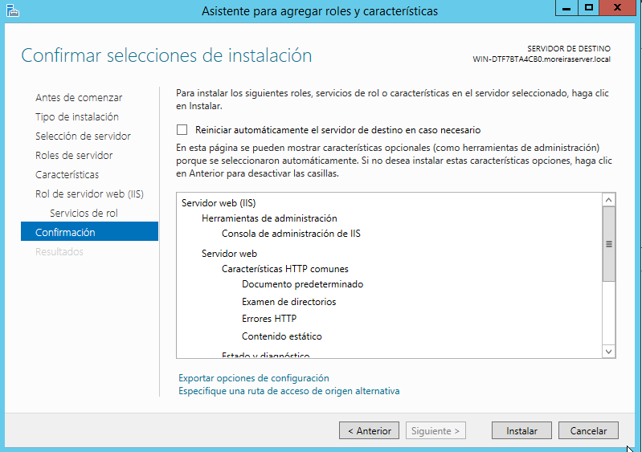

- Ahora para comprobar que todo funciona correctamente en el navegador del servidor pondremos *localhost* y nos debera salir la página por defecto de *IIS*.

  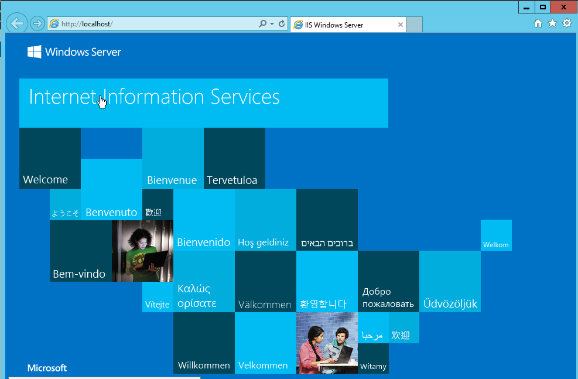

- Esto también lo comprobaremos desde un cliente poniendo la IP del servidor en un navegador.

  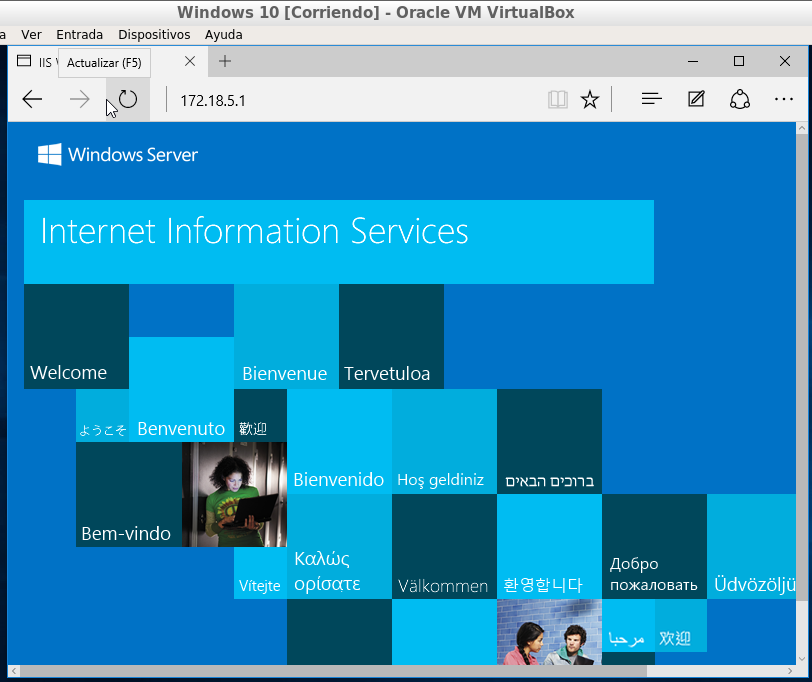

## 1.2 Crear dominios.

- En nuestro caso hemos creado una nueva zona llamada *oscarweb.com* y hemos creado un host llamado *server.oscarweb.com* y un alias con *www* - *www.oscarweb.com*

  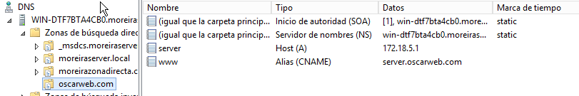

- Lo probamos y veremos que funciona.

  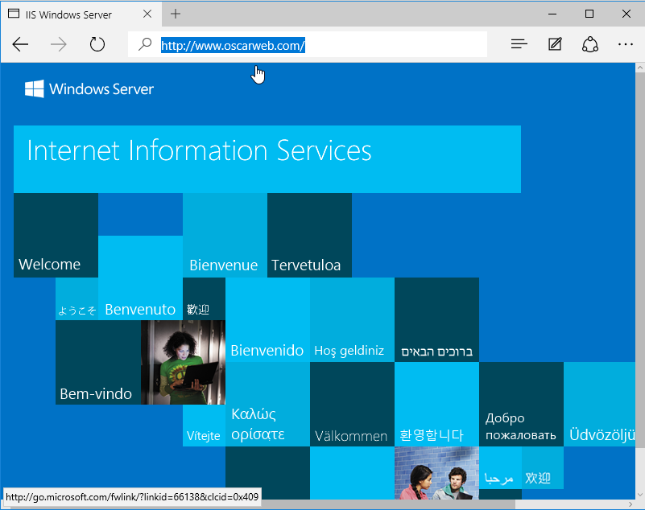

## 1.3 Index dominio principal

- Para el dominio principal por defecto se crea una carpeta en la ruta: `C:\Inetpub\wwwroot` que será donde creemos nuestro index.html para la página por defecto de nuestro IIS.

  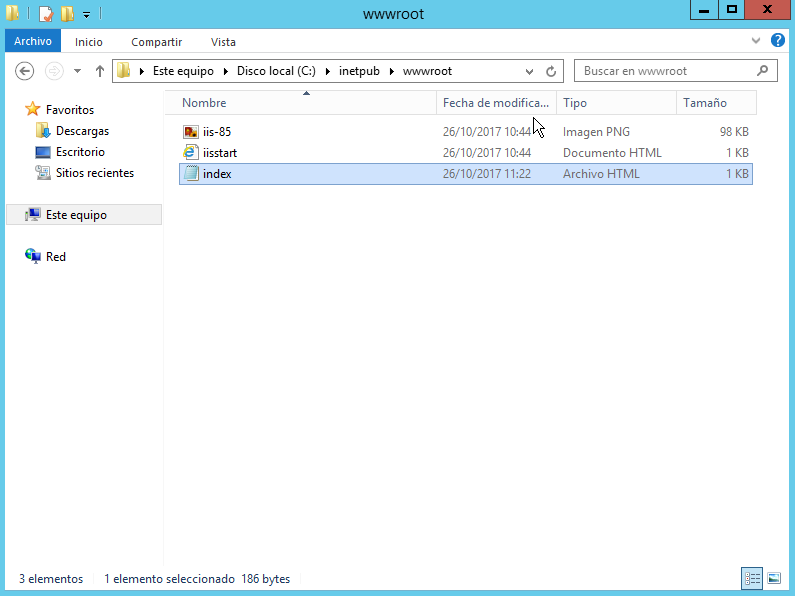

- Ahora comprobaremos que nos saldrá la página creada en vez de la que viene por defecto cuando instalamos IIS. Esto lo haremos desde el servidor y desde el cliente.
  - Navegador servidor.

    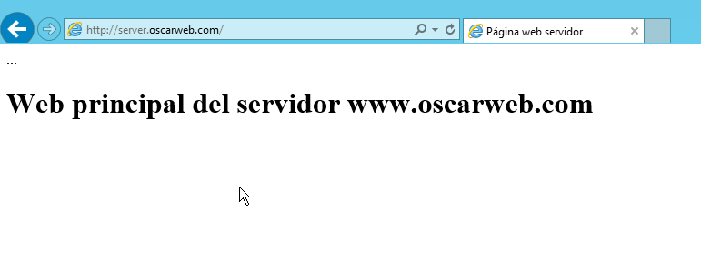

    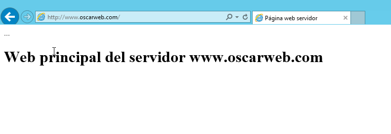

  - Navegador cliente.

    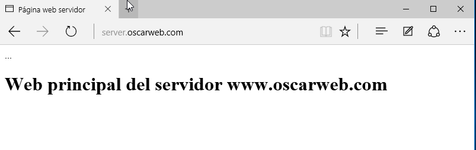

    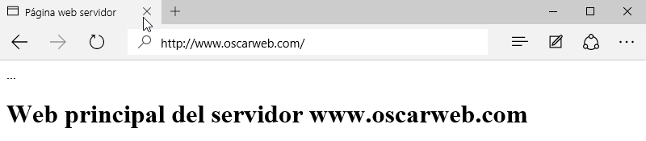

___
___

# 2. Práctica 2
