Óscar Moreira

# Instalación y configuración IIS Windows

___
___

# Prácticas

Este informe consistirá en 3 prácticas de de instalación y configuración de *IIS* en *Windows 12 Server*.

- Practicas:

  **1.** Esta práctica consistirá en instalar IIS en Windows 12 Server, crear un host principal con un alias *www*, y un *index.html*

  **2.** En esta práctica deberemos crear dos nuevos sitios web, un subdominio y otro dominio asociado al principal (una nueva zona), estos dominios tendrán sus propias carpetas con sus *index.html* y lo que querramos en cada uno.

  **3.** En esta última práctica creamos directorios virtuales para uno de los dominios que hemos creado anteriormente, en el que habrá que crear mínimo 3 subcarpetas con un *index.html* cada una.

___

# 1. Práctica 1

## 1.1 Instalación IIS

En la práctica 1 lo primero que haremos será instalar el rol de IIS.

- Iremos a `agregar roles y características` y una vez dentro en **selección de instalación** eligiremos `instalación basada en características o roles`.

  

- Seguido eligiremos el servidor en el que vamos a instalar el rol y las características.

  

- Después de haber elegido el servidor pasaremos a activar el rol de `servidor web (IIS)`, nos saldrá una ventana en la que clicaremos en `agregar características`.

  

  

- Ahora en las características pasaremos hasta llegar a **seleccionar servicios de rol** en el que activaremos `autenticación basica` y `autenticación de windows`.

  

  

  

- Finalmente instalaremos.

  

- Ahora para comprobar que todo funciona correctamente en el navegador del servidor pondremos *localhost* y nos debera salir la página por defecto de *IIS*.

  

- Esto también lo comprobaremos desde un cliente poniendo la IP del servidor en un navegador.

  

## 1.2 Crear dominios.

- En nuestro caso hemos creado una nueva zona llamada *oscarweb.com* y hemos creado un host llamado *server.oscarweb.com* y un alias con *www* - *www.oscarweb.com*

  

- Lo probamos y veremos que funciona.

  

## 1.3 Index dominio principal

- Para el dominio principal por defecto se crea una carpeta en la ruta: `C:\Inetpub\wwwroot` que será donde creemos nuestro index.html para la página por defecto de nuestro IIS.

  

- Ahora comprobaremos que nos saldrá la página creada en vez de la que viene por defecto cuando instalamos IIS. Esto lo haremos desde el servidor y desde el cliente.
  - Navegador servidor.

    

    

  - Navegador cliente.

    

    

___
___

# 2. Práctica 2

En esta práctica lo primero que haremos será crear un subdominio  del dominio que ya tenemos y crear una zona nueva para asociarla despues a la principal.

- Una vez creado los dominios nuevos, crearemos dos carpetas distinta una para cada subdominio. Creadas estas carpetas le daremos permisos al usuario IUSR

  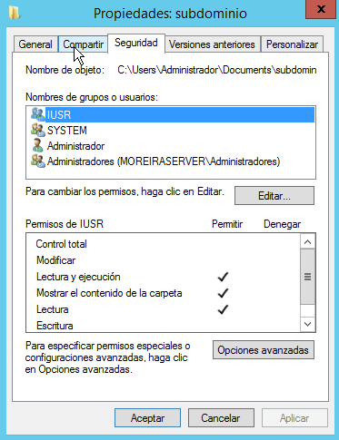

- Cuando le demos los permisos a las carpetas para cada dominio nuevo iremos a `herramientas/iis`.

- Una vez aquí dentro añadiremos un nuevo sitio web en el que le pondremos cual será su ruta a la carpeta y cual será su nombre de dominio.

  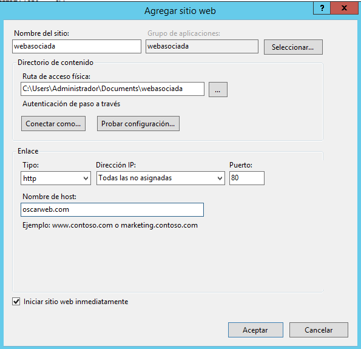

  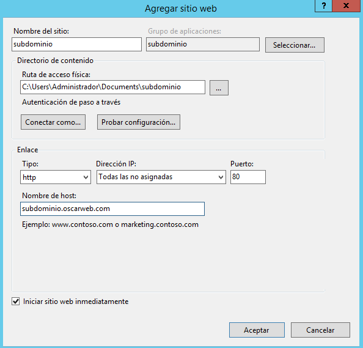

- Ahora veremos que tenemos los 3 sitios web.

  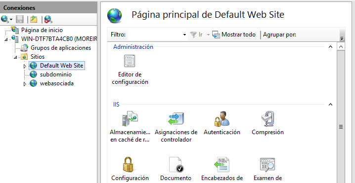

- Ahora comprobaremos que las 3 webs funcionan correctamente en el navegador con su index.html cada una.

  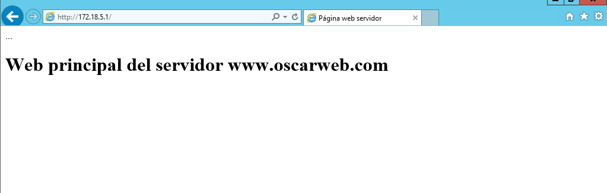

  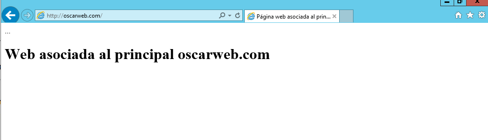

  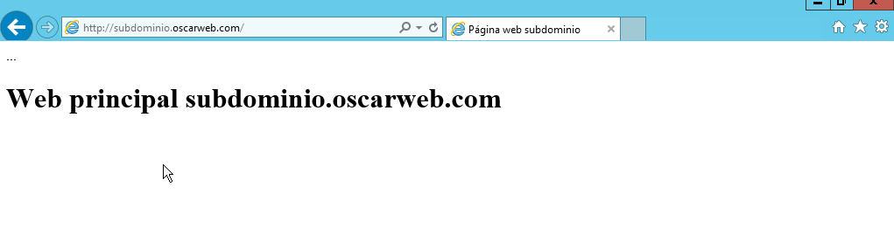

  ___
  ___

# 2. Práctica 3

En esta práctica crearemos directorios virtuales de un dominio creado anterior mente de tal manera que podamos ver en forma de lista lo que hay dentro de una carpeta por navegador.

- Lo primero sera crear una carpeta para meter las cosas dentro de lo queramos ver en el directorio virtual y dentro de esta 3 carpetas más que serán una web cada una con su *index.html*.En nuestro caso lo hemos hecho con la web que asociamos al principal.

- Una vez creadas iremos a la herramienta IIS y clicaremos botón derecho en el sitio web llamado `webasociada` y eligiremos la opción `directorio virtual`, se nos abrirá una ventana en la que pondremos la dirección de la carpeta que creamos para el directorio virtual.

  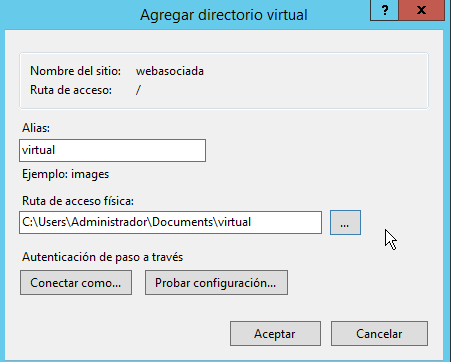

- Hecho esto veremos como nos aparece ahora.

  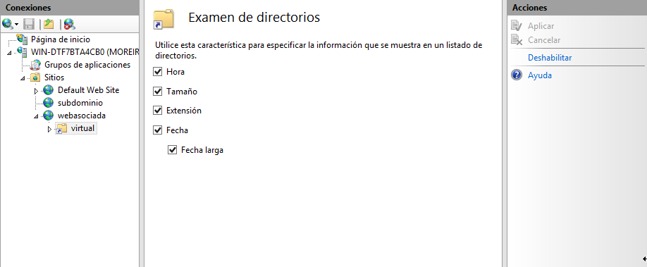

- Ahora si vamos al navegador y buscamos en *oscarweb.com/virtual* que es nuestro dominio y la carpeta del directorio virtual que hemos creado veremos que nos lista lo que hay dentro.

  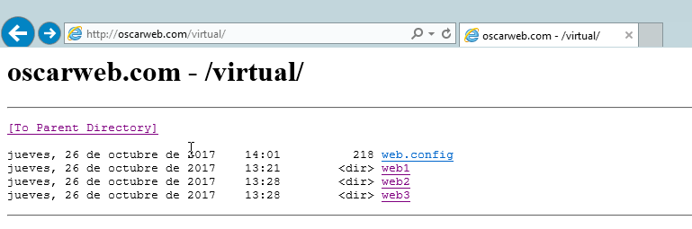

- Ahora para acabar comprobaremos desde un cliente que todas las web funcionan incluyendo las del directorio virtual entrando desde el listado.

1. Web por defecto:

    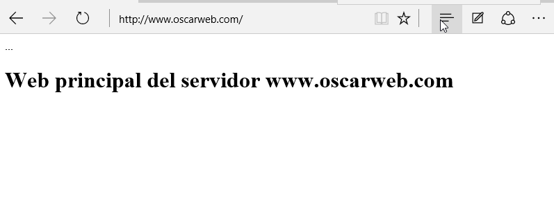

2. Web subdominio_

    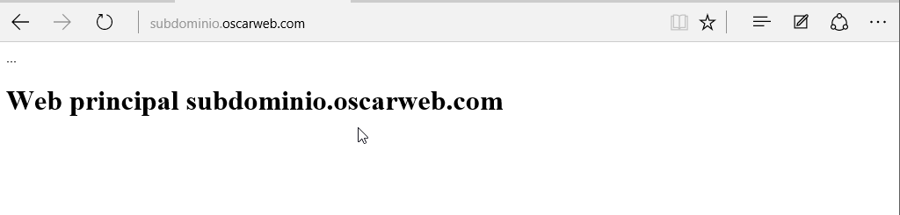

3. Web asociada al principal:

    

4. Web asociada al principal directori virtual:

    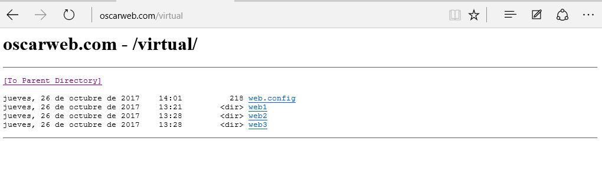

    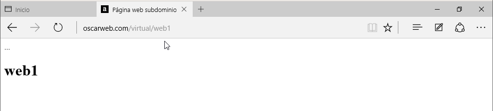

    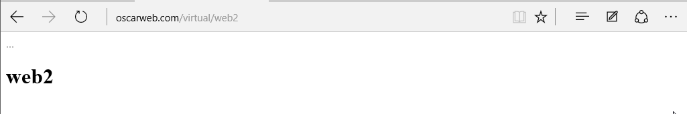

    

___
___

Fín de la práctica
