Óscar Moreira

# Prácticas IIS Windows Parte 2

___
___

# Prácticas

Este informe consistirá en 2 prácticas de  configuraciónes con *IIS* en *Windows 12 Server*.

- Practicas:

  **1.** Esta práctica consistirá en crear una web llamada ***miempresa.com*** con dos subdominios(pagos.miempresa.com y tienda.miempresa.com) cada uno de ellos con su propio sitio web.

  Una vez creados habra que darle el certificado ***SSL*** a los dos, a pagos se le dará un *certificado autofirmado* y a tienda se le dara un certificado con el programa *openssl*.

  **2.** ...

___
___

# Práctica 1

## Miempresa.com

- Lo primero que haremos será crear el dominio llamado *Miempresa.com* y dentro de este dominio otros dos subdominios que serán: *pagos.miempresa.com* y *tienda.miempresa.com*

  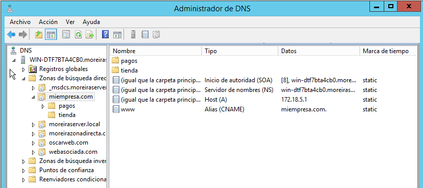

- Ahora en *IIS* creamos el sitio web ***miempresa.com*** y le indicaremos donde estara nuestra carpeta principal con su index.

  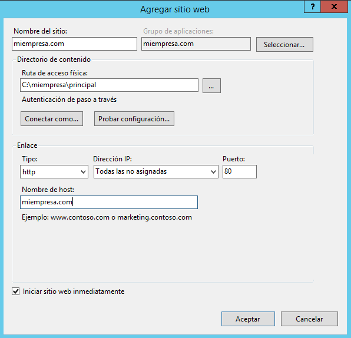

## Pagos.miempresa.com

- Una vez creado el sitio web princial pasaremos a crear el sitio web en *IIS* de ***pagos.miempresa.com*** indicandole igual donde estará ubicada su carpeta.

  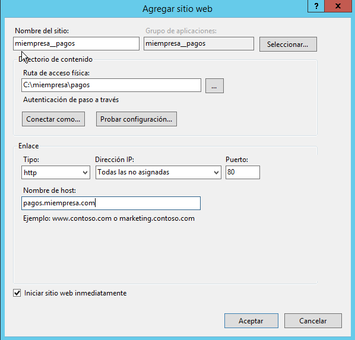

- Ahora comprobaremos que funciona desde servidor y cliente la web con el index que hemos creado y se ubica en la carpeta indicada.

  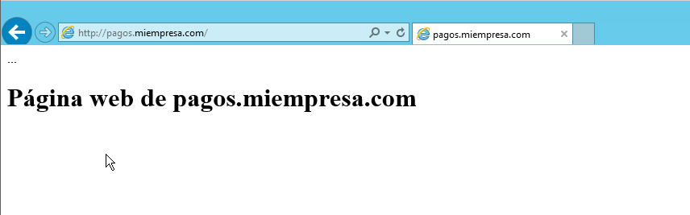

  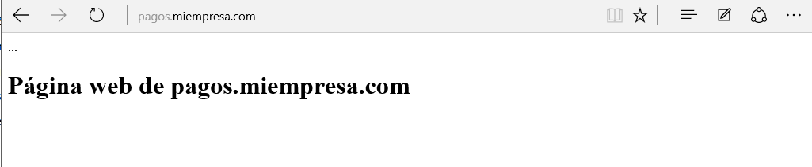

### Certificado autofirmado pagos.miempresa.com

- Lo que haremos para darle un certificado autofirmado será ir a *IIS* y clicaremos en el servidor y eligiremos **certificados de servidor**.

  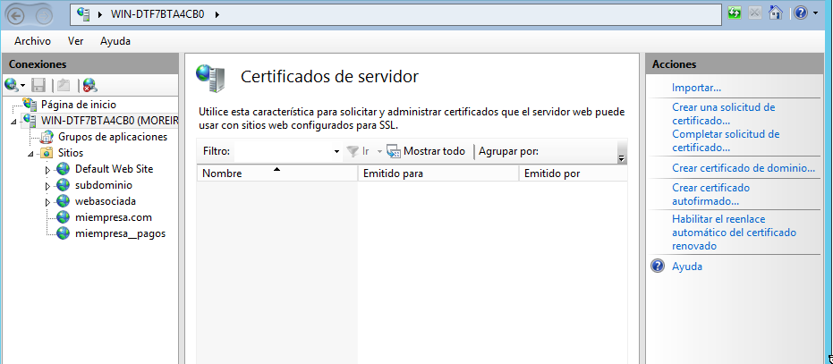

- Una vez ahí dentro a la derecha entraremos en **crear certificado autofirmado** y le pondremos un nombre y aceptaremos.

  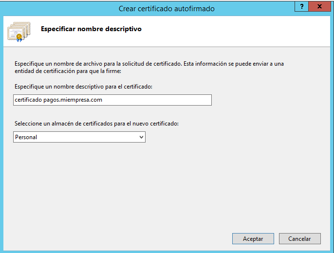

- Acabado de crear el certificado iremos al sitio web(pagos.miempresa.com) en *IIS* e iremos a los enlaces del sitio web. y eligiremos:

  - Tipo: https
  - Nombre de host: pagos.miempresa.com
  - Certificado SSL: eligiremos el que hemos creado anteriormente.

  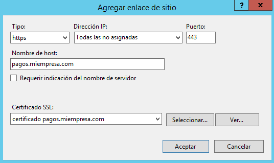

- Después de esto iremos a los enlaces y veremos que tenemos el *http* y *https* asi que eliminaremos el *http* y asi solo tendremos el *https* ya que es el certificado.

  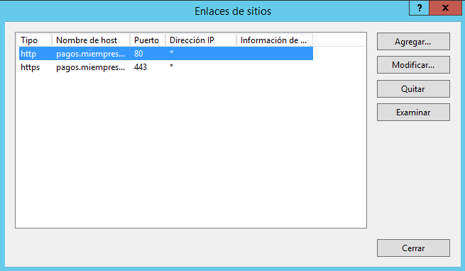

  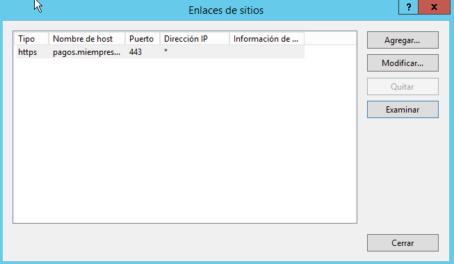

- Comprobamos que funciona el sitio web **pagos.miempresa .com**.

> Nos saldrá en rojo debido a que no hay una certificación oficial,

  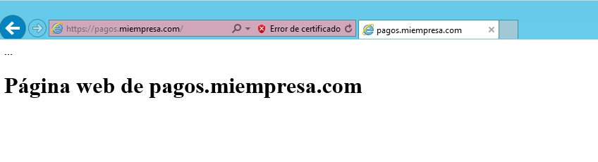

___

## Tienda.miempresa.com

En este caso le daremos la certificación a través de un programa llamado *Openssl*.

Lo primero que haremos será intalar el *Openssl*

- Ahora haremos como anteriormente creando un sitio web pero esta vez para **tienda.miempresa.com**.

  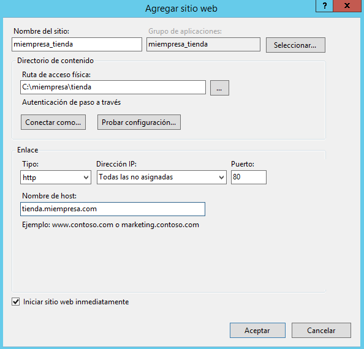

### Certificado *Openssl*

- Una vez creado iremos de nuevo a **certificados del servidor** y entraremos a la derecha en **Crear una solicitud de certificado** que rellenaremos los datos que nos pide.

  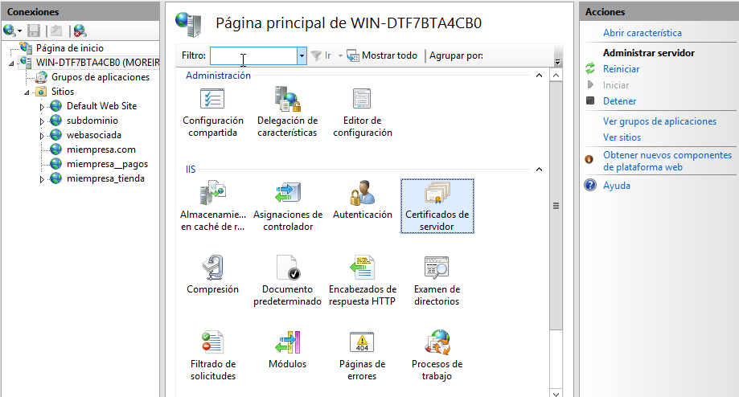

  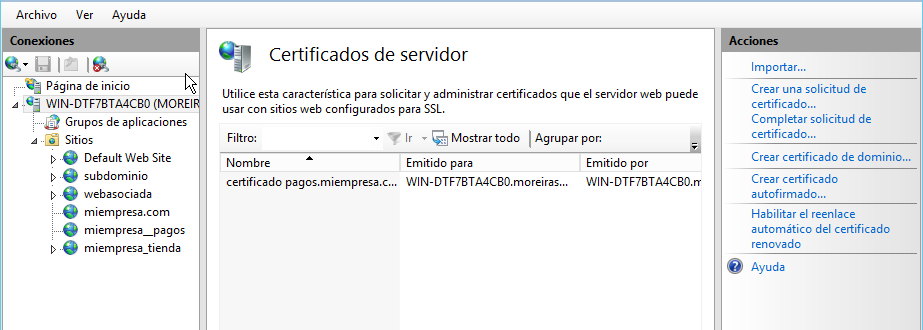

  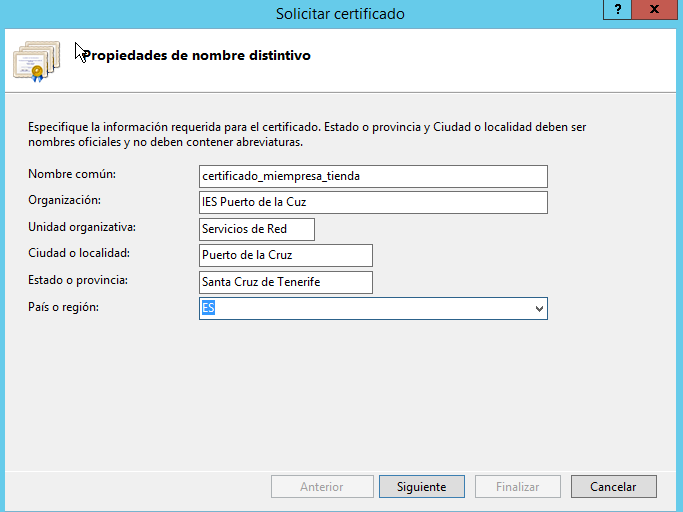

- Daremos en siguiente y la siguiente ventana de *Propuedades de proveedor* igual.

  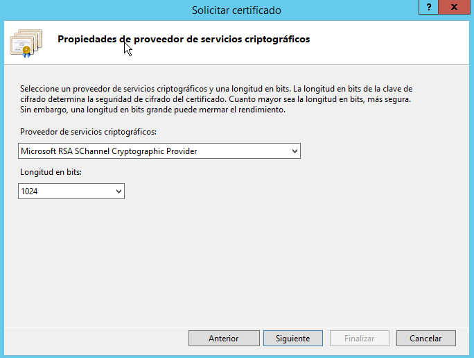

- En la siguiente ventana eligiremos la ruta donde se guardara el archivo y le pondremos la ruta al bin del programa *Openssl*.

  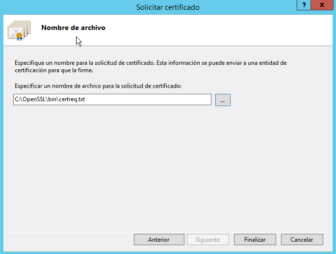

- Ahora iremos a una terminal e iremos hasta la ruta `bin` que se encuentra en la carpeta del programa *Openssl* y ejecutaremos los siguientes comandos como las imagenes siguientes.

  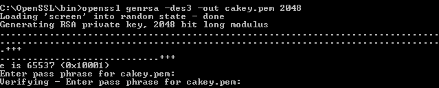

  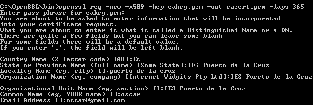

  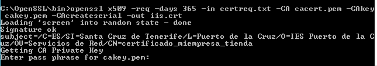

- Hecho esto iremos de nuesto al *IIS* y en **certificados del servidor** a la derecha esta vez iremos a **completar solicitud de certificado**. Le pondremos la ruta al fichero `iis.crt` que creamos con los comandos y se encuentra en el `bin` de *Openssl*.

  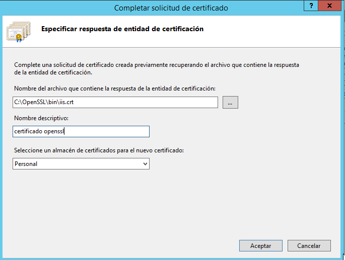

- Después de esto iremos al sitio web en *IIS* de **tienda.miempresa.com** e iremos a los enlaces y le añadiremos uno con *https* y eligiremos el certificado creado con *Openssl*

  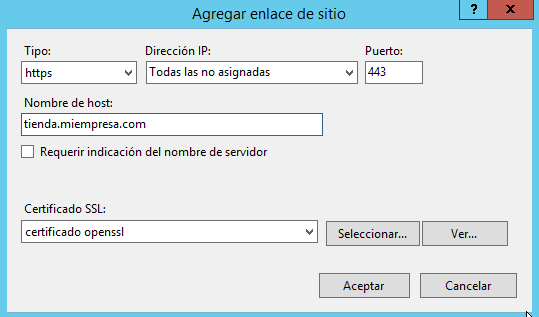

- Comprobaremos que funciona el certificado SSL

  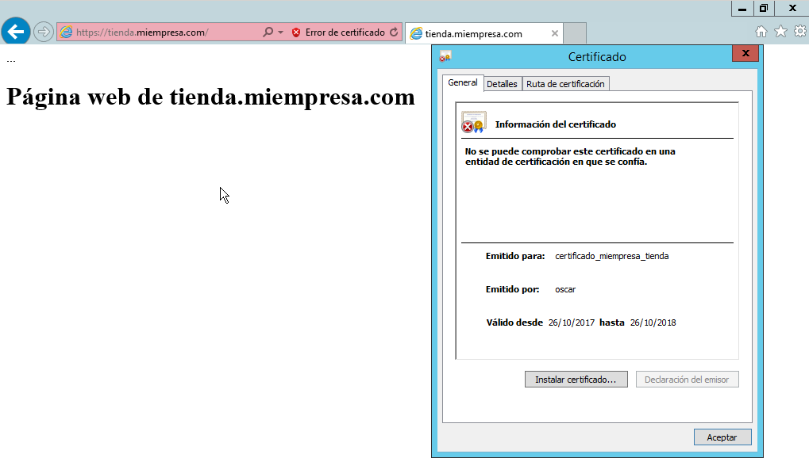

___

## Comprobaciones en el cliente

### pagos.miempresa.com

- `http://pagos.miempresa.com`

  Veremos que nos enviará a la principal ya que *http* lo quitamos y lo dejamos solo con *https*

  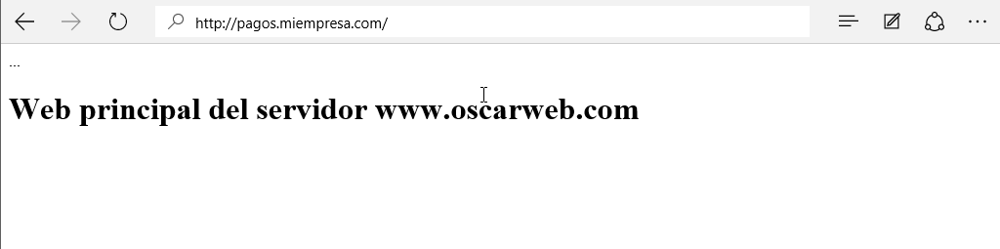

- `https://pagos.miempresa.com`

  Veremos que si funciona

  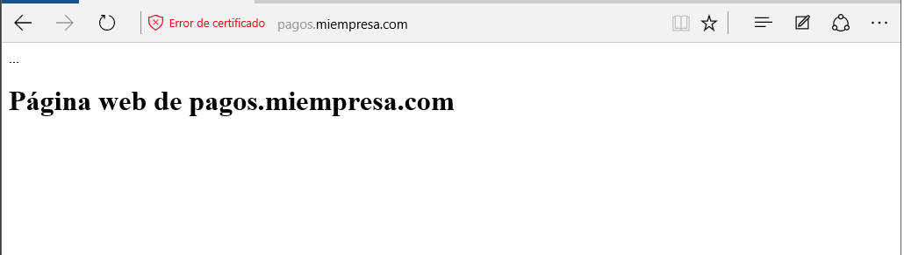

### tienda.miempresa.com

  - `http://tienda.miempresa.com`

    Veremos que con *http* si podremos ver la página pero no tenemos certificación.

    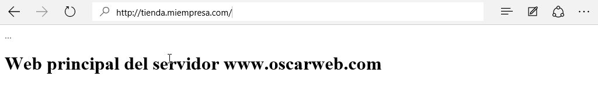

  - `https://tienda.miempresa.com`

    Veremos que si funciona con la certificación

    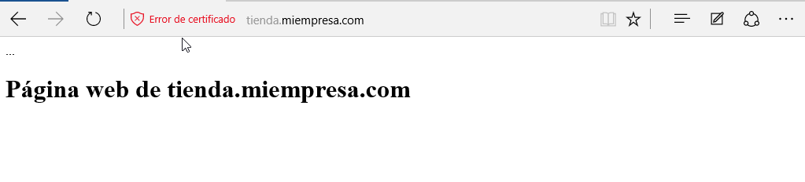

___

## Comprobaciones en el servidor

### pagos.miempresa.com

- `http://pagos.miempresa.com`

  Veremos que nos enviará a la principal ya que *http* lo quitamos y lo dejamos solo con *https*

  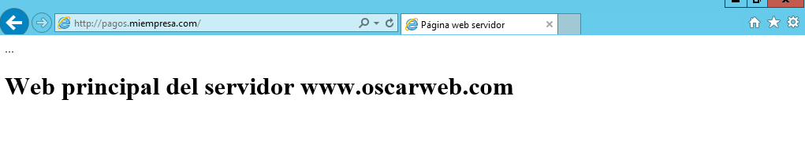

- `https://pagos.miempresa.com`

  Veremos que si funciona

  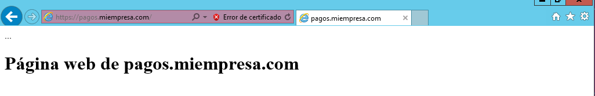

### tienda.miempresa.com

  - `http://tienda.miempresa.com`

    Veremos que con *http* si podremos ver la página pero no tenemos certificación.

    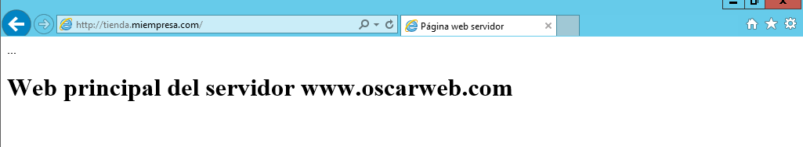

  - `https://tienda.miempresa.com`

    Veremos que si funciona con la certificación

    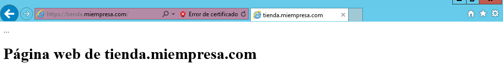

___
___
