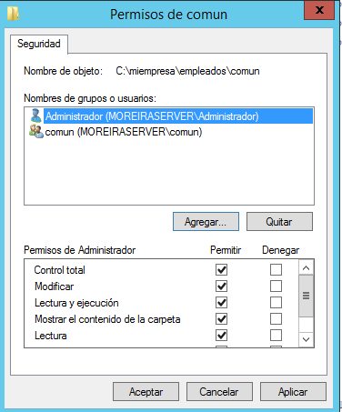

Óscar Moreira

# Prácticas IIS Windows Parte 2

___
___

# Prácticas

Este informe consistirá en 2 prácticas de  configuraciónes con *IIS* en *Windows 12 Server*.

- Practicas:

  **1.** Esta práctica consistirá en crear una web llamada ***miempresa.com*** con dos subdominios(pagos.miempresa.com y tienda.miempresa.com) cada uno de ellos con su propio sitio web.

  Una vez creados habra que darle el certificado ***SSL*** a los dos, a pagos se le dará un *certificado autofirmado* y a tienda se le dara un certificado con el programa *openssl*.

  **2.** Esta segunda práctica consistira en crear un nuevo sitio web llamado ***empleados.miempresa.com*** y en la carpeta que crearemos para él incluiremos otras 4 carpetas más que se llamarán empleado1,2,3 y común.Haremos un examen de directorios para poder visualizarlas.

  Habrá que tener un index en cada una de ellas y crear usuarios para cada una de ellas y un grupo para común, de tal manera que al entrar a la web nos pida usuario y contraseña.

___
___

# Práctica 1

## Miempresa.com

- Lo primero que haremos será crear el dominio llamado *Miempresa.com* y dentro de este dominio otros dos subdominios que serán: *pagos.miempresa.com* y *tienda.miempresa.com*

  

- Ahora en *IIS* creamos el sitio web ***miempresa.com*** y le indicaremos donde estara nuestra carpeta principal con su index.

  

- Dentro de esta carpeta de ***miempresa*** incluiremos dos más que serán las de los subdominios.

  

## Pagos.miempresa.com

- Una vez creado el sitio web princial pasaremos a crear el sitio web en *IIS* de ***pagos.miempresa.com*** indicandole igual donde estará ubicada su carpeta.

  

- Ahora comprobaremos que funciona desde servidor y cliente la web con el index que hemos creado y se ubica en la carpeta indicada.

  

  

### Certificado autofirmado pagos.miempresa.com

- Lo que haremos para darle un certificado autofirmado será ir a *IIS* y clicaremos en el servidor y eligiremos **certificados de servidor**.

  

- Una vez ahí dentro a la derecha entraremos en **crear certificado autofirmado** y le pondremos un nombre y aceptaremos.

  

- Acabado de crear el certificado iremos al sitio web(pagos.miempresa.com) en *IIS* e iremos a los enlaces del sitio web. y eligiremos:

  - Tipo: https
  - Nombre de host: pagos.miempresa.com
  - Certificado SSL: eligiremos el que hemos creado anteriormente.

  

- Después de esto iremos a los enlaces y veremos que tenemos el *http* y *https* asi que eliminaremos el *http* y asi solo tendremos el *https* ya que es el certificado.

  

  

- Comprobamos que funciona el sitio web **pagos.miempresa .com**.

> Nos saldrá en rojo debido a que no hay una certificación oficial,

  

___

## Tienda.miempresa.com

En este caso le daremos la certificación a través de un programa llamado *Openssl*.

Lo primero que haremos será intalar el *Openssl*

- Ahora haremos como anteriormente creando un sitio web pero esta vez para **tienda.miempresa.com**.

  

### Certificado *Openssl*

- Una vez creado iremos de nuevo a **certificados del servidor** y entraremos a la derecha en **Crear una solicitud de certificado** que rellenaremos los datos que nos pide.

  

  

  

- Daremos en siguiente y la siguiente ventana de *Propuedades de proveedor* igual.

  

- En la siguiente ventana eligiremos la ruta donde se guardara el archivo y le pondremos la ruta al bin del programa *Openssl*.

  

- Ahora iremos a una terminal e iremos hasta la ruta `bin` que se encuentra en la carpeta del programa *Openssl* y ejecutaremos los siguientes comandos como las imagenes siguientes.

  

  

  

- Hecho esto iremos de nuesto al *IIS* y en **certificados del servidor** a la derecha esta vez iremos a **completar solicitud de certificado**. Le pondremos la ruta al fichero `iis.crt` que creamos con los comandos y se encuentra en el `bin` de *Openssl*.

  

- Después de esto iremos al sitio web en *IIS* de **tienda.miempresa.com** e iremos a los enlaces y le añadiremos uno con *https* y eligiremos el certificado creado con *Openssl*

  

- Comprobaremos que funciona el certificado SSL

  

___

## Comprobaciones en el cliente

### pagos.miempresa.com

- `http://pagos.miempresa.com`

  Veremos que nos enviará a la principal ya que *http* lo quitamos y lo dejamos solo con *https*

  

- `https://pagos.miempresa.com`

  Veremos que si funciona

  

### tienda.miempresa.com

  - `http://tienda.miempresa.com`

    Veremos que con *http* si podremos ver la página pero no tenemos certificación.

    

  - `https://tienda.miempresa.com`

    Veremos que si funciona con la certificación

    

___

## Comprobaciones en el servidor

### pagos.miempresa.com

- `http://pagos.miempresa.com`

  Veremos que nos enviará a la principal ya que *http* lo quitamos y lo dejamos solo con *https*

  

- `https://pagos.miempresa.com`

  Veremos que si funciona

  

### tienda.miempresa.com

  - `http://tienda.miempresa.com`

    Veremos que con *http* si podremos ver la página pero no tenemos certificación.

    

  - `https://tienda.miempresa.com`

    Veremos que si funciona con la certificación

    

___
___

# Práctica 2

## Sitio web empleados.miempresa.com

- Lo primero que haremos será crear un dominio nuevo dentro de ***miempresa.com*** y con su host.

- Después de crear nuestro nuevo dominio crearemos la carpeta ***empleados*** dentro de la carpeta ***miempresa***, y aparte crearemos dentro de esta las subcarpetas ***empleado1, 2, 3*** y ***común*** con un index en cada una.

- Hecho esto iremos al *IIS* y crearemos el sitio web ***empleados.miempresa.com*** con la ubicación a la carpeta creada anteriormente.

- Luego de esto iremos al sitio web ***empleados.miempresa.com*** y entraremos en `exámen de directorios` y lo habilitaremos.

  

- De tal forma que si entras a la direccion *empleados.miempresa.com* veremos en forma de listado las carpetas web que tenemos dentro.

  

___

## Autenticación

- Para la autenticación el primer paso será en *IIS* ir al servidor y ahí entraremos en `autenticación` y habilitaremos `autenticación básica`.

 

- Ahora pasaremos a ir al sitio web ***empleados.miempresa.com*** en *IIS* y una vez dentro entraremos en `autenticación` y habilitaremos también `autenticación básica`

 

- Hecho esto iremos por cada uno de las carpetas del sito web ***empleados.miempresa.com*** en *IIS* y desabilitaremos `autenticación anónima` de esta forma le obligamos a que no pueda entrar cualquier persona sin poner usuario y contraseña.

  - Ejemplo con la carpeta común:
    > Haremos esto que veremos en la imágen con todas las carpetas.

    

___

- Una vez terminado esto pasaremos a crear los usuarios que seran los que se podran entrar en cada uno de los sitios web.

- Iremos a las herramientas del Servidor y entraremos en `Usuarios y equipos de Active Directory `.

- Dentro crearemos los usuarios ***empleado1, 2, 3*** como veremos en la imágen con el ejemplo de la creación de *empleado1*.

  > Hacer esto con los demas usuarios.

  

- Ahora haremos lo mismo pero creando un grupo llamado ***común***.

  

- Creado el grupo entraremos en sus propiedades y le añadiremos como miembros a los usuarios empleado creados anteriormente.

  

___

- Terminado esto pasaremos a darle los permisos a los usuarios en las carpetas de dichas webs.

- Para esto empezaremos por la carpeta **común** y entraremos en `propiedades/seguridad` e iremos alos permisos y solo dejaremos al *Administrador* y al grupo *común*

  

- Haremos lo mismo con las otras carpetas pero con los usuarios empleados, como veremos en el ejemplo de la siguiente imágen con la carpeta ***empleado1*** le daremos permisos solo al *Administrador* y *empleado1*.

  > Haremos esto con las demas carpetas y usuarios.

  

Con esto terminamos toda la configuración y pasaremos a comprobar que funciona.

___

## Comprobaciones desde Servidor.

- **Web común**

  > Para probar la web común solo mostramos el login con el usuario empleado1 para no repetir imágenes, pero funcionan todos los usuarios correctamente.

  

  

- **Web empleado1**

  

  

- **Web empleado2**

  

  

- **Web empleado3**

  

  

___

## Comprobaciones desde Cliente.

- **Web común**

  > Aqui hemos puesto de ejemplo solo el login con empleado2

  

  

- **Web empleado1**

  

  

- **Web empleado2**

  

  

- **Web empleado3**

  

  

___
___

Fín de la práctica.
