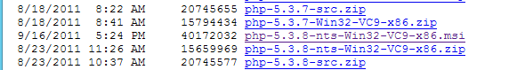

# Informe IIS - Servidor Web avanzado - PHP, MySQL, phpMyAdmin, FTP y Drupal

___

# Prácticas

### Parte 1:
- La primera parte de la práctica consistirá en crear un servidor web con soporte PHP, acceso FTP y gestor de bases de datos y phpMyAdmin.

### Parte 2:
### Parte 3:

___
___

# 1. Parte 1

## 1.0 IIS Windows Server 2012 V

En este apartado instalaremos y configuraremos todas las características necesarias para nuestro servidor de tal forma que luego podremos trabajar desde el cliente y configurar desde el cliente.

## 1.1 Instalación PHP

- Lo primero que haremos será descargar PHP la versión 5.3.8

  

- Descargado lo siguiente sera instalarlo y seguiremos los pasos que veremos en las imágenes siguientes.

  

  

  

  

  

- Ahora añadiremos la carácterística llamada CGI en el servidor.

  

  

- Una vez instalado el CGI pasaremos a crear nuestro sitio web y lo primero sera crear la carpeta llamada *cms*

  

- Dentro de esta carpeta crearemos un fichero *index.php* con el código siguiente dentro de él.

  ~~~
  <?php phpinfo(); ?>
  ~~~

  

- Crearemos un alias.

  

- Despuñes de esto iremos a *IIS* y crearemos el sitio web *cms.miepresa.com*.

  

- Por último en el sitio web en *IIS* en documentos predeterminados pondremos el *index.php* al principio.

  

- Ahora ya comprobaremso que entrando en nuestro sitio web en un navegador nos saldrá el contanido de PHP.

  

___

## 1.2 Instalación MySQL

Para instalar el *MySQL* seguiremos los siguientes pasos:
- Primero iremos a este [enlace](https://dev.mysql.com/donwloads/installer) y descargamos la segunda opción de 376.3M (instalador completo).

  

- Una vez descargado seguiremos los siguientes pasos para la instalación.

  

  

  

  

  

  

  

- Y siguiente hasta acabar.

## 1.3 phpMyAdmin

- Descargaremos phpMyAdmin en este [enlace](http://www.phpmyadmin.net)

  

- Crearemos una carpeta llamada phpmyadmin en *miempresa* con todos los ficheros.

  

- Ahora creamos un nuevo dominio para phpmyadmin

  

- Creado el dominio crearemos el sitio web en *IIS*

  

- Ahora verificamos si entrando a la web nos sale la página.

  

___
___

# Parte 2
