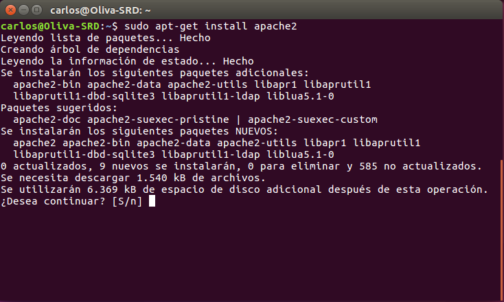
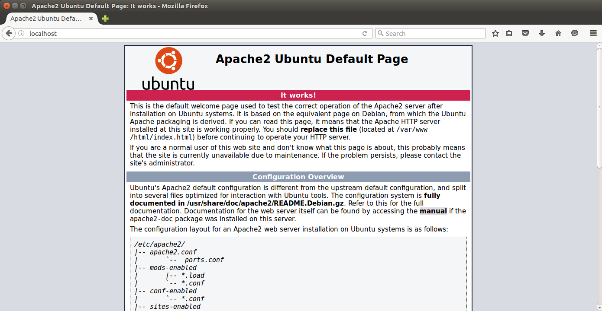
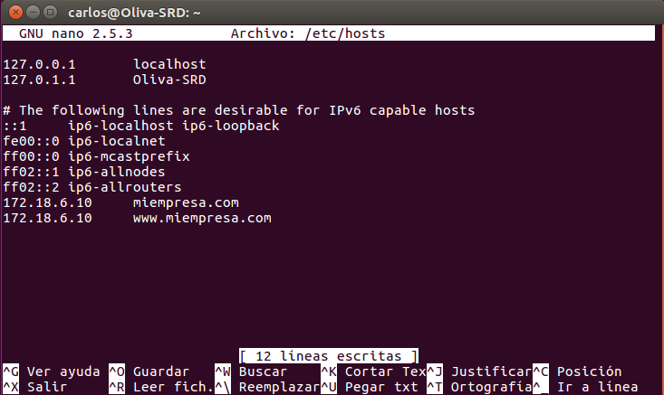
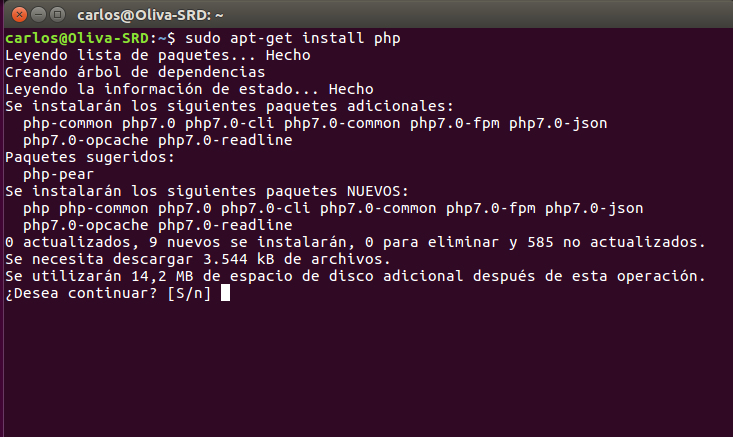
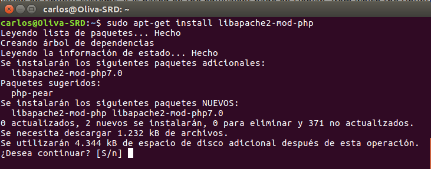
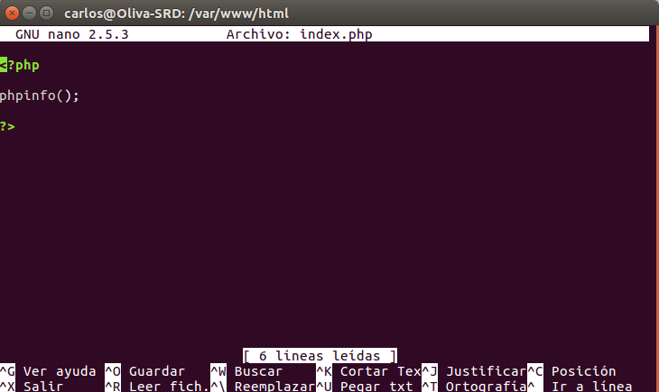
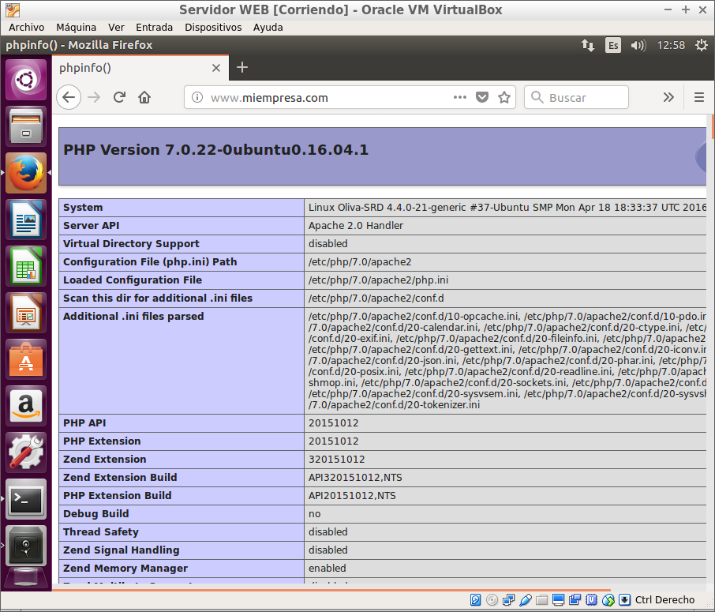

# Apache Linux

___
# Explicación práctica

Esta práctica consistirá en instalar y configurar en Linux los servicios: `Apache`,`PHP`, `MySQL`, `phpMyAdmin` y también haremos configuraciones de acceso a carpetas privadas y configuraciones *SSL*.

 ___
 ___

# Práctica

## 1. Apache

- Lo primero que haremos sera instalar *Apache* : `sudo apt-get install apache2`

  

- Ahora si vamos al navegador y entramos en `localhost` veremos que nos saldrá el index que se creo en `/var/www/` al instalar *Apache*.

  

- Añadimos en `/etc/hosts` la IP con el nombre de *www.,iempresa.com*.

  

___

## 2. PHP

- Instalamos PHP: `sudo apt-get insall php`

  

- Ahora instalaremos las librerias de *Apache* para *PHP*: `sudo apt-ger install libapache2-mod-php`.

  

- Después de esto crearemos un *index.php* en `/var/www/html`.

  

- Ahora veremos que si entramos en *www.miempresa.com* nos saldra al index de *PHP*.

  
