# Apache Linux

___
# Explicación práctica

Esta práctica consistirá en instalar y configurar en Linux los servicios: `Apache`,`PHP`, `MySQL`, `phpMyAdmin` y también haremos configuraciones de acceso a carpetas privadas y configuraciones *SSL*.

 ___
 ___

# Práctica

## 1. Apache

- Lo primero que haremos sera instalar *Apache* : `sudo apt-get install apache2`

  

- Ahora si vamos al navegador y entramos en `localhost` veremos que nos saldrá el index que se creo en `/var/www/` al instalar *Apache*.

  

- Añadimos en `/etc/hosts` la IP con el nombre de *www.,iempresa.com*.

  

___

## 2. PHP

- Instalamos PHP: `sudo apt-get insall php`

  

- Ahora instalaremos las librerias de *Apache* para *PHP*: `sudo apt-ger install libapache2-mod-php`.

  

- Después de esto crearemos un *index.php* en `/var/www/html`.

  

- Ahora veremos que si entramos en *www.miempresa.com* nos saldra al index de *PHP*.

  

___

## 3. Crear hosts virtuales.

En este apartada crearemos sitios web que configuraremos con apache2.

- Lo priemro que haremos será crear el virtual host de *www.empleados.miempresa.com* para esto iremos a la ruta `/etc/apache2/sites-available/` y crearemos un fichero que llamaremos ***empleados.conf***.

  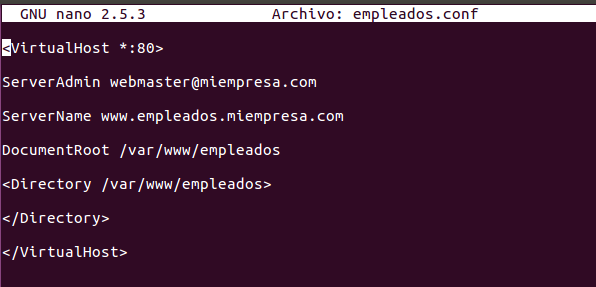

- Luego iremos al fichero `/etc/hosts` y lo añadiremos.

  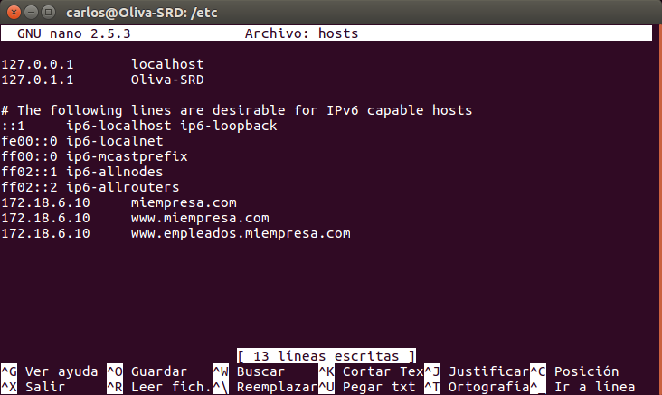

- Después de esto iremos a la ruta `/var/www/` y crearemos una carpeta llamada empleados y dentro un *index.html*.

  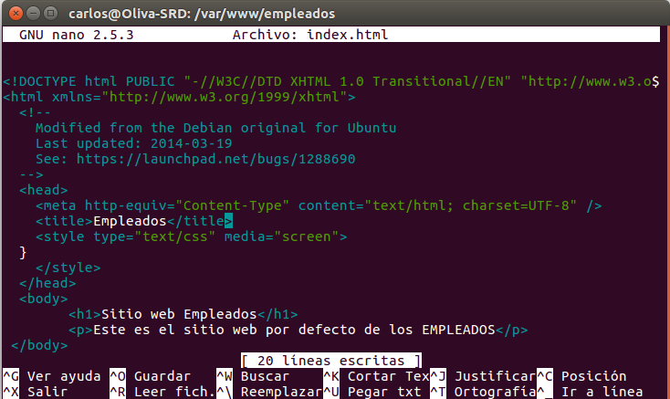

- Ahora comprobaremos que el sitio web esta bien creado y que podemos acceder a la página.

  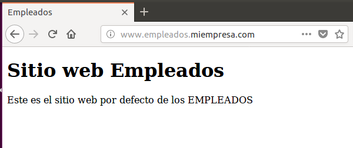

___

## 4. Sitios web seguros (SSL)

Ahora pasaremos a crear sitios web pero en este caso con certifiacion *SSL*

- Una vez se instala *Apache* también se instala *SSL*.

- Pasaremos a generar un certificado autofirmado. Ejecutaremos los siguientes comandos:

  ~~~

    - openssl genrsa -des3 -out server.key 1024
    - openssl rsa -in server.key -out server.pem
    - openssl req -new -key server.key -out server.csr
    - openssl x509 -req -days 360 -in server.csr -signkey server.key -out server.crt

  ~~~

  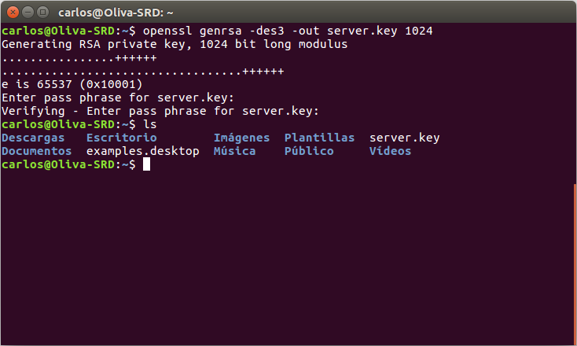

  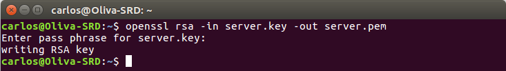

  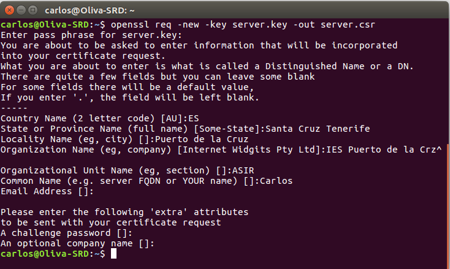

  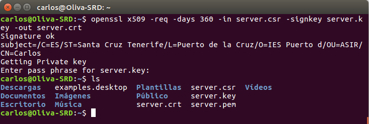

- Ahora iremos al la ruta `/etc/apache2/sites-available/` y crearemos el virtual host `pagos.conf` con susconfiguración *SSL*.

  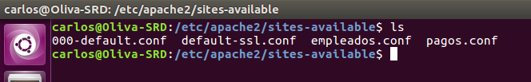

  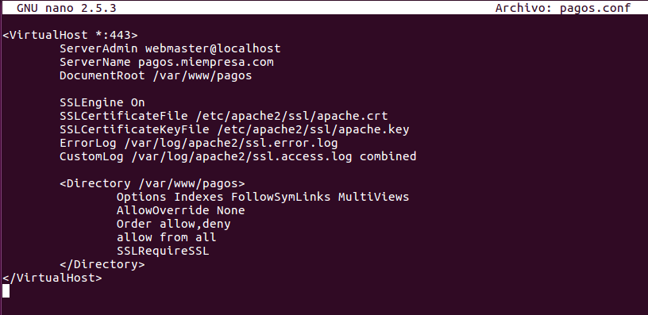

- Después de esto iremos a la ruta `/var/www/` y crearemos una carpeta llamada pagos en la que crearemos un *index.html*

  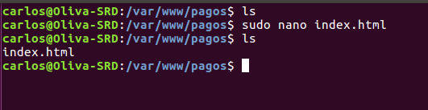

- Hecho todo esto lo añadiremos el nombre a `/etc/hosts`

  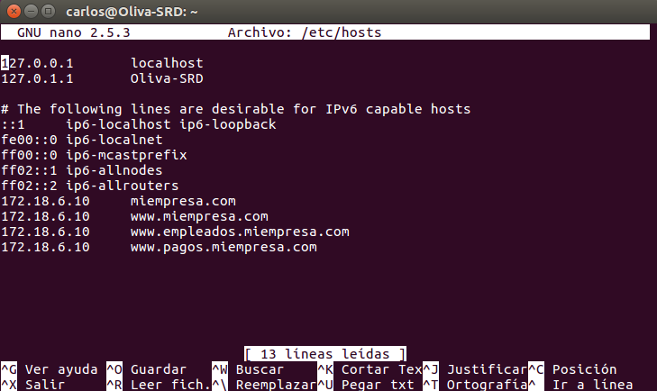

- Cuando acabemos de configurar todo ejecutaremos el comando: `sudo a2enmod ssl` que sera el módulo que habilite el *SSL* en *Apache*.

  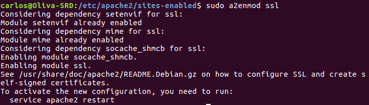

- Ahora verificamos que funciona la página.

  

___

## 5. Acceso a carpetas privadas.
