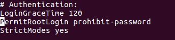

Oscar Moreira

# Clientes Ligeros LTSP en Ubuntu

___

## Definición

  Es una computadora cliente o un software de cliente en una arquitectura de red cliente-servidor que depende primariamente del servidor central para las tareas de procesamiento, y se enfoca principalmente en transportar la entrada y la salida entre el usuario y el servidor remoto.

  - Video de funcionamiento

      - No se ha podido crear el video por fallos técnicos.

___

# 1. Preparación de máquinas

Crear las siguientes máquinas:

  - Servidor LTSP

      - SO: Ubuntu desktop
      - RAM: 2GB
      - Almacenamiento: 15GB
      - Red 1: adaptador puente
      - Red 2: red interna

  - Cliente 1

    - SO: imagen creada por servidor LTSP
    - RAM: 2GB
    - Almacenamieno: sin disco
    - Red: red inerna
  - Cliente 2

    - SO: imagen creada por servidor LTSP
    - RAM: 2GB
    - Almacenamieno: sin disco
    - Red: red inerna
___

# 2. Servidor LTSP Ubuntu

Lo primero que haremos sera instalar Ubuntu en nuestra máquina virtual ya configurada.

## 2.1 Configuración de las redes

  Según acabe la instalación y ya estemos dentro nos tocará configurar las conexiones a la red.

  - Red 1 (adaptador puente)

    - IP: 172.18.5.41
    - Mascara: 255.255.0.0
    - Puerta de enlace: 172.18.0.1
    - DNS: 8.8.4.4

  - Red 2 (red interna)

    - IP: 192.168.67.1
    - Mascara: 255.255.255.0

## 2.2 Configuración de host.

  Cambiaremos el nombre de host para tenerlo a nuestro gusto, en este caso para la asginatura.

  - Primero modificaremos el archivo hosts que se encuentra en la ruta `/etc/hosts`.

    - Pondremos: `moreira5d moreira5d.curso1718`

      

  - Luego modificaremos el archivo hostname que estara en la ruta `/etc/hostname`.

    - Pondremos: `moreira5d`

      

## 2.3 Comandos de comprobación

  - ip a

    

  - route -n

    

  - hostname -a
  - hostname -f
  - uname -a

    

## 2.4 Creación de usuarios

Ahora creamos 3 usuarios `moreira1,moreira2,moreira3` usando el comando `adduser`.

## 2.5 Instalación de servicio LTSP

  - Primero instalaremos el servicio ssh para la conexión remota `apt-get install openssh-server`

    

  - Luego modificaremos el fichero `/etc/ssh/sshd_config`

    

      - Dentro de este fichero cambiaremos `PermirRootLogin proibit-password` por `PermirRootLogin yes`.

         

  

  - Ahora pasaremos a instalar el servidor LSTP con el comando `apt-get install ltsp-server-standalone` en Ubuntu

    

  - Crearemos una imágen del SO a partir del sistema real. `ltsp-build-client` . Esta imágen sera la que se cargue en los clientes ligeros para su instlación.

    

      Esto puede tardar un rato dependiendo del sistema operativo al que se le haga la imágen.

## 2.6 Configuración fichero DHCP del TTSP

  - Modificaremos el fichero de configuración `/etc/ltsp/dhcpd.conf`.

    - `option root-path /opt/ltsp/amd64`

    - `filename /ltsp/amd64/pxelinux.0`

    - Modificaremos también `range 192.168.67.1XX 192.168.67.2XX`siendo xx nuestro número en nuestro caso el 05 `range 192.168.67.105 192.168.67.205`.

     

Reiniciamos el servidor para comprobar luego que estos servicios estarán activos.

 -  Servicio DHCP: `ps -ef|grep dhcp`

 - Servicio FTP: `ps -ef|grep ftp`

    

Vemos que los servicios estan corriendo perfectamente.

___

# 3. Máquinas clientes ligeros.

## 3.1 Configuración de la máquina.

  

  

  

- Tener encendida la máquina del servidor LTSP.

- Encender después la máquina del cliente ligero.

- Al inciarse hemos tenido un problema con la maquina que no sabemos aún el porque algunos equipos con la misma configuración funciona y con otros equipos no.

- Vemos el error que nos da en esta imagen.

  
