Óscar Moreira Estévez

# Tareas programadas

# 1. Windows

## 1.1 Tarea diferida

En el caso de las tareas diferidas son solo para que se ejecuten una vez en una fecha futura, pero solo una vez.

- Iremos al `Panel de control` y buscaremos **herramientas**.

  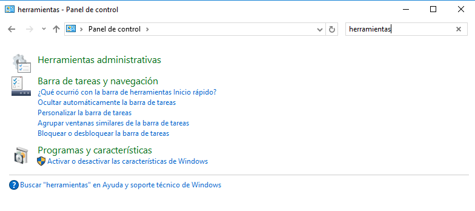

- Una vez dentro de `herramientas` buscaremos la herramienta `Programador de tareas`.

  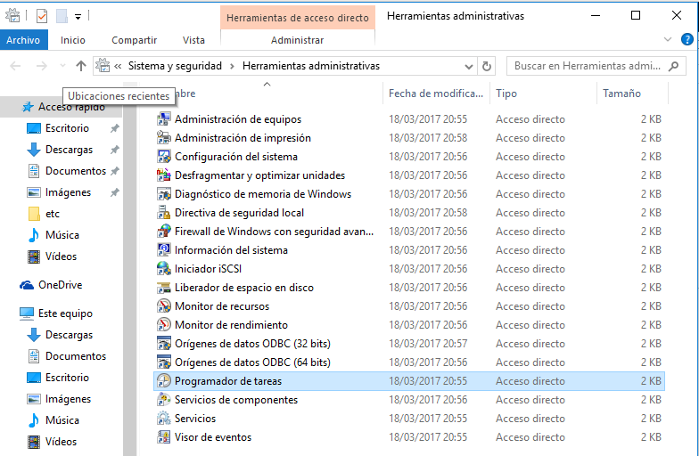

- Dentro del *Programador de tareas* iremos al panel derecho y entraremos en `Crear una tarea básica`.

  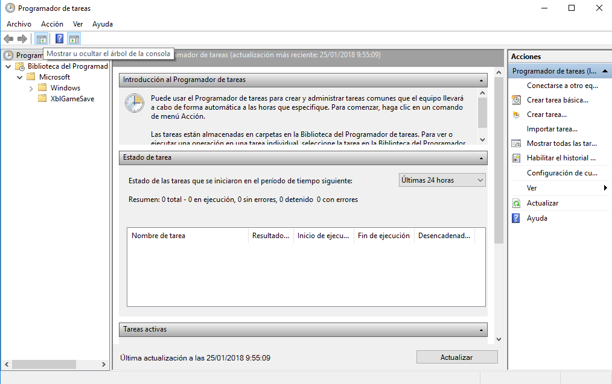

- En mi caso ejecuto un fichero *txt*.

- Dentro de la creación de una tarea básica le pondremos el nombre y una descripción.

  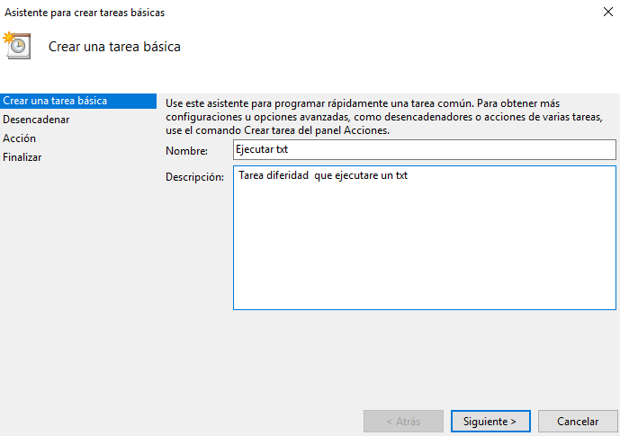

- En el siguiente paso le diremos que lo ejecute solo una vez ya que es una tarea diferida.

  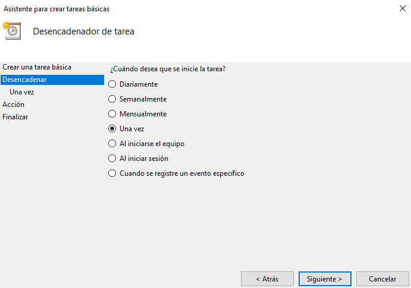

- Luego eligiremos una fecha y hora.

  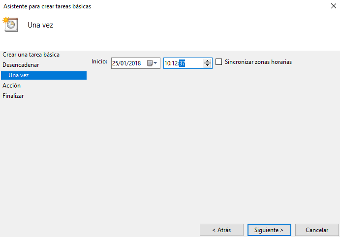

- A continucación indicamos `Iiciar un programa`

  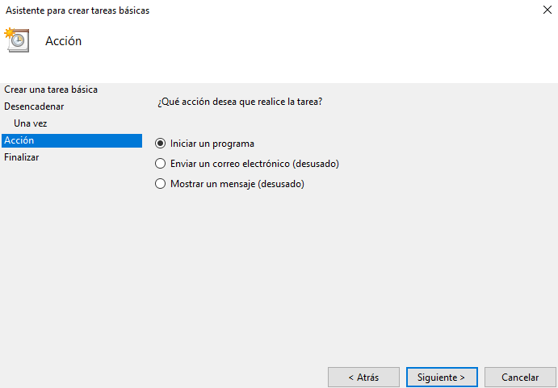

- Eligimos la ruta al programa o fichero.

  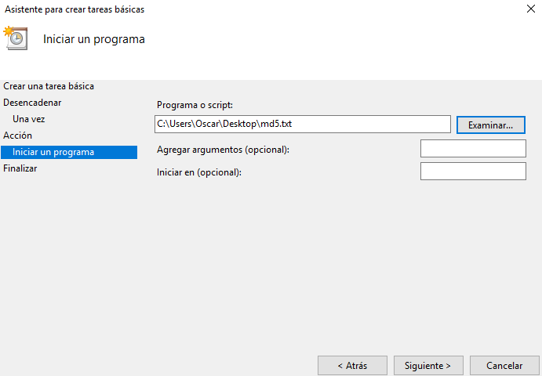

- Y finalizamos la creación.

  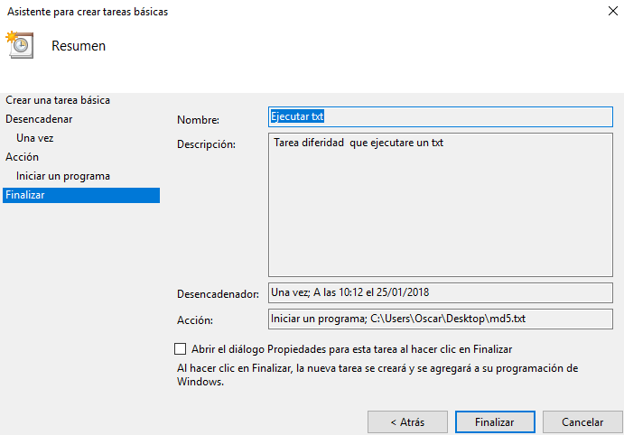

Vemos que el fichero *txt* se ha ejecutado a la hora que hemos programado.

  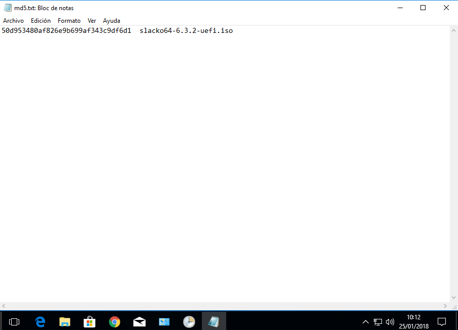

___

## 1.2 Tarea periódica

Una tarea periódica a diferencia de la diferida, será que se ejcuta cada intervalo de tiempo.

- Volveremos al panel del `Programador de tareas`y entramos en `Crear una tarea básica`.

- Le pondremos nombre y definición.

  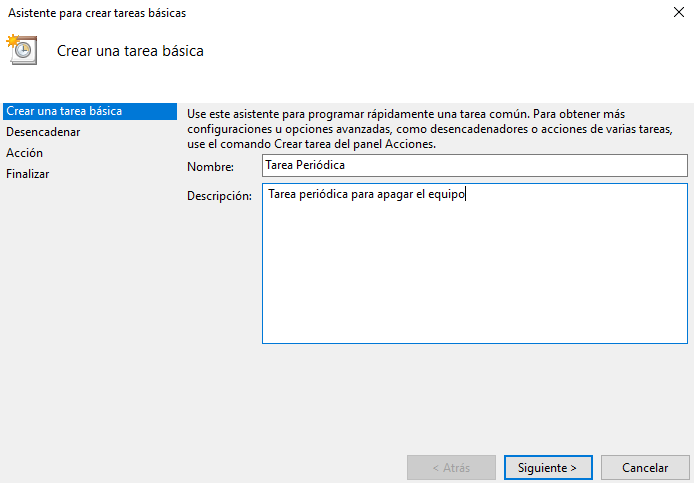

- Le pondremos que se ejecute diariamente.

  

- Luego le indicaremos la fecha de inicio, la hora y cada cuantos días se repetirá.

  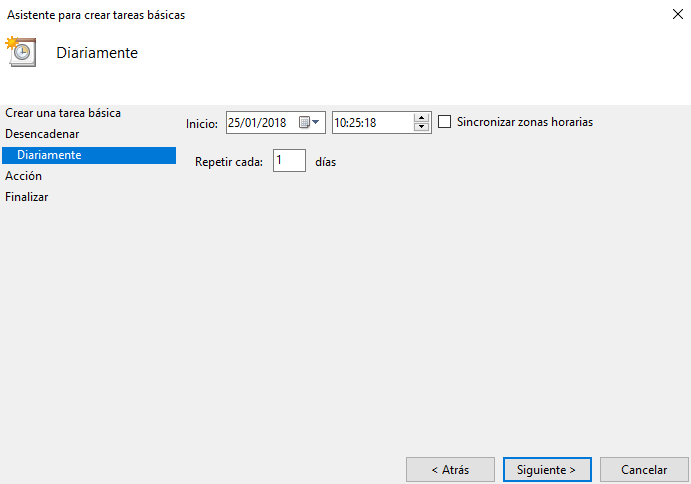

- Después de esto activaremos la opción `Iniciar un programa`.

  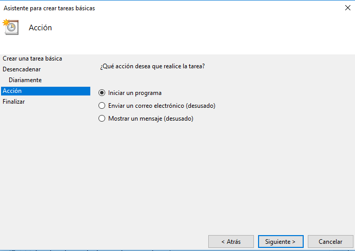

- Nuestra tarea será indicarle que se apague solo el ordenador cada día a cierta hora.

- Por lo que en *programa o script* pondrmeos el comando `shutdown` y en argumentos pondremos `/s`.

  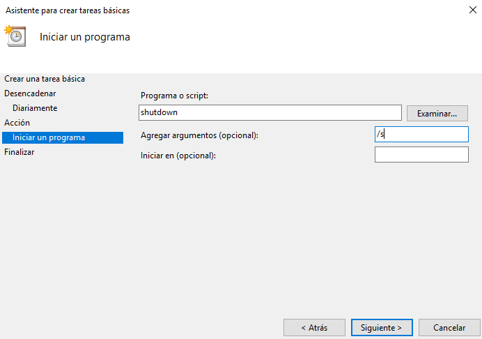

- Finalizamos la creación de la tarea.

  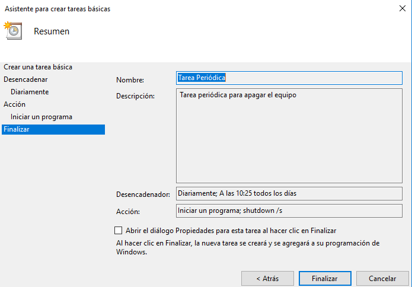

Veremos que cuando llegue la hora que le hemos indicado se nos apagará el pc.

  

___
___

# 2. Linux - OpenSUSE

## 2.1 Tarea diferida

- Lo primero que tenemos que hacer será activar el servicio `atd` que será el que nos permita ejecutar los comandos **at**.

- Iremos a `yast`--> `Administrador de servicios`.

  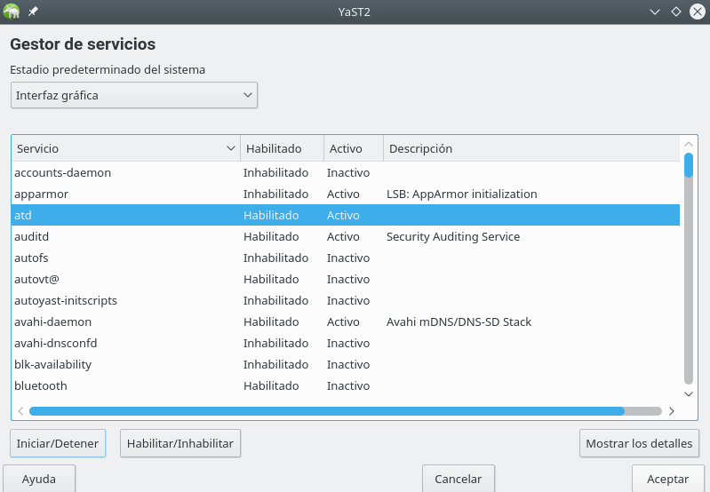

- Y habilitamos y activamos el servicio `atd`.

  

- Para verificar que esta funcionando haremos: `sudo systemctl status atd`

  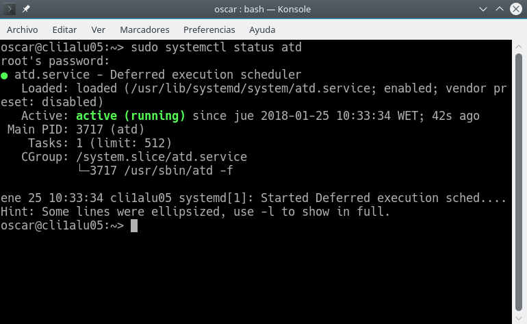

- Si ejecutamos el comando `atq` veremos que no hay tareas progradas.

  

- Ahora creamos un script que nos dará un mensaje de aviso en la pantalla.

  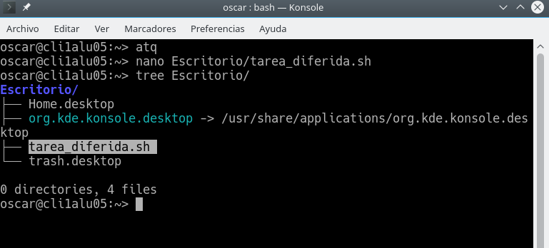

  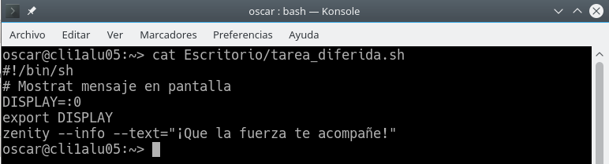

- Instalamos `zenity`.

  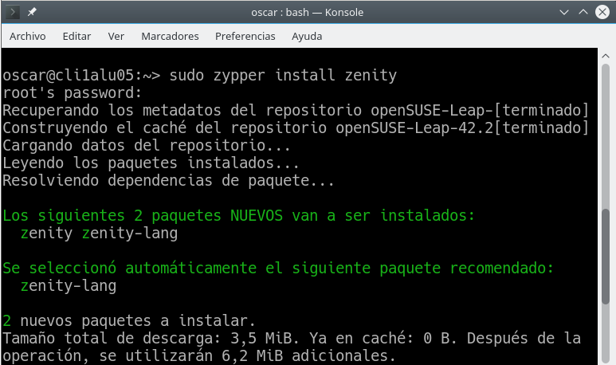

- Ahora creamos una tarea diferida  cone el comando `at` y verificamos con `atq`  que hay una tarea programada.

  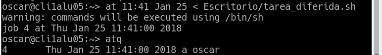

- Si hacemos `at -c 1` veremos la configuración de la primera tarea, en nuestro caso es la 4.

  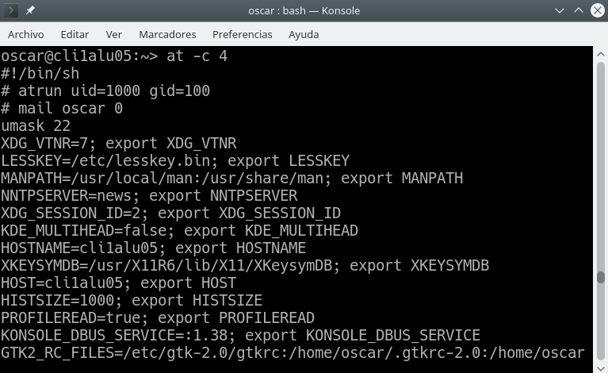

- Ahora cuando llegue la hora programada veremos que nos muestra el mensaje en pantalla.

  

- `atq` para ver que no hay tareas programadas.
___

## 2.2 Tarea periódica.

- Para las tareas periódicas usaremos el comando `crontab`.

- Primero ejecutaremos `crontab -l` para ver que no hay tareas.

  

- Usaremos `contrab -e` para abrir el editor que por defecto es el `vim` para la configuración .

- Definimos una tarea periódica para apagar el pc a una hora en concreto cada cierto tiempo.

  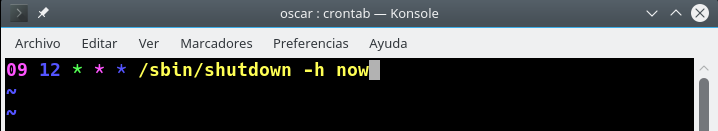

- Si ahora ejecutamos `crontab -l` veremos que hay una tarea programada.

La máquina se ha apagado pero no se puede hacer captura del apagado, aunque el proceso hecho esta todo correcto ya que ha funcionado.

___
___

Fín de la práctica
