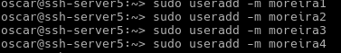
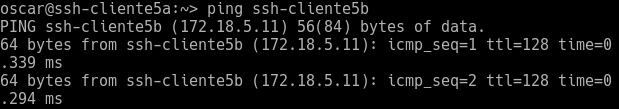
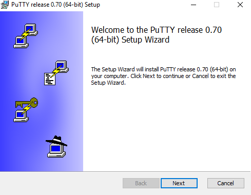
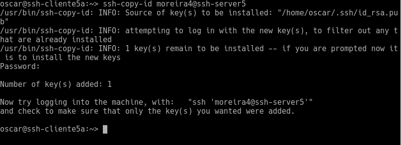
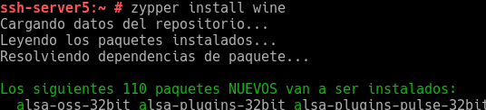

Óscar Moreira 2ºASIR

# Acceso remoto SSH

___

# Práctica

Esta práctica consiste en instalar el *SSH* que nos permitirá el acceso remoto desde cualquier lugar y cualquier sistema operativo.

Tendremos que acceder de forma remota de las siguientes maneras:

- OpenSUSE cliente - OpenSUSE server

- Windows 10 cliente - OpenSUSE server

También se crearan usuario, autenticaciones ssh , restricciones, etc..

___

# Máquinas

1. OpenSUSE server

    - Nombre de equipo: `ssh-server5`
    - IP: `172.18.5.31`
    - DNS: `8.8.4.4`
    - Gateway: `172.18.0.1`

2. OpenSUSE cliente

    - Nombre de equipo: `ssh-cliente5a`
    - IP: `172.18.5.32`
    - DNS: `8.8.4.4`
    - Gateway: `172.18.0.1`

3. Windows 10 cliente

    - Nombre de equipo: `ssh-cliente5b`
    - IP: `172.18.5.11`
    - DNS: `8.8.4.4`
    - Gateway: `172.18.0.1`

___
___

# 1. Preparación máquinas

Esta preparación consistirá en hacer que se conozcan los 3 equipos modificando un fichero `hosts`en cada uno y la creación de 4 usuarios en el servidor.

## Servidor SSH (ssh-server5)

Añadiremos en el fichero /etc/hosts los equipos clientes, donde pondremos su IP y su nombre de equipo.

Comando:
  ~~~
  sudo nano /etc/hosts
  ~~~

  

- ## Comprobaciones

  - ip a

    

  - route -n

    

  - ping 8.8.4.4 -i 2

    

  - host www.google.es

    

  - ping ssh-cliente5a

    

  - ping ssh-cliente5b

    

  - lsblk

    

  - blkid

    

  - ## Usuarios

    Crearemos 4 usuarios en el que cada uno contendra mi apellido más 1,2,3,4.

      

___

## Cliente Linux (ssh-cliente5a)

Añadiremos en el fichero /etc/hosts el otro equipo cliente y el servidor, donde pondremos su IP y su nombre de equipo.

Comando:
  ~~~
  sudo nano /etc/hosts
  ~~~

  ~~~
  172.18.5.31   ssh-server5
  172.18.5.11   ssh-cliente5b
  ~~~

- ## Comprobaciones

    - Ping a ssh-server5 (servidor ssh):

      

    - Ping al cliente5b (windows):

      

___

## Cliente Windows (ssh-cliente5b)

En este caso descargaremos el programa `putty` en este [enlace](https://www.chiark.greenend.org.uk/~sgtatham/putty/latest.html).
Eligiremos 32 bits o 64 según la arquitectura de nuestro ordenador.

Una vez descargado lo instalararemos y dejaremos toda la instalación por defecto.

  

  

  

Después de ser instalado iremos al fichero `hosts` que se encuentra en la ruta :
`C:/Windows/System32/drivers/etc` y añadiremos el otro equipo cliente y el servidor, donde pondremos su IP y su nombre de equipo.

  

- ## Comprobaciones

    - Ping a ssh-server5 (servidor ssh):

      

    - Ping al cliente5a (Linux):

      

___
___

# 2. Instalación del servicio SSH

> En el equipo ssh-server5

- Instalaremos el servicio SSH en el equipo **ssh-server5**.

  - Primero haremos un `zypper search openssh` y asi veremos los paquetes que tenemos instalados y cuales no.

      

  - Después de esto instalaremos el servicio con `sudo zypper install openssh`

      

## 2.1 Comprobación servicio SSH

- Para comprobar que el servicio esta funcionando correctamente haremos `sudo systemctl status ssh`

    

- La siguiente comprobación será verificar que el proceso esta activo con el comando: `ps -ef | grep sshd`.

    

- La última comprobación es verificar que el servicio esta escuchando en el **puerto 22**,  esto lo haremos con `netstat -nmap`.

    

## 2.2 Conexión SSH desde cliente Linux (ssh-cliente5a)

> En cliente linux (ssh-cliente5a)

- Comprobaremos que hace ping a la máquina servidor: `ping ssh-server5`

    

- Una vez comprobado esto, con el comando `nmap -Pn ssh-server5` nos mostrará que el puerto 22 está abierto y el servicio SSH es visible.

  > Si no tenemos instalado el nmap unicamente hacer `sudo zypper install nmap`

    

- Deste este cliente nos conectaremos al usuario creado `moreira1` por SSH

- Comando:

  ~~~
  ssh moreira1@ssh-server5
  ~~~

  

- Una vez dentro del usuario **moreira1** del servidor verificaremos que dentro del directorio `.ssh/` está el fichero `known_hosts`, con el comando: `ll .ssh` desde el home de moreira1.

    

### Conexión desde ssh-cliente5b (windows) al servidor ssh.

En Windows lo que haremos será conectarnos con SSH pero desde el programa llamado `putty` instalado anteriormente.

- Ejecutamos el programa y donde nos pone ***Host name (or IP address)*** pondremos el nombre **ssh-server5 o la IP del servidor SSH.

    

- Después de esto le daremos a **open** y nos saldrá un mensajito que le daremos a **si** y luego ya nos saldrá una consola en la que nos pedirá el nombre de usuario al que queremos conectarnos y luego la contraseña y ya estaremos dentro.

    

___
___

# 3. Cambiar las claves del servidor (ssh-server5)

Lo primero que haremos será verificar en la ruta `/etc/ssh/` que tenemos muchas claves públicas y privadas, entre todas estas debe estar `ssh_host _key` y `ssh_host_key.pub`.

  

- Después de esto lo que haremos sera modificar el fichero SSH `/etc/ssh/sshd_config` en el que solo dejaremos una lina sin comentar y será donde ponga: `HostKey /etc/ssh/ssh_host_rsa_key`.

  ![3.12(./img/3.2.png)

- Con esto le decimos que solo vamos a usar estas claves ya que le estamos diciendo que solo va a identificar estas.

___

### Regenerar claves.

> En ssh-server5

- Nuestro primer paso sera ejecutar `ssh-keygen -t rsa -f /etc/ssh/ssh_host_rsa_key`.
- Sin password

  

- Una vez hecho reiniciaremos el servicio SSH con  `systemctl restart sshd`.

- Comprobaremos que esta funcionando con `systemctl status sshd`

  

  ___

### Comprobación

En la comprobacion desde los clientes entraremos a un usuario y veremos que nos saldrá un mensaje porque ha cambiado la clave.

- **Linux ssh-cliente5a**

  

- **Windows ssh-cliente5**

  

___
___

# 4. Personalización prompt Bash

> Haremos esta modificación solo para *moreira1* desde el servidor ssh

> La modificación será que cuando iniciemos sesión en moreira1 nuestro prompt salga de diferente color.

- Primero iremos hasta el fichero *bashrc*. que se encuenta en `/home/moreira1`.
Lo modificaremos de la siguiente manera.

  ~~~console
  ssh-server5:~ # nano /home/moreira1/.bashrc

  ~~~

- Una vez dentro añadiremos lo siguiente:

~~~
# Se cambia el prompt al conectarse vía SSH

if [ -n "$SSH_CLIENT" ]; then
   PS1="AccesoRemoto_\e[32m\u@\h:\e[0m \w\a\$ "
else
   PS1="\[$(pwd)\]\u@\h:\w>"
fi
~~~

  

- Verificamos que ha funcionando entrando en remoto desde un cliente al usuario moreira1.

  - ssh-cliente5a

    

  - ssh-cliente5b

    

- Después de esto crearemos un fichero llamado `.alias` que se encontrará en `/home/moreira1` en el que pondremos los siguientes alias:

  ~~~
   alias c='clear'
   alias g='geany'
   alias p='ping'
   alias v='vdir -cFl'
   alias s='ssh'
  ~~~

- Comprobación de los alias.

  - ssh-cliente5a

    

  - ssh-cliente5b

    

- Vemos que ha funcionado todo correctamente.

___
___

# 5. Autenticación mediante claves públicas.

  

  ___

  Con esto lo que haremos será poder entrar en el usuario `moreira4` sin tener que poner contraseña.

  > Desde máquina cliente sin usar usuario root.

- Una vez dentro ejecutaremos el comando : `ssh-keygen -t rsa` que nos creará 2 claves, una publica (id_rsa.pub) y otra privada (id_rsa) en el fichero `/home/moreira4/.ssh`

  

- Después de esto tendremos que pasarle la clave púbica al usuario remoto `moreira4` , esto lo haremos con el comando: `ssh-copy-id moreira4@ssh-server5` .
- Cogerá esta clave y la pasara a `moreira4` a un fichero llamado `authorized_keys`

  

___

### Comprobación

En la comprobación veremos que si accedemos desde los clientes al usuario remoto `moreirea4` no nos pedirá contraseña.

- ssh-cliente5a

  

- ssh-cliente5b

  Aquí vemos que se salta el paso de ***password***

  

___
___

# 6. Uso de SSH como túnel para X

Con esto lo que haremos será poder ejecutar desde el cliente una aplicación gráfica que no este en él sino que esta en el servidor SSH.

___

> Desde el servidor ssh-server5

- Instalararemos una aplicación en el servidor en nuestro caso `geany` y lo haremos con `zypper install geany`.

  

- Luego modificaremos el fichero `/etc/ssh/sshd_config` con nano para activar la opción de ejecutar aplicaciones gráficas desde cliente.
- Dentro de el habilitaremos la opción :`X11Forwarding yes` ver que esta descomentada.

  

> Desde cliente a (ssh-cliente5a)

- Lo primero comprobaremos que no este instalada la aplicación que vamos a usar.

  

  Vemos que no lo puede ejecutar porque no existe, no esta instalado.

- Ahora lo que haremos será entrar en un usuario remoto `moreira1` pero con el comando : `ssh -X moreira1@ssh-server5`.
- La X es importante porque será lo que nos deje entrar y ejecutar aplicaciones graficas del servidor.

  

  

  

- Si probamos a entrar desde otro usuario

___
___

# 7. Aplicaciones nativas de Windows.

Para poder hacer lo mismo que el apartado anterior debemos tener instalado en el servidor el emulador ***WINE***.

> Desde ssh-server5

- Instalaremos con `zypper install wine`

  

- Ahora usaremos como referencia la propia aplicación de wine que se llama ***wine notepad***.

  - Aplicación desde el servidor

    

- Después de esto iremos al cliente windows y entraremos al usuario `moreira1` con el comando : `ssh -X moreira1@ssh-server5`

- Una vez dentro del usuario ejecutaremos el comando: `wine notepad` y veremos que nos verá.

  

___
___

# 8. Restricciones de uso

___

## Restricción sobre un usuario

En este apartado lo que haremos será restringir la conexión SSH al usuario `moreira2`.

- Para esto modificaremos el fichero `/etc/ssh/sshd_config` entraremos con `nano`-

  > Denegar usuarios : DenyUsers

  > Permitir usuarios: AllowUsers

  

### Comprobación

- **ssh-cliente5a**

  Veremos que no podemos entrar porque se nos deniega el acceso.

  

- **ssh-cliente5b**

  Veremos de nuevo que se nos deniega el acceso.

  

___

## Restricción sobre una aplicación

En este caso lo que haremos será restringir permisos sobre una aplicación para solo poder usarla los usuarios que nos interesen.

> Desde ssh-server5

- Lo primero es crear un grupo llamado `remoteapps`

  Comando:
  ~~~
  groupadd remoteapps
  ~~~

- Luego incluiremos dentro de este grupo al usuario `moreira4`

  Comando:
  ~~~
  usermod -a -G remoteapps moreira4
  ~~~

- Veremos que los permisos de la aplicación `geany` descargada anteriormente son 755, iremos a la ruta `/usr/bin/` y los veremos con `ls -l`.

  

- Ahora pondremos el progrma en el grupo `remoteapps` con el comando `chgrp remoteapps /usr/bin/geany`

  

- Por último cambiaremos los permisos de `geany` a **750** para que solo puedan usarlo los que pertenezcan al grupo `remoteapps`.

- Esto se hara con el comando `chmod 750 /usr/bin/geany` y veremos con un `ls -l` que han cambiado.

  

___

### Comprobación

> Desde ssh-cliente5a

- Veremos que si entramos desde un usuario que no sea `moreira4` no podra ejecutar la aplicación ya que no pertenece al grupo `remoteapps`.

- En nuestro caso probe con `moreira3`

  Vemos que nos da como permiso denegado

  

- Si ahora probamos con el usuario `moreira4` que si pertenece al grupo `remoteapps`
veremos que nos dejara usarlo perfectamente.

  

___
___

Fín de la práctica
