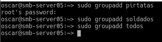
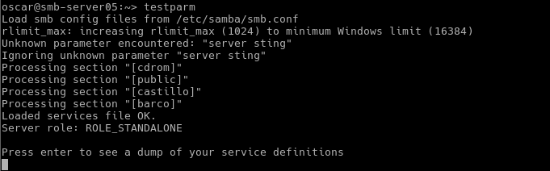
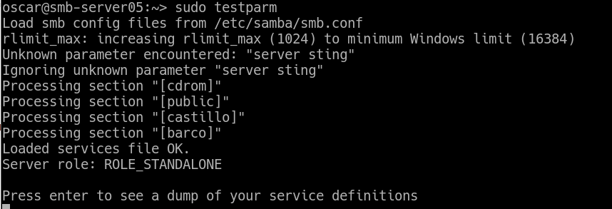
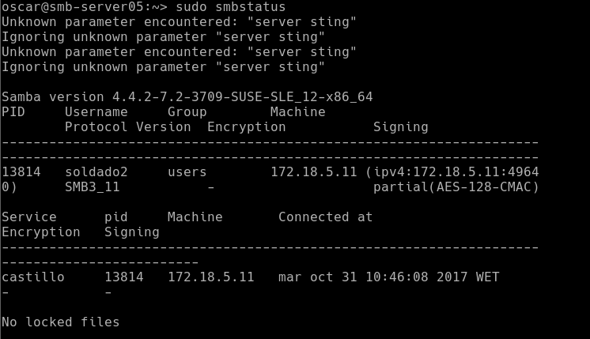
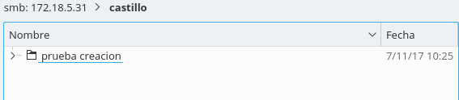

Óscar Moreira

# Samba

___

# Práctica

Esta práctica consiste en crear un *servidor samba* en OpenSUSE con dos clientes, un Windows 10 y otro cliente OpenSUSE.

Se crearán unos usuarios para samba y unas carpetas que se le darán permisos para algunos usuarios o no.

___

# Máquinas

1. OpenSUSE servidor Samba:

    - Nombre de equipo: `smb-server05`
    - IP: `172.18.5.31`
    - DNS: `8.8.4.4`

2. OpenSUSE cliente:

    - Nombre de equipo: `smb-cli05a`
    - IP: `172.18.5.32`
    - DNS: `8.8.4.4`

3. Windows 10 cliente:

    - Nombre de equipo: `smb-cli05b`
    - IP: `172.18.5.11`
    - DNS: `8.8.4.4`

___
___

# Preparación de máquinas

## Servidor Samba

Una vez configurado el servidor con su IP estática y su nombre de equipo iremos al fichero `/etc/hosts` y añadiremos los clientes con su IP y su nombre de equipo.

Hecho esto comprobaremos los siguientes comandos:

- hostname -f :

  

- ip a :

  

- lsblk :

  

- sudo blkid :

  

  ___

## Cliente OpenSUSE (smb-cli05a)

Una vez configurada la IP y su nombre de equipo iremos al fichero `/etc/hosts` y añadiremos la IP con el nombre de dominio del otro cliente y del servidor Samba.

___

## Cliente Windows 10 (smb-cli05b)

Una vez configurada la IP y su nombre de equipo iremos al fichero `c:\Windows\System32\Drivers\etc\hosts` y añadiremos la IP con el nombre de dominio del otro cliente y del servidor Samba.

___
___

# Procedimiento práctica

# 1. Servidor Samba

## 1.2 Usuarios y grupos locales

En este apartado crearemos grupos en el que irán unos usuarios que también crearemos.

- Creamos los grupos: `piratas`, `soldados` y `todos`

  

- Crearemos un usuario llamado `smbguest` pero haremos que no se pueda acceder a él mediante login.

  > Interfaz gráfica: iremos a yast a los usuarios en detalles y en el apartado `shel de inicio de sesión` pondremos `/bin/false`

  > Por comando lo haremos desde el fichero `/etc/passwd`

  

- Ahora meteremos usuarios dentro de los grupos creados:

  - Piratas: `pirata1`, `pirata2`, `supersamba`
  - Soldados: `soldado1`,`soldado2`, `supersamba`
  - Todos: `soldado1 y 2`, `pirata1 y 2`, `supersamba` y `smbguest`
  - Cdrom: todos los usuarios de samba.

    

___

## 1.3 Carpetas para los recursos compartidos.

Creamos las carpetas en la ruta `/srv/samba05/` y se llamarán: `public.d`, `castillo.d` y `barco.d`.

  

Ahora a estas carpetas le daremos los siguientes permisos:

- public.d:

  - Usuario propietario: `supersamba`.
  - Grupo propietario: `todos`.
  - Poner permisos: `775`.

- castillo.d

  - Usuario propietario: `supersamba`.
  - Grupo propietario: `soldados`.
  - Poner permisos: `770`.

- barco.d

  - Usuario propietario: `supersamba`.
  - Grupo propietario: `piratas`.
  - Poner permisos: `770`.

  

  

___

## 1.4 Configurar servidor Samba

Lo primero que haremos sera hacer una copia de seguridad del fichero `/etc/samba/smb.conf `

Luego iremos al *Yast* y buscaremos ***servidor samba*** y entraremos:

  - Workgroup: `mar1718`
  - Sin controlador de dominio

    

    

  - En Inicio :

    - Iniciar servicio: `durante el arranque`
    - Cortafuegos: `puerto abierto`

      
___

## 1.5 Crear los recursos compartidos de Samba

Ahora vamos a configurar el recurso compartido de Samba. En nuestro caso lo hemos configurado modificando el fichero `/etc/samba/smb.conf` poniendo la siguiente información con nuestros datos:

~~~
[global]
  netbios name = smb-serverxx
  workgroup = mar1617
  server string = Servidor de nombre-alumno-XX
  security = user
  map to guest = bad user
  guest account = smbguest

[cdrom]
  path = /dev/cdrom
  guest ok = yes
  read only = yes

[public]
  comment = public de nombre-alumno-XX
  path = /srv/sambaXX/public.d
  guest ok = yes
  read only = yes

[castillo]
  comment = castillo de nombre-alumno-XX
  path = /srv/sambaXX/castillo.d
  read only = no
  valid users = @soldados

[barco]
  comment = barco de nombre-alumno-XX
  path = /srv/sambaXX/barco.d
  read only = no
  valid users = pirata1, pirata2
~~~

Una vez hecho esto y guardado haremos una comprobación con el comando:

- cat `/etc/samba/smb.conf`

  

- testparm

  > Sale un parámetro desconocido de `server sting` que debería ser `server string` que se corrigio después pero no pude hacer las capturas de nuevo. Todo siguió funcionando correctamente

  

___

## 1.6 Añadir usuarios a Samba

> Sale un parámetro desconocido de `server sting` que debería ser `server string` que se corrigio después pero no pude hacer las capturas de nuevo. Todo siguió funcionando correctamente.

Primero añadiremos los usuarios a Samba con el comando: `smbpasswd -a nombreusuario`

Esto lo haremos con cada uno de los usuarios creados para samba.

Luego de hacer esto con todos pasaremos a verificar viendo una lista de los usuarios de samba, comando: `pdbedit -L`

  

## 1.7 Reiniciar servicio

Una vez terminado toda la configuración del servidor reiniciaremos los servicios smv y nmb con :

  - systemctl stop ...
  - systemctl start ...
  - systemctl status ...

    

    

Comprobaremos con los siguientes comandos:

- testparm

  > Sale un parámetro desconocido de `server sting` que debería ser `server string` que se corrigio después pero no pude hacer las capturas de nuevo. Todo siguió funcionando correctamente.

  

- sudo netstat -tap

  

___
___

# 2. Windows 10 cliente (smb-cli05b)

## 2.1 Acceder a recursos compartidos

- Dentro del cliente windows iremos al apartado de red y en el buscador pondremos el nombre denuestro servidor y veremos que nos saldrá

  

- Pero para ir de forma directa pondremos en las rutas de red la IP del servidor: `\\172.18.5.31`

  

- Ahora una vez dentro comprobaremos todos las formas posibles de acceder a las carpetas con los usuarios. En nuestro caso pondremos la captura de la carpeta `barco` accediendo como `pirata1` pero han funcionado todos los accesos.

  

  

- Ahora ejecutaremos los siguientes comandos para comprobar los resultados:

  - `smbstatus` desde el Servidor

    

  - `netstat -ntap`, desde el servidor Samba.

    

  - `netstat -n`, desde el cliente Windows.

    

___

## 2.2 Windows cliente comandos

Para consultar las conexiones que hay en windows ejecutremos el comando: `net use`

Si hubiera alguna conexión abierta la cerramos con el comando `net use * /d /y`, para las conexiones smb.

Vemos que no hay ninguna conexión ahora mismo.

Ahora si ejecutamos el comando `net view`, veremos las maquinas con recursos CIFS de la red.

Si ejecutamos el comando `net use /?` consultaremos la ayuda del comando

Para establecer una conexión con el recurso compartido y montarlo en una unidad ejecutaremos el comando: `net use S: \\ip-servidor-samba\recurso_clave /USER:usuario /p:yes`, probaremos con barco y pirata1.

>Con la opción /p:yes hacemos el montaje persistente. De modo que se mantiene en cada reinicio de mñaquina.

Comprobaremos con `net use`

A partir de ahora podremos entrar en la unidad creada.

Comprobaremos los resultados con los comandos:

- `smbstatus`, desde el servidor Samba.

  

- `netstat -ntap`, desde el servidor Samba.

  

- `netstat -n`, desde el cliente Windows.

  

___
___

# 3. Cliente OpenSUSE (smb-cli05a)

## 3.1 Cliente OpenSUSE entorno GUI

Iremos al explorador de archivos y pondremos la IP del servidor Samba: `smb://172.18.5.31` y nos saldrán nuestras carpetas del Samba.

Ahora comprobaremos que podemos entrar con sus respectivos usuarios a `barco` y `castillo `y crear algo dentro de ellas, y también comprobar que  no podemos escribir nada en `public`.

- Castillo:

  

- Barco:

  

- Public : aqui veremos que nos da error al intentar escribir sobre él solo nos deja leer.

  

Comprobaremos resultados con los siguientes comandos:

- `smbstatus`, desde el servidor Samba.

  

- `netstat -ntap`, desde el servidor Samba.

  

- `netstat -ntap`, desde el cliente OpenSUSe.

  

___

## 3.2 Cliente OpenSUSE comandos

Haremos por comando que tengamos acceso a los recursos compartidos de Samba.

Primero comprbaremos dos comandos:
~~~
- sudo smbtree: # Muestra todos los equipos/recursos de la red SMB/CIFS
                # Hay que abrir el cortafuegos para que funcione, o bien
                # ejecutarlo desde la máquina real

~~~

  

~~~
- smbclient --list 172.18.5.31     # Muestra los recursos SMB/CIFS de un equipo concreto

~~~

- Ahora después de esto crearemos la carpeta `/mnt/samba05-remoto/castillo`

  

- Ahora como usuario root montaremos el recurso compartido de Samba como si fuera una carpeta mas de nuestro sistema.
- Para eso usaremos el comando: `mount -t cifs //172.18.5.31/castillo /mnt/samba05-remoto/castillo -o username=soldado1`.

  

- Veremos que se ha montado con el comando: `df -hT`

  

Comprobaremos resultados con los siguientes comandos:

  - `smbstatus`, desde el servidor Samba.

    

  - `netstat -ntap`, desde el servidor Samba.

    

  - `netstat -ntap`, desde el cliente OpenSUSe.

    

## 3.3 Montaje automático

Tras el punto anterior de haber montado el recurso si nosotros reiniciamos el cliente veremos que no estará montado.

Lo comprobaremos con el comando: `df -hT`

Para que se monte automáticamente al iniciarse deberemos configurar el fichero `/etc/fstab` y añadirle una línea: `//smb-server05/castillo /mnt/samba05-remoto/castillo cifs username=soldado1,password=123456 0 0`

Ahora si reiniciamos el equipo veremos que si tendremos montado el recurso.

___
___

# 4. Preguntas

1. ¿Las claves de los usuarios en GNU/Linux deben ser las mismas que las que usa Samba?

    - Sí, ya que los usuarios de samba son usuarios que tienen que estar creados en el servidor y se añaden a Samba

2. ¿Puedo definir un usuario en Samba llamado soldado3, y que no exista como usuario del sistema?

    - No, ya que siempre tiene que existir en el sistema el usuario.

3. ¿Cómo podemos hacer que los usuarios soldado1 y soldado2 no puedan acceder al sistema pero sí al samba? (Consultar /etc/passwd)

    - De una forma muy fácil en el caso de OpenSUSE con el yast en los detalles del usuario en shell de inicio de sesión ponerle `/bin/false`

4. Añadir el recurso [homes] al fichero smb.conf según los apuntes. ¿Qué efecto tiene?

    - Con el recurso [homes] y la opción de `browseable = no` podremos hacer que este oculto en la red

___
___

Fín de la práctica
