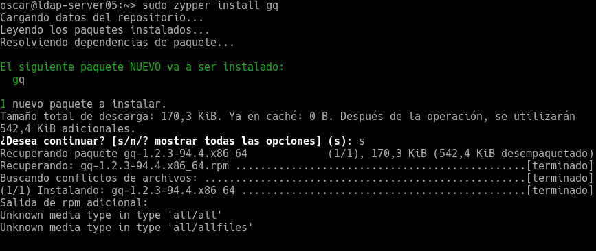
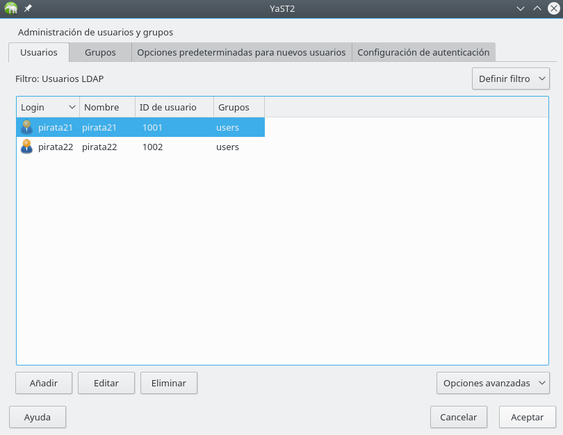
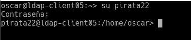

Óscar Moreira

# Servidor LDAP - OpenSUSE

___

# Práctica

Esta práctica consiste en crear un *servidor LDAP* en OpenSUSE con un cliente OpenSUSE.

Se crearán unos usuarios para LDAP y grupos con los que luego desde el cliente entraremos sin estar definidos en el cliente ya que están en el servidor LDAP.

___

# Máquinas

1. OpenSUSE servidor LDAP:

    - Nombre de equipo: `ldap-server05`
    - IP: `172.18.5.31`
    - DNS: `8.8.4.4`

2. OpenSUSE cliente:

    - Nombre de equipo: `ldap-client05`
    - IP: `172.18.5.32`
    - DNS: `8.8.4.4`

___
___

# Procedimiento práctica

# 1. Servidor LDAP

En esta práctica configuraremos LDAP con la herramienta *OpenLDAP*

## 1.1 Preparativos

Después de haber configurado la IP pasararemos a preparar el servidor.

En el archivo `/etc/hosts` añadiremos las siguientes lineas que veremos en la imágen, en las que añadiremos el host del servidor el del cliente y el de LDAP.

## 1.2 Instalación del Servidor LDAP

 Lo primero que haremos será instalar (`yast2-auth-server`).

> Esto servirá para gestionar la configuración del servidor LDAP en yast

  

El siguiente paso que haremos será configurar la autenticación:

- En Yast iremos a `Servidor de autenticación` o en inglés `authentication Server`.

  

- Dentro instalaremos los paquetes: `openldap2`, `krb5-server`, `krb5-client`.

  

- Seguimos y en los ajustes generales:

  - Iniciar servidor LDAP = `Si`
  - Registrar dameon SLP = `No`
  - Puerto abierto en el cortafuegos = `SI`

    

- Lo siguiente será el tipo de servidor `autónomo`.

  

- Configuración TLS = `No habilitar`

  

- Configuración básica de la base de datos

  - Tipo de BD = `hdb`
  - DN base = `dc=oscar05,dc=curso1718`
  - DN administrador = `cn=Administrator`
  - Añadir DN base = `SI`
  - Contraseña = `SI`
  - Directorio de BD = `/var/lib/ldap`
  - Usar esta base de datos... = `si`

    

- En Habilitación de Kerberos `NO` habilitaremos la autenticación.

  

- Terminamos y veremos el resultado final.

  

___

Comprobaciones:

- `slaptest -f /etc/openldap/slapd.conf`: comprobacón de sintaxis del fichero de configuración.

  

- `systemctl status slapd`: Comprobación del estado del servicio.

  

- `systemctl enable slapd`; Activar el servicio automaticamente cuando iniciemos.

  

- `nmap -Pn localhost | grep -P '389|636'`: Comprobación de que es accesible a la red.

  

- `slapcat`: Verificar que la base de datos esta bien.

  

- Instalar herramienta `gq` y usar  para comprobar el contenido de la base de datos LDAP.

  

- Comrpobaremos que tenemos las unidades : `groups` y `people`

  

___

## 1.4 Creación de usuarios y grupos LDAP

- Lo primero será ir a *Yast* -/- *Gestión de usuarios y grupos*

  

- Luego de esto iremos a `usuarios` y en `filtro` eligiremos `LDAP`.

  

  - Aquí dentro crearemos los usuarios: `pirata21` y `pirata22`.

    

- Creados los usurios pasaremos a los grupos y haremos el mismo procedimiento pero crearemos un grupo solo llamado `piratas2`.

  

- Ahora usaremos la herramienta `gq` para comprobar que los usuarios y el grupo están en la base de datos *LDAP*.

  

- Una vez comprobado que nos sale esa información en la herramienta `gq` pasaremos a lo siguiente.

- Ahora pasaremos a ejecutar el comando: `ldapsearch -x -L -u -t "(uid=nombre-del-usuario)"`

  > Este comando servirá para consultar en la base de datos LDAP la información del usuario con uid concreto.

  

___
___

# 2. Cliente LDAP

## 2.1 Preparativos

Configurada la maquina cliente con los primeros pasos de IP, nombre de equipo, etc... pasaremos a modificar el fichero `/etc/hosts` con las lineas que veremos en la siguiente imágen en a que pondremos el host del propio cliente y el del servidor LDAP.

  

### Comprobación

- `nmap -Pn ldap-serverXX | grep -P '389|636'`, Comprobaremos que el servidor LDAP es accesible desde el cliente.

  

- Luego con la herramienta `gq` en el cliente en: `file/preferences/`

  

- Luego iremos a `servers` y añadiremos uno nuevo y pondremos lo siguiente:

  - LDAP Host/URI = `ldap://ldap-server05`
  - Base DN = `dc=oscar05,dc=curso1718`

    

- Después de esto comprobaremos que tenemos la base de datos LDAP que creamos en el servidor con sus usuarios y grupo.

  

___

## 2.2 Instalar cliente LDAP.

- Instalaremos (`yast2-auth-client`), para configurar la autenticación.

  

- Luego iremos a: `Yast/LDAP y cliente Kerberos`

  

- Una vez dentro le daremos a `cambiar configuración`

  

- Dentro de la configuración deberáquedar de esta manera y darle a probar conexión.

  

___

## 2.3 Comprobación desde cliente.

- Ejecutaremos los siguientes comandos:

  ~~~
  getent passwd pirata21
  getent group piratas2
  id pirata21
  finger pirata21
  ~~~

    
  ~~~
   cat /etc/passwd | grep pirata21
   cat /etc/group | grep piratas2
  ~~~
    

  ~~~
  su pirata21
  su pirata22
  ~~~

      

    

___

## 2.4 autenticación

Reiniciaremos para poder entrar por interfaz al cliente a un usuario de LDAP.

Al reiniciar ha dado el error siguiente:

#### Solución :

1. Iniciaremos la máquina del cliente con `Knoppix Live`

2. En el fichero `/etc/nsswitch.conf` quitaremos la palabra ***ldap*** ya que se generó sola al hacer la configuración de LDAP por yast.

3.  passwd: files nis ldap shadow: files nis group: files nis ldap

4. Reiniciar MV cliente

5. Repetir configuración Yast.

___
___

Fín de la práctica.
