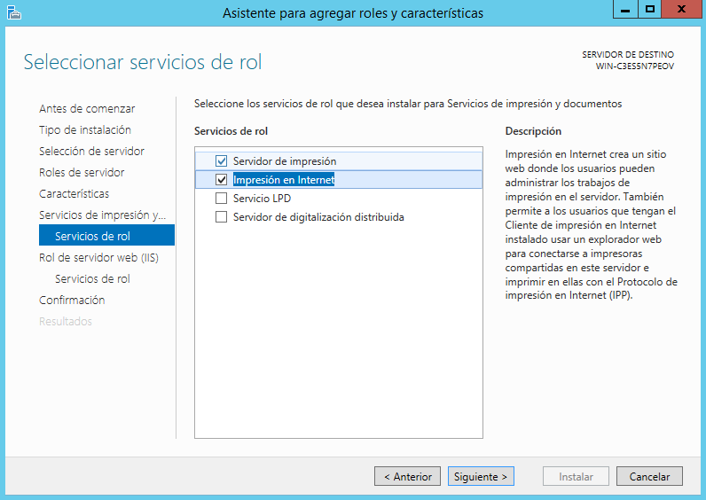
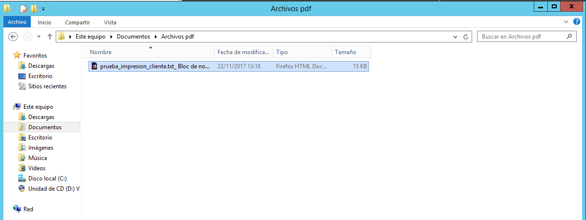

Óscar Moreira

# Servidores de impresión

___

# Práctica

Esta práctica consiste en crear un servidor de impresión en el que instalaremos un impresora en nuestro caso *PDFcreator* y desde un cliente poder usalar tanto por la red como por web habiendo puesto una ruta por defecto para guardar los pdf que imprimamos.
___

# Máquinas necesarias

1. Windows Server 2012 (servidor):

  - Esta máquina sera en la que instalaremos el rol de impresion y la impresora.

  - Especificaciones:

    - RAM: 2GB
    - Almacenamiento: 40GB
    - Red 1: adaptador puente
    - IP: 172.18.5.31

2. Windows 10 (cliente):

  - Esta máquina sera la que usemos para usar la impresora instalada en el servidor a través de web o por la red.

  - Especificaciones:

    - RAM: 2GB
    - Almacenamiento: 40GB
    - Red 1: adaptador puente
    - IP: 172.18.5.11

  ___
  ___

# Procemiento práctica

## 1. Windows server 2012

### 1.1 Rol de impresión

- Lo primero que haremos en el servidor sera agregar el rol de impresión. Para esto iremos a `Agregar características y roles` y seguiremos los siguientes pasos:

  - ***Tipo de instlación***: `Instalación basada en caraterísticas o en roles`
  - ***Servidor de destino***: `Èl único que hay en nuestro caso`
  - ***Roles de servidor***: activar `Servicios de impresión y documentos`

    

  - ***Características***: activar `Cliente de impresión en internet`

    

  - ***Servicios de rol***: activar `Impresión en internet`

    

  - ***Servicios de rol***: listado de servicios activos y siguiente.

    

  - ***Instalación***: `Instalar`

___

### 1.2 Instalación impresora

En nuestro caso instalaremos la impresora *PDFcreator*.

- Descargaremos el instalador de *PDFcreator* desde este [enlace](http://www.pdfforge.org/pdfcreator) y la instalamos.

  

- Una vez instalada entraremos en el programa de *PDFcreator* y configuraremos para elegir el autoguardado en el lugar que queramos.

- Para esto iremos dentro del programa a `perfiles` activaremos la pestaña `automático` y debajo en `Carpeta` eligiremos la ruta donde queremos que se guarden los archivos impresos.

  

___

### 1.3 Comprobación impresora en local

Para comprobar que funciona en local haremos lo siguiente:

- Crearemos un fichero de texto con algo dentro para que pueda imprimirlo.

  

- Luego le iremos a `archivo-->imprimir` y eligiremos la impresora.

  

- Veremos que cuando acabe tendremos el archivo pdf y lo podremos visualizar.

  

___

### 1.4 Compartir impresora por red

Para poder conectarnos por red desde un cliente a la impresora habrá hacer los siguientes pasos:

- Iremos a `Panel de control --> Hardware --> Dispositivos e impresoras`.

  

- Una vez aquí iremos a la impresora *PDFcreator* e iremos a `propiedades de impresora`

- Dentro de las propiedades de impresora iremos a `compartir` y activaremos `compartir esta impresora` y le pondremos en `nombre de recurso compartido` : PDFoscar05.

  

Ahora acabo esto iremos al cliente:
> Desde cliente

- En el cliente iremos a los recursos de red y veremos que nos saldrá nuestro servidor.

  

- También podremos concectarnos introduciendo la IP del servidor en el recurso de red.

  

- Si entramos nos pedirá usuario y contraseña.

  

- Ahora ya tendremos la impresora en el cliente y lo comprobaremos imprimiendo un documento.

  

- Luego de elegir la impresora e imprimir veremos que nos ha salido correctamente en el servidor.

  

___
___

# 2 Acceso a impresora desde Web

Para este apartado hay que tener seguro que hemos activado la característica `impresión de internet` cuando agregamos el rol al principio.

## Cliente Windows 10

### 2.1 Configuración impresión Web

- Lo primero que haremos será abrir un navegador en el cliente.

- Luego introduciremos la url: `http://"IPServidor"/printers`.

- Una vez pongamos la url veremos que nos pedirá usuario y contraseña del servidor.

  

- Dentro se nos abre un entorno para configurar las impresoras que tenemos en red.

  

- Ahora iremos a las propiedades de la impresora *PDFcreator* y veremos que la información se corresponde  a la que hemos configurado en el servidor.

  

- Ahora agregaremos la impresora al cliente.
- Para esto primero copiaremos la url de la impresora que encontramos en las propiedades.

  

- Abriremos la configuración de impresoras en Windows 10 sería en: `Configuración --> Impresoras y escáneres` y le daremos a `Agregar impresoras o escáner`.

  

- Esto al no encontrarlo nos saldrá una opción de `La impresora que desea no esta lista` y entraremos ahí para añadirla.

  

- Una vez dentro iremos a la opción `Seleccionar una impresora compartida por nombre` y pondremos la url que copiamos anteriormente de las propiedades de la impresora.

  

- Luego nos aparecerá una ventana en la que tendremos que poner el usuario y contraseña del servidor.

  

- Por último podremos ponerle un nombre a la impresora y acabaremos.

  

___

### 2.3 Comprobación de impresora desde navegador.

- Lo primero que haremos sera a través de navegador pausar todas las impresoras.

  

- Luego iremos a un documento de texto y lo imprimiremos y eligiremos la impresora de red que hemos configurado.

  

- Hecho esto si volvemos al navegador y actualizamos veremos que hay una impresión en cola debido a que esta en pausa la impresora.

  

- La reanudaremos y veremos que imprimirá el documento.

  

- Ahora si vamos al servidor a la carpeta por defecto que elegimos para las impresiones, encontraremos el documento que acabamos de imprimir.

  

- Y si lo abrimos veremos que esta correctamente.

  

___
___

Fín de la práctica
