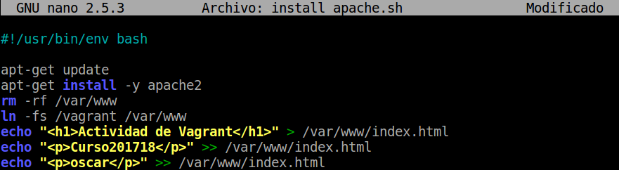
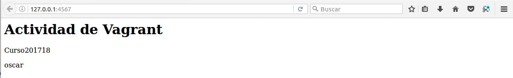
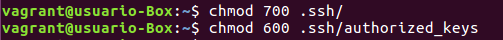

# Vagrant y VirtualBox

___

## ¿Qué es Vagrant?

Vagrant es una herramienta para la creación y configuración de entornos de desarrollo virtualizados.

Originalmente se desarrolló para VirtualBox y sistemas de configuración tales como *Chef*, *Salt* y *Puppet*. Sin embargo desde la versión 1.1 Vagrant es capaz de trabajar con múltiples proveedores, como *VMware*, *Amazon EC2*, *LXC*, *DigitalOcean*, etc.

Aunque Vagrant se ha desarrollado en Ruby se puede usar en multitud de proyectos escritos en otros lenguajes, tales como *PHP*, *Python*, *Java*, *C#* y *JavaScript*.
___
___

## 1. Práctica

Esta práctica consistirá en descargar y usar una imágen(caja o box) de un sistema operativo que se encuentre en [Vagrant](https://app.vagrantup.com/boxes/search?_ga=2.51619305.1549568112.1512469582-1037930573.1512469582).

Después de esto haremos lo contrario que será crear nuestro propio box.
___
___

## 2. Procedimiento

### 2.1 Instalación

- Lo primerro que debemos hacer es instalar vagrant:`apt-get install vagrant`

- Tendremos que verificar si las versiones son compatibles de *Vagrant* y *VirtualBox*.

- Verificamos la versión de *Vagrant*: `vagrant version`

  

- Ahora comprobaremos la versión de *VirtualBox*: `VBoxManage`

  

___

### 2.2 Proyecto

- Nuestro primer paso será crear un directorio para el proyecto de *Vagrant* que crearemos.
Ejecutaremos los siguientes comandos:

  ~~~
  mkdir mivagrant05     # Crear directorio
  cd mivagrant05        # Acceder al directorio creado
  vagrant init          # Inicializa el directorio como proeycto de Vagrant
  ~~~

  

___

### 2.3 Imagen,caja o box

- En este paso lo que haremos será obtener una imágen del sistema operativo `Ubuntu Precise de 32 bits`.

  ~~~
  vagrant box add micaja05_ubuntu_precise32 http://files.vagrantup.com/precise32.box
  ~~~

  

- Ahora verificamos que tenemos la caja con el comando: `vagrant box list`

  

- Ahora dentro de la carpeta de nuestro proyecto modificaremos el fichero ***Varantfile*** pero primero haremos una copia de seguridad.

  

  - Cambiamos la línea `config.vm.box = "base"` por `config.vm.box ="micaja05_ubuntu_precise32"`
  - Dejaremos el fichero de esta manera:

    

___

### 2.4 Iniciar nueva máquina

- Ahora dentro de la carpeta ***/mivagrant05*** ejecutaremos el comando: `vagrant up`

  

- Hecho esto nos conectaremos a la máquina con el comando: `vagrant ssh`

  

- Comandos útiles de *Vagrant*:

  ~~~

    vagrant suspend   # Suspender la máquina virtual. Tener en cuenta que la MV en modo suspendido consume más espacio en disco debido a que el estado de la máquina virtual que suele almacenarse en la RAM se pasa a disco.

    vagrant resume    # Volver a despertar la máquina virtual.

    vagrant halt      # Apagarla la máquina virtual.

    vagrant status    # Estado actual de la máquina virtual.

    vagrant destroy   # Para eliminar la máquina virtual (No los ficheros de configuración).

  ~~~

___
___

## 3. Configuración del entorno virtual

### 3.1 Sincronizar carpetas

- Identificamos las carpetas compartidas estando dentro de la máquina virtual:`ls /vagrant`

  > Esto nos mostrará que efectivamente el directorio /vagrant dentro del entorno virtual posee el mismo Vagrantfile que se encuentra en nuestro sistema anfitrión.

  

___

### 3.2 Redireccionamiento de los puertos

- Dentro de la máquina virtual instalaremos *apache2*: `apt-get install apache2`

  

- Ahora modificaremos el fichero ***Vagrantfile*** para que el puerto 4567 delanfitrión sea redireccionado al puerto 80 del entorno virtual.

  - Para esto añadir la siguiente línea:

    `config.vm.network :forwarded_port, host: 4567, guest: 80`

    

- Hecho esto como la máquina la tenemos iniciada haremos: `vagrant reload`

  

  

Una vez reiniciado verificaremos que esta hay un servicio escuchando elñ puerto 4567 de la siguiente manera:

> Desde la máquina real

- Ejecutaremos `nmap -p 4500-4600 localhost`y nos mostrará **4567/tcp open tram**

  

- También podemos hacer `nmap -p 4567 localhost` directamente buscar el puerto.

  

- Luego ejecutaremos el comando `netstat -ntap` con el resultado: `tcp 0.0.0.0:4567 0.0.0.0:* ESCUCHAR`

  

 Ahora comprobaremos que ha funcionado entrando en el navegador accediento a la dirección: `http://127.0.0.1:4567`

  

  ___
  ___

## 4. Ejemplos de configuración Vagrantfile

A continuación se muestran ejemplos de configuración Vagrantfile que NO ES NECESARIO hacer. Sólo es información.

> Enlace de interés Tutorial Vagrant. ¿Qué es y cómo usarlo?

Ejemplo para configurar la red:

~~~
config.vm.network "private_network", ip: "192.168.33.10"
~~~

Ejemplo para configurar las carpetas compartidas:

~~~
config.vm.synced_folder "htdocs", "/var/www/html"
~~~

Ejemplo para configurar la conexión SSH de vagrant a nuestra máquina virtual:

~~~
config.ssh.username = 'root'
config.ssh.password = 'vagrant'
config.ssh.insert_key = 'true'
~~~

Ejemplo para configurar la ejecución remota de aplicaciones gráficas instaladas en la máquina virtual, mediante SSH:

~~~
config.ssh.forward_agent = true
config.ssh.forward_x11 = true
~~~

___
___

## 5. Suministro

Los suministros se basa en ejecutar *scripts* durante el proceso de arranque del entorno para así instalarlas desde un principio.

- Para hacer esta parte primero apagaremos la máquina y luego la destruiremos.

  ~~~
  vagrant halt      # apagar la máquina
  vagrant destroy   # destruir máquina
  ~~~

  

### 5.1 Suninistro mediante sheel script

Lo que haremos será suministrar a la máquina con un script de Apache y así que se instale desde el momento que la creemos.

- Crearemos el script que se llame `install_apache.sh` que contendrá lo siguiente:

  ~~~
  #!/usr/bin/env bash

  apt-get update
  apt-get install -y apache2
  rm -rf /var/www
  ln -fs /vagrant /var/www
  echo "<h1>Actividad de Vagrant</h1>" > /var/www/index.html
  echo "
Curso201516
" >> /var/www/index.html
  echo "
Nombre-del-alumno
" >> /var/www/index.html
  ~~~

  

- Después de crearlo le daremos permisos de ejcución.

  ~~~
  chmod -x install_apache.sh
  ~~~

  

Hecho ya esto pasaremos a indicar a Vagrant que se tiene que ejecutar el script.

- Modificaremos el ***Vagrantfile*** y añadiremos una linea de configuración.

  ~~~
  config.vm.provision :shell, :path => "install_apache.sh"
  ~~~

  

- Ahora crearemos la máquina de nuevo.

  

- Creada la máquina de nuevo probraremos en el navegador a entrar en la url: `http://127.0.0.1:4567`

  

___

### 5.2 Suministro mediante Puppet

- Modificaremos el archivo ***Vagrantfile*** añadienlo la siguiente configuración.

  ~~~
  config.vm.provision "puppet" do |puppet|
    puppet.manifest_file = "default.pp"
  end
  ~~~
  - Que quede de esta manera:

    

- Ahora crearemos un fichero `manifests/default.pp` en el que le indicaremos las instrucciones para instalar *nmap*.

  ~~~
  package { 'nmap':
    ensure => 'present',
  }
  ~~~

  

  

Para que se apliquen los cambios de configuración, tenemos dos formas:

- Parar la MV, destruirla y crearla de nuevo (`vagrant halt, vagrant destroy y vagrant up`).
- Con la MV encendida recargar la configuración y volver a ejecutar la provisión (`vagrant reload, vagrant provision`)

  

  

___
___

## 6. Creando una caja personalizada

En este apartado haremos lo contrario a lo anterior, crearemos nuestra propia caja/box.

### 6.1 Preparación de la MV VirtualBox

- Lo primero que haremos será crear una máquina virtual en este caso ubuntu 16.04 de 64 bits

- Ahora dentro de la máquina instalaremos `openssh-server`

  

- Creamos un usuario llamado `vagrant` con el comando: `useradd -m vagrant` con una contraseña

- Luego entraremos en el usuario: `su - vagrant` y le agregaremos una clave pública para autirizar el acceso a vagrant sin necesidad e una clave.

  

  - crear `.ssh`.

  

  - Ejecutar el siguiente comando para la clave.

    ~~~
    wget https://raw.githubusercontent.com/mitchellh/vagrant/master/keys/vagrant.pub -O .ssh/authorized_keys
    ~~~

    

  - Ahora le daremospermisos a la carpeta .ssh y también al fichero authorized_keys.

    ~~~
    chmod 700 .ssh
    chmod 600 .ssh/authorized_keys
    ~~~

    

- La clave del usuario vagrant y el usuario root tiene que ser `vagrant`

- Ahora añadiremos `vagrant ALL=(ALL) NOPASSWD: ALL` a /etc/sudoers.

  > Hay que comprobar que no existe una linea indicando requiretty si existe la comentamos.

  

- Ahora verificaremos que tenemos instalado las VirtualBox Guest Additions con la versión compatible con el anfitrión.

  

___

## 6.2 Crear la caja Vagrant.

Ahora pasaremos a crear el box.

- Crearemos una carpeta llamada `mivagrant05conmicaja` para el nuevo proyecto.

- Entraremos en esta carpeta creada y ejecutaremos `vagrant init`

  

- Ahora localizaremos el nombre de nuestra máquina creada: `VBoxManage list vms`

  

- A continuación crearemos la caja llamada `package.box`

  

- Comprobamos que se ha creado la caja.

  

  

- Ahora mostramos la lista de cajas que tenemos y veremos que solo tenemos una.

  

- Nos sale solo una porque tenemos que añadir la que hems creado.

  

- Ahora veremos que ya nos sale la nueva caja.

  

- Por ultimo levantaremos la máquina y la probaremos.

  

  

___
___

Fín de la práctica
