imagen Óscar Moreira

___

# ¿Qué es *Docker*?

Docker es un proyecto de código abierto que automatiza el despliegue de aplicaciones dentro de contenedores de software, proporcionando una capa adicional de abstracción y automatización de Virtualización a nivel de sistema operativo en Linux.

Docker utiliza características de aislamiento de recursos del kernel Linux, tales como cgroups y espacios de nombres (namespaces) para permitir que "contenedores" independientes se ejecuten dentro de una sola instancia de Linux, evitando la sobrecarga de iniciar y mantener máquinas virtuales.

___

# 1. Práctica

Esta práctica consistirá en crear y eliminar conteneores *Docker*, imagenes, instalaciones dentro de contenedor *Docker*.

También trabajaremos con el fichero *Dockerfile* para crear contenedores.

Por última exportaremos alguna de las imágenes que tengamos a otro servidor que también tenga instalado docker y a su vez también importar una imagen a nuestro servidor.

___

#  2. Máquina necesaria

Para esta práctica usaremos el sistema operativo *OpenSUSE Leap*.

  - Versión de kernel necesaria 3.10 o superior.

    - Comando de comprobación versión kernel: `uname -a`

      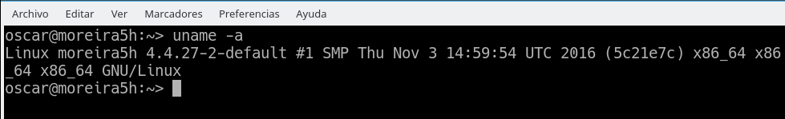

___

# 3. Instalación y primeras pruebas

- Como superusuario:

  - Lo primero será instalar *Docker* : `zypper in docker`

    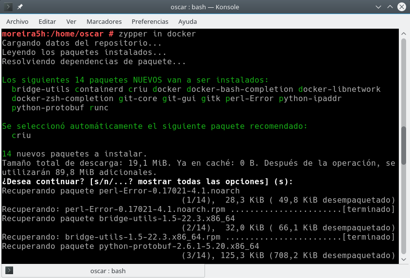

  - Una vez instalado iniciaremos el servicio: `systemctl start docker`

  - Verificamos que esta en ejecución con : `systemctl status docker`

    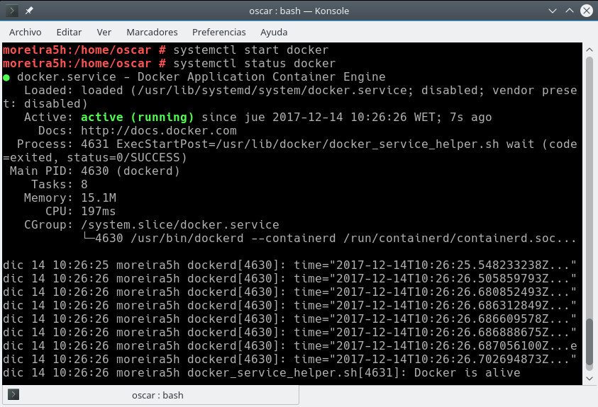

  - Ahora miraremos la version con : `docker version`

    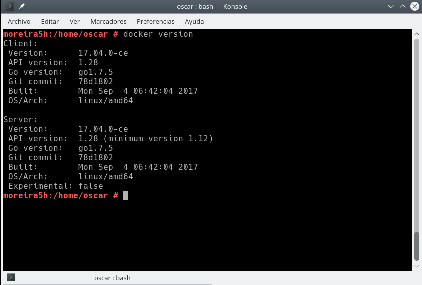

  - Por último meteremos al usuario ***oscar*** dentro del grupo *docker*: `usermod -a -G docker username`

    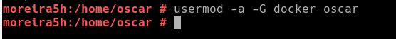

- Ahora para que nos detecte el cambio de añadirnos al grupo *docker* cerraremos sesión y volvermos a entrar.

- Hecho esto ya podremos comprobar que funciona bien *Docker* con los siguientes comandos:

  ~~~
  docker images       # Muestra las imágenes descargadas hasta ahora
  docker ps -a        # Muestra todos los contenedores creados
  ~~~

  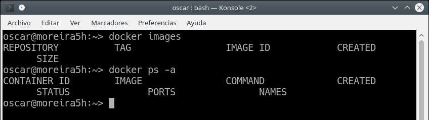

  ~~~
  docker run hello-world  # Descarga y ejecuta un contenedor con la imagen hello-world
                          # Sólo se muestra unos mensajes en pantalla
  ~~~

  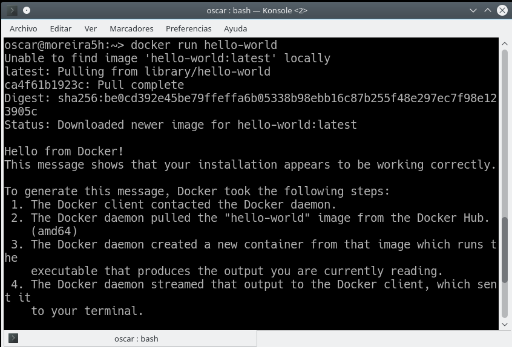

  ~~~
  docker images
  docker ps -a            # El contenedor está estado 'Exited'
  ~~~

  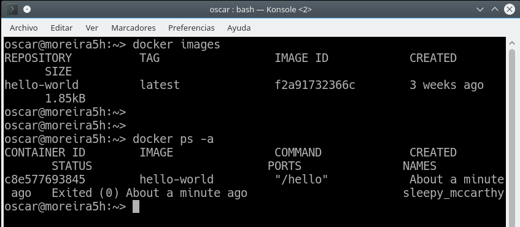

___
___

# 4. Configuración de red

Para que nuestro contenedor tenga acceso a internet a la red externa deberemos Habilitar el acceso a la red externa a los contenedores.

- OpenSUSE leap: `Yast` -> `Ajusted de red `-> `Encaminamiento` -> `Habilitar reenvío IPv4`

  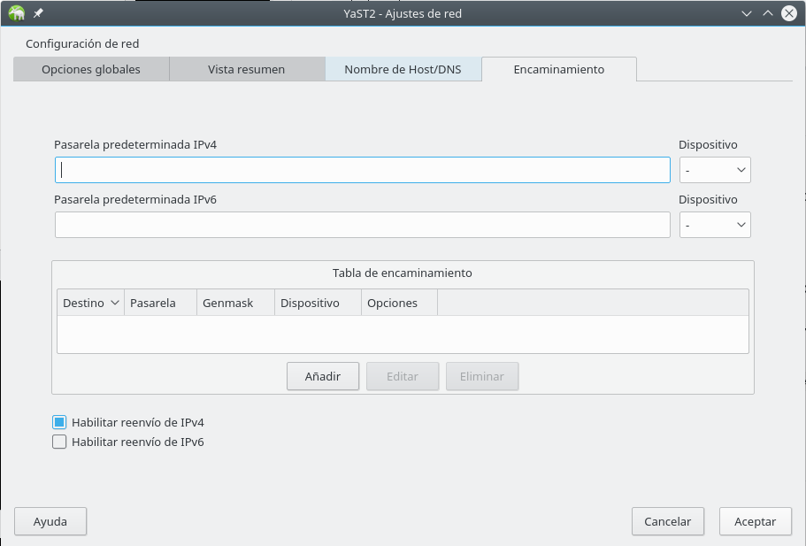

- Hecho esto reiniciaremos el equipo para que surjan efecto los cambios.

___
___

# Ejemplos de comandos

Información sobre otros comandos útiles:

  ~~~
    docker stop CONTAINERID o nombre      # parar un contenedor que estaba iniciado.
    docker start CONTAINERID o nombre     # inicia un contenedor que estaba parado.
    docker attach CONTAINERID o nombre    # conecta el terminal actual con el interior de contenedor.
    docker ps                             # muestra los contenedores en ejecución.
    docker ps -a,                         # muestra todos los contenedores en ejecución o no.
    docker rm CONTAINERID o nombre        # eliminar un contenedor.
    docker rmi IMAGENAME                  # eliminar una imagen.

  ~~~
___
___

# 5. Creación manual

En este apartado pasaremos a crear una contenedor *Debian8* e instalarle *Nginx*

## 5.1 Crear imagen manualmente

- Antes de descargar la imagen ejecutaremos los siguientes comandos:

  - `docker images`

    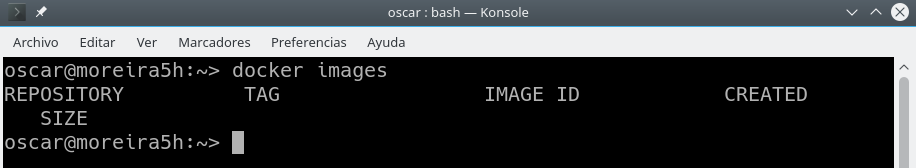

  - `docker search debian`

    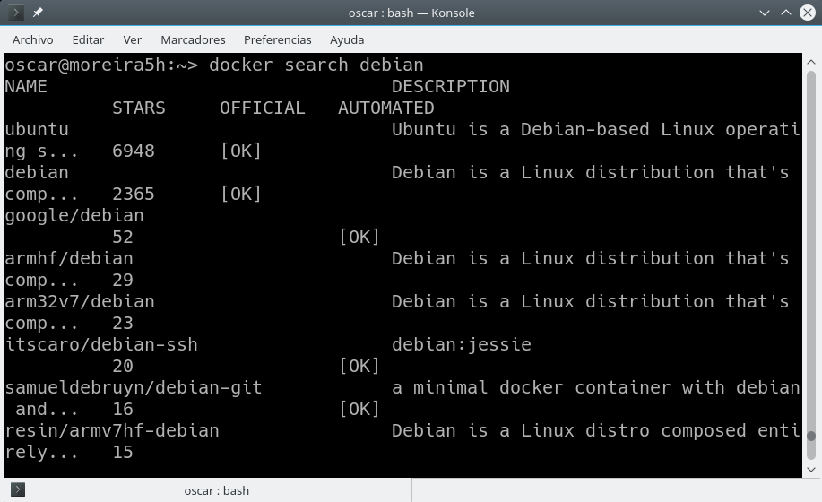

  - `docker pull debian:8`

    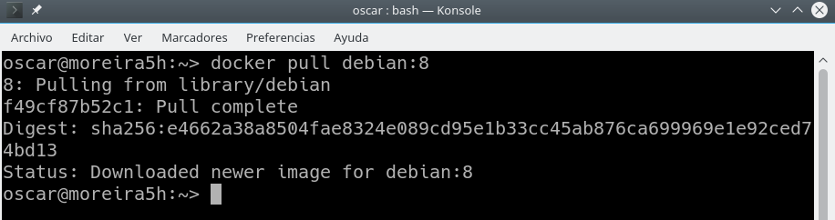

  - Comprobación:

    ~~~
    docker images
    docker ps -a
    docker ps
    ~~~

    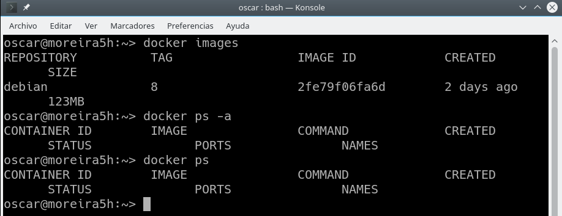

- Ahora crearemos el contenedor con el nombre `con_debian` a partir de la imagen `debian:8` descargada antes y ejecutaremos `/bin/bash`.

> /bin/bash de esta manera tendra terminal a la que podremos acceder.

  - Crear el contenedor:

    ~~~
    `docker run --name=con_debian -i -t debian:8 /bin/bash`
    ~~~

    > Cuando lo ejecutemos entraremos directamente en la terminal del contenedor con_debian como usuario root.

    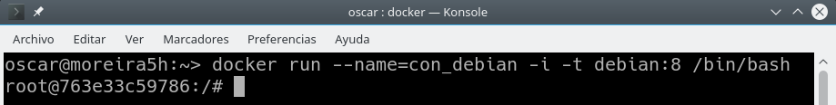

  - `cat /et/motd` : comprobar que estamos en *Debian*

    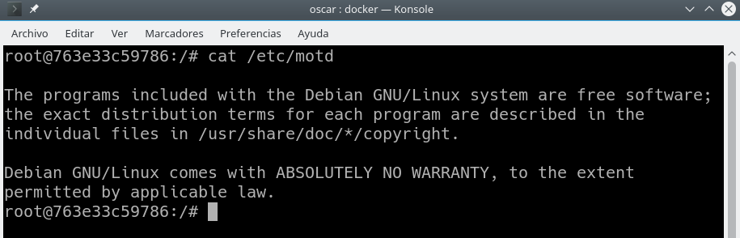

  - `apt-get update`

    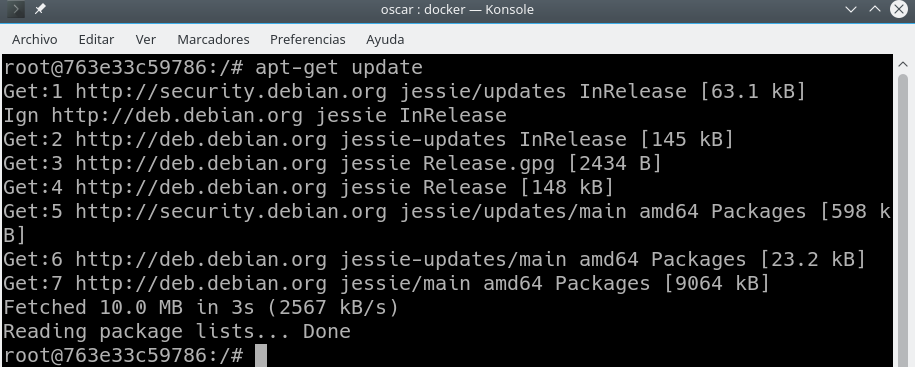

  - `apt-get install -y nginx`

    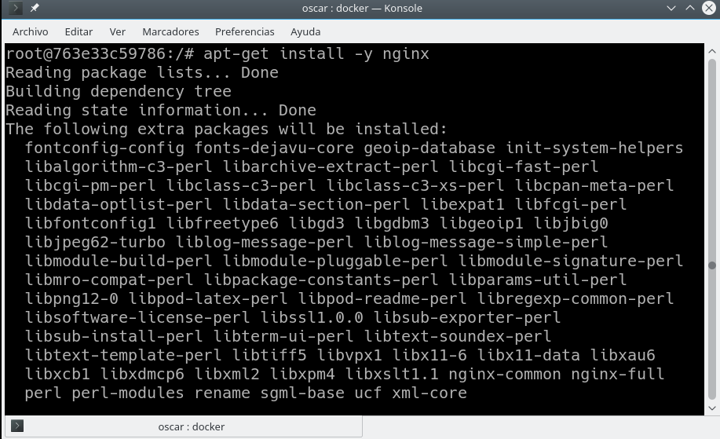

  - `apt-get install -y nano`

  - `/usr/sbin/nginx ` : Iniciamos el servicio nginx
  - `ps -ef` : comprobación

    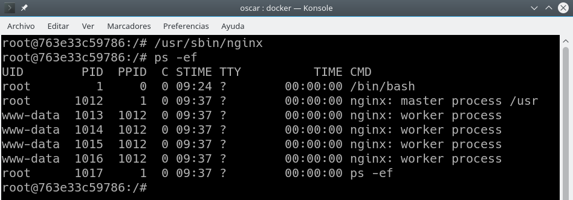

- Ahora crearemos un fichero html llamado `holamundo.html`

  ~~~
  echo "
Hola Oscar
" > /var/www/html/holamundo.html
  ~~~

  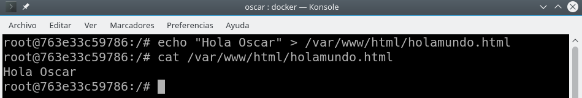

- Crearemos un script `/root/server.sh` que consistirá en dejar el servicio *Nginx* ejecutado y que no se cierre el contenedor.

  ~~~
  #!/bin/bash

  echo "Booting Nginx!"
  /usr/sbin/nginx &

  echo "Waiting..."
  while(true) do
    sleep 60
  done
  ~~~

  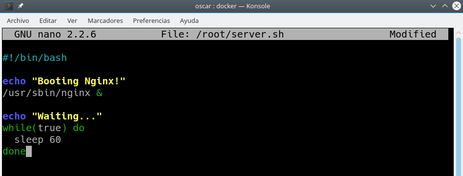

- Le daremos permisos de ejecución: `chmod +x /root/server.sh`

- Ahora pasaremos a crear una imagen de nuestro contenedor con `Nginx` y `nano` instalado en él.

  ~~~
  docker commit  con_debian oscar/nginx
  docker images
  ~~~

  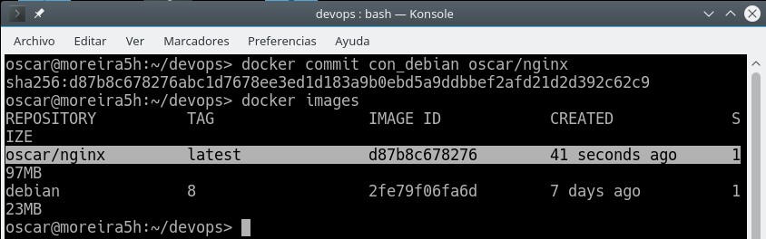

  > Los estándares de Docker estipulan que los nombres de las imagenes deben seguir el formato nombreusuario/nombreimagen. Todo cambio que se haga en la imagen y no se le haga commit se perderá en cuanto se cierre el contenedo

- Ahora por último ejecutaremos los siguientes comandos.

  ~~~
  docker ps
  docker stop con_debian    # Paramos el contenedor
  docker ps
  docker ps -a              # Vemos el contenedor parado
  docker rm IDcontenedor    # Eliminamos el contenedor
  docker ps -a
  ~~~

  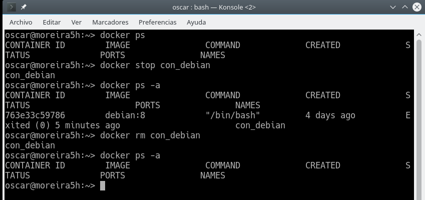

___

## 5.2 Crear contenedor Nginx

Usaremos ahora la imagen que acabamos de crear con *Nginx* instalado.

- Haremos lo siguiente para iniciar el contenedor

  ~~~
  docker ps
  docker ps -a
  docker run --name=con_nginx -p 80 -t dvarrui/nginx /root/server.sh
  ~~~

  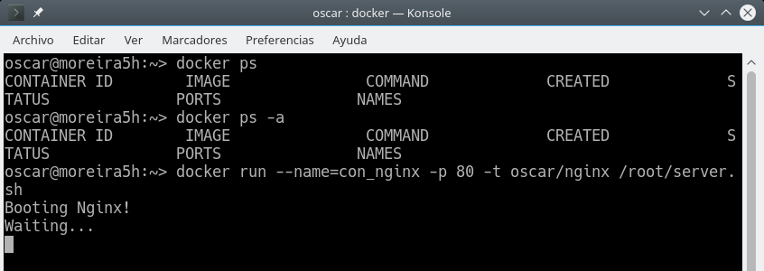

  > El argumento -p 80 le indica a Docker que debe mapear el puerto especificado del contenedor, en nuestro caso el puerto 80 es el puerto por defecto sobre el cual se levanta Nginx.

  > El script server.shnos sirve para iniciar el servicio y permanecer en espera. Lo podemos hacer también con el prgorama Supervisor.

- Ahora abriremos una terminal nueva y ejecutaremos el comando: `docker ps`

  >  Mostrará eñ contenedor en ejecución. La última columna nos indica que el puerto 80 del contenedor está redireccionado a un puerto local 0.0.0.0.:32768->80/tcp

  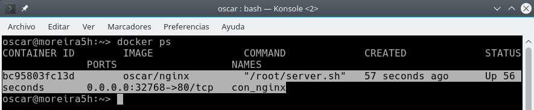

- Si ahora vamos al navegador y ponemos la direccion `0.0.0.0.:32768` o `localhost:32768` veremos que conectamos con el servidor *Nginx*

  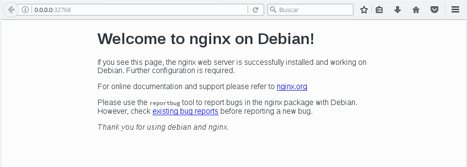

  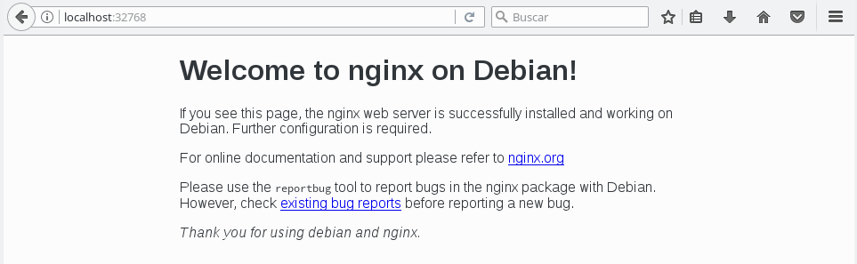

- Para acabar este apartado pararemos el contenedor y lo eliminaremos.

  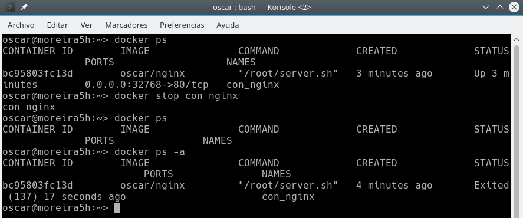

  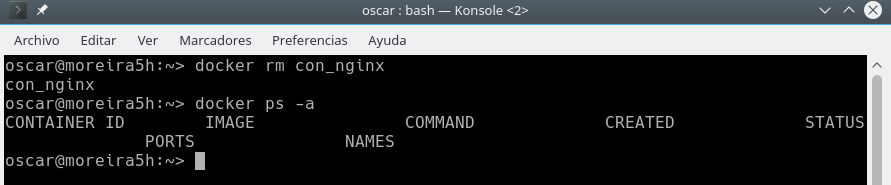

- Aunque lo eliminemos seguiremos teniendo la imagen del contenedor.

  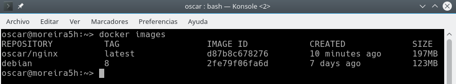

___
___

# 6. Crear contenedor con Dockerfile

## 6.1 Comprobaciones

~~~
docker images
docker ps
docker ps -a  
~~~

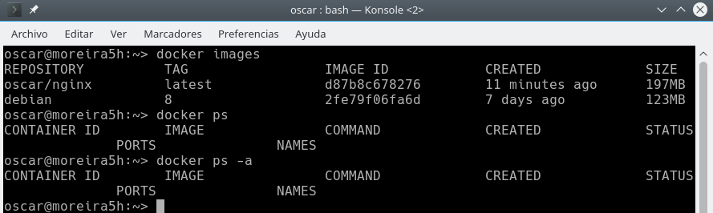

___

## 6.2 Preparar ficheros

- Creamos un directorio `home/oscar/docker05` y dentro los ficheros: `Dockerfile`, `holamundo.html` y `server.sh`

  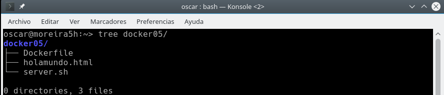

  - `Docerfile`:

    ~~~
    FROM debian:8

    MAINTAINER oscar 1.0

    RUN apt-get update
    RUN apt-get install -y apt-utils
    RUN apt-get install -y nginx
    RUN apt-get install -y nano

    COPY holamundo.html /var/www/html
    RUN chmod 666 /var/www/html/holamundo.html

    COPY server.sh /root
    RUN chmod +x /root/server.sh

    EXPOSE 80

    CMD ["/root/server.sh"]
    ~~~

    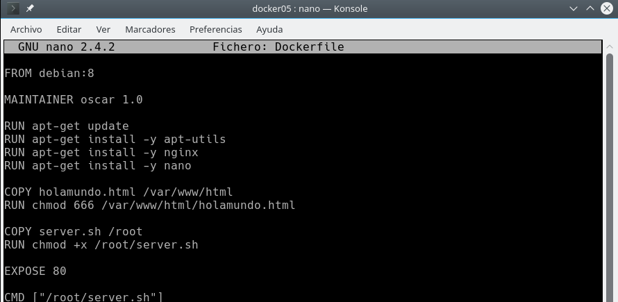
  - `Holamundo.html`: Este será el mismo que creamos la primera vez
  - `server.sh` : Este será el mismo que vimos en el apartado anterior.

  > Estos dos últimos ficheros tienen que estar en la misma carpeta que el Dockerfile.

___

## 6.3 Crear imagen desde Dockerfile

- Lo primero sera ir al directorio donde tenemos el *Dockerfile*.

- Luego ejecutaremos los siguientes comandos:

  ~~~
  docker images                   # Consultar las imágenes que tenemos
  docker build -t oscar/nginx2    # Construimos la imagen
  ~~~

  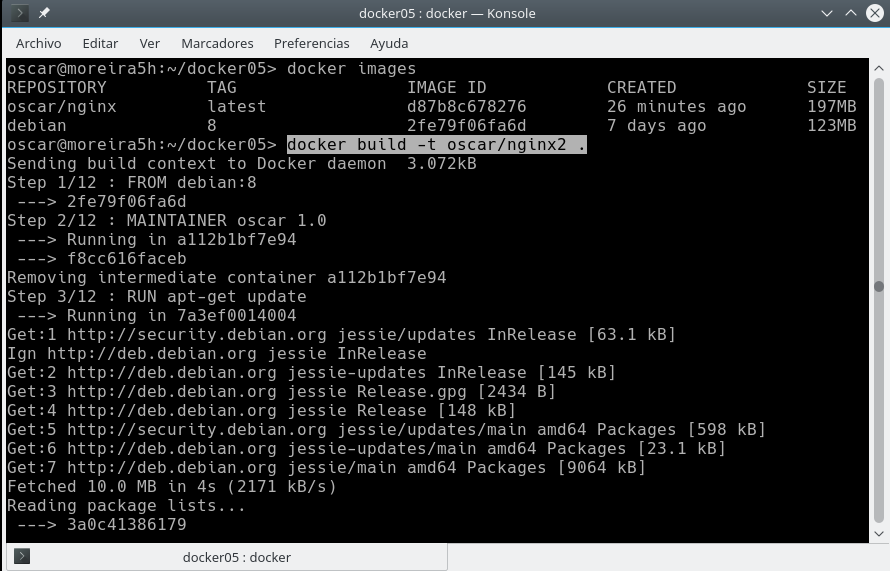

- Para comprobar que todo esta correcto haremos `docker images` y verificamos que esta la imagen que acabamos de crear.

  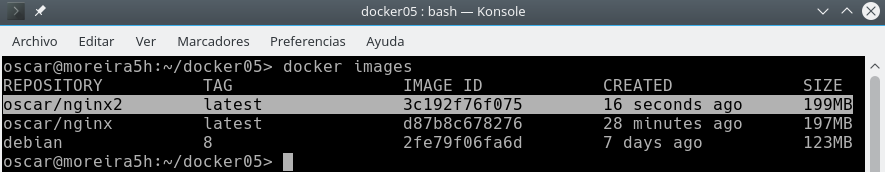

___

## 6.4 Crear contenedor y comprobar

- Ahora pasamos a crear un contenedor que vamos a llamar `con_nginx2` a partir de la `imagen/nginx2` que acabamos de crear con el *Dockerfile* y también le diremos que tiene que ejecutar el script `server.sh`

  ~~~
  docker run --name=con_nginx2 -p 80 -t oscar/nginx2 /root/server.sh
  ~~~

  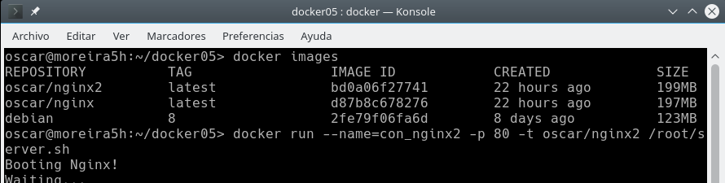

- Hecho esto haremos `docker ps` desde otra terminal para saber el puerto por el que escuchar el servidor *Nginx*.

  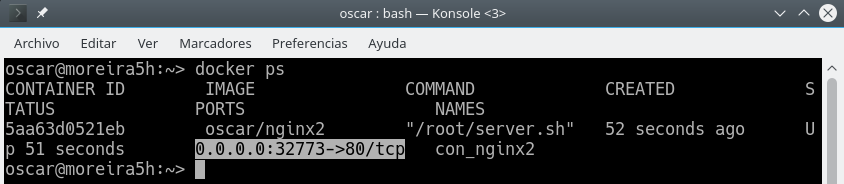

- Ahora entraremos al navegador en el enlace `localhost:32773`

  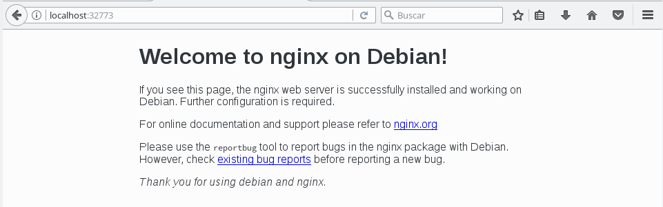

- Por último entraremos en `localhost:32773/holamundo.html`

  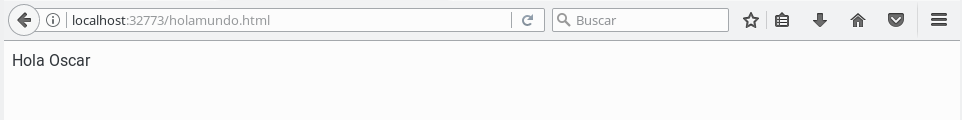

___
___

# 7. Migrar las imágenes de Docker a otro servidor

Creamos la imagen del contenedor:

- Verificamos que no tengamos ningun contenedor en ejecución. `docker ps`

  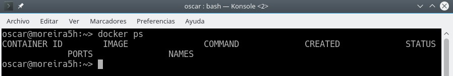

- Crear la imagen que vamos a exportar del contenedor `con_nginx2`.

  ~~~
  docker commit -p CONTAINERID o nombre container05-backup
  docker images         # comprobar que se creo la imagen
  ~~~
  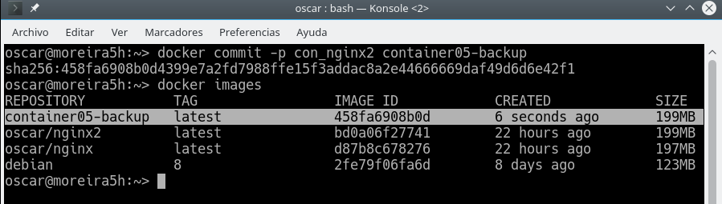

Exportamos imagen docker a fichero:

  - Ejecutamos el siguiente comando :

    > Guardamos la imagen en un tar

    ~~~
    docker save -o ~/container05-backup.tar container05-backup
    ~~~

    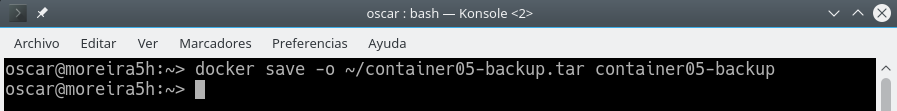

  - Verificamos que se guardo:

    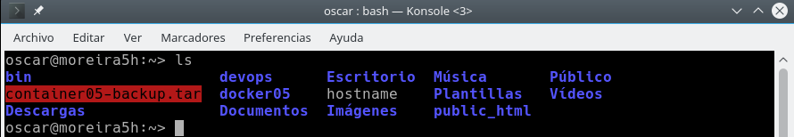

___

Importar imagen desde fichero:

> En este caso se usa la imagen de Carlos Javier Oliva.

- Tener la imagen en nuestro servidor.
- Luego haremos `docker load -i ~/container06-backup.tar` y para comprobarlo `docker images`

  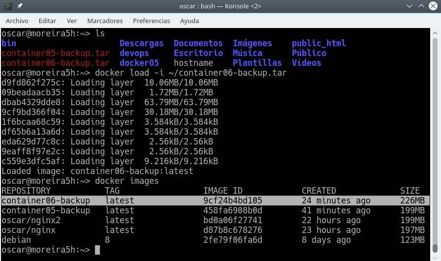

Vemos que la imagen se ha creado perfectamente.

___

# 8. Limpiar

Cuando acabamos de usar los contenedores siempre se suelen apagar y destruir

~~~
docker ps     # Verificar que no hay ningun contenedor en ejecución
docker ps -a  # Verificamos los contenedores que tenemos.
~~~

  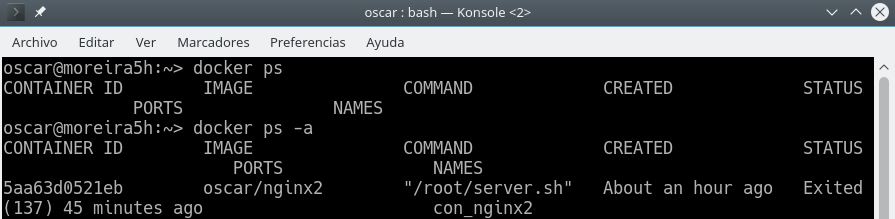

~~~
docker rm con_nginx2    #Eliminamos el contenedor
docker ps
docker ps -a          # Verificamos que no queda nada
~~~

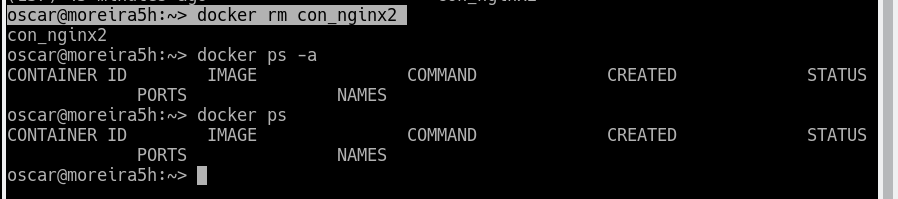
___
___

Fín de la práctica
