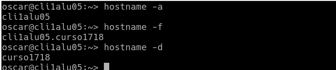
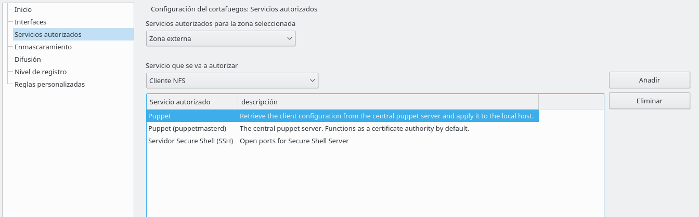
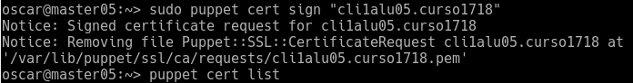
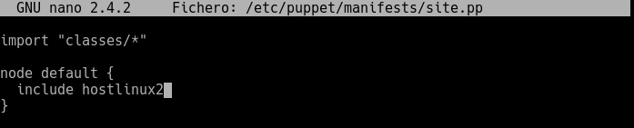

# Puppet

___

# 1. Configuración

## 1.1 Máquinas virtuales

En esta práctica usaremos 3 maquinas virtuales con la siguiente configuración:

- MV1 - Master: este será quien de las ordenes a los clientes:

  - SO: OpenSUSE
  - IP: 172.18.5.100
  - Nombre equipo: master05
  - Dominio: curso1718

- MV2 - Master: este recibirá ordenes del master:

  - SO: OpenSUSE
  - IP: 172.18.5.101
  - Nombre equipo: cli1alu05
  - Dominio: curso1718

- MV3 - Master: este recibirá ordenes del master:

  - SO: Windows 10
  - IP: 172.18.5.102
  - Nombre equipo: cli2alu05

## 1.2 configuración `/etc/hosts`

En este apartado lo que haremos será configurar el fichero  `/etc/hosts` de modo que tenga el resto de los hosts para así poder obetener la resolución de nombres de todas nuestras máquinas.

- MV1 - Master OpenSUSE:

  

- MV2 - Cliente OpenSUSE:

  -

- MV3 - Cliente W10:

  

  

## 1.3 Comprobación de las configuraciones.

- Linux:

  ~~~
  date
  ip a
  route -n
  host www.google.es
  hostname -a
  hostname -f               # Comprobar que devuelve el valor correcto!!!
  hostname -d               # Comprobar que devuelve el valor correcto!!!
  tail -n 5 /etc/hosts
  ping master05
  ping master05.curso1718
  ping cli1alu05
  ping cli1alu05.curso1718
  ping cli2alu05
  ~~~
  - Master

    

  - Cliente

    

- Windows:

  ~~~
  date
  ipconfig
  route PRINT
  nslookup www.google.es
  ping master05
  ping master05.curso1718
  ping cli1alu05
  ping cli1alu05.curso1718
  ping cli2alu05
  ~~~

___

# 2. Instalación y configuración del servidor

> En el master

- Instalamos Puppet Master en el servidor: sudo zypper install rubygem-puppet-master

  

- Ahora ejecutaremos los siguientes comandos:

  - sudo systemctl enable puppetmaster: `se iniciará automáticamente`
  - sudo systemctl start puppetmaster: `iniciamos el servicio`
  - sudo systemctl status puppetmaster: `verificamos que esta corriendo el servicio`

    

- Habiendo hecho esto se nos crea el directorio `/etc/puppet/manifests`

  

- Ahora crearemos los siguientes ficheros:

  ~~~
  mkdir /etc/puppet/files
  touch /etc/puppet/files/readme.txt
  mkdir /etc/puppet/manifests
  touch /etc/puppet/manifests/site.pp
  mkdir /etc/puppet/manifests/classes
  touch /etc/puppet/manifests/classes/hostlinux1.pp

  ~~~

  

## 2.1 Site.pp

- Editaremos el ficero `/etc/puppet/manifests/site.pp` poniendo el siguiente contenido:

  ~~~
  import "classes/*"

  node default {
    include hostlinux1
  }
  ~~~

       

## 2.2. Hostlinux1.pp

- En este fichero le añadiremos el siguiente contenido:

  ~~~
  class hostlinux1 {
    package { "tree": ensure => installed }
    package { "traceroute": ensure => installed }
    package { "geany": ensure => installed }
  }
  ~~~

  

- Verificamos que los directorios y ficheros están bien:

  

- Comprobamos que el directorio `/var/lib/puppet` tiene usuario/grupo propietario `puppet`

  

- Reiniciamos el servicio y luego verificamos que esta corriendo bien:

  

  

- Para consultar los errores: `tail /var/log/puppet/*.log`

  - En nuestro caso no sale nada porque no tenemos ningún error.

- Abrimos el cortafuegos:

  

___

# 3. Instalación y configuración cliente1

> Desde cliente1 OpenSUSE.

- Instalamos el Agente Puppet: `sudo zypper install rubygem-puppet`

  

- El cliente debe saber quien es su master asi que modificaremos el fichero `/etc/puppet/puppet.conf` añadiendole dos lineas más.

  

## 3.1 Comprobaciones

- Verificamos que el directorio `/var/lib/puppet` tiene usuario y grupo propietario `puppet`.

  

- Para que el servicio de puppet se active automáticamente haremos: `systemctl enable puppet`

- Iniciamos con `systemctl start puppet`

- Verificamos que esta corriendo: `systemctl status puppet`

  

- Para mostrar los servicios conectados a cada puerto: `netstat -ntap |grep ruby`

  

- Abriremos el cortafueros para el servicio `puppet`

___

# 4. Certificados

Para que el master y el cliente se puedan comunicar y recibir órdenes el uno del otro habrá que intercambiarse los certificados.

## 4.1 Aceptar certificado.

> Desde el master05

- Como usuario root.

- Miramos si hay peticiones pendientes

  

- Aceptamos al nuevo cliente

  

  

## 4.2 Comprobación

> Desde el cliente1

- Reiniciamos la máquina y servicio puppetmaster

- Como usuario root siguientes comandos:

  

  

- Comprobamos si tenemos errores.

> Veremos que no tenemos el fichero debido a que no hay errores.

  

- Para comprobar que ha funcionado iniciamos el programa `geany` que es el que le hemos dado la orden de que instale.

  
___

# 5. Hostlinux2.pp
> Desde el master

Esta será una configuración mas compleja que la anterior.

- Editaremos el fichero `/etc/puppet/manifests/classes/hostlinux2.pp` con el siguiente contenido:

  
  ~~~
  class hostlinux2 {
    package { "tree": ensure => installed }
    package { "traceroute": ensure => installed }
    package { "geany": ensure => installed }

    group { "piratas": ensure => "present", }
    group { "admin": ensure => "present", }

    user { 'barbaroja':
      home => '/home/barbaroja',
      shell => '/bin/bash',
      password => 'poner-una-clave-encriptada',
      groups => ['piratas','admin','root']
    }

    file { "/home/barbaroja":
      ensure => "directory",
      owner => "barbaroja",
      group => "piratas",
      mode => 750
    }

    file { "/home/barbaroja/share":
      ensure => "directory",
      owner => "barbaroja",
      group => "piratas",
      mode => 750
    }

    file { "/home/barbaroja/share/private":
      ensure => "directory",
      owner => "barbaroja",
      group => "piratas",
      mode => 700
    }

    file { "/home/barbaroja/share/public":
      ensure => "directory",
      owner => "barbaroja",
      group => "piratas",
      mode => 755
    }
  }
  ~~~

- Luego modificaremos el fichero `site.pp`:

  ~~~
  import "classes/*"

  node default {
    include hostlinux2
  }
  ~~~

  

- Ahora ejecutaremos el comando `tree` para ver que tenemos todos los ficheros bien.

  

- Reiniciamos el servicio y continuamos con el cliente1.

- Ahora comprobamos que se ha aplicado todo.

  - Carpetas:
  
    

  - Grupos:

    

    

  - Permisos:

    

# 6. Configuración Puppet en Windows

> Tener las máquinas clientes con la misma hora que en el master.

## 6.1 HostWindows3.pp

> Desde el master

- Crearemos y editaremos el fichero: `/etc/puppet/manifests/classes/hostWindows3.pp`

  ~~~
  class hostWindows3 {
    file {'C:\warning.txt':
      ensure => 'present',
      content => "Hola Mundo Puppet!",
    }
  }
  ~~~

  

- Ahora modificaremos el fichero `site.pp` para que pueda trabajar también con clientes Windows.

  ~~~
  import "classes/*"

  node 'cli1alu05.curso1718' {
    include hostlinux2
  }

  node 'cli2alu05' {
    include hostWindows3
  }
  ~~~

  

- `tree` para verificar los cambios y que tenemos bien los ficheros.

  

- Reiniciamos el servicio `puppetmaster`

- Con el comando `facter` veremos la versión de puppet que tenemos.

  

## 6.2 Instalar cliente Puppet en Windows

> En el cliente Windows

- Descargamos la misma versión de Puppet que en el master.

  

- Comenzamos la instalación de la siguiente manera.

  

  

  

  

  

- Modificamos el fichero `puppet.conf` del cliente windows.

  

- Despues de esto volveremos a aceptar certificados.

  

## 6.3 Comprobar cambios.

- Iniciamos la consola puppet como administrador y ejecutamos lo siguiente.

> Aunque salgan errores veremos que todo funciona.

  - `puppet agent --configprint server`

  - `puppet agent --server master05.curso1718 --test`

      

  - `facter`

      

  - `puppet resource user oscar`
  - `puppet resource file c:\Users`

    

- Veremos que tenemos el fichero Warning.txt

  
___

# 7. Hostwindows4.pp

- Creamos y editamos el fichero `/etc/puppet/manifests/classes/hostwindows4.pp`.

   ~~~
   class hostwindows4 {
   user { 'soldado1':
     ensure => 'present',
     groups => ['Administradores'],
    }

   user { 'aldeano1':
     ensure => 'present',
     groups => ['Usuarios'],
      }
    }
   ~~~

  

- Luego de esto editaremos el fichero `site.pp`

  

- Ahora en el cliente ejecutaremos el programa `run agent puppet` para aplicarlos cambios.

  

- Vemos quenos ha creado lo que le hemos ordenado.

  

___

# 8. Hostalumno5.pp

- Creamos y editamos el fichero : `/etc/puppet/manifests/classes/hostalumno5.pp`.

  

- Editamos el fichero `site.pp`.

  

- Ejetuamos el programa `run agent puppet`

  

- Veremos que se han creado los usuarios y grupos

  

___

# 9. Para probar: Fichero readme.txt

Los ficheros que se guardan en `/etc/puppet/files` se pueden descargar desde el resto de máquinas cliente puppet.

-  Contenido para readme.txt: "¡Al abordaje!".
- Ejemplo de configuración puppet para descargar fichero:

~~~
file {  '/opt/readme.txt' :
       source => 'puppet:///files/readme.txt',
}
~~~

> Este apartado no lo he conseguido hacer.

___
___

Fín de la práctica
