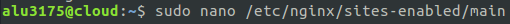

Óscar Moreira Estévez

# Mis series favoritas

Enlace a mi página de [My favourite series](http://alu3175.me/series)
## 1. Práctica

- Esta práctica consiste en crear una página web en la que nos enseñe 5 series favoritas y nos diriga a su enlace en la página [IMDB series](http://www.imdb.com/?ref_=nv_home).

- El enlace a la página debe ser  http://aluXXXX.me/series/ siendo x el respectivo número de cada alumno.
- En mi caso este enlace debería ser http://alu3175.me/series

## 2. Procedimiento

En nuestro caso ya tenemos crearemos un fichero llamado `main` en la ruta `/etc/nginx/sites-enabled/`  enlazado a `/etc/nginx/sites-available/`, esto lo hacemos con el comando `ln -s ../sites-available/main` desde la ruta `/etc/nginx/sites-enabled`.

  

Con esto se nos creare un enlace simbólico en `sites-enabled`

  - Sites-available:

    

  - Sites-enabled (simbólicos):

    

### 2.1 Creación server

- Lo primero que haremos sera abrir nuestro fichero `main` con un editor como `nano` o también podria ser `vi`.

  

- Con este comando al abrir el fichero se nos abrira así:

  

- Una ve aquí  tendremos que crear un server que nosotros lo llamaremos `alu3175.me` con el *root* `/home/alu3175`

- EL siguiente paso sera el *location* que lo llamaremos `/series` esta sera nuestra carpeta que contendra el index.html con sus imágenes.

- Quedará algo así:

  

- Con esto ya tenemos creado el server, el siguiente paso será hacer un *reload* del servicio *NGINX*. Esto se hará usando el comando `sudo systemctl reload nginx` .

### 2.2 Creación Series

- Nuestro siguiente paso será crear la carpeta *series* con todo lo necesario (index e imágenes) para crear nuestra web.

- Una forma mas sencilla para no estar trabajando directamente sobre el servidor y hacer tantas modificaciones es hacer nuestra carpeta con su index en nuestro PC con un editor html, [Brackets](http://brackets.io/) en mi caso para hacer todas las pruebas necesarias hasta tener la web completa y así ya despues subir la carpeta entera a nuestro servidor.

- Para esto cuando tengamos la carpeta con todo usamos el comando `scp -r /home/oscar/Documentos/series/ alu3175@alu3175.me:/home/alu3175`.

  - Con este comando le estamos diciendo por remoto que envia nuestra carpeta sereies al servidor a la ruta `/home/alu3175` .

    

    

  - Con esto nos evitamos estar modificando directamente en el servidor y que sea visible para la gente sin estar terminado nuestra web.

Así estará finalizada la práctica y tendremos nuestra web preparada http://alu3175.me/series
