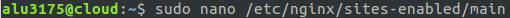
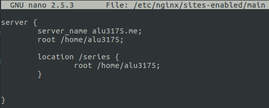
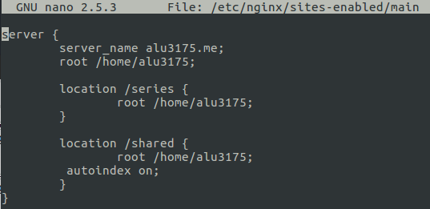
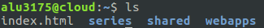
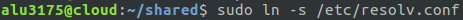
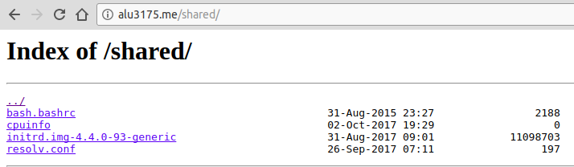

Óscar Moreira Estévez

# Listado de directorios

Enlace a [Mi listado de directorios](http://alu3175.me/shared/)

___

## 1. Práctica

Esta práctica consistirá en crear un servidor en el que podremos acceder al contenido que se encuentre en esa ruta.

- El enlace que debemos tener será http://aluXXXX.me/shared/

- En nuestro caso será http://alu3175.me/shared/

___

## 2. Procedimiento

### 2.1 Crear location

- Nuestro primer paso será ir a nuestro virtual host llamado *main* donde tenemos el servidor llamado alu3175.me en el que ya hemos creado la web [series]http://alu3175.me/series/ anteriormente.

- Este esta localizado en `/etc/nginx/sites-enabled/` ya con su enlace simbólico a `/etc/nginx/sites-available/`.

- Lo abriremos este fichero para editarlo:

  

- Nos saldrá el fichero de esta forma:

  

- Como ya tenemos creado nuestro server solo haría falta crear el nuevo *location* llamado *shared* con el root en la ruta `/home/alu3175`.
- Aparte también pondremos `autoindex on` dentro del location para que afecte a esa carpeta. Esto hará que nos liste el contenido que tengamos dentro de la carpeta.

  

### 2.2 Crear shared

- Una vez creado el *location* de *shared* pasaremos a crear la carpeta llamada *shared* en la ruta señalada en el fichero *main*. Ruta: `/home/alu3175/`

- Crearemos la carpeta con el comando `mkdir shared`

- Hecho esto veremos que ya tenemos nuestra carpeta creada.

  

- Ahora solo nos falta introducir el contenido que queramos, nosotros lo que haremos será usar enlaces simbólicos y no meter contenido directamente en la carpeta.

- Para esto meteremos los siguientes contenidos:

  - /boot/initrd.img-4.4.0-9 (imagen del kernel)
  - /etc/resolv.conf (listado de DNS)
  - /etc/bash.bashrc (configuración global de bash)
  - /proc/cpuinfo (características de la máquina)

- Para hacer el enlace simbólico debemos estar en la ruta `/home/alu3175/shared/` y ahi usar el comando `ln -s` hacia donde estan estos ficheros.

- Ejemplo:

  

  - Haremos este paso con cada uno de las rutas para introducir el contenido.

___

## 3. Comprobación

- Acabado esto ya la práctica estará finalizada solo nos quedara comprobar el enlace y verificar que está bien.

  

- Vemos que está perfectamente hecha la práctica y funcionando correctamente.

Enlace para ver shared http://alu3175.me/shared/
