Óscar Moreira 2ºASIR

# Trabajo con Virtual Hosts

- Sitio web 1 :

  - http://imw.alu3175.me/

  - http://imw.alu3175.me/mec/

- Sitio web 2 :

  - http://varlib.alu3175.me:9000/

- Sitio web 3 :

  - https://ssl.alu3175.me/students/

- Sitio web 4:

  1. http://redirect.alu3175.me
  2. http://target.alu3175.me
      - http://redirect.alu3175.me/test/
      - http://www.redirect.alu3175.me/probando/
      - http://www.redirect.alu3175.me/hola/

___
___

# Prácica

Esta actividad consiste en configurar 4 sitios web (virtual hosts) en el servidor `Nginx`.
___

### 1. [Sitio web 1](#sw1)

  - http://imw.aluXXXX.me

      - Debe mostrar una página con la imagen de "Diagrama de unidades de trabajo" de IMW (ver moodle de la asignatura).

      - La imagen no debe ser enlazada en remoto, sino se debe descargar al directorio de trabajo en la máquina de producción, y luego usar un tag  apuntando a la ruta local.

  - http://imw.aluXXXX.me/mec/

      - Debe mostrar una página con un enlace al Real decreto del título de Administración de Sistemas Informáticos en Red - MEC (ver moodle de la asignatura).
___

### 2. [Sitio web 2](#sw2)

  - http://varlib.aluXXXX.me:9000

      - Debe mostrar el listado de ficheros y directorios de /var/lib de la máquina de producción.

___
### 3. [Sitio web 3](#sw3)

  - https://ssl.aluXXX.me/students/ (ojo, es https!)

      - Debe pedir usuario/clave. Los datos son:

          - USUARIO: `usuario1`
          - CLAVE: `aula108`

      - Debe mostrar una página web con el nombre de todo el alumnado de clase.
      - Se debe prohibir explícitamente el acceso al fichero `.htpasswd`
___

### 4. [Sitio web 4](#sw4)

  - http://redirect.aluXXXX.me

      - Se debe redirigir cualquier petición de este dominio a http://target.aluXXXX.me

          - http://redirect.aluXXXX.me/test/ -> http://target.aluXXXX.me

          - http://www.redirect.aluXXXX.me/probando/ -> http://target.aluXXXX.me

          - http://www.redirect.aluXXXX.me/hola/ -> http://target.aluXXXX.me
          - ...

      - Al acceder a http://target.aluXXXX.me se debe mostrar la página web siguiente initializr-verekia-4.0.zip.

        - Para copiar y descomprimir el fichero initializr.zip se recomienda usar alguna de las siguientes herramientas: curl, wget, scp, unzip. de las siguientes herramientas: curl, wget, scp, unzip.

      - Los logfiles deben ser:

          - /var/log/nginx/redirect/access.log
          - /var/log/nginx/redirect/error.log

___
___

# Procedimiento

## Sitio web 1

### Parte 1

- http://imw.alu3175.me/

  - Lo primero que debemos hacer es crear un nuevo `virtual host` en `/etc/nginx/sites-available` llamado `imw`, para esto haremos `sudo nano imw`

    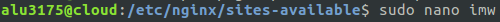

  - Dentro de este fichero crearemos el servidor.

    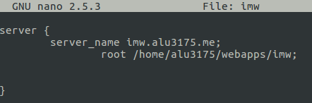

  - Una vez creado el servidor iremos a la ruta `/etc/nginx/sites-enabled/` y haremos un enlace simbolico a `/etc/nginx/sites-enabled/imw`.

    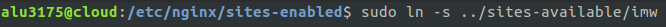

  - Hecho esto veremos que si hacemos un *ls* en `sites-enabled` estara el fichero `imw`.

      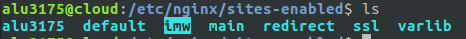

  - Una vez creado haremos un `sudo systemctl reload nginx` para recargar el servicio.

  - Ahora creado ya el `virtual host` tendremos que crear la carpeta de su root.
  - En este caso especificamos que la carpeta sería en `/home/alu3175/webapps/imw`, por lo que iremos a nuestra carpeta de webapps y crearemos `imw` con `mkdir`.

    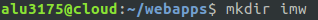

    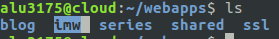

  - Una vez ya creada la carpeta crearemos una carpeta llamada `img` dentro de `imw` para introducir las imágenes que necesitemos ahi.
  `mkdir img`

    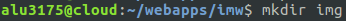

  - Cuando hayamos creado esta carpeta de imagenes descargaremos del ***moodle.claseando.es*** la imágen de *Diagrama de unidades de trabajo* en la máquina de desarrollo.

  - Una vez descargada esta imágen la pasaremos  a la máquina de producción a lnuestra carpeta `img` creada anteriormente con el comando `scp`.

    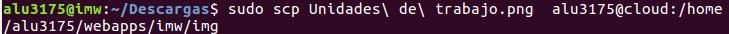

  - Si ahora vamos a la máquina de producción veremos que nuestra imágen se encontrará en la ruta especificada.

    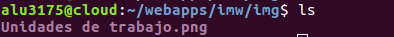

  - Para finalizar esta primera parte de `Sitio web 1` crearemos un index dentro de `/home/alu3175/webapps/imw/` en el qe contendrá la imágen descargada para poder visualizarla en la web.

    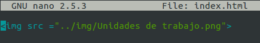

  - Ya veremos que si entramos en ***http://imw.alu3175.me/*** nos saldrá nuestra imágen.

    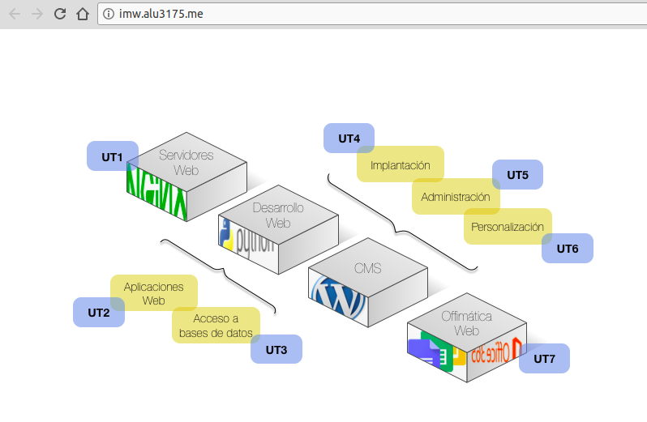

  ___

### Parte 2

- http://imw.alu3175.me/mec

  - Para crear `mec` iremos de nuevo como al principio de la `parte 1 ` a `/etc/nginx/sites-enabled/`, iremos a enabled directamente ya que ya esta enlazado simbolicamente con `sites-available/imw`.

  - Entraremos al fichero con `sudo nano imw` para poder modificarlo.

  - Una vez dentro del fichero añadiremos un *location* con la ruta `/home/alu3175/webapps/imw`.

    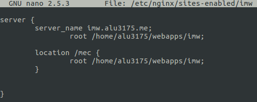

  - Después de esto haremos un `sudo systemctl reload nginx` para recargar el servidor.

  - Una vez recargado el servidor iremos a la ruta `/home/alu3175/webapps/imw/` y crearemos una carpeta llamada `mec`. Y confirmamos que se ha creado con ***ls***

    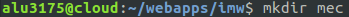

    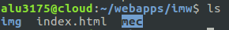

  - Ahora creada esta carpeta iremos a la máquina de desarrollo y descargaremo el pdf del ***moodle.claseando.es*** que se llama `Real decreto del título de Administración de Sistemas Informáticos en Red `.

  - Descargado este pdf lo pasaremos a la máquina de producción con el comando `scp` a la ruta donde hemos creado la carpeta `mec`

    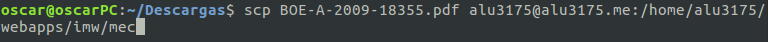

  - Una vez hecho esto lo verificaremos

    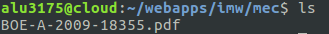

  - Teniendo ya nuestro pdf en la carpeta mec solo nos queda crear un index con `sudo nano`.

    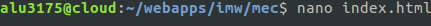

  - Dentro de este index usaremos la etiqueta para añadir enlaces y pondremos el pdf.

    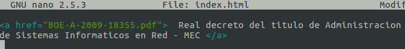

  - Con esto nuestro pagina mec estará acabada y veremos que si entramos en ***http://imw.alu3175.me/mec***  podremos acceder al pdf.

    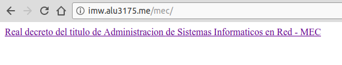

    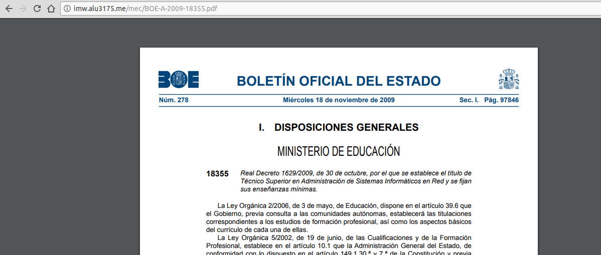

___
___

## Sitio web 2

http://varlib.alu3175.me:9000/

- Crearemos un `virtual host` nuevo en `/etc/nginx/sites-available/` con el comando `sudo nano` llamado ***varlib***

    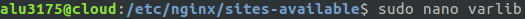

- Dentro de este fichero crearemos el servidor en el que le diremos que escuche en el puerto `9000`, y su ruta será directamente `/vat/lib` con un `autoindex on` para que liste todo lo que haya en esa ruta.

    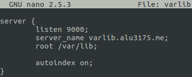

- Una vez hecho esto iremos a la ruta `/etc/nginx/sites-enabled/` y haremos un enlace simbólico (*ln -s*) a la ruta `/etc/nginx/sites-available/varlib`.

    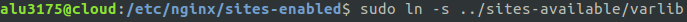

- Comprobaremos que se ha hecho bien el enlace simbólico.

    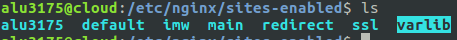

- Con esto ya nuestro sitio web 2 estará terminado.
- Entraremos en el enlace ***http://varlib.alu3175.me:9000/*** y veremos que nos saldra un listado de todo lo que hay en `/var/lib` .

    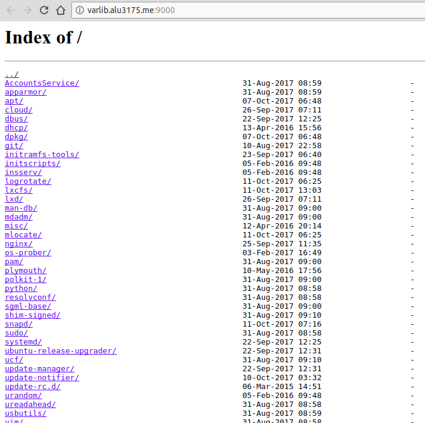

___
___

## Sitio web 3

### Parte 1 Usuario y contraseña

https://ssl.alu3175.me/students/

- Lo primero que haremos será dentro de `/home/alu3175/webapps/` crear una carpeta que se llame `ssl` que es donde meteremos todas las páginas que tengan la certificación.
- Una vez creada esta carpeta crearemos una llamada `students` dentro de `ssl`.

    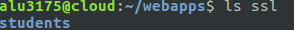

- Ahora creada esta carpeta lo que haremos sera crear un usuario y una contraseña para poder acceder.

- Para esto primero encriptaremos la contraseña que vamos a usar, en nuestro caso sera `aula108` y lo haremos con el siguiente comando que sera con el lenguaje `perl`.

~~~
perl -le 'print crypt("aula108", "salt-hash")'
~~~

- Al aplicar esto nos generará la contraseña encriptada asi que la copiaremos.

  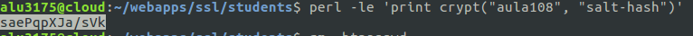

- Cuando la tengamos copiada lo siguiente será crear el fichero `.htpasswd` donde contendra el usuario y la contraseña encriptada, en nuestro caso será: ***usuario1:aula108 encriptado***

- Dentro de la carpeta `students` haremos el siguiente comando :

~~~
echo "usuario:contraseña encriptada" > .htpasswd
~~~

  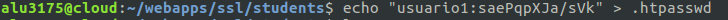

- Veremos que haciendo un `ls -a` veremos el fichero oculto en `students`.

    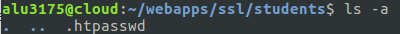

- Después de tener el fichero creado con el usuario y contraseña iremos al virtual host `ssl`.

- Crearemos un *location* en el fichero `ssl` que tenemos creado en `/etc/nginx/sites-enabled/` que esta enlazado simbolicamente con `/etc/nginx/sites-available/ssl`.

    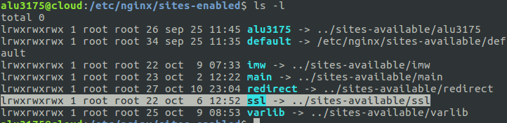

- Entraremos al fichero con el comando `sudo nano ssl` y lo configuraremos de la siguiente manera el *location*.

- Se  añadirá a *location* :

~~~
auth_basic "nombre Login";
auth_basic_user_file ruta hacia el archivo .htpasswd;
~~~
  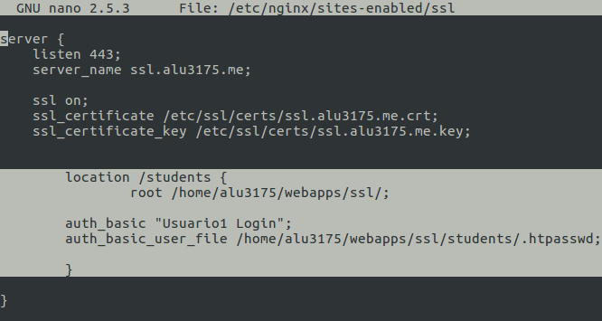

- Luego de esto haremos un `sudo systemctl reload nginx` para recargar el servidor.

- Ahora solo nos queda dentro de `/home/alu3175/webapps/ssl/students/` crear un index en el que contendra nombres de alumnos de la clase.

- Iremos a esta ruta y haremos `nano index.html` y pondremos los nombres.

  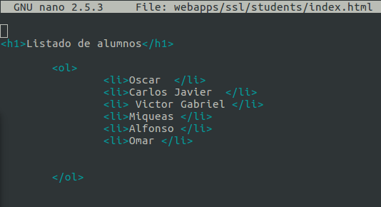

- Ahora veremos que si entramos en el enlace ***https://ssl.alu3175.me/students/*** nos pedirá usuario y contraseña.

    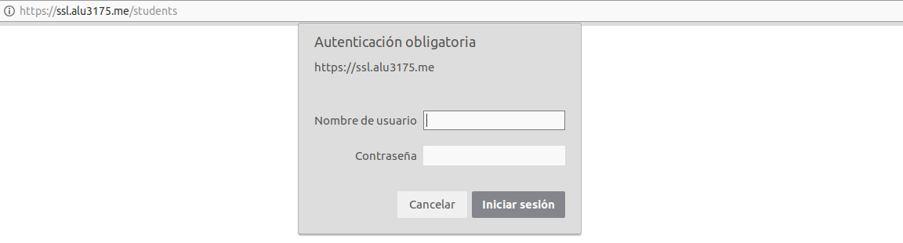

    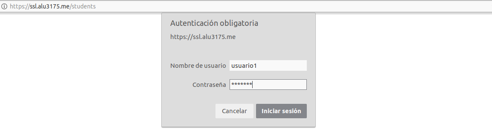

    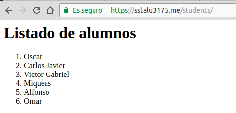
___

### Parte 2 Denegar acceso .htpasswd

https://ssl.alu3175.me/students/.htpasswd

- Para denegar acceso al archivo ***.htpasswd*** solo tendremos que ir al fichero `ssl` de `/etc/nginx/sites-enabled/` y añadirle dos lineas más.

    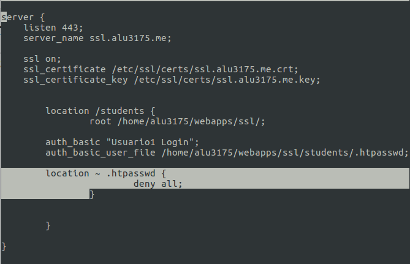

- Ahora veremos que cuando entremos en el enlace ***https://ssl.alu3175.me/students/.htpasswd*** nos dara un error de permisos.

    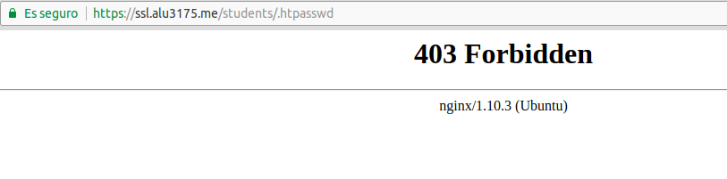

___
___

## Sitio web 4

- Lo primero que haremos será crear un virtual host llamado `redirect` y hacer su enlace simbólico de `/etc/nginx/sites-enabled` a `/etc/nginx/sites-available/redirect`

    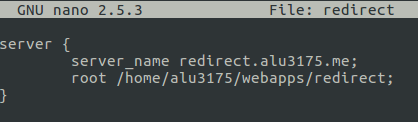

    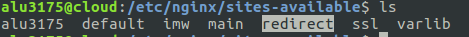

    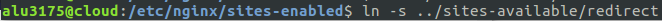

    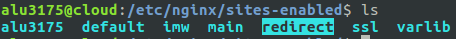

- Ahora dentro de `/home/alu3175/webapps` crearemos una carpeta llamada redirect.

    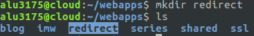

- Luego de esto crearemos otro *virtual host* llamado target y que haremos un enlace simbólico como el anterior.

    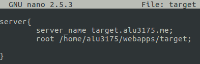

    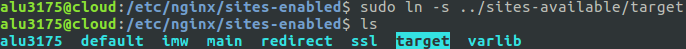

- Seguido iremos a la máquina de desarrollo y descargaremos el fichero ***initializr-verekia-4.0.zip.***, lo descomprimimos y lo pasaremos ala máquina de producción todo su contenido por el comando `scp`.

    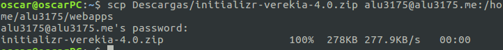

- Una vez pasado a la de producción lo descomprimiremos.

    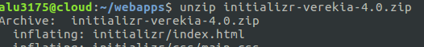

- Despues de comprimido le cambiaremos el nombre y lo llamaremos target.

    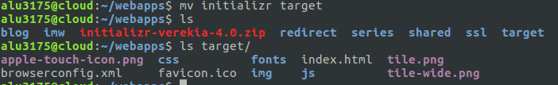

- Veremos que si vamos a la máquina de produccion lo encontraremos ahi. y si entramos en ***http://target.alu3175.me*** entraremos a la página.

    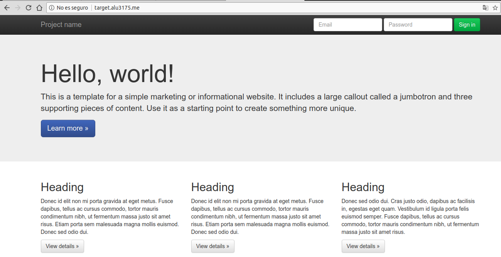

- Ya funcionando esto solo nos queda hacer las ***redirecciones***

- Para esto iremos al fichero ***redirect*** en `/etc/nginx/sites-enabled` y lo configuraremos de esta manera.

  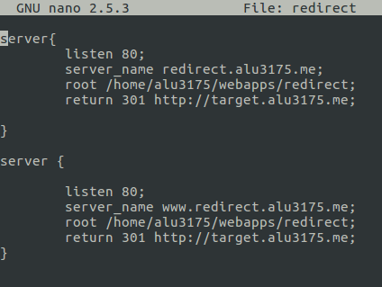

- Con esto estamos redirigiendo siempre los `redirect` a la pagina ***http://target.alu3175.me***.

- Por último solo queda añadir los logs al virtual host `target` para separar sus logs.
- Solo tendremos que ir a la carpeta `/var/log/nginx` y crear una carpeta llamada `redirect`.

    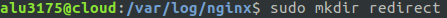

- Y después para finalizar ir en el fichero `target` de `/etc/nginx/sites-enabled` añadiremos 2 lineas mas diciendole donde estarán los logs de acceso y de error.

    

Con esto ya se redigira cualquiera de estos enlaces siempre a http://target.alu3175.me.

- http://redirect.alu3175.me
- http://redirect.alu3175.me/test/
- http://www.redirect.alu3175.me/probando/
- http://www.redirect.alu3175.me/hola/

___
___
