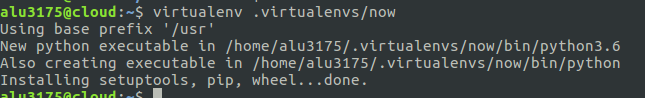
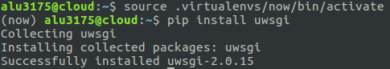

Óscar Moreira 2º ASIR

# Sirviendo aplicaciones Php y Python

___

**Sitio web 1:** http://php.alu3175.me/

  - Sitio web creado con *PHP*.

**Sitio web 2:** http://now.alu3175.me/

  - Sitio web creado con *Python*.

___
___

# Práctica

La actividad consiste en configurar 4 sitios web (virtual hosts) en nuestro servidor web Nginx, con las siguientes características.

## [Sitio web 1](#sw1)

  - http://php.imwpto.me

  - Mostrar la aplicación [demo_php.zip](https://github.com/sdelquin/claseando/blob/master/imw/UT1/assignments/assignment4/demo_php.zip)

## [Sitio web 2](#sw2)

  - http://now.imwpto.me

    

  - El código del programa python es el siguiente:

    ~~~python

    import datetime
    import pytz
    from flask import Flask
    app = Flask(__name__)

    @app.route("/")
    def hello():
        now = datetime.datetime.now(pytz.timezone("Atlantic/Canary"))
        return """
        <h1>Testing Python over Nginx</h1>
        <h2>In Canary Islands...</h2>
        Today is: {today}
         
        Now is: {now}
        """.format(
          today=now.strftime("%d/%m/%Y"),
          now=now.strftime("%H:%Mh")
        )

    ~~~
[Volver a configuración de fichero main.py](#seguir)

  - En el entorno virtual hay que instalar, al menos, los paquetes **uwsgi**, **flask** y **pytz**.
  - El código debe residir en $HOME/now.
  - Se debe configurar supervisor para gestionar el proceso uwsgi.
  - Se debe probar los siguientes comandos, y ver cómo es la respuesta del navegador   al acceder a la web:

    ~~~
    $ supervisorctl status
    $ supervisorctl start now
    $ supervisorctl stop now
    $ supervisorctl restart now
    ~~~

___
___

# Sitio web 1

[Inicio](#inicio)
___

___

## Procedimiento

- El primer paso que haremos sera crear un nuevo ***virtual host*** en `/etc/nginx/sites-available` llamado *php*, esto lo haremos con el comando: `sudo nano php`

  

- Dentro de este fichero lo confguraremos el ***virtual host*** de esta manera.

  >  location ~ \.php$ {contenido} , hará que se puedan localizar los ficheros ***.php*** y hacer que nginx entienda ***php***

  ~~~
  server{
          server_name php.alu3175.me;
          index index.php;
          root /home/alu3175/webapps/php;

          location ~ \.php$ {
                  include snippets/fastcgi-php.conf;
                  fastcgi_pass unix:/run/php/php7.0-fpm.sock;
          }
  }
  ~~~

  

- Después de crear este fichero haremos un enlace simbólico en `/etc/nginx/sites-enabled` de `/etc/nginx/sites-available/php`.

  

- Y comprobamos que se ha hecho el enlace y tenemos el fichero en *sites-enabled*.

  

- Luego haremos una recarga del servidor nginx con `sudo systemctl reload nginx`.

  

- Después de la recarga iremos a `/home/alu3175/webapps` y crearemos una carpeta llamada ***php*** con el comando: `mkdir php`.
- Verificamos que esta creada.

  

- Una vez verificado iremos a nuestra máquina de desarrollo y descargaremos [demo_php.zip](https://github.com/sdelquin/claseando/blob/master/imw/UT1/assignments/assignment4/demo_php.zip).

- Cuando este descargado lo pasaremos a la máquina de producción con `scp`

  

- Veremos ahora que en `/home/alu3175/webapps` tenemos el *zip* que hemos pasado

  

- Lo descomprimimos con `unzip demo_php.zip` y nos sacara una carpeta llamada ***demo_php*** con todos su contenido dentro.

  

- Por ultimo pasamos todo este contenido de la carpeta a la carpeta ***php***

  

- Recargamos ***Nginx*** por si quedan configuraciones hechas por recargar y ya veremos que entrando en http://php.alu3175.me nos abrirá la página:

  

___

### [Índice de enlaces](#inicio)
___

# Sitio web 2
[Inicio](#inicio)
___

___

## Procedimiento

- Empezaremos creando un nuevo entorno virtual que llamaremos ***now*** en la carpeta ya creada ***.virtualenvs*** que se encuentra en `/home/alu3175` . Usaremos el comando: `virtualenv`.

  

- Después de tener creado nuestro *entorno virtual* lo activaremos para entrar en él con el comando:

  ~~~console
  source .virtualenvs/now/bin/activate
  ~~~
  

- Veremos que ahora nos aparece el nombre del entorno virtual al principio, eso quiere que estamos dentro.

- El siguiente paso será instalar paquetes que necesitemos para este entorno, en este caso instalaremos: ***uWSGI*** , ***Flask*** y ***Pytz***.

- Esto lo haremos con el comando **pip install** para instalar paquetes de *Python*

  

  

  

- Ahora pasaremos a crear nuestro código que se encontrará en una carpeta que llamaremos *now* en la ruta `/home/alu3175`. Comando:`mkdir /home/alu3175/now`

- Dentro de esta carpeta crearemos un fichero llamado *main.py* con el comando `nano main.py`. Veremos con un `tree` el arbol que hemos creado.

  

- Después meteremos dentro del fichero `main.py` el código que se encuentra en el enunciado de la [práctica 2](#practica2)

  

- Una vez hecho esto pasaremos a comprobar si la aplicación funciona.
- Lo que haremos será ejecutar el comando:`uwsgi --socket 0.0.0.0:8080 --protocol=http -w main:app` dentro de `home/alu3175/now`

  

- Con esto ejecutado sin cerrarlo probaremos en la web si funciona la aplicación poniendo: http://now.alu3175:8080

  > Captura distinta hecha después del cambio de código por eso ya no sale el 8080

  

- Vemos que funciona correcamente.

___

### Configuración del servidor

- Lo primero sera crear un fichero llamado **uwsgi.ini** dentro de `/home/alu3175/now` con el comando : `nano uwsgi.ini`.

  

- Dentro de este fichero pondremos la siguiente configuración:

  ~~~
  [uwsgi]
  chdir = /home/alu3175/now           # Ruta al directorio del proyecto
  module = main:app                   # Fichero.py
  master = true                       # Crea un proceso maestro
  processes = 1                       # Numero de workers para atender peticiones
  socket = /tmp/now.sock              # Ruta hasta el socket
  chmod-socket = 666                  # Permisos del socket
  vacuum = true                       # Limpieza del socket al finalizar
  ~~~

  

- Ahora pasaremos a crear un script que llamaremos `run.sh` que será el que se encargue de lanzar el proceso `uwsgi` y de activar nuestro entorno virtual. Este lo crearemos dentro de `/home/alu3175/now`, con el comando nano.

  

- Dentro del fichero pondremos lo siguiente:

  ~~~
  #!/bin/bash

  source /home/alu3175/.virtualenvs/now/bin/activate
  uwsgi --ini /home/alu3175/now/uwsgi.ini
  ~~~

  

- Hecho esto pasaremos a darle permisos de ejecución al script.

  

  

- Ahora podremos lanzar el scritp `run.sh` sin tener que activar el entorno virtual previamente, ya que el propio script realiza esta tarea.

- Estando en la ruta donde se encuentra el script ejecutariamos: `./run.sh`
___

### Virtual host

Ahora crearemos el virtual host llamado *now* en `/etc/nginx/sites-available` para que pueda responder peticiones a la url http://now.alu3175.me .

-  Ejecutaremos el comando: `sudo nano /etc/nginx/sites-available/now` para crear el fichero

    

- Dentro pondremos lo siguiente:

    ~~~
    server {
      server_name now.alu3175.me;

      location / {
        include uwsgi_params;
        uwsgi_pass unix:/tmp/now.sock;   # socket definido en uwsgi.ini

        }

        location /static {
          root /home/alu3175/now;         # para servir ficheros estáticos
        }
      }
    ~~~

  

- Creado ya el virtual host en `sites-available` haremos un enlace simbólico en `/etc/nginx/sites-enabled` con el comando:

    ~~~console
    alu3175@cloud:/etc/nginx/sites-enabled$ sudo ln -s ../sites-available/now
    ~~~

  

- Verificamos que esta dentro ahora dentro y bien enlazado con el comando: `ln -s`

  

- Ya creado el virtual host entero lo recargaremos con: `sudo systemctl reload nginx` para que cargue las configuraciones.

  

- Si ahora probamos en la web de nuevo nos saldrá un error de ***502 Bad Gateway*** .

  

- Esto es porque nos falta que la aplicación *uWSGI* escuche las peticiones y las devuelva como *html* a *nginx*, asi que ejecutaremos el script `run.sh`

  

- Ahora veremos que si entramos en la [web](http://now.alu3175.me) podremos verla.

  

___

### Configuración supervisor

Supervisor lo usaremos para que la aplicacion siempre este corriendo y no tengamos que estar ejecuntando el script para que funcione.

- El primer paso sera crear el archivo de configuración para *supervisor* para el entorno virtual *now*

  ~~~console
  alu3175@cloud:~$ sudo nano /etc/supervisor/conf.d/now.conf
  ~~~
  

- Dentro de este fichero pondremos lo siguiente:

  ~~~
  [program:now]
  user = alu3175
  command = /home/alu3175/now/run.sh
  autostart = true
  autorestart = true
  stopsignal = INT
  killasgroup = true
  stderr_logfile = /home/alu3175/now/now.err.log
  stdout_logfile = /home/alu3175/now/now.out.
  ~~~

  

- Terminado esto verificamos que este corriendo supervisor con `sudo systemctl status supervisor`

  

___

Para terminar ejecutaremos los comandos de *supervisorctl* para verificar que todo esta correcto.

- supervisorctl status

  

- supervisorctl stop now

  

- supervisorctl start now

  

- supervisorctl restart now

  

___

Con esto estará terminada la práctica y ya podremos entrar a http://now.alu3175.me siempre que queramos sin tener que activar nada.

___
___

Fín de la práctica
