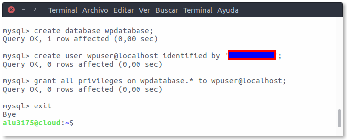

# Wordpress

Enlace página : http://wordpress.alu3175.me

# 1. Base de datos Wordpress

- Lo primero que haremos será crear una base de datos para *Wordpress*

- Para esto entraremos en *MySQL* como *root*:

  ~~~
  mysql -u root -p
  ~~~

  

- Una vez estemos dentro de *MySQL* crearemos una base de datos, un usuario y le daremos privilegios a este usuario sobre la base de datos que creemos.

  

# 2. Descarga Wordpress

- Para instalar Wordpress lo primero que haremos será descargar el código fuente desde su propia página web estanso en el directorio `/tmp`.

  ~~~
  curl -O https://wordpress.org/latest.zip
  ~~~

  

- Después de esto como es un fichero **.zip** lo que haremos será descomprimirlo con el comando `unzip`

  

- Luego coiaremos la carpeta entera al directio `usr/share/`7

  

- Ahora le daremos permisos al usruaio y grupo de *Nginx* sobre la carpeta Wordpress que se encuentra en `/usr/share`

  

# Editar fichero de configuración

- Para editar el fichero de configuración lo que haremos será ir a la ruta `/usr/share/wordpress`

- Dentro del directorio haremos una copia del fichero `wp-config-sample.php` y lo llamaremos `wp-config.php`

- Hecho esto pasaremos a editarlo con el *nano*

  

- Dentro del fichero el siguiente contenido tendrá que estar de la siguiente manera:

  ~~~
  // ** MySQL settings - You can get this info from your web host ** //
  /** The name of the database for WordPress */
  define('DB_NAME', 'wpdatabase');

  /** MySQL database username */
  define('DB_USER', 'wpuser');

  /** MySQL database password */
  define('DB_PASSWORD', 'Testing_1234');

  /** Database Charset to use in creating database tables. */
  define('DB_CHARSET', 'utf8mb4');
  ~~~

  

# 3. Acceso mediante Nginx

- Lo primero que haremos será crear un nuevo host virtual para *Wordpress*:

  ~~~
  sudo nano /etc/nginx/sites-available/wordpress
  ~~~

- Una vez dentro del fichero para editar pondremos el siguiente contenido:

  ~~~
  server {
    server_name wordpress.alu3175.me;
    index index.php;
    root /usr/share/wordpress;
    location ~ \.php$ {
        include snippets/fastcgi-php.conf;
        fastcgi_pass unix:/run/php/php7.0-fpm.sock;
    }
  }
  ~~~

  

- Hecho esto haremos un enlace simbólico a `/etc/nginx/sites-enabled/` y lo comprobamos.

  

- Ahora para que se ejecuten todos los cambios tendremos que reiniciar el servicio *Nginx* y verificar que esta corriendo bien.

  

Fín con esto ya estará hecha toda la configuración y ahora si entramos en el enlace http://worpdress.alu3175.me podremos comenzar la instalación.

# 4. Instalación de Wordpress

- Entraremos en el enlace http://wordpress.alu3175.me y veremos que podemos comenzar la instalación primero eligiendo idioma.

  

- Luego pasaremos a poner un nombre al sitio y elegiremos un nombre de usuario con contraseña.

  

- Después de esto veremos que se nos muestra un mensaje de que lo hemos instalado.

  

Por último para acceder  nos saldrá que pongamos un usuario y contraseña que son los que ya hemos creado anteriormente.

  

Y ya vemos que estamos dentro de nuestro *WordPress*

___

# 5. Permalinks

## 5.1 Nginx

Para poder usar los *permalinks* debemos configurarlo primero en *Nginx*:

- Editaremos el fichero `/etc/nginx/sites-enable/wordpress` de tal manera que añadiremos lo siguiente:

  ~~~
  location / {
    try_files $uri $uri/ /index.php?$args;
  }
  ~~~

  

- Luego de esto reiniciaremos el servicio y verificamos que *Nginx* esta corriendo bien.

  

## 5.2 Wordpress

Para acabar activando los *permalinks* tendremos que ir a nuestro servidor wordpress entrar y activarlos eligiendo de que manera queremos que nos lo muestre.

  

___

# 6. Temas y contenido en WordPress.

Para añadir temas iremos a `personalizar tu sitio`-->`cambiar tema`-->`Temas de Wordpress.org` y aqui eligiremos el que queramos.

  

Para añadir contenido a WordPress (un nuevo post) lo que haremos será lo siguiente:

- Iremos a `Entradas`-->`Añadir nueva` y ahí pondremos el titulo y el contenido que queremos.

  

- Finalmente vemos como se ha introdicido en nuestra web tanto el tema como el post.

  

  

___
___

Fín de la práctica
